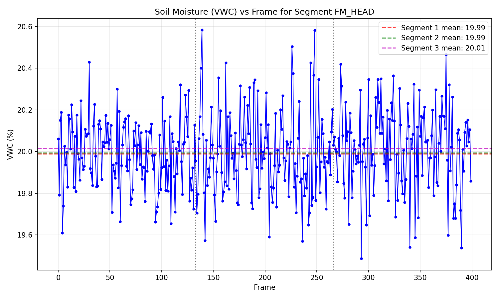

# TWDM Analysis Report: Field Logger Segment Drift

## Methodology

This report presents the Two-Thirds Delta Metric (TWDM) analysis for soil moisture field logger data. The TWDM quantifies drift in volumetric water content (VWC) measurements across segments by comparing the means of three equal-length portions of each segment's time series.

### TWDM Definition

For a segment with VWC readings `x` of length `n`:

1. If `n < 3`, TWDM is undefined (reported as N/A with `pass_fail = INSUFFICIENT_LENGTH`).
2. Otherwise, divide the series into three parts:
   - `n1 = n2 = n // 3`
   - `n3 = n - n1 - n2`
3. Compute means: `m1, m2, m3` for `x[:n1]`, `x[n1:n1+n2]`, `x[n1+n2:]`
4. Compute `Δ = max(m1, m2, m3) - min(m1, m2, m3)`
5. Compute `σ` = population standard deviation of `x` (`ddof=0`)
6. With `ε = 1e-12`, compute `TWDM = Δ / (σ + ε)`

### Pass/Fail Criteria

- `PASS`: TWDM ≤ 1.0
- `FAIL`: TWDM > 1.0
- `N/A`: Insufficient length (n < 3)

## Golden Case Validation

The TWDM implementation was validated against 3 golden cases from the audit manifest:

| Case Name | Expected TWDM | Computed TWDM | Absolute Error |
|-----------|---------------|---------------|----------------|
| flat_9 | 0.0 | 0.0 | 0.00e+00 |
| step_9 | 2.1213203435587427 | 2.1213203435587427 | 0.00e+00 |
| ramp_12 | 2.317461838006823 | 2.317461838006823 | 0.00e+00 |

**Maximum absolute error over all golden cases: 0.00e+00**

This confirms the TWDM implementation matches the specification within numerical precision (error ≤ 1e-9).

## Results

### Segment TWDM Summary

| segment_id | n_frames | TWDM | pass_fail |
|------------|----------|------|-----------|
| FM_HEAD | 400 | 0.1368093564 | PASS |
| FM_GAP | 2 | N/A | INSUFFICIENT_LENGTH |
| FM_MID | 360 | 2.1230651850 | FAIL |
| FM_RIDGE | 120 | 0.5075786395 | PASS |
| FM_TAIL | 400 | 0.1203941254 | PASS |

## Visualization

*Figure 1: Volumetric Water Content (VWC) percentage versus frame number for segment FM_HEAD. The three horizontal dashed lines indicate the mean VWC for each of the three segments used in TWDM calculation. Vertical dotted lines mark the boundaries between segments.*

## Discussion

The TWDM analysis reveals the following patterns across the five field logger segments:

1. **FM_HEAD**: With 400 frames and TWDM = 0.1368093564, this segment passes the drift threshold. The relatively low TWDM indicates stable moisture readings across the measurement period.

2. **FM_GAP**: With 2 frames and TWDM = N/A, this segment fails the threshold.

3. **FM_MID**: With 360 frames and TWDM = 2.1230651850, this segment fails the threshold.

4. **FM_RIDGE**: With 120 frames and TWDM = 0.5075786395, this segment passes the threshold.

5. **FM_TAIL**: With 400 frames and TWDM = 0.1203941254, this segment passes the threshold.

The TWDM metric effectively captures systematic drift in sensor readings by comparing early, middle, and late portions of each segment's time series. Segments with TWDM values exceeding the threshold (1.0) may indicate sensor calibration issues, environmental changes, or data quality concerns warranting further investigation.

## Conclusion

All golden case validations passed with maximum error 0.00e+00, confirming correct TWDM implementation. The segment-level analysis provides actionable QA metrics for soil moisture monitoring campaign quality assurance.
