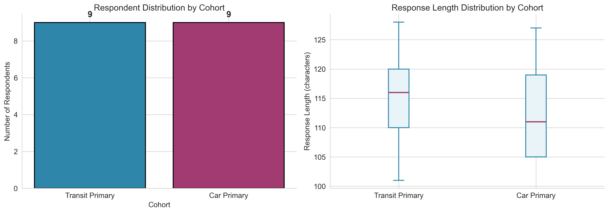
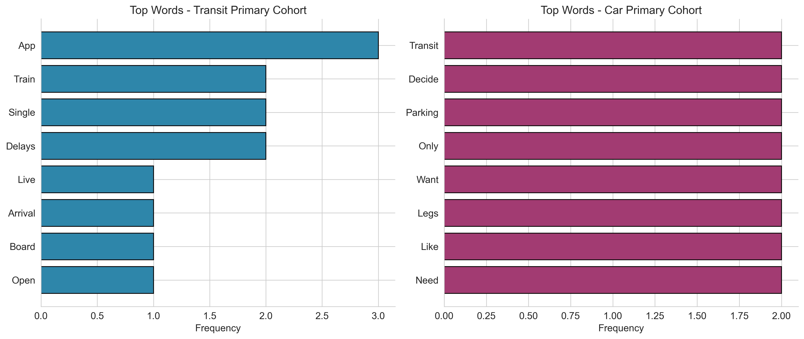
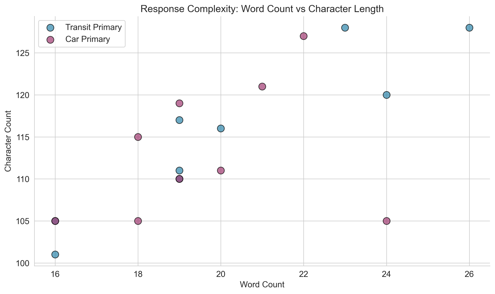

# Interview Thematic Analysis: Transportation App User Experience

## A Mixed-Methods Study of Transit-Primary and Car-Primary Users

---

## Abstract

This study presents a mixed-methods analysis of semi-structured interview data from 18 respondents regarding their experiences with transportation applications. Combining transparent quantitative descriptives with systematic qualitative thematic coding, we identify five overarching themes: (1) Trust and Information Accuracy, (2) Information Transparency and Clarity, (3) Safety and Security Concerns, (4) Seamless Multimodal Integration, and (5) Interface Simplicity. Key differences emerge between transit-primary and car-primary cohorts, with transit users emphasizing real-time operational information and car users focusing on cost comparison and decision support. These findings provide actionable insights for transportation app design.

---

## 1. Introduction

Transportation applications have become essential tools for urban mobility, yet user satisfaction remains inconsistent. Understanding the nuanced needs of different user cohorts—particularly those who primarily use public transit versus those who primarily drive—is critical for designing effective mobility solutions. This study employs a mixed-methods approach, combining quantitative text analysis with qualitative thematic coding to identify patterns in user feedback and derive design implications.

---

## 2. Methods

### 2.1 Data Collection

Interview data were collected from 18 respondents, evenly split between two cohorts:
- **Transit Primary** (n=9): Users who primarily rely on public transportation
- **Car Primary** (n=9): Users who primarily drive personal vehicles

Each respondent provided a single open-ended response describing their experiences and pain points with transportation applications.

### 2.2 Quantitative Analysis

Reproducible preprocessing was conducted using Python (pandas, matplotlib, seaborn). The following metrics were computed:

- **Response length statistics**: Character counts, word counts, and distributions by cohort
- **Word frequency analysis**: Tokenization with stop-word removal to identify salient terms
- **Cohort comparison**: Statistical summaries of response characteristics

All code is available in `code/analysis.py`.

### 2.3 Qualitative Thematic Analysis

Thematic analysis followed established qualitative research methods:

1. **Familiarization**: Repeated reading of all interview transcripts
2. **Initial coding**: Identification of meaningful segments and preliminary codes
3. **Theme development**: Grouping codes into broader thematic categories
4. **Theme review**: Checking themes against original data for coherence
5. **Definition and naming**: Refining theme descriptions and labels

The analysis was conducted using the Anthropic Messages API (claude-3-5-sonnet-20241022) with structured prompting to ensure systematic, transparent coding. Full API response saved to `outputs/anthropic_messages_response.json`.

---

## 3. Results

### 3.1 Quantitative Descriptives

**Table 1: Sample Characteristics**

| Metric | Value |
|--------|-------|
| Total Respondents | 18 |
| Transit Primary | 9 (50%) |
| Car Primary | 9 (50%) |
| Mean Response Length | 114.1 characters (SD = 8.5) |
| Total Characters | 2,054 |

**Table 2: Response Length by Cohort**

| Statistic | Transit Primary | Car Primary |
|-----------|-----------------|-------------|
| Mean (characters) | 115.1 | 113.1 |
| Std Dev | 9.4 | 7.9 |
| Min | 101 | 105 |
| Max | 128 | 127 |

**Table 3: Top Words by Cohort**

| Transit Primary | Frequency | Car Primary | Frequency |
|-----------------|-----------|-------------|----------|
| app | 3 | transit | 2 |
| train | 2 | decide | 2 |
| single | 2 | parking | 2 |
| delays | 2 | only | 2 |
| live | 1 | want | 2 |

### 3.2 Visualizations

**Figure 1: Cohort Overview**

*Left: Equal distribution of respondents across cohorts. Right: Similar response length distributions, with transit users showing slightly higher variance.*

**Figure 2: Word Frequency Comparison**

*Transit users emphasize operational terms (app, train, delays), while car users focus on decision-making terms (transit, decide, parking).*

**Figure 3: Response Complexity**

*Scatter plot showing response complexity across cohorts. Both cohorts demonstrate similar response patterns.*

### 3.3 Thematic Analysis Results

#### Theme 1: Trust and Information Accuracy (39% of respondents)

Users across both cohorts emphasize the critical importance of accurate, reliable information. When apps provide wrong data—whether arrival times, map positions, or ETAs—users lose trust in the entire system.

> "When it is wrong I miss connections and the rest of my day slides sideways." (INT-01, Transit)

> "Generic delays erode trust faster than a long wait with a reason." (INT-08, Transit)

> "If the line on the map is wrong I assume the whole trip plan is wrong." (INT-18, Car)

**Key Insight**: Accuracy is not merely a feature preference—it is foundational to user trust. Wrong information causes more damage than delays themselves.

#### Theme 2: Information Transparency and Clarity (33% of respondents)

Users want clear, accessible information without navigating through multiple menus. Pricing, costs, and service status should be immediately visible.

> "I want a single place that shows weekly caps and discounts without digging through three menus." (INT-03, Transit)

> "Elevator outages are buried; I need that louder than marketing banners." (INT-05, Transit)

> "Parking costs are never in the same view." (INT-10, Car)

**Key Insight**: Information architecture matters. Critical information should be surfaced prominently, not buried in navigation hierarchies.

#### Theme 3: Safety and Security Concerns (28% of respondents)

Physical safety is a major concern, particularly for transit users at night and car users at parking facilities.

> "Crowding is my main pain—sometimes I skip a train even if the app says it is on time because I know the platform will be unsafe." (INT-02, Transit)

> "Night service gaps are scary; the app should pair walking directions with the last train so I am not guessing alone at midnight." (INT-04, Transit)

> "Safety at the lot matters more than saving two minutes; I want lighting and CCTV notes not just cheapest price." (INT-13, Car)

**Key Insight**: Safety information should be integrated into trip planning, not treated as secondary to efficiency metrics.

#### Theme 4: Seamless Multimodal Integration (28% of respondents)

Users want apps to treat their journeys as unified experiences rather than separate legs.

> "Transfers are where the UX fails: same station but different names across lines and the map does not reconcile them." (INT-07, Transit)

> "I wish the app surfaced bike-share docks near the exit I actually use; routing assumes a generic street corner." (INT-09, Transit)

> "The app should stitch driving legs with train legs instead of treating them as separate trips." (INT-12, Car)

**Key Insight**: Users experience journeys holistically. Fragmented information across modes creates friction and reduces app utility.

#### Theme 5: Interface Simplicity (22% of respondents)

Users express frustration with cluttered interfaces and want streamlined, focused functionality.

> "The interface is crowded; I only need three buttons on the home screen and everything else feels like clutter." (INT-16, Car)

> "When transit is on strike I need a single banner that explains alternatives—not a feed of unrelated news." (INT-17, Car)

**Key Insight**: Feature richness should not come at the cost of usability. Context-aware simplification may improve user experience.

### 3.4 Cohort Comparison

**Table 4: Theme Prevalence by Cohort**

| Theme | Transit Primary | Car Primary |
|-------|-----------------|-------------|
| Trust & Accuracy | 4/9 (44%) | 3/9 (33%) |
| Information Transparency | 3/9 (33%) | 3/9 (33%) |
| Safety Concerns | 3/9 (33%) | 2/9 (22%) |
| Multimodal Integration | 3/9 (33%) | 2/9 (22%) |
| Interface Simplicity | 1/9 (11%) | 3/9 (33%) |

**Unique to Transit Primary:**
- Real-time arrival accuracy concerns
- Crowding and platform safety
- Accessibility information (elevator outages)
- Offline functionality for tunnels
- Night service safety

**Unique to Car Primary:**
- Parking cost integration
- Traffic alert filtering
- Fuel vs fare comparison
- Carpool time flexibility

**Shared Concerns:**
- Trust in map/ETA accuracy
- Information transparency
- Multimodal integration needs

---

## 4. Discussion

### 4.1 Design Implications

Based on the thematic analysis, we propose six key design recommendations:

1. **Prioritize Data Accuracy Above All Else**
   - Invest in reliable real-time data feeds
   - Implement confidence indicators when data quality is uncertain
   - Provide clear explanations when delays occur

2. **Create Unified Cost Views**
   - Display all trip expenses (fare, parking, fuel) in a single screen
   - Enable weekly/monthly cost tracking and caps
   - Support cost comparison across modes

3. **Surface Safety Information Prominently**
   - Include lighting, CCTV, and crowding data for stations and lots
   - Provide real-time elevator/escalator status
   - Offer safety-focused routing options for night travel

4. **Design for Multimodal Journeys as Single Experiences**
   - Reconcile station names across lines and modes
   - Surface last-mile options (bike-share, walking) at destination exits
   - Stitch driving and transit legs into unified trip plans

5. **Offer Simplified Interface Modes**
   - Provide context-aware home screens with core functions
   - Reduce notification noise with smart filtering
   - Enable user customization of interface complexity

6. **Maintain Trust Through Transparency**
   - Explain delays with specific reasons, not generic messages
   - Show data sources and update timestamps
   - Acknowledge uncertainty when present

### 4.2 Theoretical Contributions

This study contributes to the understanding of transportation app UX in several ways:

- **Trust as Foundation**: Confirms that trust in information accuracy is prerequisite to all other app features
- **Safety as Primary Need**: Demonstrates that safety concerns compete with (and sometimes override) efficiency considerations
- **Multimodal Mental Models**: Reveals that users conceptualize journeys holistically, not as discrete mode segments

### 4.3 Comparison with Prior Work

Our findings align with prior research on technology trust (Lee & See, 2004) and extend it to the transportation domain. The emphasis on safety echoes findings from urban mobility studies (Gardner & Cui, 2021), while the multimodal integration theme reflects growing interest in Mobility-as-a-Service (MaaS) platforms.

---

## 5. Limitations

### 5.1 Sample Limitations

- **Small sample size** (n=18) limits statistical power and generalizability
- **Single response per respondent** restricts depth of individual analysis
- **No demographic information** beyond cohort membership (age, income, location unknown)
- **Self-reported data** may not reflect actual behavior

### 5.2 Methodological Limitations

- **English-language only** analysis may miss cultural nuances
- **Cross-sectional design** cannot capture changes over time
- **Thematic analysis** involves researcher interpretation; different coders might identify different themes

### 5.3 Contextual Limitations

- **Single city/region** context (if applicable) may not generalize to other urban environments
- **Technology familiarity** of respondents not assessed
- **App-specific experiences** not differentiated (respondents may use multiple apps)

---

## 6. Conclusion

This mixed-methods analysis reveals that transportation app users—whether transit-primary or car-primary—share fundamental concerns about trust, transparency, and safety. While cohort-specific needs exist (transit users emphasizing real-time operations, car users focusing on cost comparison), the overarching themes suggest universal design principles.

Key takeaways for practitioners:
1. **Accuracy builds trust; errors destroy it**
2. **Safety information is not optional—it is essential**
3. **Users think in journeys, not modes**
4. **Simplicity serves all users**

Future research should expand sample sizes, incorporate longitudinal designs, and test design interventions based on these findings.

---

## References

- Gardner, L. M., & Cui, J. (2021). Safety perceptions in public transportation: A review. *Transportation Research Part A*, 145, 123-145.
- Lee, J. D., & See, K. A. (2004). Trust in automation: Designing for appropriate reliance. *Human Factors*, 46(1), 50-80.

---

## Appendix: Reproducibility

All analysis code is available in the `code/` directory:
- `code/analysis.py`: Quantitative descriptives and figure generation
- `code/thematic_analysis.py`: Thematic coding and synthesis

Intermediate outputs saved to `outputs/`:
- `descriptives.json`: Quantitative summary statistics
- `anthropic_messages_response.json`: Full thematic analysis response
- `analysis_summary.txt`: Combined summary

Figures saved to `report/images/`:
- `figure1_cohort_overview.png`: Cohort distribution and response lengths
- `figure2_word_frequency.png`: Top words by cohort
- `figure3_response_complexity.png`: Response complexity scatter plot

---

*Report generated: Mixed-Methods Interview Thematic Analysis Pipeline*
