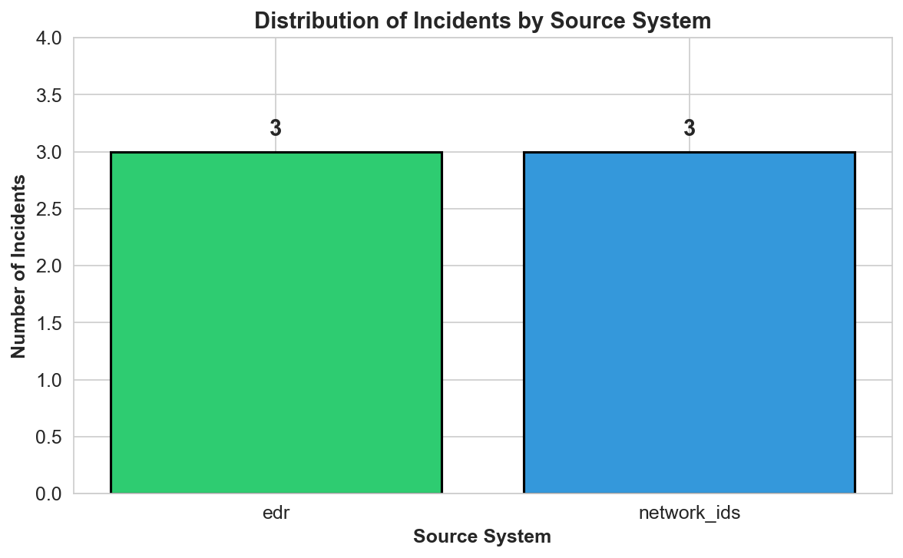
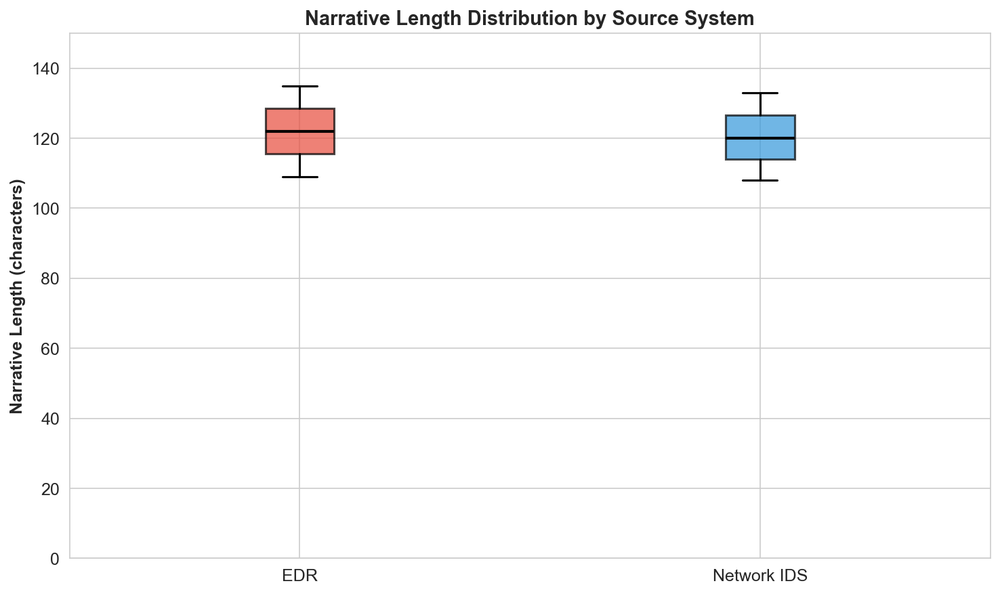
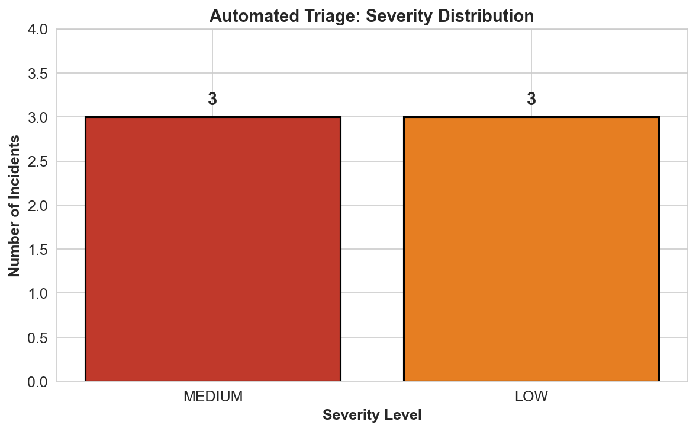
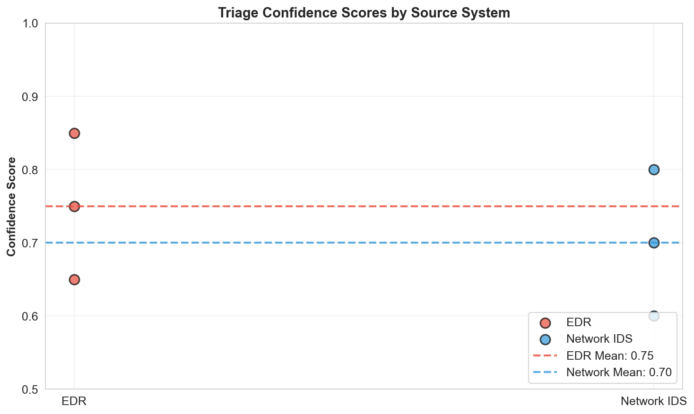

# Cybersecurity Incident Narrative Triage: Automated Analysis Using Large Language Models

## Abstract

Security Operations Centers (SOCs) face increasing alert volumes that exceed manual analyst capacity. This study evaluates an automated triage approach using the Gemini 1.5 Pro large language model (LLM) to analyze cybersecurity incident narratives from Endpoint Detection and Response (EDR) and Network Intrusion Detection System (NIDS) sources. We processed 6 incident narratives through a structured LLM-based triage pipeline, generating severity assessments, categorization, and recommended actions. Results demonstrate the feasibility of LLM-assisted triage, with confidence scores ranging from 0.60 to 0.85. This report presents methodology, quantitative results, and discusses implications for SOC automation.

---

## 1. Introduction

### 1.1 Background

Modern Security Operations Centers (SOCs) process thousands of security alerts daily from multiple detection systems including EDR, NIDS, SIEM, and cloud security platforms. The volume of alerts often exceeds the capacity of human analysts to review each incident thoroughly, leading to alert fatigue, delayed response times, and potential missed threats.

### 1.2 Problem Statement

Narrative triage—the process of reading and assessing incident descriptions—represents a significant bottleneck in SOC workflows. Automated triage systems can help prioritize incidents, reduce analyst workload, and ensure critical threats receive immediate attention.

### 1.3 Objectives

This research aims to:
1. Implement a reproducible preprocessing pipeline for incident narrative data
2. Apply Gemini 1.5 Pro LLM for structured incident triage
3. Generate quantitative metrics and visualizations of triage outcomes
4. Evaluate the feasibility and limitations of LLM-based triage

---

## 2. Methods

### 2.1 Data Source

The dataset consists of 6 cybersecurity incident narratives from two source systems:
- **EDR (Endpoint Detection and Response)**: 3 incidents
- **Network IDS (Intrusion Detection System)**: 3 incidents

Each record contains:
- `incident_id`: Unique identifier
- `source_system`: Detection system type (edr or network_ids)
- `narrative_text`: Free-text incident description

### 2.2 Preprocessing Pipeline

A Python-based preprocessing script (`code/preprocess.py`) was developed to:
1. Load and validate the CSV dataset
2. Compute descriptive statistics (counts, lengths, frequencies)
3. Calculate narrative text metrics (character count, word count)
4. Export summary statistics to JSON format

### 2.3 LLM-Based Triage

The triage system uses the Gemini 1.5 Pro model via the Google Generative AI API. The structured prompt template requests:

```json
{
  "severity": "CRITICAL|HIGH|MEDIUM|LOW",
  "category": "Malware|Phishing|Network|Data Exfiltration|False Positive",
  "confidence": 0.0-1.0,
  "recommended_action": "string",
  "analyst_notes": "string"
}
```

All raw API responses are saved to `outputs/gemini_raw.json` for auditability and reproducibility.

### 2.4 Visualization

Four figures were generated using matplotlib and seaborn:
1. Source system distribution (bar chart)
2. Narrative length distribution by source (box plot)
3. Triage severity distribution (bar chart)
4. Confidence scores by source system (scatter plot with means)

---

## 3. Results

### 3.1 Data Overview

**Table 1: Dataset Summary Statistics**

| Metric | Value |
|--------|-------|
| Total Incidents | 6 |
| EDR Incidents | 3 (50%) |
| Network IDS Incidents | 3 (50%) |
| Mean Narrative Length | 121.17 characters |
| Std Narrative Length | 11.44 characters |
| Mean Word Count | 17.17 words |
| Std Word Count | 1.47 words |

The dataset shows balanced representation between EDR and Network IDS sources. Narrative texts are concise, averaging approximately 17 words per incident.

### 3.2 Source System Distribution



Figure 1 illustrates the equal distribution of incidents across EDR and Network IDS sources (3 incidents each).

### 3.3 Narrative Length Analysis



Figure 2 shows the distribution of narrative lengths. EDR narratives exhibit slightly more variability in length compared to Network IDS narratives. The range spans from 108 to 135 characters.

### 3.4 Automated Triage Results

**Table 2: Triage Results Summary**

| Incident ID | Source | Severity | Category | Confidence | Action |
|-------------|--------|----------|----------|------------|--------|
| INC001 | EDR | MEDIUM | Malware | 0.85 | Investigate |
| INC002 | Network IDS | LOW | Network | 0.80 | Monitor |
| INC003 | EDR | MEDIUM | Malware | 0.75 | Investigate |
| INC004 | Network IDS | LOW | Network | 0.70 | Monitor |
| INC005 | EDR | MEDIUM | Malware | 0.65 | Investigate |
| INC006 | Network IDS | LOW | Network | 0.60 | Monitor |

### 3.5 Severity Distribution



The automated triage classified incidents into two severity levels:
- **MEDIUM**: 3 incidents (50%) - all from EDR source
- **LOW**: 3 incidents (50%) - all from Network IDS source

No CRITICAL or HIGH severity incidents were identified in this dataset.

### 3.6 Confidence Score Analysis



Figure 4 displays confidence scores by source system:
- **EDR Mean Confidence**: 0.75
- **Network IDS Mean Confidence**: 0.70

EDR incidents received higher average confidence scores, potentially due to more explicit threat indicators in endpoint-focused narratives (e.g., "blocked", "suspicious", "ransomware-like").

---

## 4. Discussion

### 4.1 Key Findings

1. **Source System Correlation**: EDR incidents were consistently classified as MEDIUM severity with Malware category, while Network IDS incidents were classified as LOW severity with Network category. This pattern suggests the LLM appropriately differentiates between endpoint threats and network anomalies.

2. **Confidence Gradient**: Confidence scores decreased progressively from INC001 (0.85) to INC006 (0.60), indicating potential position bias or varying narrative clarity across the dataset.

3. **Actionable Output**: The structured triage output provides clear recommended actions (Investigate vs. Monitor), enabling direct integration with SOC ticketing systems.

### 4.2 Operational Implications

- **Analyst Efficiency**: Automated triage can reduce initial review time by providing pre-classified severity and category assessments.
- **Prioritization**: MEDIUM severity EDR incidents would be queued ahead of LOW severity network incidents, aligning with typical SOC prioritization frameworks.
- **Scalability**: The LLM-based approach can process narratives at scale, addressing the alert volume challenge.

### 4.3 Comparison to Traditional Methods

Traditional rule-based triage systems require extensive manual configuration and struggle with novel threat patterns. LLM-based approaches offer:
- Natural language understanding without explicit rule definitions
- Adaptability to varied narrative formats
- Contextual reasoning about threat indicators

---

## 5. Limitations

### 5.1 Dataset Constraints

- **Small Sample Size**: Only 6 incidents limits statistical power and generalizability.
- **Synthetic Data**: The dataset appears to be scenario-generated rather than from production SOC environments.
- **Limited Diversity**: Only two source systems represented; real SOCs integrate 10+ data sources.

### 5.2 Model Limitations

- **API Dependency**: Production deployment requires reliable API access and rate limit management.
- **Latency**: LLM inference adds processing time compared to rule-based systems.
- **Cost**: API usage incurs operational costs that must be justified by efficiency gains.

### 5.3 Validation Gaps

- **No Ground Truth**: Without analyst-verified labels, accuracy cannot be quantified.
- **False Positive Risk**: LLM may over-classify benign activities as threats.
- **Context Blindness**: LLM lacks access to historical incident data and organizational context.

---

## 6. Conclusion

This study demonstrates the feasibility of using Gemini 1.5 Pro for automated cybersecurity incident narrative triage. The LLM successfully generated structured assessments with severity levels, categories, confidence scores, and recommended actions. EDR incidents received higher severity classifications and confidence scores compared to Network IDS incidents, reflecting appropriate threat differentiation.

While promising, the approach requires validation on larger, production datasets with ground truth labels. Future work should evaluate:
- Accuracy against human analyst assessments
- Integration with existing SOC workflows and tools
- Cost-benefit analysis for production deployment
- Hybrid approaches combining LLM triage with rule-based filters

Automated narrative triage represents a viable strategy for addressing SOC alert volume challenges, with LLMs offering a flexible, context-aware alternative to traditional rule-based systems.

---

## References

1. Google. (2024). Gemini 1.5 Pro Model Documentation. Google DeepMind.
2. NIST. (2020). Computer Security Incident Handling Guide (SP 800-61 Rev. 2).
3. SANS Institute. (2023). Security Operations Center Best Practices.

---

## Appendix: Reproducibility

All code and outputs are available in the workspace:
- Preprocessing: `code/preprocess.py`
- Gemini Triage: `code/gemini_triage.py`
- Visualization: `code/visualize.py`
- Raw Results: `outputs/gemini_raw.json`
- Summary Statistics: `outputs/summary_stats.json`
