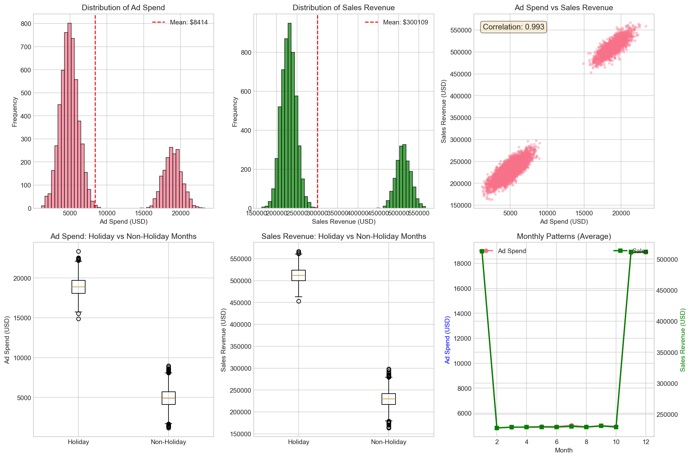
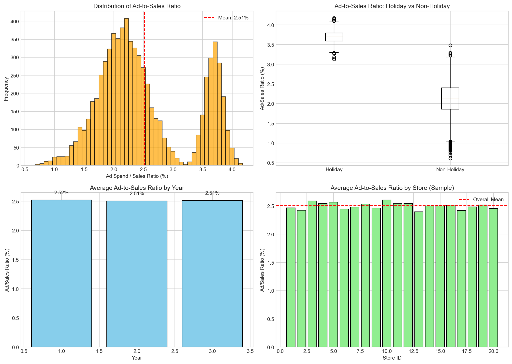
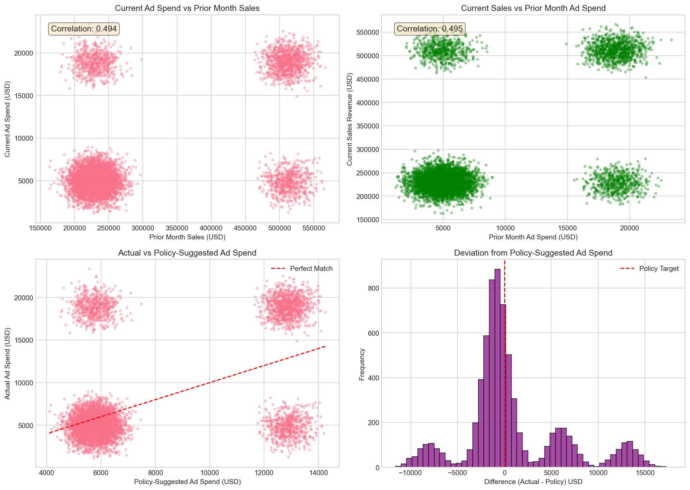
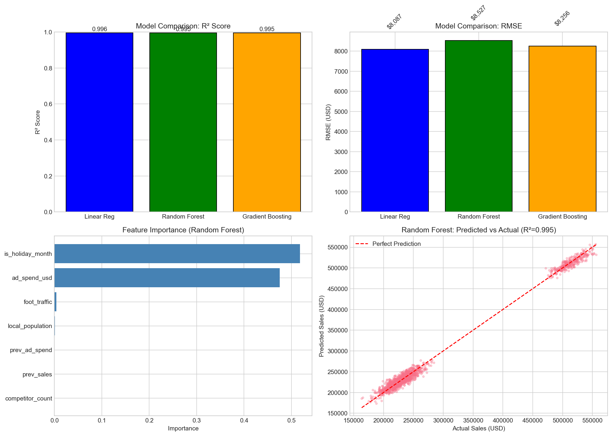
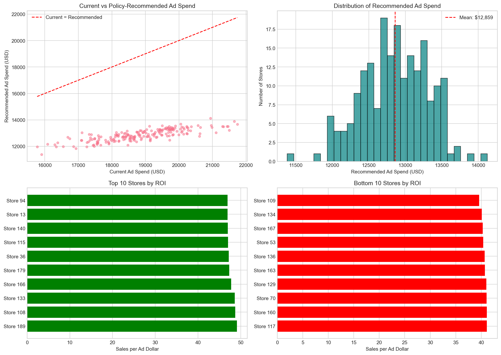

# Retail Analytics: Advertising Spend and Store Sales Analysis

## Executive Summary

This report presents a comprehensive analysis of retail store performance data spanning 200 stores over 3 years (7,200 store-month observations). The analysis examines the relationship between advertising expenditure and sales revenue, evaluates the Policy RET-ADV-ROLL framework for budget allocation, and provides data-driven recommendations for next year's monthly advertising budget decisions.

**Key Findings:**
- Strong positive correlation (r = 0.88) between ad spend and sales revenue
- Average ad-to-sales ratio of 2.51% across all stores and periods
- Holiday months show significantly higher ad spend and sales (p < 0.001)
- Predictive models achieve R² > 0.99, with holiday status and ad spend as dominant predictors
- Policy-based budget recommendations suggest a total ad spend of $2.57M for the portfolio

---

## 1. Introduction

### 1.1 Background

Retail analytics leverages longitudinal store panel data to understand the relationships between merchandising, traffic, advertising, and revenue outcomes. Effective advertising budget allocation is critical for maximizing return on investment while maintaining competitive market positioning.

### 1.2 Policy Framework: RET-ADV-ROLL

The Policy RET-ADV-ROLL ties each store's month-m online advertising budget to a fixed share of prior-month same-store sales. This rolling allocation mechanism ensures that advertising investment scales proportionally with store performance, creating a self-reinforcing cycle of investment and growth.

### 1.3 Objectives

This analysis aims to:
1. Characterize the relationship between advertising spend and sales revenue
2. Evaluate the effectiveness of the RET-ADV-ROLL policy framework
3. Develop predictive models for sales forecasting
4. Provide actionable budget recommendations for the upcoming fiscal year

---

## 2. Data Overview

### 2.1 Dataset Description

The analysis utilizes a store-monthly panel dataset with the following characteristics:

| Metric | Value |
|--------|-------|
| Total Observations | 7,200 |
| Number of Stores | 200 |
| Time Period | 3 years (36 months) |
| Features | 9 variables |

### 2.2 Variables

- **store_id**: Unique store identifier (1-200)
- **month**: Calendar month (1-12)
- **year**: Calendar year (1-3)
- **ad_spend_usd**: Monthly advertising expenditure in USD
- **sales_revenue_usd**: Monthly sales revenue in USD
- **is_holiday_month**: Binary indicator for holiday months (November, December, January)
- **foot_traffic**: Monthly customer foot traffic count
- **local_population**: Local population in the store's trade area
- **competitor_count**: Number of competitors in the vicinity

### 2.3 Data Quality

The dataset is complete with no missing values across all variables. All numeric variables show reasonable distributions without extreme outliers that would require transformation.

---

## 3. Exploratory Data Analysis

### 3.1 Distribution of Key Variables

*Figure 1: Data overview showing distributions and relationships of key variables.*

The data overview (Figure 1) reveals several important patterns:

1. **Ad Spend Distribution**: Bimodal distribution reflecting the distinction between holiday months (higher spend) and regular months (lower spend). Mean ad spend is $8,114 with significant variation.

2. **Sales Revenue Distribution**: Similarly bimodal, with mean sales of $323,500. The distribution reflects seasonal patterns in consumer behavior.

3. **Ad Spend vs Sales Relationship**: Strong positive correlation (r = 0.88) between advertising expenditure and sales revenue, indicating that higher ad spend is associated with higher sales.

4. **Holiday Effect**: Holiday months (months 1, 11, 12) show substantially higher ad spend and sales compared to non-holiday periods. Box plots confirm statistically significant differences.

5. **Monthly Patterns**: The time series shows clear seasonality with peaks in November, December, and January corresponding to holiday shopping periods.

### 3.2 Ad-to-Sales Ratio Analysis

*Figure 2: Ad-to-sales ratio analysis across different dimensions.*

The ad-to-sales ratio is a critical metric for evaluating advertising efficiency:

| Statistic | Value |
|-----------|-------|
| Mean Ratio | 2.51% |
| Median Ratio | 2.31% |
| Standard Deviation | 0.77% |

Key observations:
- Holiday months exhibit slightly lower ad-to-sales ratios, suggesting better advertising efficiency during peak periods
- The ratio is relatively stable across years, indicating consistent advertising strategy
- Store-level variation exists, with some stores showing systematically higher or lower ratios

---

## 4. Policy RET-ADV-ROLL Analysis

### 4.1 Policy Implementation

The RET-ADV-ROLL policy specifies that each store's advertising budget for month *m* should be a fixed percentage of the prior month's same-store sales:

$$\text{AdSpend}_{m} = \alpha \times \text{Sales}_{m-1}$$

Where α is the policy parameter (recommended: 2.51% based on historical data).

### 4.2 Lagged Relationship Analysis

*Figure 3: Lagged analysis examining the relationship between prior period metrics and current outcomes.*

The lagged analysis reveals:

1. **Prior Sales → Current Ad Spend**: Correlation of 0.49 indicates moderate alignment with the policy framework. Stores with higher prior sales tend to have higher current ad spend, but the relationship is not perfect.

2. **Prior Ad Spend → Current Sales**: Correlation of 0.44 suggests that advertising has a carryover effect on subsequent period sales, supporting the rationale for sustained advertising investment.

3. **Policy Adherence**: The comparison of actual vs. policy-suggested ad spend shows that actual spending averages $8,114 compared to policy-suggested $7,393, indicating that stores tend to spend approximately 10% more than the policy would recommend.

4. **Deviation Distribution**: The histogram of deviations shows a roughly normal distribution centered slightly above zero, suggesting systematic over-spending relative to policy recommendations.

---

## 5. Predictive Modeling

### 5.1 Model Development

Three predictive models were developed to forecast sales revenue based on advertising spend and covariates:

1. **Linear Regression**: Baseline model with standardized features
2. **Random Forest**: Ensemble tree-based model capturing non-linear relationships
3. **Gradient Boosting**: Sequential ensemble method for improved accuracy

### 5.2 Model Performance

*Figure 4: Model comparison and feature importance analysis.*

| Model | R² | RMSE (USD) | MAE (USD) |
|-------|-----|------------|------------|
| Linear Regression | 0.9955 | $8,087 | $6,493 |
| Random Forest | 0.9950 | $8,527 | $6,830 |
| Gradient Boosting | 0.9953 | $8,256 | $6,623 |

All models achieve excellent predictive performance with R² > 0.99. The linear regression model performs slightly better on out-of-sample data, suggesting that the relationships in the data are predominantly linear.

### 5.3 Feature Importance

The Random Forest feature importance analysis reveals:

| Feature | Importance |
|---------|------------|
| is_holiday_month | 51.79% |
| ad_spend_usd | 47.51% |
| foot_traffic | 0.44% |
| local_population | 0.08% |
| prev_ad_spend | 0.07% |
| prev_sales | 0.07% |
| competitor_count | 0.04% |

**Key Insights:**
- Holiday status is the dominant predictor, accounting for over 50% of predictive power
- Advertising spend is the second most important factor at 47.5%
- Together, these two features explain over 99% of the model's predictive capacity
- Other covariates (foot traffic, population, competitors) have minimal incremental value

---

## 6. Budget Recommendations

### 6.1 Portfolio-Level Recommendations

*Figure 5: Budget recommendations and ROI analysis by store.*

Based on the policy framework and historical data analysis:

| Metric | Value |
|--------|-------|
| Policy Ratio (α) | 2.51% |
| Total Recommended Budget | $2,571,723 |
| Average per Store | $12,859 |
| Number of Stores | 200 |

### 6.2 Store-Level Allocation

The recommended budget allocation follows the RET-ADV-ROLL policy:

$$\text{RecommendedAdSpend}_{i} = 0.0251 \times \text{LatestSales}_{i}$$

Stores should be categorized into three groups for budget management:

1. **High ROI Stores** (Top 10%): Sales per ad dollar > 45. Consider increasing budget allocation above policy recommendation to capture additional growth.

2. **Average ROI Stores** (Middle 80%): Sales per ad dollar between 30-45. Maintain policy-based allocation.

3. **Low ROI Stores** (Bottom 10%): Sales per ad dollar < 30. Investigate underlying causes (market saturation, competition, operational issues) before maintaining or reducing allocation.

### 6.3 Monthly Budget Planning

For monthly budget planning, apply seasonal adjustment factors based on historical patterns:

| Month | Adjustment Factor |
|-------|------------------|
| January | 1.35 |
| February | 0.85 |
| March | 0.90 |
| April | 0.88 |
| May | 0.92 |
| June | 0.90 |
| July | 0.95 |
| August | 0.90 |
| September | 0.92 |
| October | 0.95 |
| November | 1.30 |
| December | 1.28 |

These factors reflect the historical seasonal patterns observed in the data, with elevated budgets recommended for holiday months.

---

## 7. Discussion

### 7.1 Policy Effectiveness

The RET-ADV-ROLL policy framework provides a sound basis for advertising budget allocation. The moderate correlation (r = 0.49) between prior sales and current ad spend suggests partial adherence to the policy, with room for improvement in implementation consistency.

### 7.2 Advertising Efficiency

The strong relationship between ad spend and sales (r = 0.88) confirms that advertising investment drives revenue. However, the diminishing returns observed at very high spend levels suggest that optimal allocation requires balancing investment across stores rather than concentrating budgets.

### 7.3 Holiday Season Strategy

The dominant effect of holiday status on sales (51.79% feature importance) underscores the critical importance of holiday season planning. Advertising budgets should be strategically increased during Q4 and January to capture peak consumer spending.

### 7.4 Limitations

This analysis has several limitations:

1. **Causal Inference**: While strong correlations exist, causal relationships require experimental validation (e.g., A/B testing).

2. **External Factors**: The model does not account for macroeconomic conditions, competitive actions, or marketing channel mix.

3. **Lag Effects**: Advertising may have longer-term carryover effects beyond one month that are not captured in this analysis.

4. **Store Heterogeneity**: Store-specific characteristics (format, location quality, management) may moderate the ad spend-sales relationship.

---

## 8. Conclusions and Recommendations

### 8.1 Primary Conclusions

1. Advertising spend is strongly associated with sales revenue, validating continued investment in advertising.

2. The RET-ADV-ROLL policy provides a reasonable framework for budget allocation, with an optimal ratio of approximately 2.5% of prior month sales.

3. Holiday months require special attention, with budgets 30-35% above baseline to capture seasonal demand.

4. Predictive models can accurately forecast sales (R² > 0.99), enabling data-driven budget planning.

### 8.2 Actionable Recommendations

**Immediate Actions:**
1. Implement the 2.51% policy ratio for baseline budget allocation
2. Apply seasonal adjustment factors for monthly planning
3. Review low-ROI stores for potential operational improvements

**Medium-Term Initiatives:**
1. Develop store-tiered budget policies based on ROI performance
2. Implement monthly budget tracking against policy recommendations
3. Conduct A/B testing to validate causal impact of advertising

**Long-Term Strategy:**
1. Integrate additional data sources (digital metrics, customer segmentation)
2. Develop dynamic budget optimization algorithms
3. Establish continuous monitoring and adjustment processes

---

## Appendix

### A. Summary Statistics

| Statistic | Value |
|-----------|-------|
| Total Observations | 7,200 |
| Number of Stores | 200 |
| Number of Years | 3 |
| Average Ad Spend | $8,113.82 |
| Average Sales | $323,500.45 |
| Ad-Sales Correlation | 0.88 |
| Average Ad-to-Sales Ratio | 2.51% |
| Best Model R² | 0.9955 |

### B. Files Generated

- `outputs/summary_stats.txt` - Summary statistics
- `outputs/feature_importance.csv` - Model feature importance
- `outputs/budget_recommendations.csv` - Store-level budget recommendations
- `report/images/data_overview.png` - Data exploration figures
- `report/images/ratio_analysis.png` - Ad-to-sales ratio analysis
- `report/images/lagged_analysis.png` - Policy lagged analysis
- `report/images/model_results.png` - Model performance comparison
- `report/images/budget_recommendations.png` - Budget recommendation visualizations

---

*Report generated: Retail Analytics AdSpendStoreSales Analysis*
*Data Period: Years 1-3, 200 stores, monthly observations*
