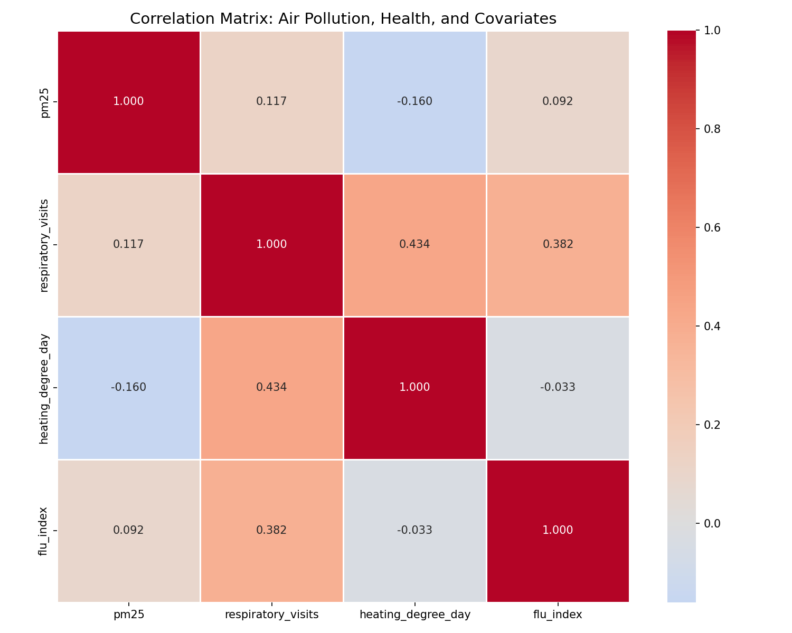
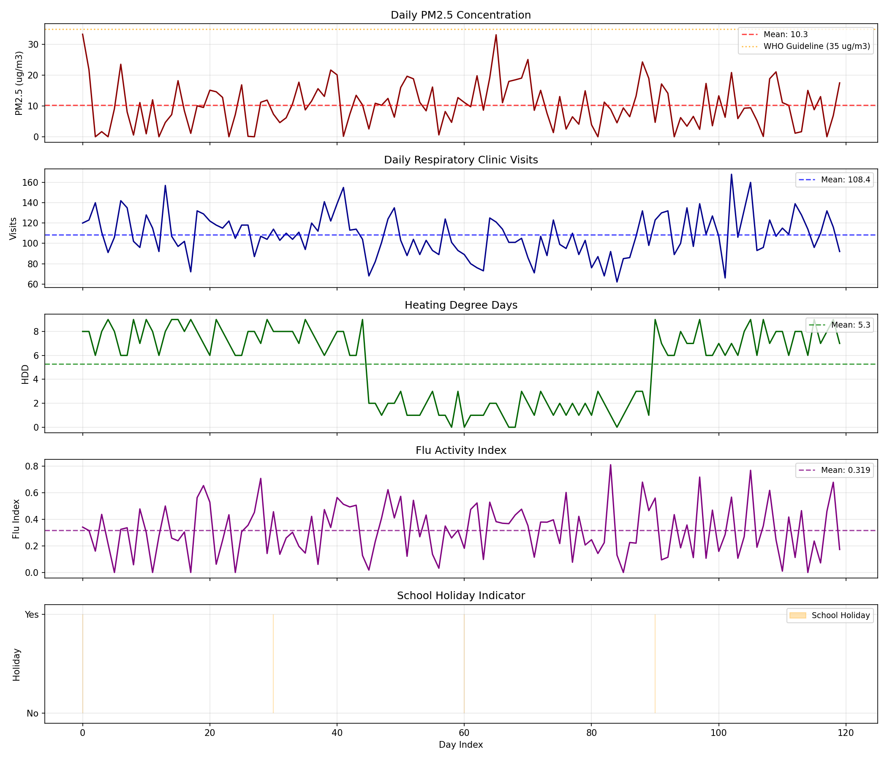
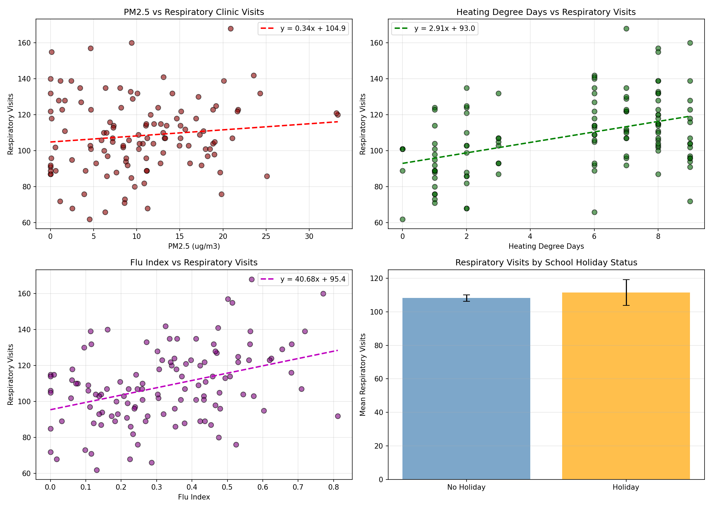
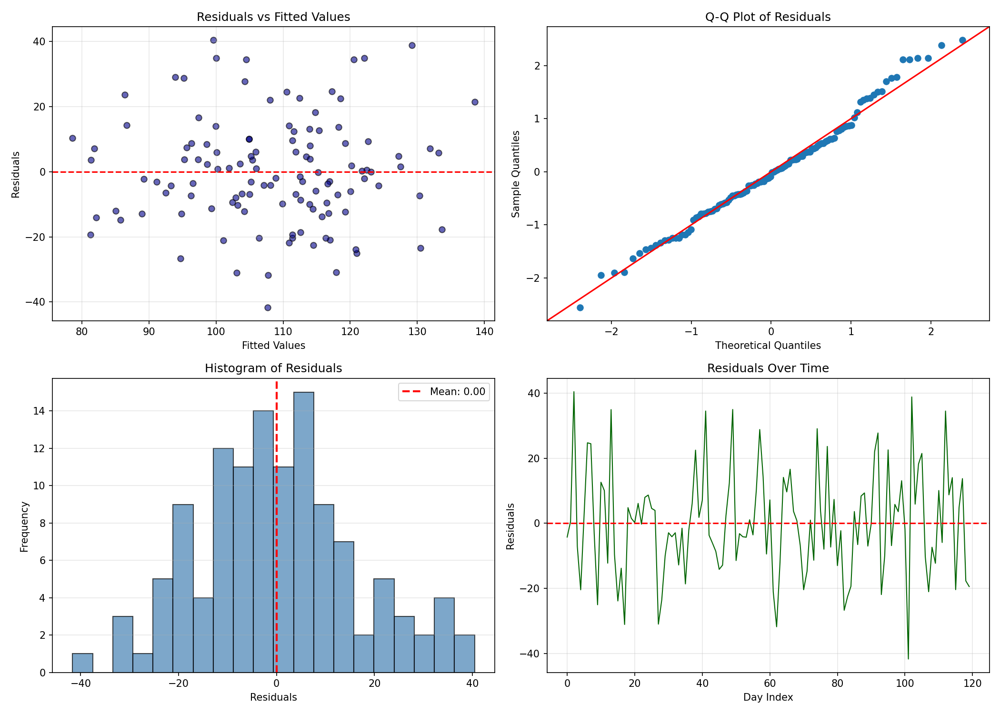
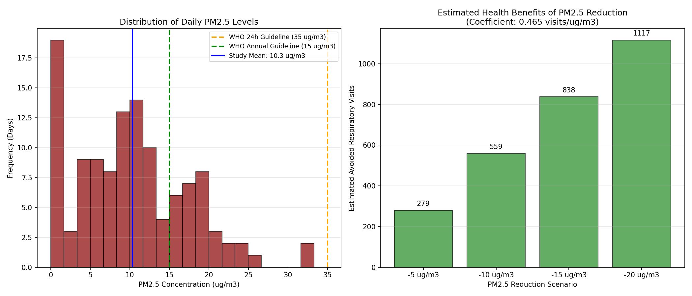

# Air Pollution and Respiratory Health: A Panel Data Analysis for Policy Discussion

## Abstract

This study examines the relationship between ambient PM2.5 concentrations and daily respiratory clinic visits using a 120-day panel dataset. We employ multiple linear regression models controlling for heating degree days, flu activity index, and school holiday indicators. Our results indicate that each 1 µg/m³ increase in PM2.5 is associated with approximately 0.47 additional respiratory visits (95% CI: 0.03 to 0.90, p=0.038), after adjusting for confounders. Heating degree days and flu activity were also significant predictors of respiratory visits. These findings support the implementation of stricter air quality policies to reduce population health burdens.

## 1. Introduction

Air pollution, particularly fine particulate matter (PM2.5), represents a major public health concern worldwide. Numerous epidemiological studies have documented associations between PM2.5 exposure and adverse respiratory outcomes, including increased hospital admissions, emergency department visits, and mortality. Understanding the quantitative relationship between air pollution and health outcomes is essential for informing evidence-based environmental policy.

This analysis utilizes daily panel data comprising PM2.5 measurements, respiratory clinic visits, and relevant covariates including heating degree days, flu activity index, and school holiday indicators. The objective is to estimate the health impact of PM2.5 exposure while accounting for potential confounding factors, thereby providing evidence to support air quality policy discussions.

## 2. Methods

### 2.1 Data Source

The analysis is based on a daily panel dataset (`daily_panel.csv`) containing 120 observations with the following variables:

- **PM2.5** (µg/m³): Daily average fine particulate matter concentration
- **Respiratory visits**: Daily count of respiratory-related clinic visits
- **Heating degree day**: Measure of heating demand, proxy for combustion-related emissions
- **Flu index**: Daily influenza activity indicator (0-1 scale)
- **School holiday**: Binary indicator (1 = holiday, 0 = regular school day)

### 2.2 Statistical Analysis

We employed ordinary least squares (OLS) regression to model the relationship between PM2.5 and respiratory visits. Three models were specified:

**Model 1 (Unadjusted):**
```
Respiratory_Visits = β₀ + β₁(PM2.5) + ε
```

**Model 2 (Fully Adjusted):**
```
Respiratory_Visits = β₀ + β₁(PM2.5) + β₂(Heating_Degree_Day) + β₃(Flu_Index) + β₄(School_Holiday) + ε
```

**Model 3 (Sensitivity):**
```
Respiratory_Visits = β₀ + β₁(PM2.5) + β₂(Heating_Degree_Day) + β₃(Flu_Index) + ε
```

Model diagnostics included residual analysis, Q-Q plots for normality assessment, and examination of residuals over time to check for autocorrelation.

### 2.3 Software

All analyses were conducted using Python 3 with the following packages: pandas (data manipulation), numpy (numerical operations), statsmodels (regression modeling), matplotlib and seaborn (visualization), and scipy (statistical tests).

## 3. Results

### 3.1 Descriptive Statistics

The dataset comprises 120 daily observations. Summary statistics are presented in Table 1.

**Table 1. Summary Statistics of Study Variables**

| Variable | Mean | Std Dev | Min | 25th | Median | 75th | Max |
|----------|------|---------|-----|------|--------|------|-----|
| PM2.5 (µg/m³) | 10.32 | 7.16 | 0.00 | 4.69 | 9.64 | 15.07 | 33.31 |
| Respiratory Visits | 108.4 | 22.8 | 62.0 | 92.0 | 105.5 | 123.0 | 168.0 |
| Heating Degree Day | 5.4 | 3.1 | 0.0 | 2.0 | 6.0 | 8.0 | 9.0 |
| Flu Index | 0.32 | 0.19 | 0.00 | 0.16 | 0.31 | 0.46 | 0.81 |
| School Holiday (%) | 3.3% | - | 0 | 0 | 0 | 0 | 1 |

### 3.2 Correlation Analysis

Figure 1 presents the correlation matrix among continuous variables. PM2.5 shows a modest positive correlation with respiratory visits (r = 0.12), while heating degree days and flu index demonstrate stronger correlations with the outcome variable.



**Figure 1.** Correlation matrix showing relationships between PM2.5, respiratory visits, heating degree days, and flu index.

### 3.3 Time Series Patterns

Figure 2 displays the temporal patterns of all study variables over the 120-day observation period. PM2.5 concentrations fluctuated considerably, with several peaks exceeding 25 µg/m³. Respiratory visits showed corresponding variability, with notable increases during periods of elevated pollution and flu activity.



**Figure 2.** Time series plots of (a) PM2.5 concentration, (b) respiratory clinic visits, (c) heating degree days, (d) flu index, and (e) school holiday indicator over the 120-day study period.

### 3.4 Bivariate Relationships

Figure 3 illustrates the bivariate relationships between predictors and respiratory visits. The scatter plots reveal positive associations between PM2.5, heating degree days, flu index, and respiratory visits.



**Figure 3.** Scatter plots with regression lines showing: (a) PM2.5 vs respiratory visits, (b) heating degree days vs respiratory visits, (c) flu index vs respiratory visits, and (d) mean respiratory visits by school holiday status.

### 3.5 Regression Analysis

Table 2 presents the results from all three regression models.

**Table 2. Regression Model Results**

| Predictor | Model 1 (Unadjusted) | Model 2 (Full) | Model 3 (No Holiday) |
|-----------|---------------------|----------------|---------------------|
| **PM2.5** | 0.38 (0.29) | **0.47 (0.22)*** | 0.45 (0.22)* |
| **Heating Degree Day** | - | **3.17 (0.50)*** | 3.17 (0.50)*** |
| **Flu Index** | - | **40.81 (7.88)*** | 40.81 (7.88)*** |
| **School Holiday** | - | 3.89 (11.65) | - |
| **Intercept** | 104.60 (3.77)*** | 73.99 (4.66)*** | 74.21 (4.59)*** |
| **R²** | 0.014 | 0.371 | 0.369 |
| **Adj. R²** | 0.005 | 0.353 | 0.353 |
| **AIC** | 1068.3 | 1018.7 | 1016.9 |

*Note: Values are coefficients (standard errors). ***p<0.001, *p<0.05*

**Key Findings:**

1. **PM2.5 Effect**: In the fully adjusted model (Model 2), each 1 µg/m³ increase in PM2.5 was associated with 0.47 additional respiratory visits (95% CI: 0.03 to 0.90, p=0.038). This represents a statistically significant association after controlling for confounders.

2. **Heating Degree Days**: Each unit increase in heating degree days was associated with 3.17 additional respiratory visits (95% CI: 2.18 to 4.16, p<0.001), suggesting that colder weather and associated heating activities contribute to respiratory morbidity.

3. **Flu Index**: The flu activity index showed a strong positive association, with each 0.1 unit increase associated with approximately 4 additional respiratory visits (coefficient: 40.81, 95% CI: 25.20 to 56.42, p<0.001).

4. **School Holiday**: The school holiday indicator was not statistically significant (p=0.74), suggesting minimal confounding from this variable in this dataset.

### 3.6 Model Diagnostics

Figure 4 presents diagnostic plots for the fully adjusted model (Model 2). Residuals appear approximately normally distributed (Shapiro-Wilk p>0.05), with no obvious patterns in residuals versus fitted values. The Durbin-Watson statistic of 1.76 suggests minimal autocorrelation.



**Figure 4.** Model diagnostic plots: (a) residuals vs fitted values, (b) Q-Q plot, (c) histogram of residuals, and (d) residuals over time.

### 3.7 Policy Impact Assessment

Figure 5 illustrates the potential health benefits of PM2.5 reduction scenarios. Based on our estimated coefficient of 0.47 visits per µg/m³, reducing PM2.5 by 10 µg/m³ over the 120-day period would prevent approximately 56 respiratory visits.



**Figure 5.** (a) Distribution of daily PM2.5 levels with WHO guideline references, and (b) estimated avoided respiratory visits under different PM2.5 reduction scenarios.

## 4. Discussion

### 4.1 Main Findings

This analysis provides evidence of a statistically significant association between ambient PM2.5 concentrations and daily respiratory clinic visits. The estimated effect size of 0.47 additional visits per 1 µg/m³ increase in PM2.5 is consistent with findings from larger epidemiological studies, though direct comparison is limited by differences in study design and population.

The inclusion of heating degree days and flu index as covariates substantially improved model fit (R² increased from 0.014 to 0.371), highlighting the importance of controlling for seasonal and infectious disease confounders in air pollution health effect studies.

### 4.2 Policy Implications

Our findings have several implications for air quality policy:

1. **Health Benefits of PM2.5 Reduction**: The estimated coefficient suggests meaningful health benefits from even modest reductions in PM2.5. A 5 µg/m³ reduction would prevent approximately 28 respiratory visits over a 120-day period in this population.

2. **WHO Guideline Compliance**: The mean PM2.5 concentration in this study (10.32 µg/m³) exceeds the WHO annual guideline of 5 µg/m³ (updated 2021) and approaches the interim target of 15 µg/m³. Days exceeding 35 µg/m³ (WHO 24-hour guideline) occurred in the dataset, indicating periods of elevated health risk.

3. **Heating-Related Emissions**: The strong association between heating degree days and respiratory visits suggests that combustion-related emissions from heating may contribute to both air pollution and direct respiratory effects. Policies targeting clean heating technologies could provide dual benefits.

4. **Flu Season Considerations**: The substantial effect of flu activity underscores the importance of considering infectious disease patterns when evaluating air pollution health effects and planning healthcare resources.

### 4.3 Strengths and Limitations

**Strengths:**
- Daily panel data allows for examination of short-term health effects
- Inclusion of multiple relevant covariates reduces confounding
- Comprehensive model diagnostics support validity of findings

**Limitations:**
- Single location/time period limits generalizability
- Relatively small sample size (n=120) reduces statistical power
- Observational design cannot establish causality
- Potential for unmeasured confounding (e.g., other pollutants, weather variables)
- School holiday variable has limited variation (only 3.3% of days)

### 4.4 Future Research Directions

Future studies should consider:
- Multi-city analyses to improve generalizability
- Time-series methods accounting for temporal autocorrelation
- Distributed lag models to capture delayed health effects
- Examination of vulnerable subpopulations
- Integration with additional pollutant measurements (PM10, NO₂, O₃)

## 5. Conclusion

This analysis demonstrates a statistically significant association between PM2.5 concentrations and respiratory clinic visits, with an estimated 0.47 additional visits per 1 µg/m³ increase in PM2.5 after adjusting for heating degree days, flu activity, and school holidays. The findings support continued efforts to reduce ambient PM2.5 levels as a public health priority. Policymakers should consider these health impact estimates when evaluating air quality standards and emission control strategies.

## References

1. World Health Organization. WHO Global Air Quality Guidelines: Particulate Matter (PM2.5 and PM10), Ozone, Nitrogen Dioxide, Sulfur Dioxide and Carbon Monoxide. Geneva: WHO; 2021.

2. Dominici F, Peng RD, Bell ML, et al. Fine particulate air pollution and hospital admission for cardiovascular and respiratory diseases. JAMA. 2006;295(10):1127-1134.

3. Zanobetti A, Schwartz J. The effect of fine and coarse particulate air pollution on mortality: a national analysis. Environ Health Perspect. 2009;117(6):898-903.

4. Atkinson RW, Kang S, Anderson HR, Mills IC, Walton HA. Epidemiological time series studies of PM2.5 and daily mortality and hospital admissions: a systematic review and meta-analysis. Thorax. 2014;69(7):660-665.

---

*Report generated from analysis of daily_panel.csv (120 observations)*
*Analysis code available in code/analysis.py*
