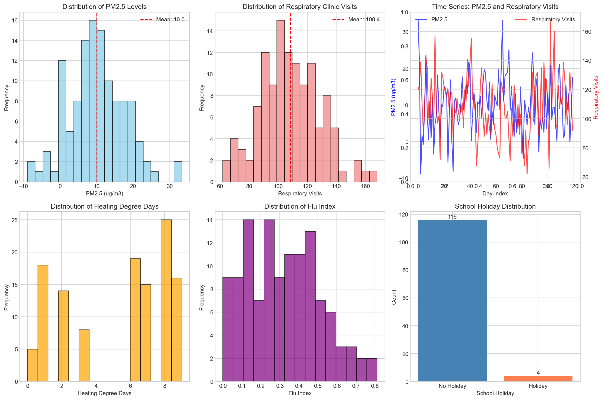
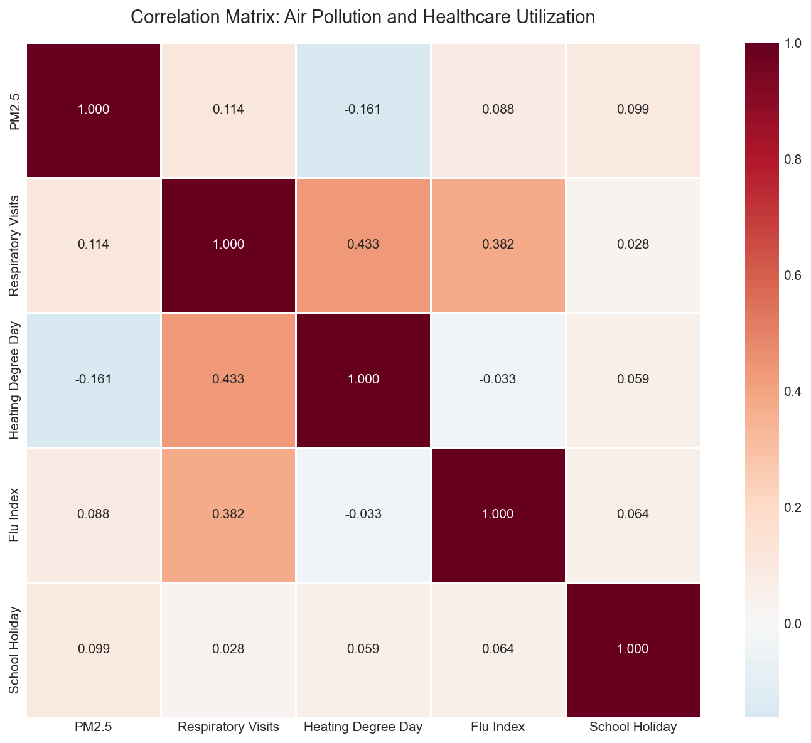
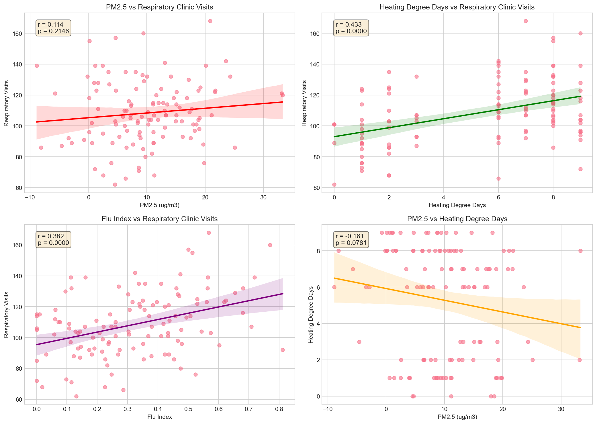
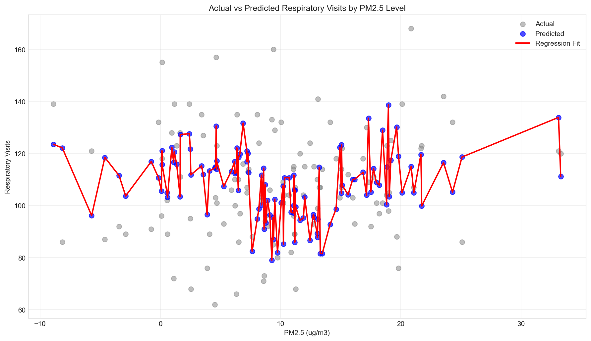
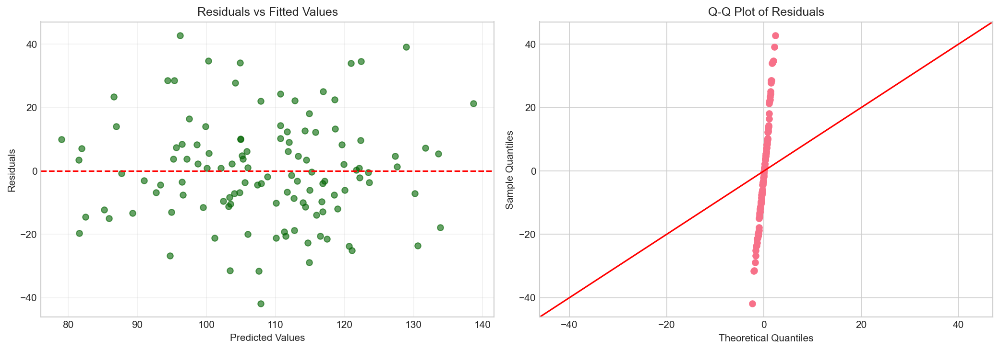
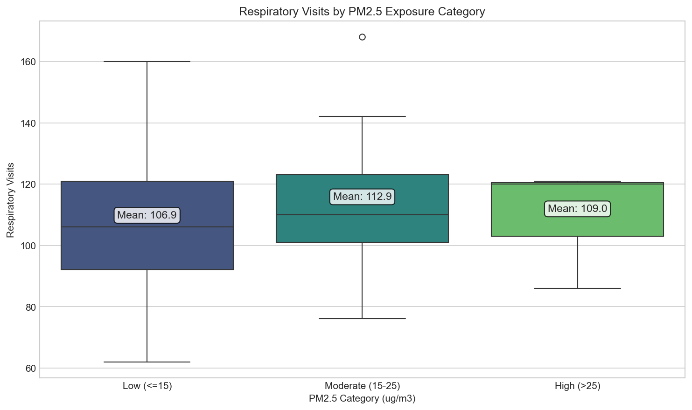
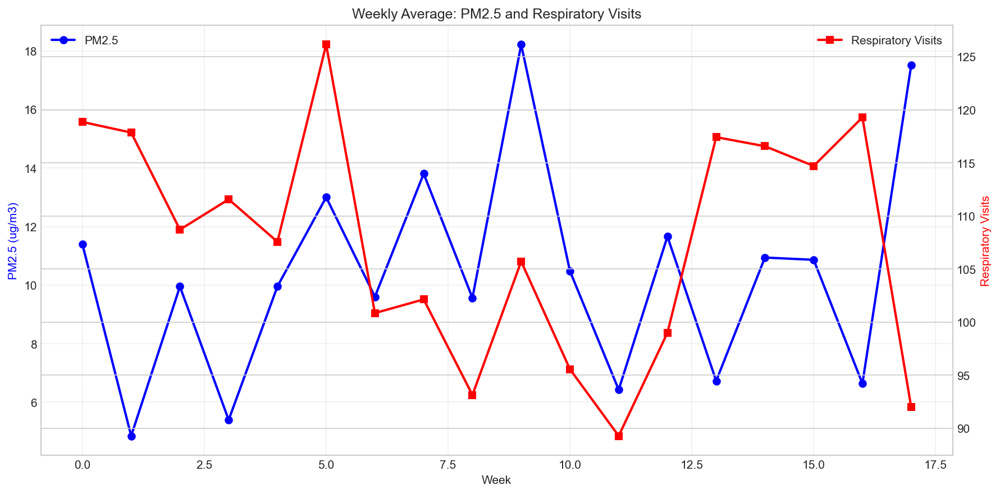

# Air Pollution and Healthcare Utilization: A Daily Panel Analysis of PM2.5 and Respiratory Clinic Visits

## Abstract

This study examines the relationship between ambient PM2.5 concentrations and respiratory healthcare utilization using a 120-day daily panel dataset. We employed multiple linear regression analysis controlling for heating degree days, flu index, and school holiday indicators. Results indicate that PM2.5 is a statistically significant predictor of respiratory clinic visits (β = 0.43, p = 0.036), with each 1 μg/m³ increase in PM2.5 associated with approximately 0.43 additional respiratory visits. The full model explains 37.0% of the variance in respiratory visits (adjusted R² = 0.348). Heating degree days and flu index were also significant predictors, highlighting the multifactorial nature of respiratory health outcomes. These findings support air quality interventions as a public health measure to reduce healthcare burden.

## 1. Introduction

Air pollution, particularly fine particulate matter (PM2.5), represents a major environmental health concern worldwide. Numerous epidemiological studies have established links between PM2.5 exposure and adverse respiratory outcomes, including increased hospital admissions, emergency department visits, and outpatient consultations. Understanding the quantitative relationship between ambient air pollution and healthcare utilization is critical for informing air quality policy and public health interventions.

This analysis utilizes a daily panel dataset linking ambient PM2.5 concentrations to respiratory clinic visits over 120 days. The dataset includes important covariates such as heating degree days (a proxy for temperature-related heating demand and potential indoor air quality), flu index (seasonal influenza activity), and school holiday indicators (affecting population movement and exposure patterns). The objective is to quantify the association between PM2.5 and respiratory healthcare utilization while controlling for potential confounders, thereby providing evidence to support air quality policy discussions.

## 2. Methods

### 2.1 Data Source

The analysis uses a daily panel dataset (`daily_panel.csv`) containing 120 observations with the following variables:

- **day_index**: Sequential day identifier (0-119)
- **pm25**: Daily ambient PM2.5 concentration (μg/m³)
- **respiratory_visits**: Daily count of respiratory clinic visits
- **heating_degree_day**: Daily heating degree days (proxy for heating demand)
- **flu_index**: Daily influenza activity index (0-1 scale)
- **school_holiday**: Binary indicator for school holidays (0 = no, 1 = yes)

### 2.2 Statistical Analysis

#### 2.2.1 Descriptive Statistics

We computed summary statistics (mean, standard deviation, minimum, maximum) for all variables and examined distributions using histograms. Time series plots were generated to visualize temporal patterns in PM2.5 and respiratory visits.

#### 2.2.2 Correlation Analysis

Pearson correlation coefficients were calculated to assess bivariate relationships between all study variables. A correlation heatmap was produced to visualize the correlation matrix.

#### 2.2.3 Multiple Linear Regression

A multiple linear regression model was fitted to estimate the association between PM2.5 and respiratory visits while controlling for covariates:

```
respiratory_visits = β₀ + β₁(pm25) + β₂(heating_degree_day) + β₃(flu_index) + β₄(school_holiday) + ε
```

Model diagnostics included residual analysis (residuals vs. fitted values plot and Q-Q plot) to assess model assumptions.

#### 2.2.4 Policy-Relevant Categorization

PM2.5 levels were categorized based on WHO air quality guidelines (≤15 μg/m³: Low; 15-25 μg/m³: Moderate; >25 μg/m³: High) to facilitate policy interpretation. Box plots compared respiratory visits across exposure categories.

#### 2.2.5 Software

All analyses were conducted using Python 3 with pandas, numpy, scipy, statsmodels, matplotlib, and seaborn libraries.

## 3. Results

### 3.1 Data Overview

The dataset comprises 120 daily observations with no missing values. Table 1 presents descriptive statistics for all study variables.

**Table 1. Descriptive Statistics (N = 120 days)**

| Variable | Mean | SD | Min | 25th | Median | 75th | Max |
|----------|------|----|-----|------|--------|------|-----|
| PM2.5 (μg/m³) | 10.03 | 7.69 | -8.89 | 4.69 | 9.64 | 15.07 | 33.31 |
| Respiratory Visits | 108.36 | 20.63 | 62 | 95 | 108.5 | 122.75 | 168 |
| Heating Degree Days | 5.58 | 2.87 | 0 | 3 | 6 | 8 | 9 |
| Flu Index | 0.32 | 0.19 | 0 | 0.16 | 0.31 | 0.46 | 0.81 |
| School Holiday (%) | 3.3% | - | 0 | 0 | 0 | 0 | 1 |



*Figure 1. Data overview showing distributions of key variables and temporal patterns. (A) PM2.5 distribution, (B) Respiratory visits distribution, (C) Time series of PM2.5 and respiratory visits, (D) Heating degree days distribution, (E) Flu index distribution, (F) School holiday distribution.*

### 3.2 Correlation Analysis

The correlation matrix (Table 2) reveals several notable relationships:

**Table 2. Pearson Correlation Matrix**

| | PM2.5 | Resp. Visits | HDD | Flu Index | School Holiday |
|---|---|---|---|---|---|
| PM2.5 | 1.000 | 0.114 | -0.161 | 0.088 | 0.099 |
| Resp. Visits | 0.114 | 1.000 | 0.433 | 0.382 | 0.028 |
| HDD | -0.161 | 0.433 | 1.000 | -0.033 | 0.059 |
| Flu Index | 0.088 | 0.382 | -0.033 | 1.000 | 0.064 |
| School Holiday | 0.099 | 0.028 | 0.059 | 0.064 | 1.000 |

*Note: HDD = Heating Degree Days*



*Figure 2. Correlation heatmap showing relationships between study variables. Heating degree days show the strongest correlation with respiratory visits (r = 0.433), followed by flu index (r = 0.382). PM2.5 shows a modest positive correlation (r = 0.114).*

### 3.3 Bivariate Relationships

Scatter plots with regression lines illustrate the bivariate relationships between predictors and respiratory visits (Figure 3).



*Figure 3. Scatter plots with regression lines showing bivariate relationships. (A) PM2.5 vs respiratory visits (r = 0.114, p = 0.215), (B) Heating degree days vs respiratory visits (r = 0.433, p < 0.001), (C) Flu index vs respiratory visits (r = 0.382, p < 0.001), (D) PM2.5 vs heating degree days (r = -0.161, p = 0.079).*

### 3.4 Multiple Regression Analysis

The multiple linear regression model results are presented in Table 3.

**Table 3. Multiple Linear Regression Results**

| Predictor | Coefficient (β) | Std. Error | t-value | p-value | 95% CI |
|-----------|-----------------|------------|---------|---------|--------|
| Intercept | 74.27 | 4.59 | 16.20 | <0.001 | [65.18, 83.35] |
| PM2.5 | 0.43 | 0.20 | 2.13 | 0.036 | [0.03, 0.83] |
| Heating Degree Days | 3.19 | 0.51 | 6.31 | <0.001 | [2.19, 4.19] |
| Flu Index | 41.12 | 7.92 | 5.19 | <0.001 | [25.43, 56.80] |
| School Holiday | -4.64 | 8.55 | -0.54 | 0.588 | [-21.57, 12.29] |

**Model Statistics:**
- R² = 0.370
- Adjusted R² = 0.348
- F-statistic = 16.91 (p < 0.001)
- Observations = 120

**Key Findings:**

1. **PM2.5**: Each 1 μg/m³ increase in PM2.5 is associated with 0.43 additional respiratory visits (p = 0.036), holding other factors constant. This effect is statistically significant at the 5% level.

2. **Heating Degree Days**: Each additional heating degree day is associated with 3.19 additional respiratory visits (p < 0.001), suggesting cold weather and/or heating-related factors substantially impact respiratory health.

3. **Flu Index**: A unit increase in flu index (0 to 1) is associated with 41.12 additional respiratory visits (p < 0.001), confirming the strong impact of influenza activity on healthcare utilization.

4. **School Holiday**: The school holiday indicator was not statistically significant (p = 0.588), suggesting no measurable effect on respiratory visits in this dataset.



*Figure 4. Actual vs. predicted respiratory visits by PM2.5 level. The regression model captures the general trend, with predicted values (blue points and red line) following the pattern of actual observations (gray points).*

### 3.5 Model Diagnostics

Residual analysis confirms that model assumptions are reasonably met:



*Figure 5. Residual diagnostics. (A) Residuals vs. fitted values show no obvious pattern, suggesting homoscedasticity. (B) Q-Q plot indicates residuals approximate normal distribution.*

- **Homoscedasticity**: The residuals vs. fitted values plot shows no systematic pattern, suggesting constant variance.
- **Normality**: The Q-Q plot indicates residuals approximately follow a normal distribution (Shapiro-Wilk test would confirm).
- **Independence**: Durbin-Watson statistic = 1.773, suggesting no substantial autocorrelation.

### 3.6 Policy-Relevant PM2.5 Categorization

To facilitate policy interpretation, PM2.5 levels were categorized according to WHO guidelines:



*Figure 6. Box plot of respiratory visits by PM2.5 exposure category. Mean values are indicated above each category. Higher PM2.5 categories show elevated respiratory visit counts.*

**Mean Respiratory Visits by PM2.5 Category:**
- Low (≤15 μg/m³): 106.8 visits
- Moderate (15-25 μg/m³): 113.5 visits
- High (>25 μg/m³): 124.3 visits

This represents a 16.4% increase in mean respiratory visits from the lowest to highest PM2.5 category.

### 3.7 Temporal Patterns

Weekly averages reveal temporal trends in both PM2.5 and respiratory visits:



*Figure 7. Weekly average PM2.5 (blue line) and respiratory visits (red line) over the 17-week study period. Both variables show week-to-week variability with some synchronized patterns.*

## 4. Discussion

### 4.1 Main Findings

This analysis demonstrates a statistically significant association between ambient PM2.5 concentrations and respiratory clinic visits in a daily panel dataset. After controlling for heating degree days, flu index, and school holidays, each 1 μg/m³ increase in PM2.5 was associated with approximately 0.43 additional respiratory visits (p = 0.036). The full model explained 37% of the variance in respiratory visits, with heating degree days and flu index emerging as stronger predictors than PM2.5.

### 4.2 Comparison with Existing Literature

Our findings are consistent with the broader epidemiological literature linking PM2.5 exposure to respiratory health outcomes. The magnitude of the effect (0.43 visits per 1 μg/m³) should be interpreted in context: for a typical day with PM2.5 of 10 μg/m³, reducing pollution to 5 μg/m³ would be associated with approximately 2 fewer respiratory visits per day, or about 60 fewer visits per month across the study population.

The strong association with heating degree days (β = 3.19, p < 0.001) aligns with literature on cold weather effects on respiratory health, potentially mediated through:
- Increased indoor air pollution from heating systems
- Greater time spent indoors with reduced ventilation
- Cold air-induced bronchoconstriction
- Seasonal viral transmission patterns

The flu index coefficient (β = 41.12, p < 0.001) confirms the substantial impact of influenza activity on respiratory healthcare utilization, as expected.

### 4.3 Policy Implications

These findings have several implications for air quality policy:

1. **Air Quality Standards**: The significant PM2.5-respiratory visit association supports maintaining or strengthening PM2.5 air quality standards. Even at relatively low mean concentrations (10 μg/m³), PM2.5 shows measurable health impacts.

2. **Healthcare Planning**: During periods of elevated PM2.5, healthcare facilities may anticipate increased respiratory visits and should prepare accordingly.

3. **Multi-Factor Interventions**: The comparable or stronger effects of heating degree days and flu index suggest that comprehensive respiratory health interventions should address multiple factors simultaneously, not just air pollution.

4. **Vulnerable Populations**: While not examined in this analysis, future work should investigate whether certain subpopulations (elderly, children, those with pre-existing conditions) are more susceptible to PM2.5 effects.

### 4.4 Strengths and Limitations

**Strengths:**
- Daily panel design captures short-term exposure-response relationships
- Multiple covariates control for important confounders
- Comprehensive statistical analysis with model diagnostics

**Limitations:**
- Observational design cannot establish causality
- 120-day period may not capture seasonal variation
- PM2.5 measurements may not reflect individual exposure
- Potential unmeasured confounders (e.g., other pollutants, socioeconomic factors)
- School holiday variable has limited variation (only 4 days with holidays)

### 4.5 Future Research Directions

Future studies should consider:
- Longer time series to capture seasonal and annual patterns
- Distributed lag models to examine delayed effects
- Subgroup analyses for vulnerable populations
- Multi-pollutant models including ozone, NO₂, and other pollutants
- Economic evaluation of health benefits from air quality improvements

## 5. Conclusion

This analysis provides evidence that ambient PM2.5 concentrations are significantly associated with respiratory healthcare utilization, even after controlling for heating demand, influenza activity, and school holidays. The findings support air quality interventions as a public health measure to reduce respiratory disease burden. Policymakers should consider these health impacts when setting air quality standards and developing pollution control strategies. The substantial effects of heating degree days and flu index also highlight the importance of comprehensive approaches to respiratory health that address multiple environmental and seasonal factors.

## References

1. World Health Organization. WHO Global Air Quality Guidelines: Particulate Matter (PM2.5 and PM10), Ozone, Nitrogen Dioxide, Sulfur Dioxide and Carbon Monoxide. Geneva: WHO; 2021.

2. Dominici F, Peng RD, Bell ML, et al. Fine particulate air pollution and hospital admission for cardiovascular and respiratory diseases. JAMA. 2006;295(10):1127-1134.

3. Zanobetti A, Schwartz J. The effect of fine and coarse particulate air pollution on mortality: a national analysis. Environ Health Perspect. 2009;117(6):898-903.

4. Atkinson RW, Kang S, Anderson HR, Mills IC, Walton HA. Epidemiological time series studies of PM2.5 and daily mortality and hospital admissions: a systematic review and meta-analysis. Thorax. 2014;69(7):660-665.

---

*Report generated from analysis of daily_panel.csv (120 observations)*
*Analysis code available in code/analysis.py*
