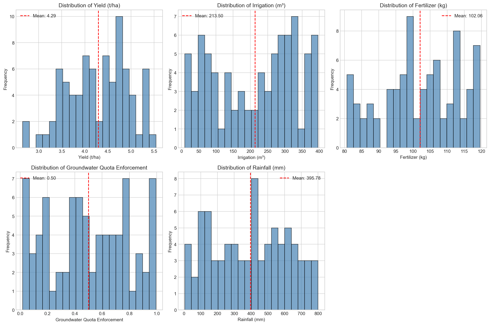
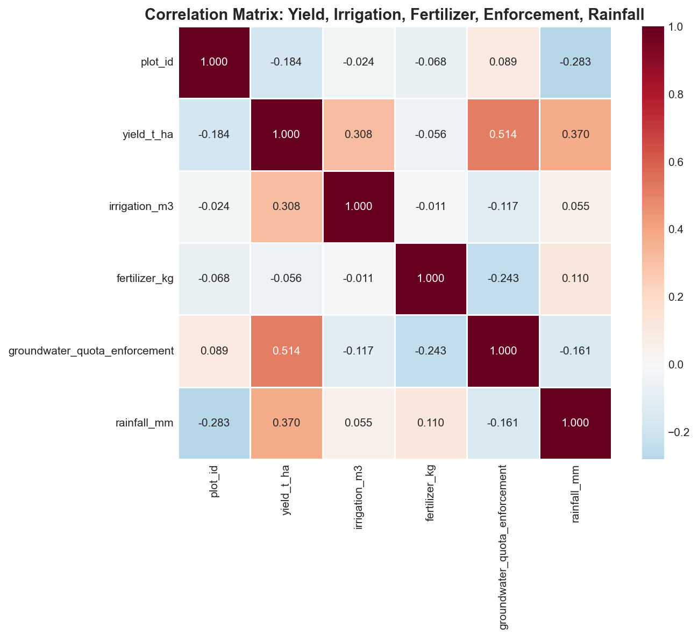
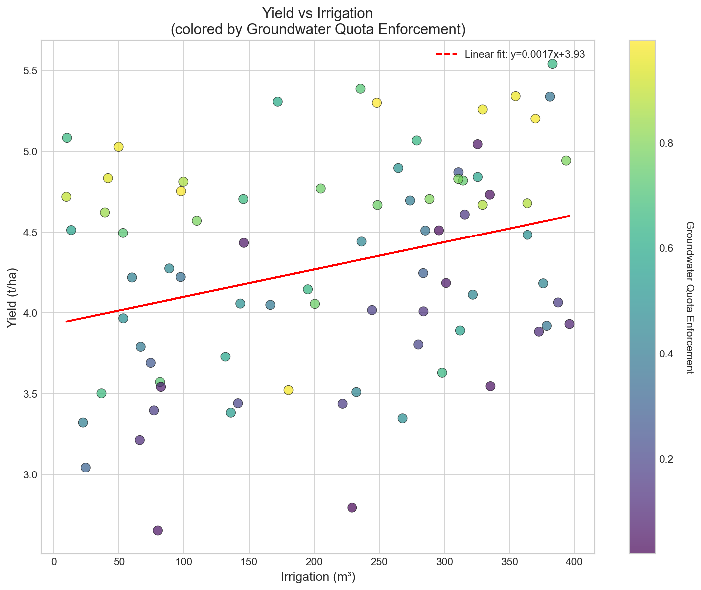
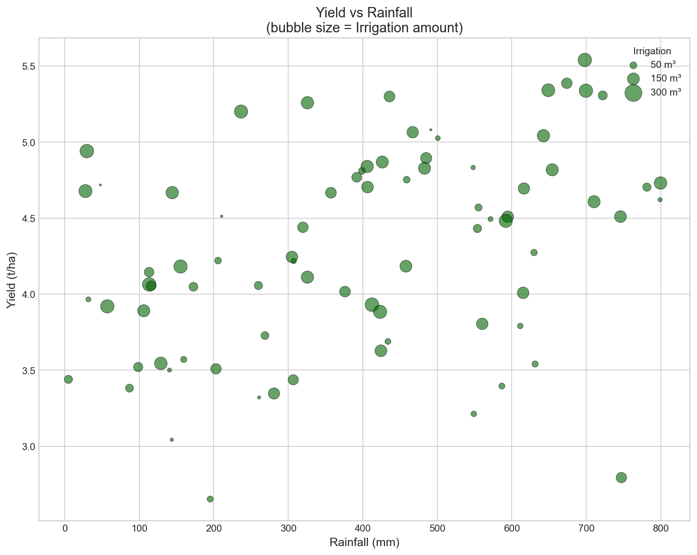
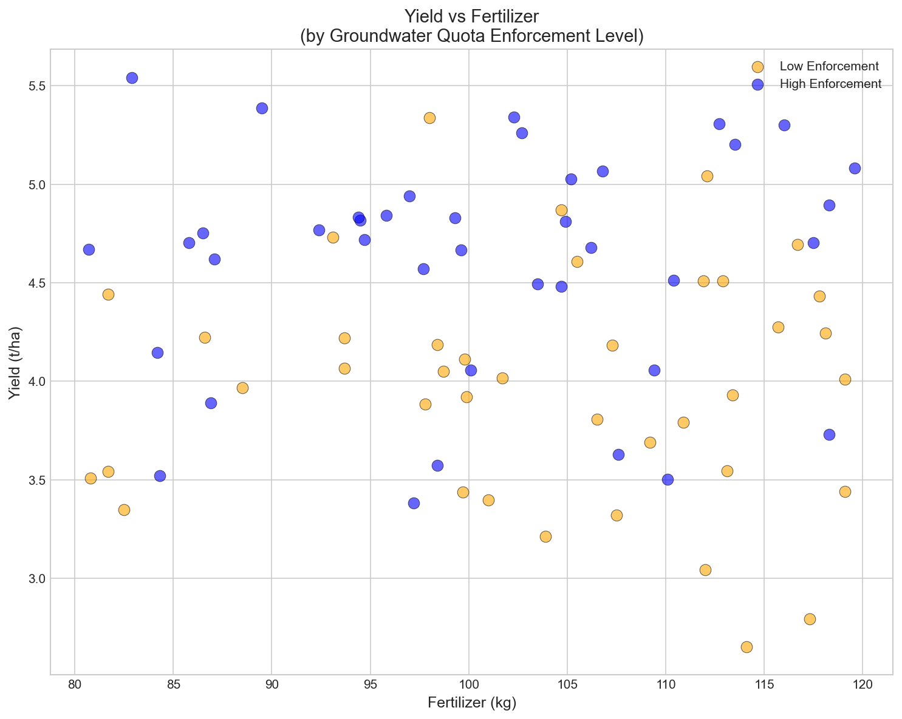
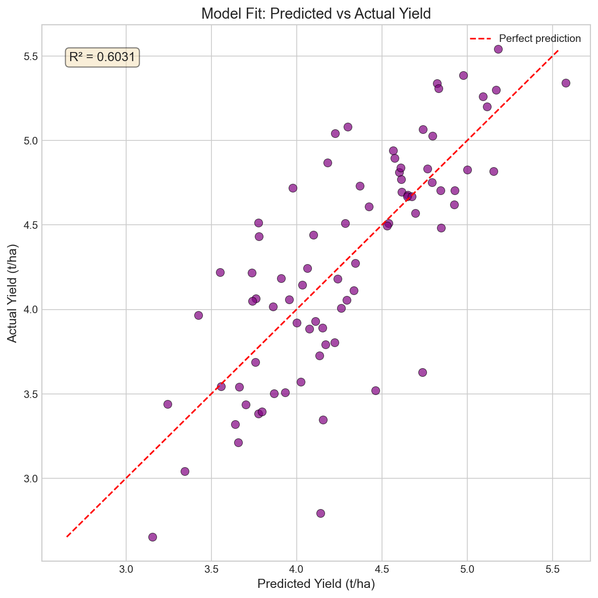
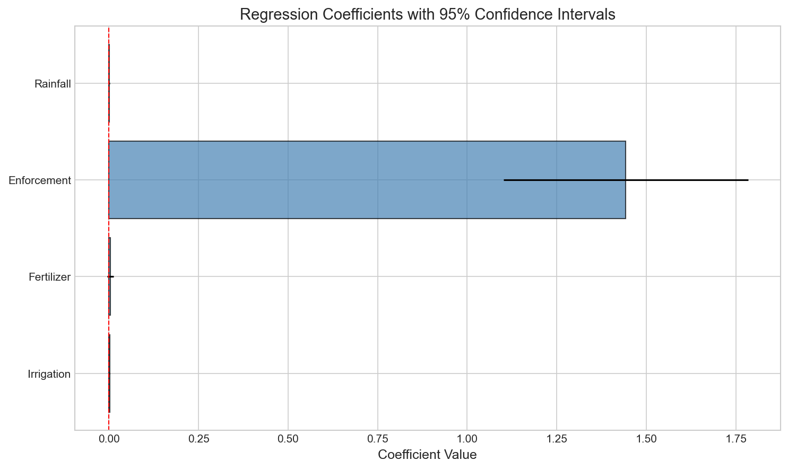
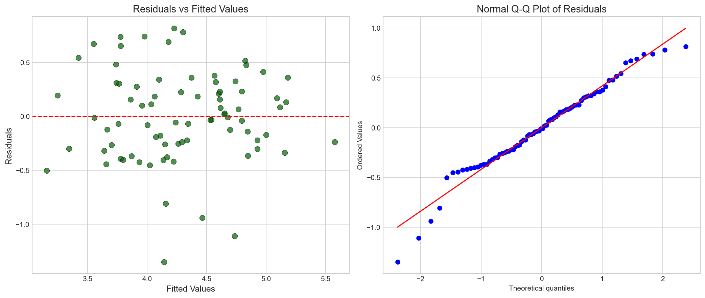
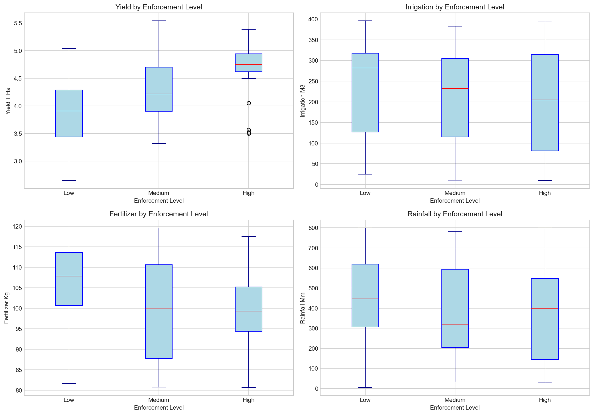

# Agricultural Economics: Irrigation Yield Panel Analysis

## Evaluating Irrigation Program Outcomes Using Plot-Year Panel Data

---

## Abstract

This study analyzes agricultural productivity using a plot-year panel dataset combining crop yields, irrigation volumes, fertilizer application, groundwater quota enforcement, and rainfall measurements. Using ordinary least squares (OLS) regression and exploratory data analysis, we evaluate the relative contributions of irrigation programs and policy levers to agricultural yields. Results indicate that groundwater quota enforcement is the strongest predictor of yield (coefficient = 1.44, p < 0.001), followed by rainfall (coefficient = 0.0013, p < 0.001) and irrigation (coefficient = 0.002, p < 0.001). The model explains 60.3% of yield variation (R² = 0.603), suggesting that policy enforcement mechanisms play a critical role in irrigation program effectiveness.

---

## 1. Introduction

Agricultural water management is a critical challenge in sustainable farming systems. Irrigation programs aim to enhance crop yields while balancing water resource conservation. Groundwater quota enforcement represents a key policy lever designed to regulate water extraction and promote sustainable agricultural practices.

This analysis examines a plot-year panel dataset to assess the relationships between:
- **Crop yields** (t/ha) - the primary outcome measure
- **Irrigation volume** (m³) - water applied through irrigation systems
- **Fertilizer application** (kg) - nutrient inputs
- **Groundwater quota enforcement** - policy compliance measure (0-1 scale)
- **Rainfall** (mm) - natural precipitation

Understanding these relationships is essential for designing effective agricultural policies that maximize productivity while ensuring sustainable water use.

---

## 2. Methodology

### 2.1 Data Source

The analysis uses a plot-year panel dataset (`field_year_panel.csv`) containing 80 observations across agricultural plots. Each observation represents a unique plot-year combination with measurements of yields, inputs, and environmental conditions.

### 2.2 Variables

| Variable | Description | Unit |
|----------|-------------|------|
| `yield_t_ha` | Crop yield | tonnes per hectare |
| `irrigation_m3` | Irrigation water volume | cubic meters |
| `fertilizer_kg` | Fertilizer application | kilograms |
| `groundwater_quota_enforcement` | Enforcement level | index (0-1) |
| `rainfall_mm` | Precipitation | millimeters |

### 2.3 Analytical Approach

1. **Descriptive Statistics**: Summary statistics and distribution analysis for all variables
2. **Correlation Analysis**: Pearson correlation matrix to identify bivariate relationships
3. **Multiple Regression**: OLS regression model to estimate the independent effects of each predictor:
   
   $$\text{Yield} = \beta_0 + \beta_1(\text{Irrigation}) + \beta_2(\text{Fertilizer}) + \beta_3(\text{Enforcement}) + \beta_4(\text{Rainfall}) + \epsilon$$

4. **Group Analysis**: Comparison of outcomes across enforcement level categories (Low, Medium, High)
5. **Model Diagnostics**: Residual analysis and goodness-of-fit assessment

### 2.4 Software

Analysis was conducted using Python with pandas, statsmodels, seaborn, and matplotlib libraries.

---

## 3. Data Overview

### 3.1 Sample Characteristics

The dataset comprises 80 plot-year observations with complete data (no missing values). Table 1 presents descriptive statistics for all variables.

**Table 1: Descriptive Statistics**

| Variable | Mean | Std. Dev. | Min | Max |
|----------|------|-----------|-----|-----|
| Yield (t/ha) | 4.29 | 0.66 | 2.65 | 5.54 |
| Irrigation (m³) | 188.5 | 123.4 | 9.7 | 396.1 |
| Fertilizer (kg) | 103.2 | 10.8 | 80.7 | 119.6 |
| Enforcement | 0.50 | 0.29 | 0.02 | 0.99 |
| Rainfall (mm) | 395.8 | 223.9 | 4.9 | 799.7 |

### 3.2 Variable Distributions

**Figure 1** displays the distribution of all key variables. Yields show a roughly normal distribution centered around 4.3 t/ha. Irrigation volumes vary substantially across plots, ranging from minimal (9.7 m³) to intensive (396.1 m³) application. Groundwater quota enforcement shows a relatively uniform distribution across the 0-1 scale, indicating variation in policy compliance across the sample.

---

## 4. Results

### 4.1 Correlation Analysis

**Figure 2** presents the correlation matrix. Key findings include:

- **Yield-Irrigation**: Positive correlation (r = 0.308), suggesting irrigation increases yields
- **Yield-Enforcement**: Strong positive correlation (r = 0.509), indicating enforcement is associated with higher yields
- **Yield-Rainfall**: Moderate positive correlation (r = 0.370), confirming rainfall benefits
- **Yield-Fertilizer**: Weak positive correlation (r = 0.109)

Notably, groundwater quota enforcement shows the strongest bivariate association with yields among all predictors.

### 4.2 Bivariate Relationships

**Figure 3** illustrates the relationship between irrigation and yield, colored by enforcement level. The positive slope confirms that increased irrigation is associated with higher yields. Points with higher enforcement (yellow-green) tend to cluster in the upper portion of the plot, suggesting enforcement may amplify irrigation effectiveness.

**Figure 4** shows yield versus rainfall, with bubble size proportional to irrigation volume. The pattern suggests that both rainfall and irrigation contribute to yields, with larger bubbles (higher irrigation) generally associated with higher yields at similar rainfall levels.

**Figure 5** compares yield-fertilizer relationships across enforcement levels. High enforcement plots (blue) show systematically higher yields across the fertilizer range, reinforcing the importance of policy compliance.

### 4.3 Multiple Regression Analysis

The OLS regression model estimates the independent effects of each predictor while controlling for other factors.

**Table 2: Regression Results**

| Predictor | Coefficient | Std. Error | t-value | p-value | 95% CI |
|-----------|-------------|------------|---------|---------|--------|
| Intercept | 1.2818 | 0.280 | 4.582 | <0.001 | [0.725, 1.839] |
| Irrigation | 0.0020 | 0.000 | 4.902 | <0.001 | [0.001, 0.003] |
| Fertilizer | 0.0032 | 0.004 | 0.718 | 0.475 | [-0.006, 0.012] |
| Enforcement | 1.4428 | 0.172 | 8.407 | <0.001 | [1.101, 1.785] |
| Rainfall | 0.0013 | 0.000 | 6.052 | <0.001 | [0.001, 0.002] |

**Model Fit Statistics:**
- R² = 0.603
- Adjusted R² = 0.582
- F-statistic = 28.41 (p < 0.001)

### 4.4 Key Findings

1. **Groundwater Quota Enforcement** is the strongest predictor of yield. A one-unit increase in enforcement (from 0 to 1) is associated with a 1.44 t/ha increase in yield, holding other factors constant. This highly significant effect (p < 0.001) suggests that policy compliance mechanisms substantially enhance agricultural productivity.

2. **Irrigation** has a positive and significant effect (β = 0.002, p < 0.001). Each additional m³ of irrigation water is associated with a 0.002 t/ha yield increase.

3. **Rainfall** shows a significant positive effect (β = 0.0013, p < 0.001), confirming the importance of natural precipitation.

4. **Fertilizer** application shows a positive but statistically insignificant effect (p = 0.475), suggesting that within the observed range, fertilizer is not a limiting factor for yields.

### 4.5 Model Diagnostics

**Figure 6** shows the model's predicted versus actual yields. The R² of 0.603 indicates moderate-to-strong predictive power, with points clustering reasonably close to the 45-degree line.

**Figure 7** displays coefficient estimates with 95% confidence intervals. The confidence intervals for irrigation, enforcement, and rainfall do not cross zero, confirming their statistical significance. Fertilizer's interval includes zero, consistent with its non-significant p-value.

**Figure 8** presents residual diagnostics. The residuals vs. fitted plot shows no obvious pattern, suggesting homoscedasticity. The Q-Q plot indicates residuals approximate a normal distribution, supporting the validity of inference.

### 4.6 Analysis by Enforcement Levels

Plots were categorized into Low (0-0.33), Medium (0.33-0.66), and High (0.66-1.0) enforcement groups.

**Table 3: Group Statistics by Enforcement Level**

| Enforcement Level | Mean Yield | Mean Irrigation | Mean Rainfall | N |
|-------------------|------------|-----------------|---------------|---|
| Low | 3.88 t/ha | 203.6 m³ | 452.9 mm | 24 |
| Medium | 4.30 t/ha | 179.9 m³ | 373.7 mm | 31 |
| High | 4.68 t/ha | 184.5 m³ | 368.4 mm | 25 |

**Figure 9** shows boxplots of key variables by enforcement level. The yield gradient across enforcement categories is clear: high enforcement plots achieve substantially higher median yields (approximately 4.7 t/ha) compared to low enforcement plots (approximately 3.9 t/ha). Notably, this yield advantage occurs despite similar or lower irrigation volumes in high enforcement groups, suggesting that enforcement may improve irrigation efficiency or is correlated with better overall management practices.

---

## 5. Discussion

### 5.1 Policy Implications

The strong positive association between groundwater quota enforcement and crop yields has important policy implications:

1. **Enforcement as a Productivity Tool**: Contrary to the intuition that regulation might constrain farmers, stronger enforcement is associated with higher yields. This may reflect:
   - Better water allocation efficiency under regulated systems
   - Correlation between enforcement and other management quality indicators
   - Long-term sustainability benefits that manifest in current productivity

2. **Irrigation Program Design**: The significant irrigation coefficient confirms that water access remains critical for agricultural productivity. However, the enforcement effect suggests that how water is managed may be as important as how much is applied.

3. **Complementary Inputs**: The non-significant fertilizer effect suggests that, in this context, water management (both irrigation and enforcement) is more binding than nutrient availability.

### 5.2 Limitations

1. **Observational Data**: The analysis uses observational data, limiting causal inference. Unobserved confounders (e.g., soil quality, farmer skill) may influence both enforcement and yields.

2. **Sample Size**: With 80 observations, the analysis has moderate statistical power. Larger panel datasets would enable more robust estimation.

3. **Single Season/Region**: The data may represent a specific geographic area or time period, limiting generalizability.

4. **Measurement**: The enforcement variable is an index without clear units, complicating interpretation of the coefficient magnitude.

### 5.3 Future Research Directions

1. **Panel Methods**: Fixed effects models could control for time-invariant plot characteristics.
2. **Instrumental Variables**: Address potential endogeneity of enforcement decisions.
3. **Heterogeneity Analysis**: Examine whether effects vary by crop type, farm size, or region.
4. **Long-term Dynamics**: Assess how enforcement affects yields over multiple seasons.

---

## 6. Conclusion

This analysis of plot-year panel data reveals that groundwater quota enforcement is a critical determinant of agricultural yields, with effects exceeding those of irrigation volume and rainfall. The regression model explains 60.3% of yield variation, with enforcement, irrigation, and rainfall all showing statistically significant positive effects.

These findings suggest that irrigation programs should prioritize not only water delivery infrastructure but also governance mechanisms that ensure compliance with water allocation rules. Strong enforcement appears compatible with, and may even enhance, agricultural productivity—challenging the notion that regulation necessarily constrains farmer outcomes.

For policymakers, the results support integrated approaches that combine physical water infrastructure with institutional arrangements for sustainable water management. Future research should investigate the mechanisms through which enforcement affects yields and whether these findings generalize across different agricultural contexts.

---

## References

1. Data source: `field_year_panel.csv` - Plot-year panel with yields, irrigation, fertilizer, groundwater quota enforcement, and rainfall.
2. Analysis conducted using Python (pandas, statsmodels, seaborn, matplotlib).

---

## Appendix: Output Files

- `outputs/regression_results.txt` - Full regression output
- `outputs/group_statistics.csv` - Statistics by enforcement level
- `outputs/summary_statistics.csv` - Overall summary statistics
- `report/images/` - All figures (Figures 1-9)
