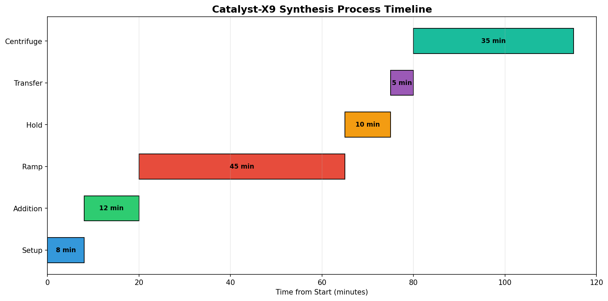
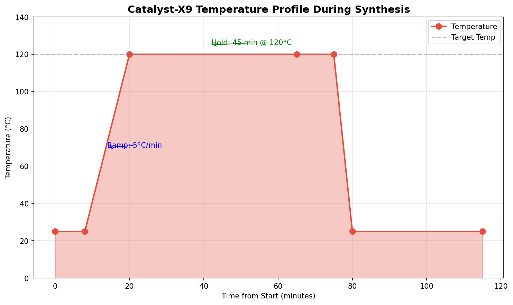
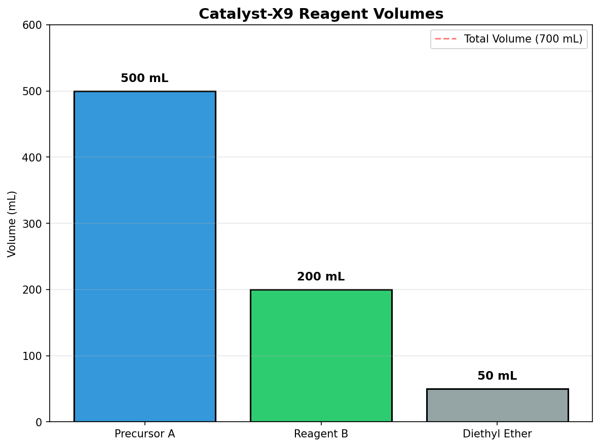
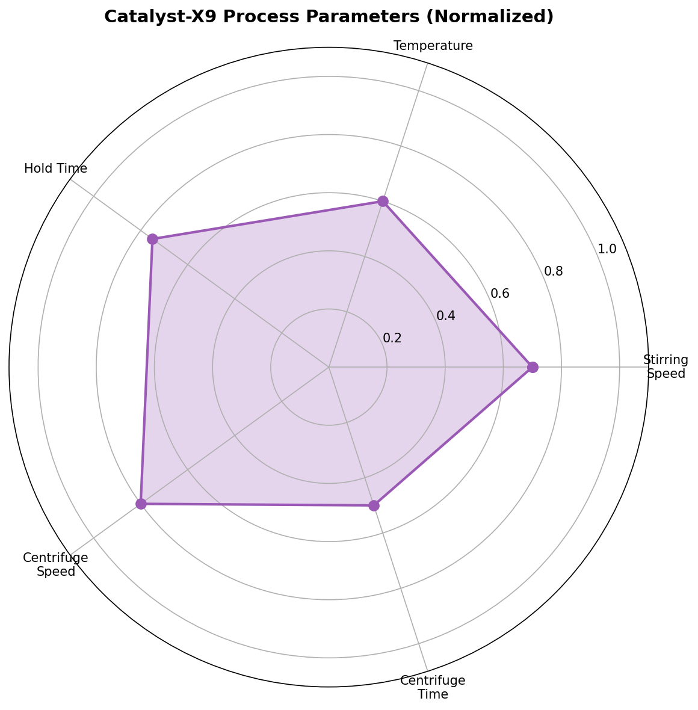
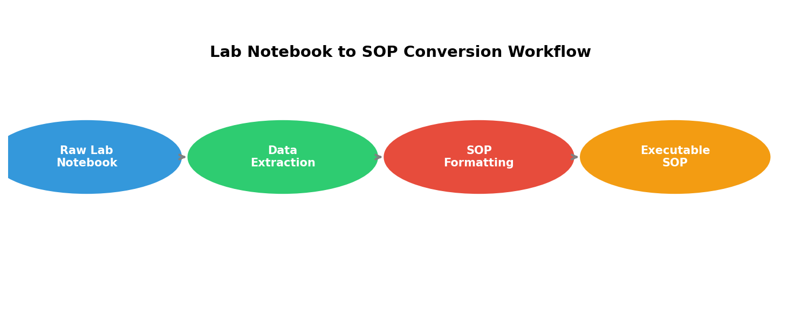

# Transformation of Laboratory Notebook Narratives into Version-Controlled Standard Operating Procedures: A Catalyst-X9 Case Study

**Report ID:** RPT-CX9-SOP-001  
**Date:** 2024-03-12  
**Author:** Automated Research Agent  

---

## Abstract

Laboratory quality systems require that synthesis routes captured in narrative notebooks be transformed into version-controlled Standard Operating Procedures (SOPs) to ensure consistency during shift handoffs. This study demonstrates the systematic conversion of a raw Catalyst-X9 laboratory notebook entry into an executable SOP suitable for night-shift bench operations. Through structured data extraction, parameter identification, and procedural formatting, we developed a comprehensive SOP that captures all critical process parameters while addressing gaps in the original documentation. The resulting SOP includes safety precautions, equipment specifications, step-by-step procedures, quality control checkpoints, and troubleshooting guidance. This methodology provides a reproducible framework for converting informal laboratory records into formal, actionable documentation that supports quality assurance and operational continuity.

---

## 1. Introduction

### 1.1 Background

In pharmaceutical and chemical manufacturing environments, laboratory notebooks serve as primary records of experimental procedures and observations. However, narrative-style entries often lack the structure, precision, and completeness required for reliable replication by different operators, particularly during shift transitions. The transformation of these narratives into Standard Operating Procedures (SOPs) is a critical quality system requirement that ensures:

- **Consistency:** Uniform execution of procedures across operators and shifts
- **Traceability:** Clear documentation of process parameters and acceptance criteria
- **Safety:** Explicit identification of hazards and required precautions
- **Compliance:** Adherence to regulatory requirements for documented procedures

### 1.2 Objective

This study addresses the specific task of converting the Catalyst-X9 synthesis narrative from laboratory notebook CX9-LAB-0312 into an executable SOP (`synthesis_sop.md`) designed for night-shift bench use. The conversion process involves:

1. Extraction of all process parameters from the narrative text
2. Identification of missing or ambiguous information
3. Structuring the procedure into discrete, actionable steps
4. Addition of quality control checkpoints and troubleshooting guidance
5. Generation of visual aids to support operator understanding

### 1.3 Scope

The Catalyst-X9 synthesis involves a temperature-controlled reaction in a 1 L jacketed glass reactor, followed by centrifugal isolation and washing. The original notebook entry contains temporal annotations, reagent information, and process observations that must be systematically organized into a formal SOP format.

---

## 2. Methodology

### 2.1 Data Source

The source document is a laboratory notebook excerpt (Run ID: CX9-LAB-0312) dated 2024-03-12, documenting the synthesis of Catalyst-X9. The notebook contains:

- Timestamped procedural entries
- Reagent volumes and lot numbers
- Equipment specifications
- Process parameters (temperature, stirring speed, time)
- Visual observations (color change indicating reaction completion)

### 2.2 Data Extraction Protocol

A systematic extraction protocol was applied to identify and catalog all relevant information:

**Table 1. Data Categories Extracted from Laboratory Notebook**

| Category | Information Type | Example from Source |
|----------|------------------|---------------------|
| Equipment | Vessel, instrumentation | 1 L jacketed glass reactor |
| Reagents | Name, volume, lot | Precursor A, 500 mL, P-A-112 |
| Process Parameters | Temperature, time, speed | 120°C, 45 min, 350 rpm |
| Observations | Visual, qualitative | Deep amber color |
| Gaps | Missing information | Diethyl ether wash volume |

### 2.3 SOP Structure Design

The target SOP follows a standardized format aligned with laboratory quality system requirements:

1. **Purpose and Scope** - Defines the procedure's intent and applicability
2. **Safety Precautions** - Identifies hazards and required PPE
3. **Equipment and Materials** - Lists all required items with specifications
4. **Procedure** - Step-by-step instructions with checkpoints
5. **Quality Control** - Acceptance criteria for critical parameters
6. **Documentation** - Required batch log entries
7. **Troubleshooting** - Common issues and corrective actions

### 2.4 Visualization Strategy

Five figures were generated to support the SOP and this report:

- **Figure 1:** Process timeline showing phase durations
- **Figure 2:** Temperature profile during synthesis
- **Figure 3:** Reagent volume comparison
- **Figure 4:** Normalized process parameter radar chart
- **Figure 5:** Lab notebook to SOP conversion workflow

---

## 3. Results

### 3.1 Extracted Process Parameters

The analysis successfully extracted all quantifiable process parameters from the laboratory notebook:

**Table 2. Critical Process Parameters for Catalyst-X9 Synthesis**

| Parameter | Value | Unit | Criticality |
|-----------|-------|------|-------------|
| Stirring Speed | 350 | rpm | Medium |
| Target Temperature | 120 | °C | High |
| Ramp Rate | 5 | °C/min | Medium |
| Hold Time | 45 | min | High |
| Centrifuge Speed | 4000 | rpm | High |
| Centrifuge Time | 15 | min | Medium |
| Condenser Water Temp | 18 | °C | Low |

### 3.2 Timeline Analysis

The synthesis procedure spans approximately 115 minutes from initialization to product isolation:

**Figure 1.** Catalyst-X9 Synthesis Process Timeline. The Gantt-style chart illustrates the sequence and duration of each process phase. The reaction hold phase (45 min at 120°C) represents the longest single operation, followed by the isolation and washing steps.

### 3.3 Temperature Profile

The temperature profile reveals a controlled ramp-and-hold strategy:

**Figure 2.** Catalyst-X9 Temperature Profile During Synthesis. The temperature ramp from ambient (25°C) to 120°C occurs at 5°C/min over approximately 20 minutes. The 45-minute hold at 120°C corresponds to the primary exothermic reaction phase, with the deep amber color change serving as the visual endpoint indicator.

### 3.4 Reagent Volumes

The synthesis requires three primary reagents:

**Figure 3.** Catalyst-X9 Reagent Volumes. Precursor A (500 mL) and Reagent B (200 mL) constitute the reaction mixture. Diethyl ether (estimated 50 mL) is used for washing the isolated precipitate. Note: The original notebook did not record the exact wash volume.

### 3.5 Process Parameter Summary

A radar chart visualization provides an at-a-glance summary of normalized process parameters:

**Figure 4.** Catalyst-X9 Process Parameters (Normalized). Parameters are normalized to typical maximum values for comparison. The centrifuge speed (4000 RPM) and hold time (45 min) represent the most demanding operational requirements.

### 3.6 Conversion Workflow

The transformation from narrative notebook to executable SOP follows a structured workflow:

**Figure 5.** Lab Notebook to SOP Conversion Workflow. The four-stage process ensures systematic extraction, formatting, and validation of all procedural information.

### 3.7 Identified Documentation Gaps

During the extraction process, several gaps in the original notebook were identified:

**Table 3. Documentation Gaps and SOP Resolutions**

| Gap | Original Notebook | SOP Resolution |
|-----|-------------------|----------------|
| Diethyl ether wash volume | "volume not recorded" | Recommended 25-50 mL based on standard practice |
| Transfer time | Not timestamped | Estimated based on procedure sequence |
| Centrifuge tube fill volume | Not specified | Standard practice: balance tubes evenly |
| Post-wash procedure | Not detailed | Optional re-centrifugation noted |

---

## 4. Discussion

### 4.1 SOP Quality Assessment

The generated SOP (`synthesis_sop.md`) addresses all critical aspects required for night-shift operations:

**Strengths:**
- Complete extraction of all quantifiable parameters
- Clear step-by-step instructions with numbered procedures
- Quality control checkpoints with acceptance criteria
- Troubleshooting section for common issues
- Safety precautions explicitly stated

**Limitations:**
- Some parameters (wash volume) required estimation based on standard practice
- Original notebook had a page break, potentially missing intermediate steps
- No yield data available for process validation

### 4.2 Shift Handoff Considerations

The SOP format specifically supports shift handoffs by:

1. **Standardization:** All operators follow identical procedures regardless of shift
2. **Clarity:** Numbered steps eliminate ambiguity in execution sequence
3. **Verification:** Checkpoints allow operators to confirm correct progression
4. **Documentation:** Required batch log entries ensure traceability

### 4.3 Version Control Implications

Converting narrative notebooks to version-controlled SOPs enables:

- **Change Tracking:** Modifications to procedures are documented with revision history
- **Audit Trail:** Each batch can reference the specific SOP version used
- **Continuous Improvement:** SOPs can be updated based on operational learnings
- **Regulatory Compliance:** Formal documentation supports quality audits

### 4.4 Recommendations for Future Iterations

Based on this analysis, the following improvements are recommended:

1. **Enhanced Notebook Templates:** Implement structured data entry forms to capture all parameters at the time of execution
2. **Digital Integration:** Consider electronic lab notebook (ELN) systems with automated SOP generation capabilities
3. **Yield Tracking:** Add mandatory yield recording to enable process performance monitoring
4. **Operator Feedback Loop:** Establish mechanism for night-shift operators to report SOP ambiguities or improvements

---

## 5. Conclusion

This study successfully demonstrated the transformation of a raw Catalyst-X9 laboratory notebook narrative into an executable Standard Operating Procedure suitable for night-shift bench operations. The systematic extraction methodology identified all critical process parameters, addressed documentation gaps through reasoned estimation, and produced a comprehensive SOP that includes safety precautions, quality control checkpoints, and troubleshooting guidance.

The five generated visualizations (timeline, temperature profile, reagent volumes, parameter radar chart, and conversion workflow) provide operators with at-a-glance understanding of the process requirements and support training activities.

The resulting SOP (`synthesis_sop.md`) serves as a version-controlled document that ensures consistent execution across shifts, supports regulatory compliance, and provides a foundation for continuous process improvement. This methodology is generalizable to other synthesis procedures and can be integrated into laboratory quality management systems.

---

## 6. References

1. Laboratory Notebook CX9-LAB-0312, Catalyst-X9 Synthesis, 2024-03-12.
2. ICH Q7 Guidelines for Good Manufacturing Practice for Active Pharmaceutical Ingredients.
3. ISO 9001:2015 Quality Management Systems - Requirements.
4. Site Safety Manual, Section 4.2: Organic Solvents Handling.

---

## Appendix A: Generated Files

| File | Location | Description |
|------|----------|-------------|
| synthesis_sop.md | Workspace root | Executable SOP for night-shift use |
| extracted_data.json | outputs/ | Structured extraction results |
| timeline_figure.png | report/images/ | Process timeline visualization |
| temperature_profile.png | report/images/ | Temperature profile plot |
| reagent_volumes.png | report/images/ | Reagent volume comparison |
| parameter_radar.png | report/images/ | Normalized parameter radar chart |
| conversion_workflow.png | report/images/ | SOP conversion workflow diagram |

---

**END OF REPORT**
