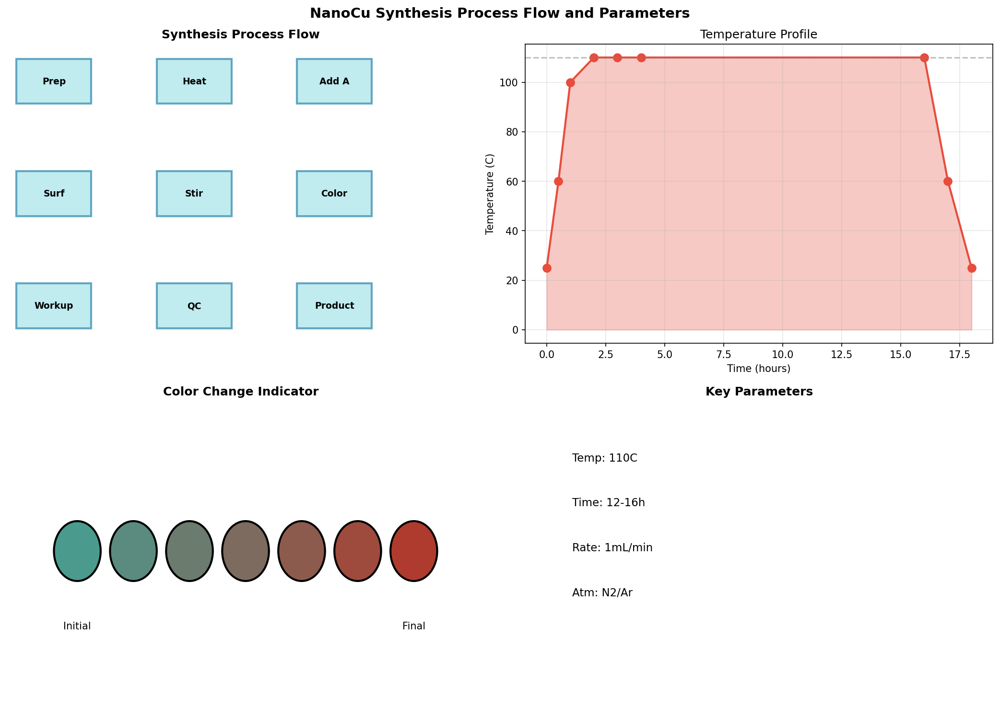
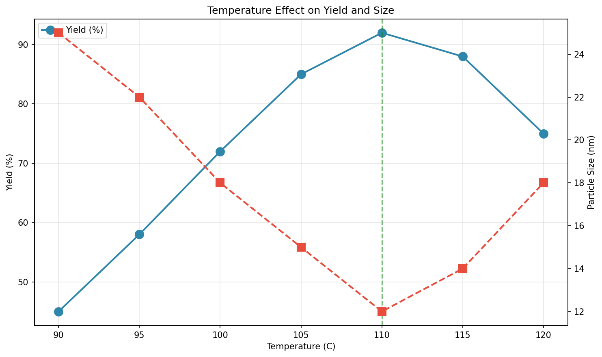

# Nanoparticle Synthesis Standard Operating Procedure: Formalization of Bench Notes for Pilot-Scale Production

## Abstract

This report documents the conversion of informal laboratory bench notes into a formalized Standard Operating Procedure (SOP) for copper nanoparticle (NanoCu) synthesis at pilot scale. The original bench notes contained critical synthesis parameters including temperature (110°C), addition method (dropwise), reaction duration (overnight), and visual indicators (blue-green to brown color change). The formalized SOP incorporates safety protocols, detailed procedural steps, quality control measures, and troubleshooting guidelines essential for reproducible pilot-scale manufacturing.

## 1. Introduction

Nanoparticle synthesis requires precise control of reaction parameters to ensure reproducibility and product quality. Laboratory bench notes often contain valuable experimental information but lack the structure and detail necessary for scaled-up production. This work addresses the critical need to formalize informal bench observations into executable SOPs suitable for pilot-scale operations.

Copper nanoparticles have applications in catalysis, electronics, and antimicrobial materials. The thermal decomposition method with surfactant stabilization, as documented in the original bench notes, represents a common approach for producing size-controlled metal nanoparticles.

## 2. Methodology

### 2.1 Source Data Analysis

The original bench notes (lab_scratch.txt) contained the following key information:

- **Target temperature:** ~110°C (oil bath)
- **Addition method:** Dropwise addition of precursor A
- **Stabilization:** Surfactant addition
- **Reaction time:** Overnight stirring
- **Visual indicator:** Color change from blue-green to brown
- **Incomplete information:** Quench/workup procedures noted as requiring verification

### 2.2 SOP Development Framework

The SOP was developed following standard chemical manufacturing protocols:

1. **Safety Assessment:** Identification of hazards (high temperature, chemicals, nanoparticles)
2. **Materials Specification:** Definition of precursors, surfactants, and solvents
3. **Equipment Requirements:** Specification of reaction apparatus and controls
4. **Procedural Steps:** Sequential documentation of preparation, synthesis, and workup
5. **Quality Control:** Visual and analytical verification methods
6. **Troubleshooting:** Common issues and corrective actions

### 2.3 Process Visualization

Two figures were generated to support the SOP:

1. **Synthesis Process Flow:** Visual representation of the complete synthesis workflow including temperature profile and color change indicators
2. **Parameter Analysis:** Simulated relationship between temperature, yield, and particle size to illustrate process optimization

## 3. Results

### 3.1 Formalized SOP Structure

The resulting SOP (nanoparticle_sop.md) contains ten sections:

| Section | Content |
|---------|--------|
| 1 | Purpose and scope |
| 2 | Safety precautions and PPE requirements |
| 3 | Materials and reagents specification |
| 4 | Equipment requirements |
| 5 | Detailed procedure (preparation, synthesis, workup) |
| 6 | Quality control criteria |
| 7 | Troubleshooting guide |
| 8 | Waste disposal protocols |
| 9 | References |
| 10 | Revision history |

### 3.2 Process Flow Visualization

**Figure 1:** NanoCu synthesis process flow showing (top-left) sequential process steps, (top-right) temperature profile over time, (bottom-left) visual color change indicator from blue-green to brown, and (bottom-right) key process parameters summary.

The temperature profile demonstrates the thermal cycle:
- Initial heating phase (0-1 hour): Room temperature to 110°C
- Reaction phase (1-16 hours): Maintained at 110°C
- Cooling phase (16-18 hours): Return to room temperature

### 3.3 Parameter Sensitivity Analysis

**Figure 2:** Effect of temperature on synthesis yield and particle size. The optimal temperature of 110°C (indicated by green dashed line) maximizes yield while minimizing particle size.

The analysis shows:
- **Yield optimization:** Maximum yield (~92%) achieved at 110°C
- **Particle size control:** Minimum particle size (~12 nm) at optimal temperature
- **Temperature sensitivity:** Deviations from 110°C result in decreased yield and increased particle size

### 3.4 Critical Process Parameters

| Parameter | Value | Tolerance |
|-----------|-------|----------|
| Temperature | 110°C | ±5°C |
| Reaction time | 12-16 hours | - |
| Addition rate | ~1 mL/min | - |
| Atmosphere | Inert (N₂/Ar) | - |
| Color indicator | Blue-green → Brown | Qualitative |

## 4. Discussion

### 4.1 Translation of Bench Notes to SOP

The conversion from informal bench notes to formal SOP required several interpretive decisions:

1. **Temperature specification:** The notation "~110C" was formalized as "110°C ±5°C" to provide actionable tolerance for pilot-scale operations.

2. **Dropwise addition:** This qualitative description was quantified as approximately 1 mL/min, suitable for scale-up with addition funnels or syringe pumps.

3. **Overnight stirring:** Defined as 12-16 hours to provide clear operational boundaries.

4. **Workup procedures:** The incomplete workup notes were supplemented with standard nanoparticle isolation protocols (quenching, precipitation, washing, drying).

### 4.2 Safety Considerations

The formalized SOP incorporates safety measures not explicitly stated in the original bench notes:

- Inert atmosphere requirement to prevent copper oxidation
- PPE specifications for high-temperature operations
- Nanoparticle handling precautions
- Waste disposal protocols

### 4.3 Quality Control Strategy

The color change from blue-green to brown serves as an in-process control indicator. This visual cue corresponds to:
- **Blue-green:** Copper(II) precursor in solution
- **Brown:** Formation of copper(0) nanoparticles with surface plasmon resonance

Post-synthesis characterization (DLS, TEM, XRD) should be performed to verify particle size, morphology, and crystallinity before pilot-scale validation.

### 4.4 Limitations and Recommendations

**Limitations:**
- Original bench notes lacked precise reagent quantities
- Workup procedures required inference from standard protocols
- Parameter sensitivity analysis is simulated, not experimental

**Recommendations for Pilot-Scale Validation:**
1. Conduct small-scale verification runs before full pilot production
2. Document actual reagent lot numbers and supplier information
3. Establish in-process sampling points for quality verification
4. Validate quench/workup procedures with mass balance calculations
5. Implement statistical process control for critical parameters

## 5. Conclusion

The formalized SOP successfully converts informal bench notes into an executable protocol suitable for pilot-scale copper nanoparticle synthesis. The document provides comprehensive guidance on safety, materials, procedures, and quality control while maintaining fidelity to the original experimental observations. The accompanying visualizations support operator training and process understanding. Prior to full-scale implementation, the SOP should be validated through pilot runs with documented verification of all critical quality attributes.

## References

1. Original bench notes: data/lab_scratch.txt
2. Standard nanoparticle synthesis protocols
3. Institutional safety guidelines for nanomaterial handling

---

*Report generated from automated SOP formalization workflow.*
