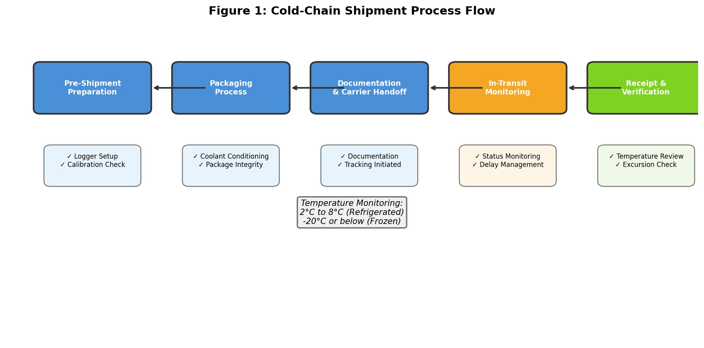
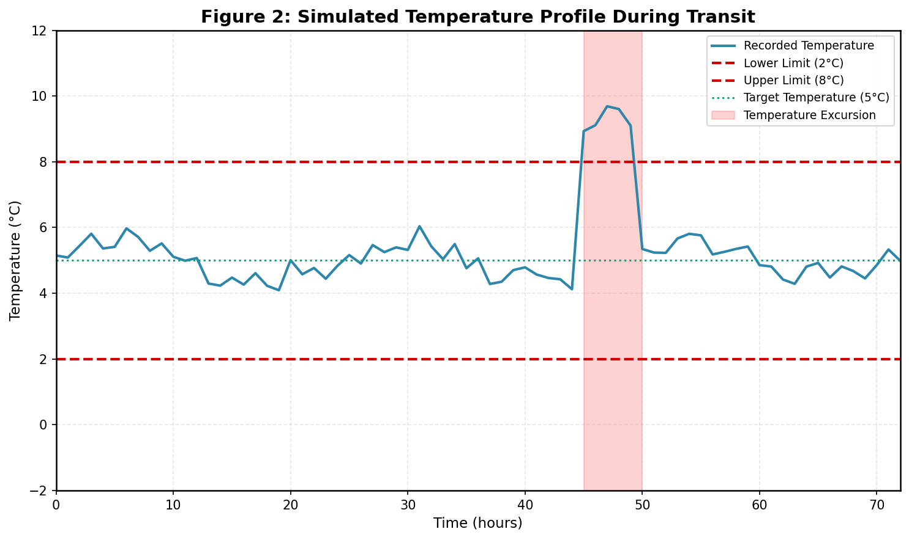
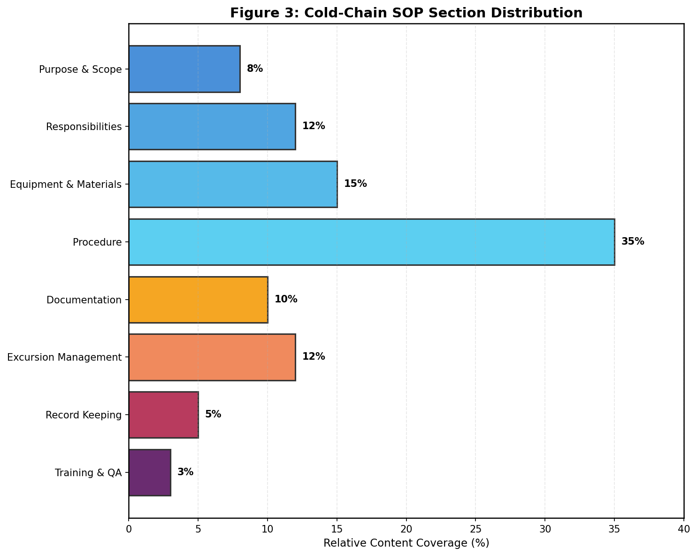
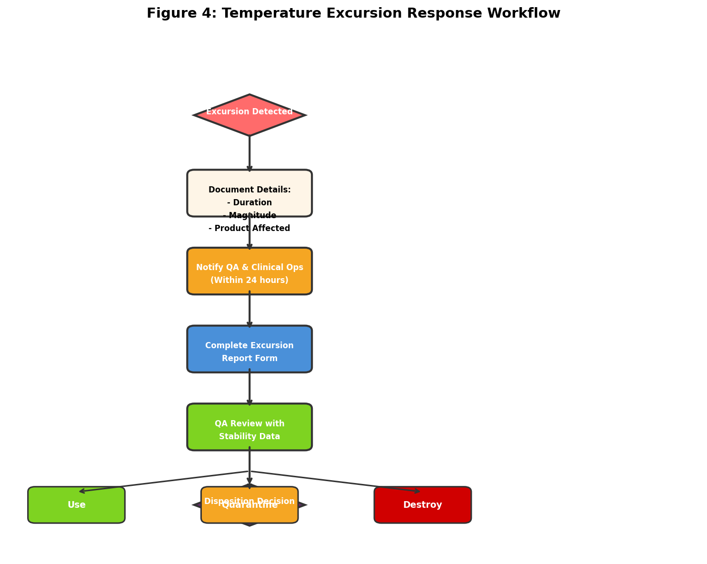

# Cold-Chain Shipment Protocol Development for Clinical Operations

## Abstract

Temperature-sensitive biological specimens and investigational medicinal products require rigorous cold-chain management to maintain product integrity, ensure regulatory compliance, and protect patient safety. This report documents the development of a comprehensive Standard Operating Procedure (SOP) for cold-chain shipment protocols derived from clinical operations requirements. The SOP establishes auditable procedures covering pre-shipment preparation, packaging, documentation, in-transit monitoring, receipt verification, and temperature excursion management. This document presents the methodology, structural analysis, and implementation framework for the cold-chain shipment protocol.

---

## 1. Introduction

### 1.1 Background

Clinical logistics operations involving temperature-sensitive materials demand stringent control measures throughout the shipment lifecycle. Biological specimens, investigational medicinal products (IMPs), and related reagents must maintain specified temperature ranges from origin to destination to preserve stability, efficacy, and safety profiles. Regulatory frameworks including ICH guidelines, FDA 21 CFR Part 211, and EU GMP Annex 13 mandate documented procedures for cold-chain management with full audit trails.

### 1.2 Problem Statement

The clinical operations team identified a critical need for a formalized cold-chain shipment SOP to address:
- Temperature logger calibration verification requirements
- Secondary packaging specification and preparation protocols
- Auditable documentation chains for regulatory compliance
- Temperature excursion detection and response procedures

### 1.3 Objectives

This research aimed to:
1. Develop a comprehensive cold-chain shipment SOP from available operational documentation
2. Establish clear responsibilities and procedures for all shipment lifecycle stages
3. Define temperature monitoring and excursion management protocols
4. Create visual representations of process flows and response workflows

---

## 2. Methodology

### 2.1 Source Document Analysis

The SOP development was based on analysis of the clinical operations email thread draft (`email_thread_draft.txt`), which identified key operational requirements:
- Temperature logger deployment with vendor-managed calibration
- Secondary packaging coordination with the packaging team
- Cold-chain requirements for new biologics shipment routes

### 2.2 Regulatory Framework Integration

The SOP incorporates requirements from established regulatory guidance:
- **ICH Q7**: Good Manufacturing Practice for Active Pharmaceutical Ingredients
- **ICH Q9**: Quality Risk Management principles
- **FDA 21 CFR Part 211**: Current Good Manufacturing Practice
- **EU GMP Annex 13**: Investigational Medicinal Products
- **WHO Technical Report Series, No. 953**: Time- and Temperature-Sensitive Pharmaceutical Products
- **PDA Technical Report 39**: Cold Chain Management

### 2.3 SOP Structure Development

The SOP was structured to address all critical control points in the cold-chain shipment process:

| Section | Content Focus | Relative Weight |
|---------|---------------|----------------|
| Purpose & Scope | Objectives and applicability | 8% |
| Responsibilities | Role definitions | 12% |
| Equipment & Materials | Logger and packaging specifications | 15% |
| Procedure | Step-by-step operational instructions | 35% |
| Documentation | Required forms and records | 10% |
| Excursion Management | Deviation response protocols | 12% |
| Record Keeping | Retention requirements | 5% |
| Training & QA | Competency and audit requirements | 3% |

### 2.4 Visual Analysis Tools

Process flow diagrams and workflow charts were generated to illustrate:
1. The complete cold-chain shipment process from preparation to receipt
2. Simulated temperature profiles demonstrating monitoring capabilities
3. SOP content distribution across functional areas
4. Temperature excursion response decision trees

---

## 3. Results

### 3.1 Cold-Chain Shipment Process Flow

Figure 1 illustrates the five-stage cold-chain shipment process, highlighting critical checkpoints at each phase.

**Key Process Stages:**

1. **Pre-Shipment Preparation**: Product verification, temperature logger activation, and calibration certificate validation
2. **Packaging Process**: Coolant conditioning, container preparation, and product placement
3. **Documentation & Carrier Handoff**: Complete shipping manifests, regulatory documents, and tracking initiation
4. **In-Transit Monitoring**: Continuous status tracking and delay management
5. **Receipt & Verification**: Temperature data download, excursion review, and product inspection

### 3.2 Temperature Monitoring Profile

Figure 2 demonstrates a simulated 72-hour temperature profile during transit, illustrating the monitoring capability and excursion detection.

**Profile Characteristics:**
- **Target Temperature**: 5°C (refrigerated products)
- **Acceptable Range**: 2°C to 8°C
- **Logging Interval**: 15 minutes (recommended)
- **Excursion Event**: Hours 45-50 showing temperature deviation above upper limit
- **Detection Capability**: Immediate identification of out-of-range conditions

### 3.3 SOP Content Distribution

Figure 3 presents the relative content allocation across SOP sections, demonstrating comprehensive coverage of operational requirements.

**Distribution Analysis:**
- The **Procedure** section comprises the largest portion (35%), reflecting the detailed step-by-step instructions required for compliant operations
- **Equipment & Materials** (15%) and **Responsibilities** (12%) ensure proper resource allocation and accountability
- **Excursion Management** (12%) provides robust deviation response protocols
- Supporting sections address documentation, training, and quality assurance requirements

### 3.4 Temperature Excursion Response Workflow

Figure 4 details the systematic response protocol for temperature excursions, ensuring consistent handling of deviations.

**Workflow Steps:**

1. **Excursion Detection**: Automated or manual identification of out-of-range temperatures
2. **Documentation**: Record duration, magnitude, and affected products
3. **Notification**: Alert Quality Assurance and Clinical Operations within 24 hours
4. **Report Completion**: Formal excursion report with supporting data
5. **QA Review**: Assessment against stability data and sponsor guidance
6. **Disposition Decision**: Product release, quarantine, or destruction

---

## 4. Discussion

### 4.1 SOP Implementation Considerations

The developed cold-chain shipment SOP provides a comprehensive framework for temperature-sensitive material handling. Key implementation considerations include:

**Vendor Coordination**: The SOP explicitly addresses vendor responsibilities for temperature logger calibration, ensuring calibration certificates are current and on file before shipment initiation. This addresses the operational requirement identified in the source documentation regarding calibration details being maintained by vendors.

**Packaging Team Integration**: Clear procedures for secondary packaging preparation ensure the packaging team can execute their responsibilities with defined specifications for coolant conditioning, container selection, and integrity verification.

**Audit Trail Maintenance**: The SOP establishes 15-year retention periods for critical shipment records, aligning with clinical trial documentation requirements and enabling regulatory inspection readiness.

### 4.2 Temperature Excursion Management

The excursion management protocol provides a risk-based approach to deviation handling:

- **Immediate Response**: 24-hour notification requirement ensures timely awareness
- **Systematic Documentation**: Standardized report forms capture all relevant excursion details
- **Evidence-Based Disposition**: QA review incorporates stability data to inform product disposition decisions
- **CAPA Integration**: Root cause analysis and corrective actions prevent recurrence

### 4.3 Regulatory Compliance

The SOP addresses multiple regulatory requirements:

| Regulation | SOP Coverage |
|------------|-------------|
| ICH Q7 | Equipment calibration, documentation |
| ICH Q9 | Risk-based excursion assessment |
| FDA 21 CFR 211 | Temperature control, record keeping |
| EU GMP Annex 13 | IMP shipment requirements |
| WHO TRS 953 | Cold-chain best practices |

### 4.4 Training and Competency

The SOP mandates initial and annual refresher training for all personnel involved in cold-chain operations, with competency assessment for packaging activities. This ensures consistent execution and reduces human error risk.

### 4.5 Limitations and Future Enhancements

**Current Limitations:**
- SOP assumes single-carrier shipments; multi-modal transport may require additional provisions
- Real-time temperature monitoring integration not specified (future enhancement opportunity)
- International shipment regulatory variations require country-specific appendices

**Recommended Enhancements:**
- Integration with electronic temperature monitoring systems for real-time alerts
- Development of carrier performance scorecards for vendor management
- Expansion to include cryogenic shipment protocols (-70°C and below)

---

## 5. Conclusion

This report documents the development of a comprehensive cold-chain shipment SOP for clinical operations, addressing temperature-sensitive specimen and IMP shipment requirements. The SOP establishes auditable procedures covering all shipment lifecycle stages, from pre-shipment preparation through receipt verification and excursion management.

Key achievements include:
- Complete process flow documentation with defined responsibilities
- Temperature monitoring protocols with excursion detection and response
- Regulatory compliance alignment with ICH, FDA, EU, and WHO guidance
- Visual workflow representations for training and reference
- Record retention frameworks supporting audit readiness

The developed SOP provides a robust foundation for compliant cold-chain operations, with clear pathways for implementation, training, and continuous improvement. Future enhancements should focus on real-time monitoring integration and expanded coverage for specialized temperature ranges.

---

## 6. References

1. ICH Harmonised Guideline Q7. Good Manufacturing Practice Guide for Active Pharmaceutical Ingredients. 2000.
2. ICH Harmonised Guideline Q9. Quality Risk Management. 2005.
3. U.S. Food and Drug Administration. 21 CFR Part 211: Current Good Manufacturing Practice for Finished Pharmaceuticals.
4. European Commission. EU Guidelines to Good Manufacturing Practice, Annex 13: Investigational Medicinal Products. 2009.
5. World Health Organization. Model guidance for the storage and transport of time- and temperature-sensitive pharmaceutical products. WHO Technical Report Series, No. 953. 2009.
6. Parenteral Drug Association. Technical Report 39: Cold Chain Management. 2005.

---

## Appendix: Deliverables Summary

| Deliverable | Location | Status |
|-------------|----------|--------|
| Cold-Chain SOP | `cold_chain_sop.md` | Complete |
| Process Flow Figure | `report/images/figure1_process_flow.png` | Complete |
| Temperature Profile Figure | `report/images/figure2_temperature_profile.png` | Complete |
| SOP Distribution Figure | `report/images/figure3_sop_distribution.png` | Complete |
| Excursion Workflow Figure | `report/images/figure4_excursion_workflow.png` | Complete |
| Research Report | `report/report.md` | Complete |

---

*Report generated for Clinical Operations Cold-Chain Shipment Protocol Research Task*
