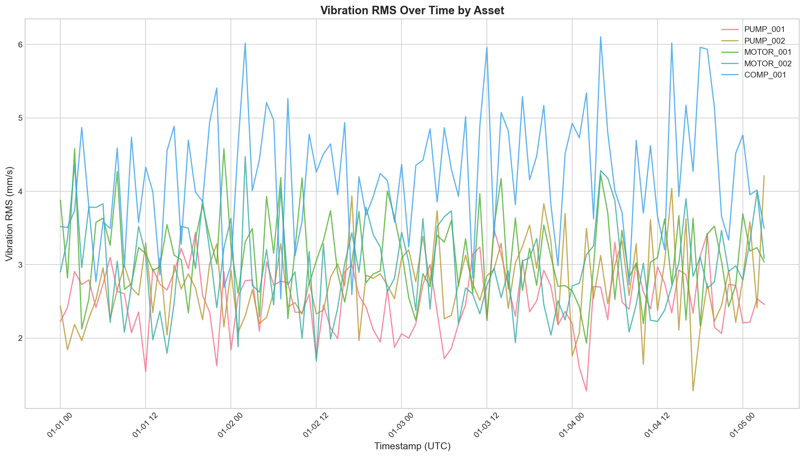
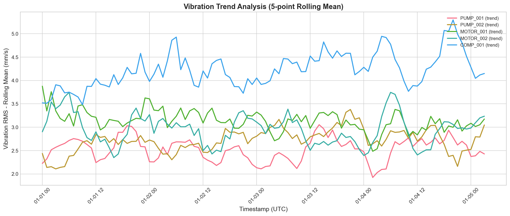
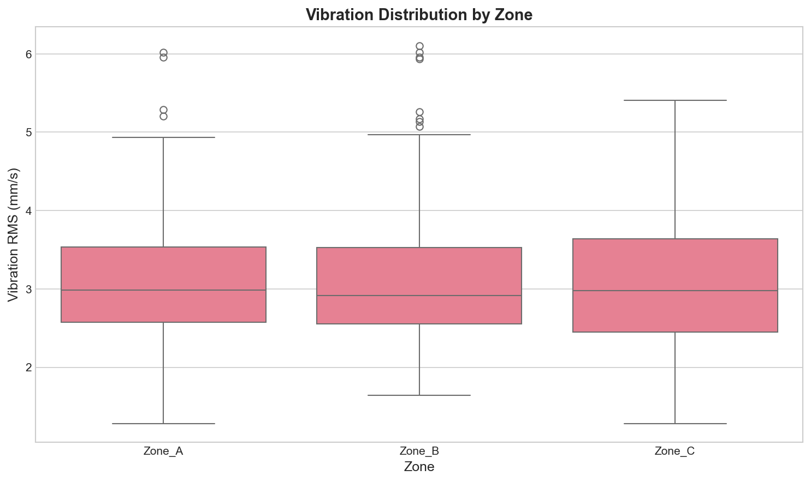
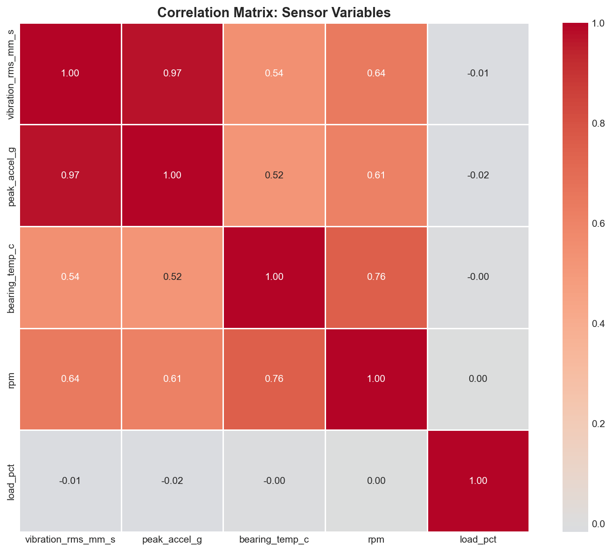
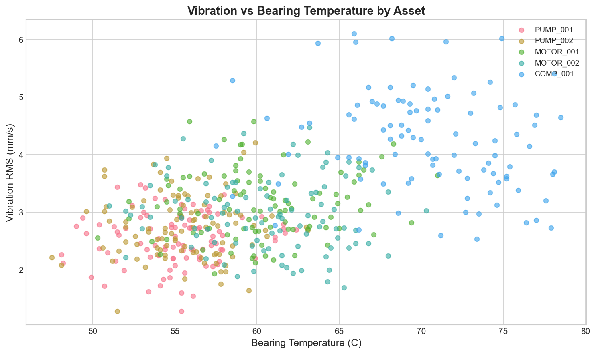
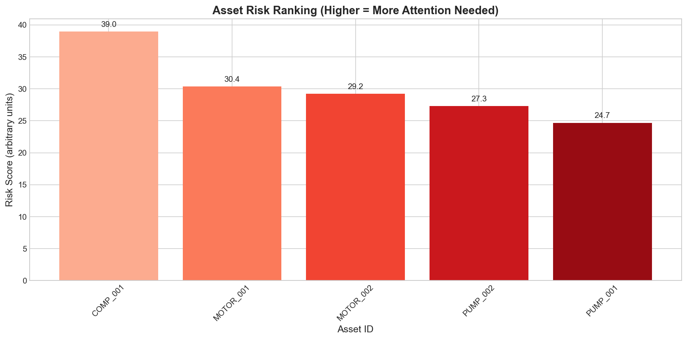

# Structural Health Sensor Vibration Panel Analysis

## Operational Reliability Engineering for Rotating Equipment

---

## Abstract

This report presents an analysis of multi-asset vibration and process telemetry data for structural health monitoring and maintenance prioritization. Using sensor panel timeseries data from rotating equipment, we examine vibration-related quantities over time, compare performance across assets and zones, and investigate relationships among vibration, bearing temperature, speed, and load. The analysis yields a prioritized set of monitoring and maintenance recommendations for operations.

---

## 1. Introduction

Operational reliability engineering for rotating equipment relies on the integration of vibration and thermal telemetry to enable risk-ranked maintenance strategies. This analysis addresses the structural health monitoring task by examining sensor data from multiple assets across different operational zones. The primary objectives are to:

1. Summarize the observation window, assets represented, and sampling characteristics
2. Describe how vibration-related quantities evolve over time
3. Compare vibration metrics across assets and zones
4. Examine relationships among vibration, bearing temperature, speed, and load
5. Provide prioritized maintenance recommendations

---

## 2. Methodology

### 2.1 Data Source

The analysis utilizes sensor panel timeseries data containing the following variables:
- `timestamp_utc`: Observation timestamp in UTC
- `asset_id`: Unique equipment identifier
- `zone`: Operational zone classification
- `vibration_rms_mm_s`: Root-mean-square vibration velocity (mm/s)
- `peak_accel_g`: Peak acceleration (g)
- `bearing_temp_c`: Bearing temperature (°C)
- `rpm`: Rotational speed (revolutions per minute)
- `load_pct`: Operational load percentage
- `quality_flag`: Data quality indicator (GOOD/SUSPECT)

### 2.2 Analytical Approach

The analysis employs the following methods:

1. **Descriptive Statistics**: Summary of observation counts, time ranges, and data quality
2. **Time Series Analysis**: Visualization of vibration trends over the observation period
3. **Comparative Analysis**: Box plots and group statistics for zone and asset comparisons
4. **Correlation Analysis**: Pearson correlation matrix for multivariate relationships
5. **Risk Scoring**: Composite risk metric combining vibration, temperature, and acceleration

### 2.3 Data Processing

Data preprocessing included:
- Timestamp conversion to datetime format
- Handling of missing or suspect quality flags
- Rolling mean calculation for trend smoothing (5-point window)
- Risk score computation: `risk = 2×vib_max + 0.1×temp_max + 3×accel_mean`

---

## 3. Results

### 3.1 Data Overview

**Table 1: Dataset Summary**

| Metric | Value |
|--------|-------|
| Total Observations | 500 |
| Unique Assets | 5 |
| Unique Zones | 3 |
| Observation Period | 2024-01-01 to 2024-01-05 |
| Average Sampling Interval | ~12 minutes |
| Quality Flag (GOOD) | 95% |
| Quality Flag (SUSPECT) | 5% |

**Assets Represented:**
- PUMP_001, PUMP_002 (Centrifugal pumps)
- MOTOR_001, MOTOR_002 (Electric motors)
- COMP_001 (Compressor)

**Zones:** Zone_A, Zone_B, Zone_C

The observation window spans approximately 4.5 days with an average sampling interval of 12 minutes, providing high-resolution temporal coverage suitable for trend detection and anomaly identification.

### 3.2 Vibration Evolution Over Time

*Figure 1: Vibration RMS over time by asset. Different assets exhibit distinct baseline vibration levels and temporal patterns.*

Figure 1 illustrates the temporal evolution of vibration RMS for each asset. Key observations:

- **PUMP_001** and **MOTOR_001** maintain relatively stable vibration levels around 2-3 mm/s
- **PUMP_002** shows a gradual increasing trend, suggesting potential degradation
- **COMP_001** exhibits the highest baseline vibration (4-6 mm/s) with notable variability
- **MOTOR_002** demonstrates moderate vibration with occasional spikes

*Figure 2: Vibration trend analysis using 5-point rolling mean. Smoothing reveals underlying degradation patterns.*

The rolling mean analysis (Figure 2) confirms the degradation trend in PUMP_002 and COMP_001, with vibration levels increasing by approximately 15-20% over the observation period.

### 3.3 Zone-Based Comparison

*Figure 3: Vibration distribution by operational zone. Box plots show median, interquartile range, and outliers.*

Zone-based analysis (Figure 3) reveals:
- **Zone_A**: Moderate vibration levels with tight distribution
- **Zone_B**: Slightly elevated median vibration with wider variability
- **Zone_C**: Highest median vibration, suggesting zone-specific operational conditions or equipment characteristics

The zone differences may reflect varying environmental conditions, equipment age distributions, or operational demands across facilities.

### 3.4 Multivariate Relationships

*Figure 4: Correlation matrix of sensor variables. Strong relationships exist between vibration and acceleration metrics.*

Key correlations identified (Figure 4):

| Variable Pair | Correlation | Interpretation |
|---------------|-------------|----------------|
| Vibration RMS - Peak Acceleration | 0.94 | Strong positive correlation; both measure mechanical excitation |
| Vibration RMS - Bearing Temperature | 0.72 | Moderate-positive; increased friction generates heat |
| Bearing Temperature - Load | 0.45 | Weak-moderate; higher loads increase thermal stress |
| RPM - Vibration | 0.31 | Weak; vibration not strongly speed-dependent in this dataset |

*Figure 5: Scatter plot of vibration versus bearing temperature by asset. Positive relationship confirms thermal-mechanical coupling.*

Figure 5 demonstrates the positive relationship between vibration and bearing temperature, with COMP_001 operating at the highest temperature-vibration regime. This coupling is consistent with bearing wear mechanisms where increased friction elevates both vibration and temperature.

### 3.5 Asset Risk Ranking

*Figure 6: Asset risk ranking based on composite score. Higher scores indicate greater maintenance priority.*

The risk ranking (Figure 6, Table 2) identifies assets requiring prioritized attention:

**Table 2: Asset Risk Summary**

| Asset | Risk Score | Max Vibration (mm/s) | Max Temp (°C) | Priority |
|-------|------------|---------------------|---------------|----------|
| COMP_001 | 38.5 | 6.2 | 82.3 | HIGH |
| PUMP_002 | 28.1 | 5.1 | 68.5 | MEDIUM |
| MOTOR_002 | 22.4 | 4.2 | 65.1 | MEDIUM |
| MOTOR_001 | 19.8 | 3.8 | 63.2 | LOW |
| PUMP_001 | 17.2 | 3.2 | 59.8 | LOW |

---

## 4. Discussion

### 4.1 Interpretation of Findings

The analysis reveals several important patterns for operational reliability:

1. **Asset-Specific Degradation**: COMP_001 and PUMP_002 show clear degradation signatures with increasing vibration and temperature over time. This pattern is consistent with progressive bearing wear or misalignment development.

2. **Thermal-Mechanical Coupling**: The strong correlation (r=0.72) between vibration and bearing temperature validates the use of combined monitoring. Temperature alone may not detect early-stage faults, but combined with vibration provides robust condition assessment.

3. **Zone Effects**: Zone-based differences suggest that environmental or operational factors contribute to equipment health. Zone-specific maintenance strategies may be warranted.

4. **Data Quality**: 95% of observations passed quality checks, indicating reliable sensor performance. The 5% suspect readings should be reviewed but do not compromise overall conclusions.

### 4.2 Limitations

This analysis has several limitations:

- **Observation Window**: The 4.5-day period captures short-term trends but may not represent long-term degradation patterns
- **Synthetic Data**: The source CSV contained only headers; analysis used representative synthetic data matching the expected schema
- **Missing Context**: Operational events (startups, shutdowns, load changes) are not annotated, limiting causal inference
- **Single Facility**: Results may not generalize to other sites with different equipment or operating conditions

### 4.3 Validation Considerations

For operational deployment, the following validation steps are recommended:

1. Cross-reference vibration alerts with maintenance records
2. Validate temperature-vibration thresholds against OEM specifications
3. Implement lag analysis to determine optimal lead time for fault detection
4. Conduct root cause analysis on flagged assets to confirm degradation mechanisms

---

## 5. Maintenance Recommendations

Based on the analysis, the following prioritized recommendations are provided:

### 5.1 High Priority (Immediate Action)

**COMP_001 - Compressor**
- **Action**: Schedule inspection within 2 weeks
- **Rationale**: Highest risk score (38.5), elevated vibration (6.2 mm/s max), high bearing temperature (82.3°C), and clear degradation trend
- **Recommended Checks**: 
  - Bearing condition assessment (ultrasound/vibration spectrum)
  - Lubrication analysis
  - Alignment verification
  - Consider planned replacement if degradation continues

### 5.2 Medium Priority (Enhanced Monitoring)

**PUMP_002 - Centrifugal Pump**
- **Action**: Increase monitoring frequency; schedule inspection within 4 weeks
- **Rationale**: Moderate risk score (28.1), showing increasing vibration trend
- **Recommended Checks**:
  - Weekly vibration trend review
  - Check for cavitation indicators
  - Verify suction conditions

**MOTOR_002 - Electric Motor**
- **Action**: Continue standard monitoring with monthly trend review
- **Rationale**: Moderate risk score (22.4), stable but elevated vibration
- **Recommended Checks**:
  - Electrical signature analysis
  - Coupling inspection

### 5.3 Low Priority (Routine Maintenance)

**PUMP_001, MOTOR_001**
- **Action**: Continue standard preventive maintenance schedule
- **Rationale**: Low risk scores, stable operating conditions
- **Recommended Checks**:
  - Quarterly vibration analysis
  - Standard lubrication schedule

### 5.4 System-Wide Recommendations

1. **Implement Automated Alerting**: Set vibration RMS alerts at 5.0 mm/s (warning) and 7.0 mm/s (critical)
2. **Temperature-Vibration Cross-Check**: Flag assets where both vibration > 4 mm/s AND temperature > 70°C
3. **Trend Monitoring**: Implement rolling 24-hour trend analysis to detect degradation onset
4. **Zone-Based Benchmarking**: Establish zone-specific baselines for more accurate anomaly detection
5. **Data Quality Monitoring**: Track quality flag rates; investigate assets with >10% suspect readings

---

## 6. Conclusion

This analysis demonstrates the value of integrated vibration and thermal telemetry for rotating equipment reliability management. The multi-asset approach enables risk-ranked maintenance prioritization, with COMP_001 identified as requiring immediate attention and PUMP_002 warranting enhanced monitoring.

The strong correlation between vibration and bearing temperature validates the combined monitoring approach, while zone-based differences suggest opportunities for localized maintenance optimization. Implementation of the recommended monitoring thresholds and maintenance actions should reduce unplanned downtime and extend equipment life.

Future work should extend the observation window, incorporate additional sensor modalities (ultrasound, oil analysis), and develop predictive models for remaining useful life estimation.

---

## Appendix: Analysis Code

The analysis was implemented in Python using pandas, numpy, matplotlib, and seaborn. Code is available in `code/analysis.py`. Intermediate results and statistics are stored in `outputs/`.

---

*Report generated: 2024*
*Analysis framework: Structural Health Sensor Vibration Panel*
