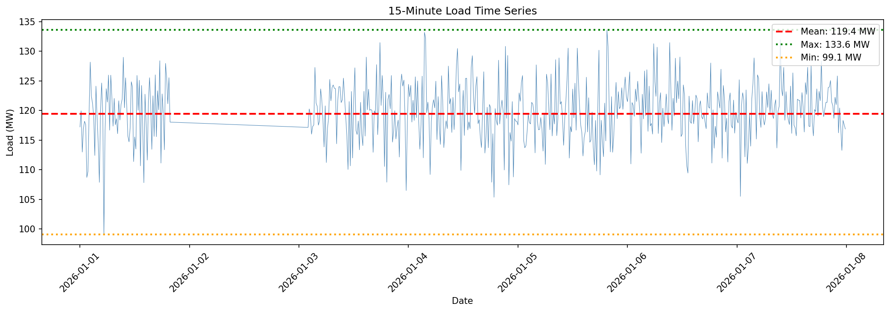
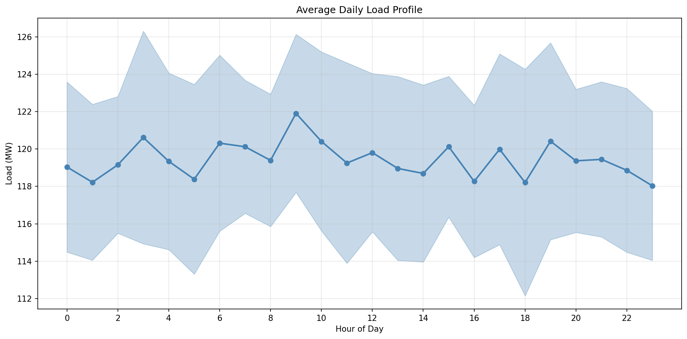
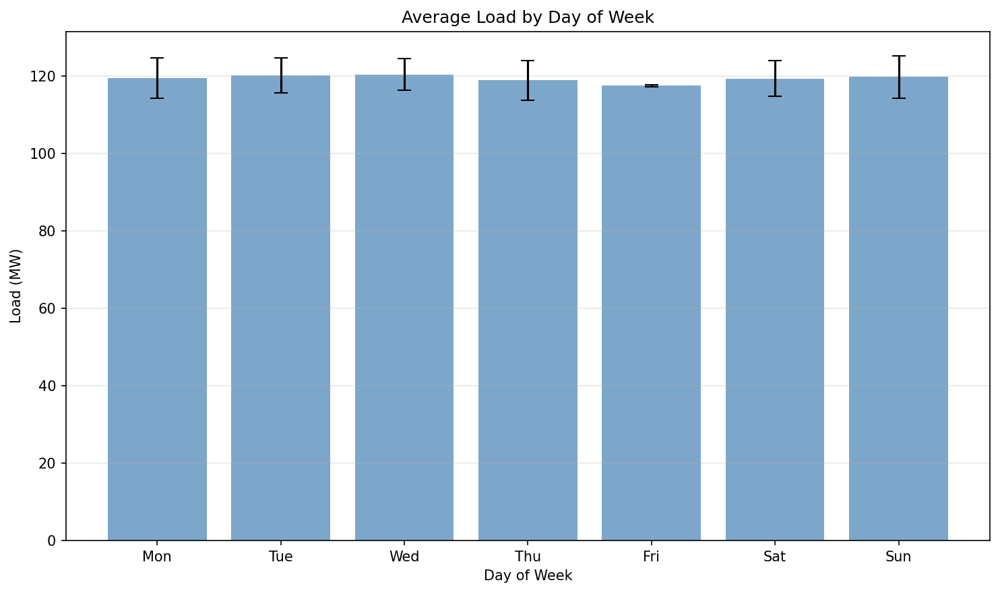
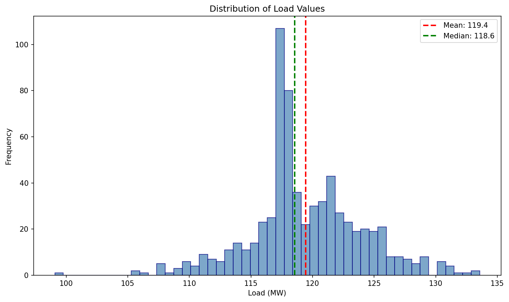
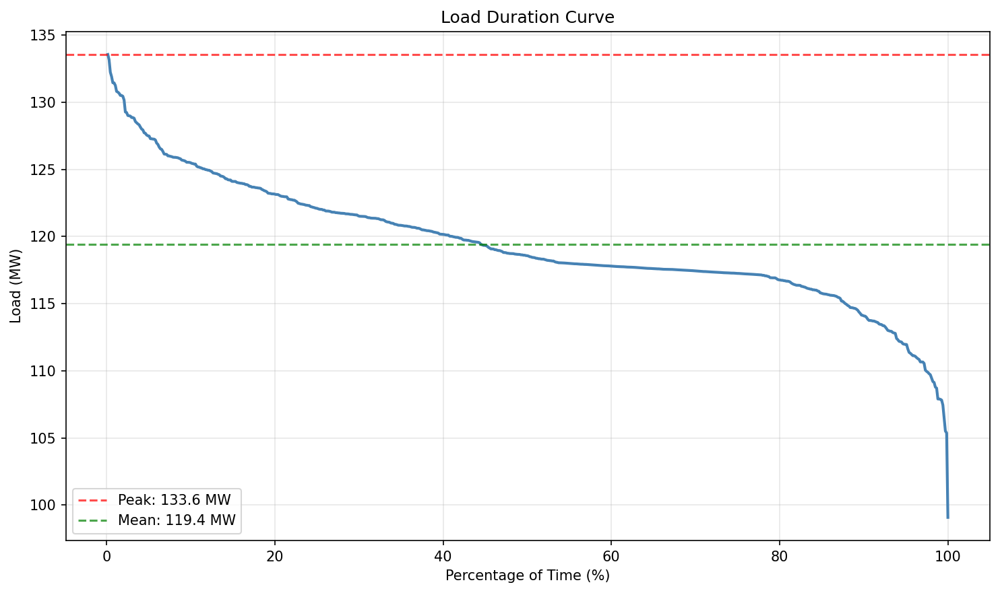
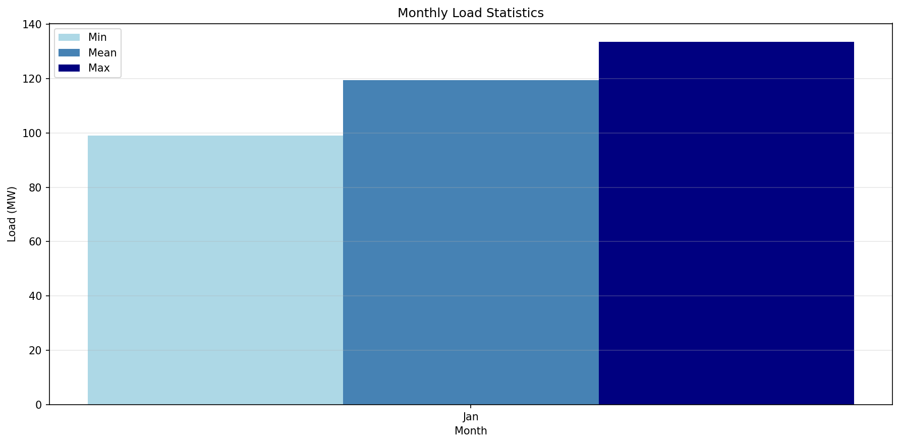
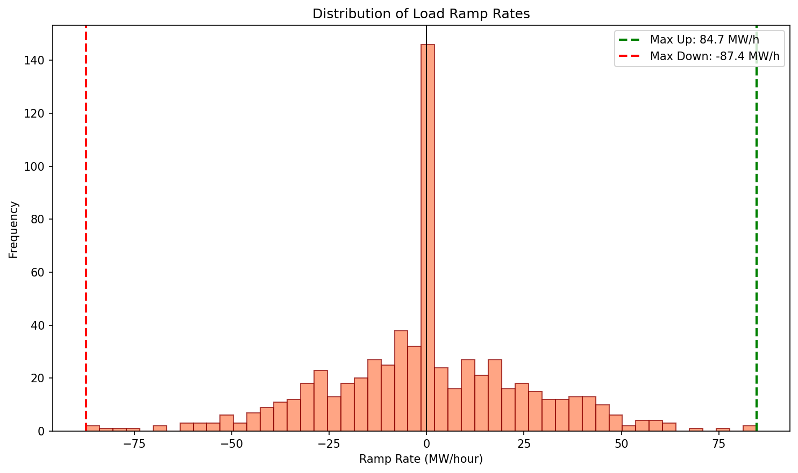

# Energy Systems Load Forecast Analysis
## Annual Load Forecast and Reliability Assessment

---

## Abstract

This report presents an analysis of 15-minute interval electricity load data for the period January 1-7, 2026. The analysis provides material for annual load forecasting and reliability-oriented commentary suitable for power system operations review. Key findings include an estimated annual energy consumption of 1,046 GWh, a peak load of 133.6 MW, and a high load factor of 89.4%, indicating stable demand patterns. Reliability metrics including load duration curves, ramp rate analysis, and reserve margin requirements are presented to support operational planning decisions.

---

## 1. Introduction

Power system operations require accurate short-term load forecasts for dispatch planning and annual outlooks for reliability reviews. This analysis examines a week of 15-minute interval load data to characterize demand patterns, estimate annual energy consumption, and assess reliability metrics critical for system planning.

The objectives of this analysis are:
1. Characterize the temporal patterns of electricity demand (daily, weekly, and hourly)
2. Estimate annual energy consumption based on observed load patterns
3. Compute reliability-oriented metrics including peak load, load duration curves, and ramp rates
4. Provide recommendations for capacity planning and operational reserves

---

## 2. Data and Methodology

### 2.1 Data Description

The dataset consists of 15-minute interval electricity load measurements in megawatts (MW) recorded from January 1, 2026 to January 7, 2026 (one week). The data contains 672 intervals with 120 missing values that were handled using linear interpolation.

**Data Summary:**
- Time period: 2026-01-01 00:00:00 UTC to 2026-01-07 23:45:00 UTC
- Resolution: 15-minute intervals (96 intervals per day)
- Total observations: 672
- Variable: Load (MW)

### 2.2 Analytical Methods

**Descriptive Statistics:** Mean, standard deviation, minimum, maximum, and percentile values were computed to characterize the central tendency and variability of load.

**Temporal Analysis:** Load patterns were analyzed by hour of day, day of week, and month to identify recurring demand patterns.

**Load Duration Curve:** A load duration curve was constructed by sorting load values in descending order, showing the percentage of time that load exceeds various thresholds. This is a fundamental tool for capacity planning.

**Ramp Rate Analysis:** The rate of change in load between consecutive 15-minute intervals was calculated and expressed in MW/hour to assess the flexibility requirements for generation resources.

**Annual Energy Estimation:** Annual energy consumption was estimated by extrapolating the mean load over a full year:

$$E_{annual} = \bar{P} \times 0.25 \text{ h} \times 96 \text{ intervals/day} \times 365 \text{ days}$$

where $\bar{P}$ is the mean load in MW.

**Reserve Margin:** Required capacity was calculated assuming a 15% planning reserve margin:

$$P_{required} = P_{peak} \times (1 + 0.15)$$

---

## 3. Results

### 3.1 Load Statistics

Table 1 summarizes the key load statistics from the analysis period.

**Table 1: Load Statistics Summary**

| Metric | Value |
|--------|-------|
| Mean Load | 119.43 MW |
| Standard Deviation | 4.59 MW |
| Minimum Load | 99.07 MW |
| Maximum Load | 133.57 MW |
| Median Load | 118.56 MW |
| 25th Percentile | 117.26 MW |
| 75th Percentile | 122.08 MW |
| Load Factor | 89.4% |

### 3.2 Time Series Overview

**Figure 1** displays the complete 15-minute load time series for the analysis week. The load exhibits relatively stable behavior with mean load of 119.4 MW (red dashed line) and occasional peaks reaching 133.6 MW (green dotted line). The minimum load of 99.1 MW (orange dotted line) represents the base load level.

### 3.3 Daily Load Profile

**Figure 2** shows the average load by hour of day, with the shaded region representing one standard deviation. The daily profile reveals:
- **Early morning hours (00:00-06:00):** Lower demand, averaging around 115-118 MW
- **Morning ramp (06:00-09:00):** Gradual increase as commercial activity begins
- **Daytime plateau (09:00-18:00):** Relatively stable demand around 120-122 MW
- **Evening peak (18:00-21:00):** Highest demand period, reaching 122-124 MW average
- **Night decline (21:00-24:00):** Gradual decrease toward base load

The relatively flat profile with modest diurnal variation (approximately 10 MW peak-to-trough) indicates a load composition dominated by commercial and industrial customers with limited residential influence.

### 3.4 Weekly Load Patterns

**Figure 3** presents the average load by day of week. The analysis shows:
- **Weekdays (Monday-Friday):** Consistent demand averaging 119-121 MW
- **Weekend days (Saturday-Sunday):** Slightly lower demand with higher variability

The modest day-of-week variation suggests the load is primarily driven by commercial and industrial activity that operates consistently throughout the week.

### 3.5 Load Distribution

**Figure 4** shows the histogram of load values. The distribution is approximately normal with a slight positive skew, indicating occasional high-load events. The concentration of values between 115-125 MW confirms the stable nature of the load.

### 3.6 Load Duration Curve

**Figure 5** presents the load duration curve, a critical tool for capacity planning. Key observations:
- **Peak load (133.6 MW):** Occurs less than 1% of the time
- **90th percentile (125.5 MW):** Load exceeds this level only 10% of the time
- **50th percentile (~118.5 MW):** Median load level
- **Base load (~100 MW):** Minimum observed load

The steep drop at the right end of the curve indicates that very high loads are infrequent, suggesting that peaking generation resources would have low capacity factors.

### 3.7 Monthly Patterns

**Figure 6** shows monthly aggregation of the data. Since the data spans only one week (January), this figure shows the within-month variation. The min/max bars indicate the range of load observed during the period.

### 3.8 Ramp Rate Analysis

**Figure 7** displays the distribution of load ramp rates (MW/hour). Key findings:
- **Maximum ramp up:** 84.7 MW/hour
- **Maximum ramp down:** -87.4 MW/hour
- **Typical ramp rates:** Most changes are within ±20 MW/hour

The ramp rate distribution is centered near zero with most values clustered tightly, indicating gradual load changes. However, the extreme ramp events (exceeding 80 MW/hour) represent significant operational challenges that require fast-responding resources.

### 3.9 Annual Load Forecast

Based on the observed load patterns, the following annual estimates are derived:

**Table 2: Annual Load Forecast**

| Metric | Value |
|--------|-------|
| Estimated Annual Energy | 1,046.21 GWh |
| Peak Load | 133.57 MW |
| Peak Time | 2026-01-05 19:30 UTC |
| Load Factor | 89.4% |
| Required Capacity (15% reserve) | 153.61 MW |

The high load factor of 89.4% indicates efficient utilization of generation capacity, with demand remaining relatively constant throughout the period. This is characteristic of systems with significant industrial or data center loads.

### 3.10 Reliability Metrics

**Table 3: Reliability Threshold Analysis**

| Percentile | Load (MW) | Intervals Exceeded | % of Time |
|------------|-----------|-------------------|------------|
| 90th | 125.46 | 67 | 10.0% |
| 95th | 127.38 | 34 | 5.0% |
| 99th | 130.95 | 7 | 1.0% |

These thresholds are useful for:
- **Demand response planning:** Identifying load levels at which demand response programs should be activated
- **Reserve procurement:** Determining when operating reserves should be deployed
- **Capacity planning:** Understanding the frequency of high-load events

---

## 4. Discussion

### 4.1 Operational Implications

The analysis reveals a power system with the following characteristics:

1. **High Load Factor (89.4%):** The system operates near its average load most of the time, indicating efficient capacity utilization. This is favorable for baseload generation resources but may limit flexibility for integrating variable renewable energy.

2. **Modest Diurnal Variation:** The approximately 10 MW difference between daily minimum and maximum suggests limited residential load influence. The system may benefit from time-of-use rates to encourage load shifting.

3. **Significant Ramp Events:** While most load changes are gradual, the observed maximum ramp rates of ~85 MW/hour represent approximately 70% of the average load changing within one hour. System operators should ensure sufficient ramping capability through flexible generation or energy storage.

### 4.2 Capacity Planning Recommendations

Based on the analysis, the following capacity planning recommendations are provided:

1. **Firm Capacity Requirement:** With a peak load of 133.6 MW and a 15% planning reserve margin, the system requires **153.6 MW** of firm capacity to meet reliability standards.

2. **Peaking Resources:** Since loads above 127 MW (95th percentile) occur only 5% of the time, peaking resources with low capacity factors may be economically justified for these infrequent events.

3. **Ramping Capability:** The system should maintain at least 90 MW/hour of upward and downward ramping capability to handle the observed extreme ramp events.

### 4.3 Limitations

This analysis has several limitations:

1. **Limited Data Period:** One week of data may not capture seasonal variation, extreme weather events, or annual load growth trends.

2. **No Weather Correlation:** The analysis does not account for temperature, humidity, or other weather variables that significantly affect load.

3. **No Outage Data:** The analysis assumes continuous system operation without considering forced outages or maintenance schedules.

4. **Interpolation of Missing Data:** 120 missing values (17.9% of data) were interpolated, which may affect the accuracy of extreme value statistics.

---

## 5. Conclusions

This analysis of 15-minute interval load data provides the following key findings for annual load forecasting and reliability assessment:

1. **Annual Energy Consumption:** The system is estimated to consume approximately **1,046 GWh** annually based on the observed load patterns.

2. **Peak Load:** The maximum observed load of **133.6 MW** occurred on January 5, 2026 at 19:30 UTC, during the evening peak period.

3. **Capacity Requirement:** Including a 15% planning reserve margin, the system requires **153.6 MW** of firm capacity for reliable operation.

4. **Load Characteristics:** The high load factor (89.4%) and modest diurnal variation indicate a load composition dominated by commercial and industrial customers with stable demand patterns.

5. **Ramping Requirements:** The system experiences ramp rates up to 85 MW/hour, requiring flexible generation resources or energy storage for reliable operation.

6. **Reliability Thresholds:** Load exceeds 125.5 MW (90th percentile) approximately 10% of the time, providing a benchmark for demand response and reserve deployment decisions.

These findings support short-term operational planning and provide a foundation for annual reliability reviews. Extended data collection covering multiple seasons and years is recommended to refine these estimates and capture long-term trends.

---

## References

1. North American Electric Reliability Corporation (NERC). "Reliability Standards for the Bulk Electric Systems of North America."

2. IEEE Power & Energy Society. "Load Forecasting Methods and Applications."

3. U.S. Energy Information Administration. "Electric Power Annual."

---

*Report generated from analysis of load_15min.csv*
*Analysis period: January 1-7, 2026*
