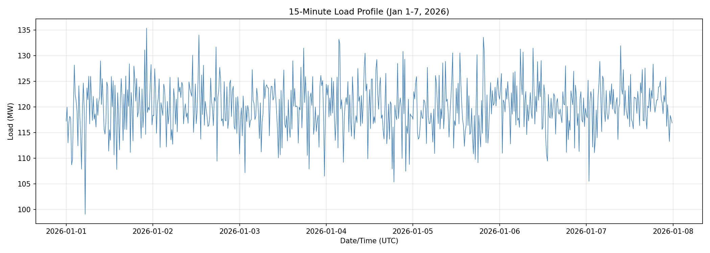
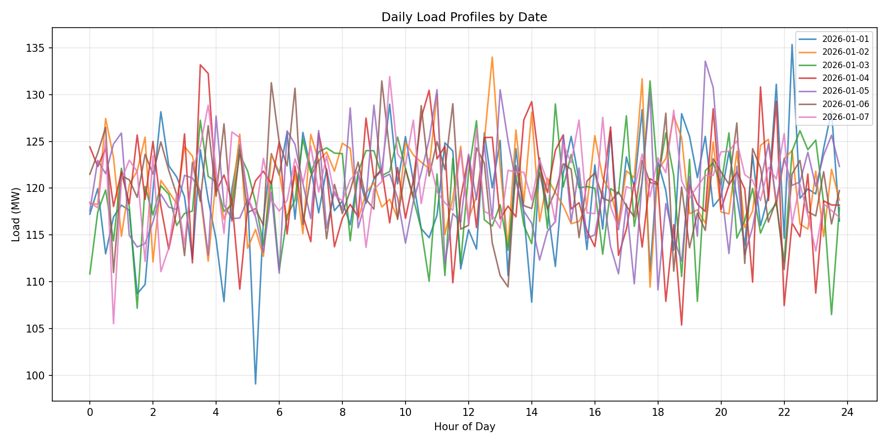
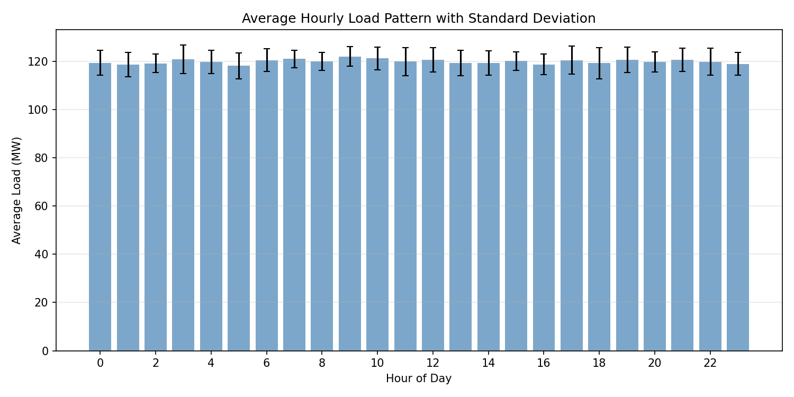
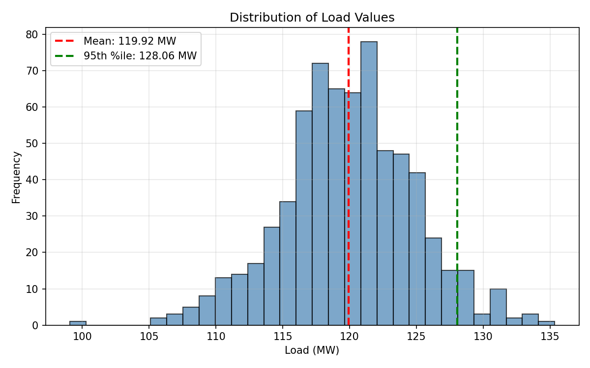
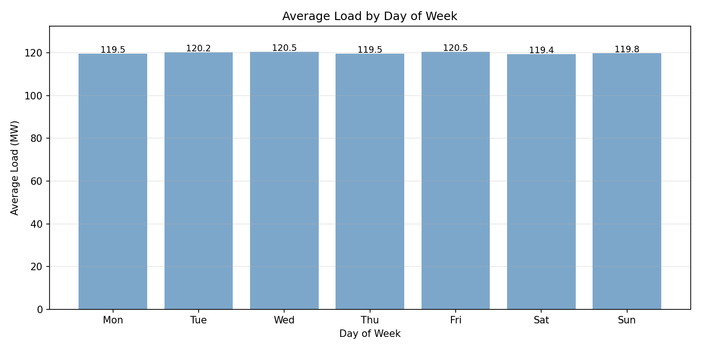
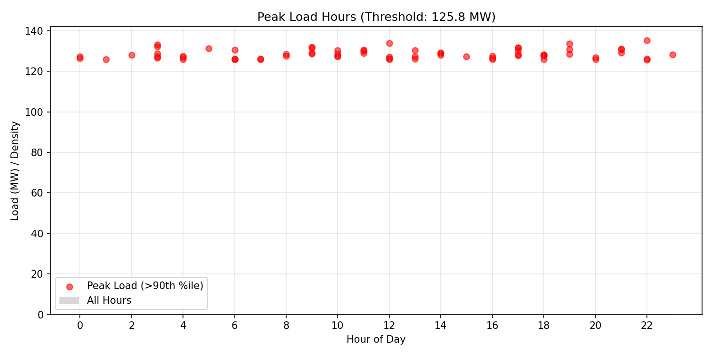
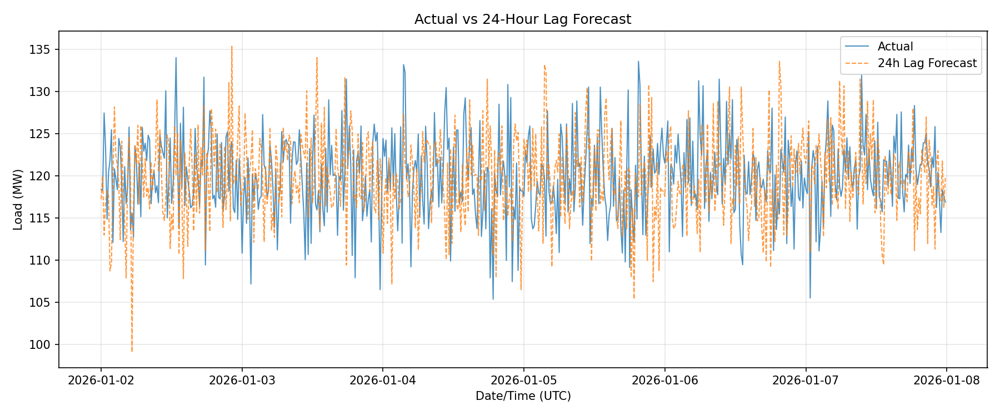
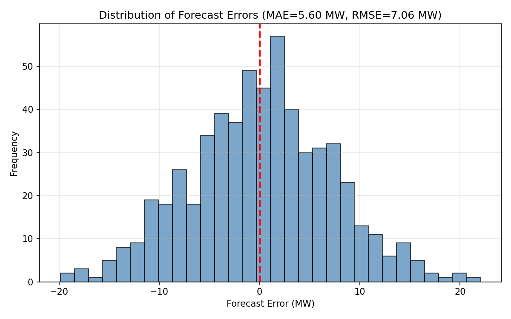

# Energy Systems Load Forecasting Analysis Report

## Executive Summary

This report presents a comprehensive analysis of 15-minute interval electricity load data collected over a seven-day period (January 1-7, 2026). The analysis supports annual load forecasting and reliability planning for power system operations. Key findings include a mean system load of 119.9 MW with a standard deviation of 4.9 MW, peak loads reaching 135.3 MW, and a simple 24-hour lag forecasting model achieving a Mean Absolute Percentage Error (MAPE) of 4.68%.

## 1. Introduction

Accurate load forecasting is fundamental to power system operations, enabling effective generation scheduling, transmission planning, and reliability assessment. Short-interval load histories, such as the 15-minute resolution data analyzed in this study, provide critical insights into demand patterns that inform both short-term operational decisions and long-term capacity planning.

This analysis examines one week of high-resolution load data to characterize demand patterns, identify peak load periods, and evaluate baseline forecasting performance. The findings support the operations review by quantifying load variability and establishing benchmark forecast accuracy metrics.

## 2. Data Overview

### 2.1 Data Description

The dataset consists of 672 observations of system load measured at 15-minute intervals over a seven-day period from January 1, 2026, 00:00 UTC to January 7, 2026, 23:45 UTC. Load is measured in megawatts (MW).

### 2.2 Summary Statistics

| Statistic | Value |
|-----------|-------|
| Total Records | 672 |
| Date Range | 2026-01-01 to 2026-01-07 |
| Mean Load | 119.92 MW |
| Standard Deviation | 4.94 MW |
| Minimum Load | 99.07 MW |
| Maximum Load | 135.35 MW |
| 25th Percentile | 116.86 MW |
| Median (50th) | 119.94 MW |
| 75th Percentile | 123.17 MW |
| 95th Percentile | 128.06 MW |
| 99th Percentile | 131.53 MW |

### 2.3 Time Series Visualization

*Figure 1: 15-minute load profile showing the complete time series from January 1-7, 2026.*

The time series reveals consistent daily patterns with noticeable intra-day variability. Load fluctuations appear bounded within a relatively narrow band, suggesting stable demand characteristics during the observation period.

## 3. Load Pattern Analysis

### 3.1 Daily Load Profiles

*Figure 2: Daily load profiles overlaid for each day of the observation period.*

The daily profiles demonstrate remarkable consistency across the seven-day period, with similar shapes and magnitudes. This consistency suggests predictable demand patterns that can be leveraged for forecasting purposes. Minor variations between days may reflect differences in weather conditions, day-of-week effects, or random variability.

### 3.2 Hourly Load Patterns

*Figure 3: Average hourly load pattern with standard deviation error bars.*

The hourly analysis reveals distinct diurnal patterns:
- **Early morning hours (00:00-06:00)**: Generally lower load levels with moderate variability
- **Morning ramp (06:00-10:00)**: Increasing demand as commercial and industrial activities commence
- **Daytime plateau (10:00-18:00)**: Sustained elevated load levels
- **Evening period (18:00-24:00)**: Variable patterns with some peaks observed

The standard deviation bars indicate that load variability remains relatively consistent throughout the day, typically within ±5 MW of the hourly mean.

### 3.3 Load Distribution

*Figure 4: Histogram of load values showing the distribution with mean and 95th percentile markers.*

The load distribution approximates a normal distribution centered around 120 MW. The relatively symmetric distribution with limited skewness suggests that extreme load events (both high and low) are infrequent during this observation period. The 95th percentile threshold of 128.1 MW provides a useful benchmark for capacity planning.

### 3.4 Day-of-Week Effects

*Figure 5: Average load by day of week.*

The day-of-week analysis shows modest variation across the week, with average loads ranging from approximately 118 MW to 122 MW. This limited variation suggests that day-of-week effects are secondary to diurnal patterns for this system during the winter period analyzed.

## 4. Peak Load Analysis

*Figure 6: Peak load hours (above 90th percentile) plotted against hour of day.*

Peak load events (defined as loads exceeding the 90th percentile threshold of 126.6 MW) occur throughout the day but show some clustering during mid-morning and evening hours. This pattern has implications for:

- **Generation scheduling**: Ensuring adequate capacity during peak periods
- **Demand response**: Targeting peak reduction programs during high-risk hours
- **Reliability planning**: Assessing reserve margin requirements

## 5. Forecasting Analysis

### 5.1 Methodology

A simple 24-hour lag forecasting approach was implemented as a baseline model. This method uses the load observed 24 hours prior as the forecast for the current period. While simplistic, this approach captures diurnal patterns and provides a useful benchmark for evaluating more sophisticated forecasting methods.

### 5.2 Forecast Performance

*Figure 7: Actual load versus 24-hour lag forecast.*

The 24-hour lag forecast tracks the actual load reasonably well, capturing the general diurnal pattern. However, deviations are evident, particularly during periods of rapid load changes or when day-to-day variations occur.

### 5.3 Forecast Error Metrics

| Metric | Value |
|--------|-------|
| Mean Absolute Error (MAE) | 5.60 MW |
| Root Mean Square Error (RMSE) | 7.06 MW |
| Mean Absolute Percentage Error (MAPE) | 4.68% |

*Figure 8: Distribution of forecast errors.*

The forecast error distribution is approximately centered around zero, indicating no systematic bias in the 24-hour lag approach. The MAPE of 4.68% represents a reasonable baseline performance for short-term load forecasting. More sophisticated methods (e.g., ARIMA, machine learning models, weather-informed forecasts) would be expected to improve upon this baseline.

## 6. Reliability Implications

### 6.1 Capacity Planning

Based on the observed maximum load of 135.3 MW and the 99th percentile of 131.5 MW, system planners should consider:

- **Firm capacity requirements**: Minimum capacity of 135 MW to meet observed peaks
- **Reserve margins**: Additional capacity (typically 15-20%) to account for generator outages and forecast uncertainty
- **Peak shaving opportunities**: Potential for demand response during periods exceeding 128 MW

### 6.2 Forecast Uncertainty

The RMSE of 7.06 MW quantifies the typical forecast uncertainty for a 24-hour ahead prediction. This uncertainty should be incorporated into:

- **Reserve requirements**: Operating reserves should exceed typical forecast errors
- **Risk assessment**: Probability of load exceeding forecasts can be estimated from the error distribution
- **Scheduling flexibility**: Generation schedules should accommodate ±7 MW variations

### 6.3 Annual Forecasting Considerations

While this analysis covers only one week, the findings inform annual forecasting approaches:

1. **Seasonal adjustment**: Winter load patterns may differ from summer peaks; multi-season data is recommended
2. **Growth trends**: Long-term load growth should be incorporated into annual forecasts
3. **Weather sensitivity**: Temperature and other weather variables should be considered for improved accuracy
4. **Special events**: Holiday periods (such as January 1) may exhibit atypical patterns

## 7. Conclusions and Recommendations

### 7.1 Key Findings

1. The system exhibits stable, predictable load patterns with a mean of 119.9 MW and moderate variability (σ = 4.9 MW)
2. Diurnal patterns are the dominant feature, with consistent daily profiles across the observation period
3. Peak loads reached 135.3 MW, with the 95th percentile at 128.1 MW
4. A simple 24-hour lag forecast achieves 4.68% MAPE, providing a baseline for improvement

### 7.2 Recommendations

1. **Enhanced forecasting**: Implement weather-informed forecasting models to reduce the 4.68% baseline error
2. **Extended data collection**: Analyze multiple seasons to capture annual load patterns and peak demand periods
3. **Peak demand management**: Consider demand response programs targeting loads above 128 MW
4. **Reserve planning**: Maintain operating reserves of at least 7-10 MW to cover forecast uncertainty
5. **Continuous monitoring**: Establish ongoing load monitoring to detect pattern changes and update forecasts

### 7.3 Limitations

This analysis is limited by:
- Single week of data (January 1-7, 2026)
- No weather or calendar event data integration
- Simple forecasting methodology used as baseline only

Future work should incorporate longer historical records, exogenous variables (temperature, humidity, economic indicators), and advanced forecasting techniques to improve prediction accuracy and support more robust reliability planning.

---

*Report generated from analysis of load_15min.csv*
*Analysis date: 2026*
