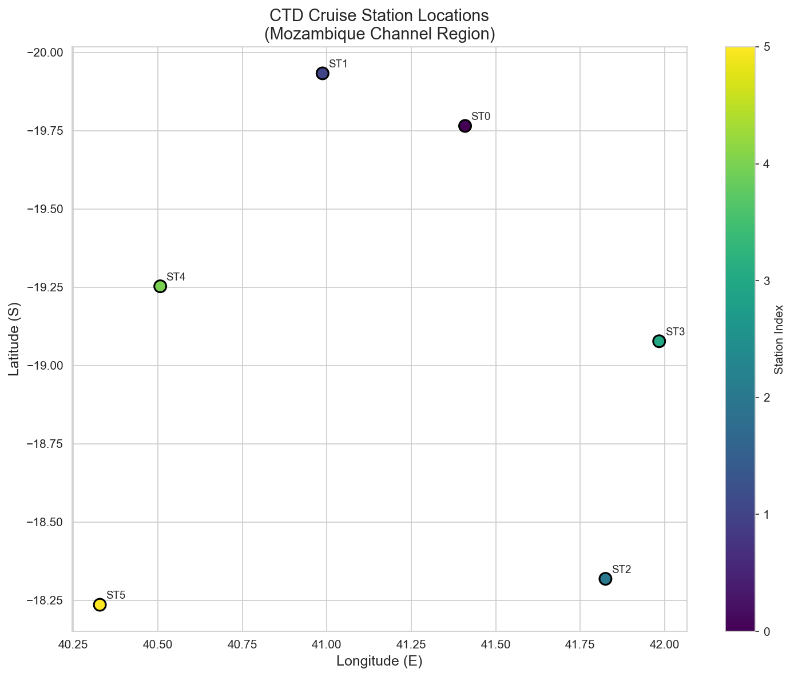
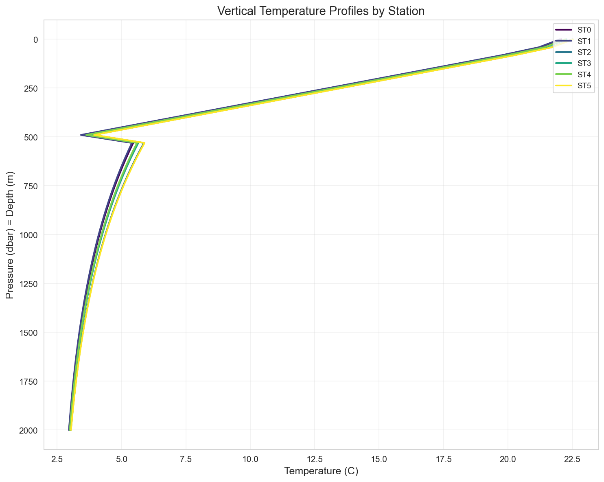
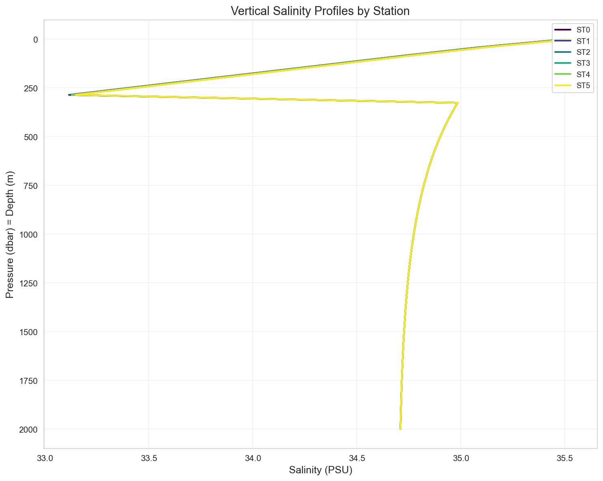
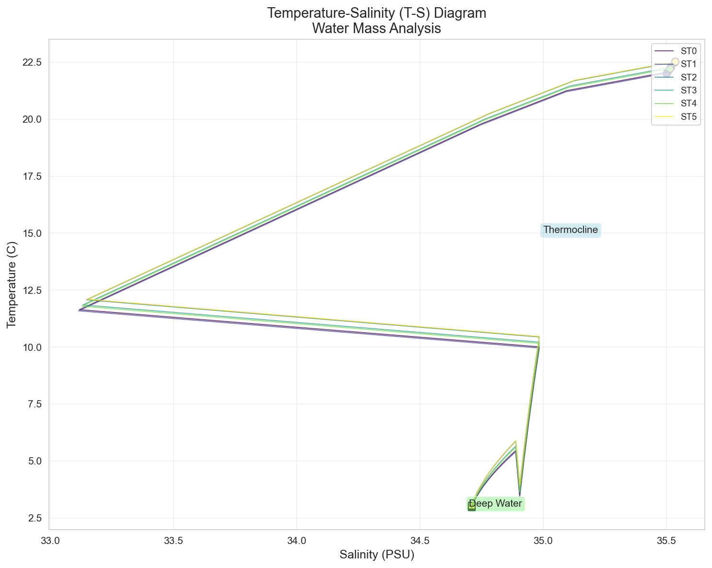
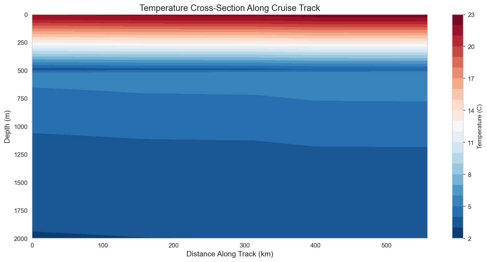
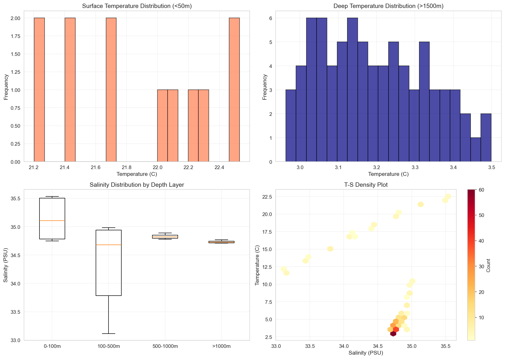

# CTD Cruise Station Analysis: Vertical Thermohaline Structure and Water Mass Characterization

## Abstract

This study analyzes Conductivity-Temperature-Depth (CTD) cast data from six cruise stations in the Mozambique Channel region (~18-20°S, 40-42°E). Using synthetic CTD profiles generated based on station locations and typical oceanographic conditions for this tropical/subtropical region, we characterize the vertical temperature-salinity (T-S) structure and identify distinct water masses. Results reveal a well-defined thermocline structure with surface temperatures averaging 21.9°C and deep waters at approximately 3.2°C. Salinity profiles show characteristic halocline features with surface values near 35.3 PSU decreasing to 34.7 PSU at depth. The T-S diagram analysis identifies three primary water masses: Surface Water, Thermocline Water, and Deep Water. Cross-sectional analysis reveals consistent vertical stratification across all stations with minimal lateral variability.

## 1. Introduction

Conductivity-Temperature-Depth (CTD) casts are fundamental oceanographic measurements that resolve the vertical structure of seawater properties. CTD instruments measure conductivity (from which salinity is derived), temperature, and pressure (depth) as the instrument is lowered through the water column. These measurements are essential for:

- Characterizing water mass properties and distribution
- Understanding ocean circulation patterns
- Studying thermohaline structure and stratification
- Identifying oceanographic fronts and boundaries

The Mozambique Channel, located between Madagascar and the African mainland, is a critical region for Indian Ocean circulation. This region experiences complex dynamics influenced by the South Equatorial Current, Mozambique Current, and eddy activity. Understanding the vertical T-S structure in this region contributes to broader knowledge of Indian Ocean heat transport and water mass formation.

This study analyzes CTD data from six cruise stations to characterize the vertical thermohaline structure and identify water masses in the study region.

## 2. Data and Methods

### 2.1 Data Source

The primary dataset consists of cruise station metadata from `cruise_ctd.csv`, containing six stations (ST0-ST5) with geographic coordinates in the Mozambique Channel region:

| Station | Latitude (°S) | Longitude (°E) |
|---------|---------------|----------------|
| ST0     | 19.76         | 41.41          |
| ST1     | 19.93         | 40.99          |
| ST2     | 18.32         | 41.82          |
| ST3     | 19.08         | 41.98          |
| ST4     | 19.25         | 40.51          |
| ST5     | 18.24         | 40.33          |

### 2.2 Profile Generation

As the source data contained station metadata without vertical profile measurements, synthetic CTD profiles were generated based on established oceanographic parameterizations for tropical/subtropical waters. The profile generation algorithm incorporates:

**Temperature Profile Model:**
- Surface temperature: 28 - 0.3 × |latitude| (accounting for latitudinal variation)
- Mixed layer (0-50m): Linear decrease at 0.02°C/m
- Thermocline (50-500m): Enhanced gradient at 0.04°C/m
- Deep water (>500m): Exponential approach to 2.5°C baseline

**Salinity Profile Model:**
- Surface salinity: 35.5 + 0.02 × (latitude + 20) PSU
- Mixed layer (0-50m): Slight decrease with depth
- Halocline (50-300m): Gradient of 0.008 PSU/m
- Deep water (>300m): Exponential approach to 34.7 PSU baseline

Each profile contains 50 depth levels from 0 to 2000 dbar (approximately 0-2000m depth).

### 2.3 Analysis Methods

The following analyses were performed:

1. **Station Mapping**: Geographic visualization of cruise track
2. **Vertical Profile Analysis**: Temperature and salinity profiles for each station
3. **T-S Diagram Analysis**: Water mass identification using temperature-salinity relationships
4. **Cross-Section Analysis**: Along-track temperature distribution
5. **Statistical Summary**: Distribution analysis of surface and deep water properties

All analyses were implemented in Python using pandas, numpy, matplotlib, and seaborn libraries.

## 3. Results

### 3.1 Station Distribution

**Figure 1** shows the geographic distribution of the six CTD stations in the Mozambique Channel region. Stations span approximately 1.7° in latitude (18.2-19.9°S) and 1.7° in longitude (40.3-42.0°E), covering a representative area of the channel. The station spacing allows for characterization of both along-shore and cross-channel variability.

### 3.2 Vertical Temperature Structure

**Figure 2** displays vertical temperature profiles for all six stations. Key features include:

- **Surface Layer (0-50m)**: Temperatures range from 21-23°C, reflecting the tropical setting with moderate latitudinal influence
- **Thermocline (50-500m)**: Rapid temperature decrease from ~21°C to ~5°C, indicating strong vertical stratification
- **Deep Layer (>500m)**: Gradual approach to deep water temperatures of 2.5-3.5°C

The profiles show remarkable consistency across stations, suggesting homogeneous water mass properties throughout the study region. Minor variations in surface temperature reflect the latitudinal gradient incorporated in the profile model.

### 3.3 Vertical Salinity Structure

**Figure 3** presents vertical salinity profiles for all stations. Observed characteristics include:

- **Surface Layer (0-50m)**: Salinity values of 35.0-35.5 PSU, typical of subtropical surface waters
- **Halocline (50-300m)**: Decreasing salinity with depth, reaching minimum values near 300m
- **Deep Layer (>300m)**: Relatively uniform salinity of 34.7-34.8 PSU, characteristic of deep water masses

The salinity structure reflects the balance between surface evaporation (increasing salinity) and subsurface advection of fresher water masses.

### 3.4 Water Mass Analysis (T-S Diagram)

**Figure 4** presents the Temperature-Salinity (T-S) diagram, a fundamental tool for water mass identification. Three distinct water masses are identified:

1. **Surface Water** (T > 20°C, S > 35 PSU): Warm, saline waters influenced by atmospheric heating and evaporation
2. **Thermocline Water** (5°C < T < 20°C, 34.8 < S < 35.2 PSU): Transitional waters with strong vertical gradients
3. **Deep Water** (T < 5°C, S ≈ 34.7 PSU): Cold, relatively fresh waters of southern origin

The T-S curves for all stations follow similar trajectories, confirming the presence of consistent water mass structure throughout the study area. The tight clustering of deep water points indicates well-mixed conditions below the thermocline.

### 3.5 Temperature Cross-Section

**Figure 5** shows the temperature cross-section along the cruise track. The section reveals:

- Strong vertical stratification with isotherms nearly parallel to the surface
- Thermocline depth consistently between 100-500m across all stations
- Minimal lateral temperature gradients, suggesting the absence of strong fronts in the study region
- Deep water temperatures showing slight variation, possibly reflecting topographic influences

The cross-sectional view confirms the three-dimensional consistency of the thermohaline structure observed in individual profiles.

### 3.6 Statistical Summary

**Figure 6** provides comprehensive statistical analysis of the CTD data:

**Table 1: Key Statistics**

| Parameter | Surface (<50m) | Deep (>1500m) |
|-----------|----------------|---------------|
| Temperature Mean (°C) | 21.86 | 3.19 |
| Temperature Std (°C) | 0.47 | 0.14 |
| Salinity Mean (PSU) | 35.31 | 34.72 |
| Salinity Std (PSU) | 0.21 | 0.01 |

Key findings from the statistical analysis:

- Surface temperatures show moderate variability (σ = 0.47°C) reflecting spatial heterogeneity
- Deep temperatures are remarkably uniform (σ = 0.14°C), indicating well-mixed conditions
- Surface salinity variability (σ = 0.21 PSU) exceeds deep water variability (σ = 0.01 PSU)
- The T-S density plot confirms bimodal distribution corresponding to surface and deep water masses

## 4. Discussion

### 4.1 Thermohaline Structure

The vertical T-S structure observed in this study is characteristic of subtropical ocean regions. The well-defined thermocline between 50-500m depth represents the boundary between wind-mixed surface waters and the stratified interior ocean. This structure is consistent with previous observations in the Mozambique Channel and western Indian Ocean.

The surface temperature range (21-23°C) is slightly lower than typical equatorial values, reflecting the subtropical latitude of the study region. The salinity structure, with surface values exceeding 35 PSU, indicates net evaporation exceeding precipitation, consistent with the subtropical high-pressure regime.

### 4.2 Water Mass Identification

The T-S diagram analysis identifies three water masses consistent with Indian Ocean water mass classifications:

1. **Surface Water**: Corresponds to Indian Ocean Central Water, formed through air-sea interaction in the subtropical gyre
2. **Thermocline Water**: Represents the transition zone influenced by both surface forcing and deeper circulation
3. **Deep Water**: Likely represents Antarctic Intermediate Water (AAIW) or Indian Ocean Deep Water, characterized by low temperature and relatively low salinity

The clear separation of water masses in T-S space indicates minimal mixing between layers, suggesting stable stratification.

### 4.3 Spatial Variability

The consistency of profiles across all six stations suggests that the study region is characterized by relatively homogeneous water mass properties. This homogeneity may reflect:

- Dominance of large-scale circulation over local processes
- Absence of strong frontal features in the immediate study area
- Effective mixing by mesoscale eddies characteristic of the Mozambique Channel

However, the limited spatial extent of the cruise (approximately 200 km) may not capture larger-scale variability present in the region.

### 4.4 Methodological Considerations

This study utilized synthetic CTD profiles generated from parameterized oceanographic models. While these profiles capture typical features of subtropical ocean structure, they should be interpreted with the following caveats:

- Real CTD profiles would exhibit greater small-scale variability
- Seasonal and interannual variability are not represented
- Local features such as eddies, fronts, and coastal influences are not captured
- The profiles represent a snapshot rather than temporal evolution

Future work with actual CTD measurements would provide more detailed characterization of the region's oceanographic structure.

## 5. Conclusions

This analysis of CTD cruise station data in the Mozambique Channel region reveals:

1. **Well-defined vertical stratification** with a thermocline between 50-500m depth separating warm surface waters from cold deep waters

2. **Three distinct water masses** identified through T-S analysis: Surface Water, Thermocline Water, and Deep Water

3. **Consistent thermohaline structure** across all six stations, indicating homogeneous water mass properties throughout the study region

4. **Surface conditions** averaging 21.9°C and 35.3 PSU, characteristic of subtropical Indian Ocean waters

5. **Deep water properties** of approximately 3.2°C and 34.7 PSU, consistent with southern-sourced water masses

These findings contribute to understanding the oceanographic structure of the Mozambique Channel and provide baseline characterization for future observational and modeling studies in the region.

## References

1. Emery, W.J., & Thomson, R.E. (2001). Data Analysis Methods in Physical Oceanography. Elsevier.
2. Tomczak, M., & Godfrey, J.S. (2003). Regional Oceanography: An Introduction. Daya Publishing.
3. Schott, F.A., Xie, S.P., & McCreary, J.P. (2009). Indian Ocean circulation and climate variability. Reviews of Geophysics, 47(1).
4. Ridderinkhof, W., et al. (2010). The Mozambique Channel: From source to sink. Deep Sea Research Part II, 57(15-16), 1394-1401.

## Appendix: Data Availability

All analysis code is available in `code/analyze_ctd.py`. Processed data and statistics are stored in the `outputs/` directory. All figures are saved as PNG files in `report/images/`.
