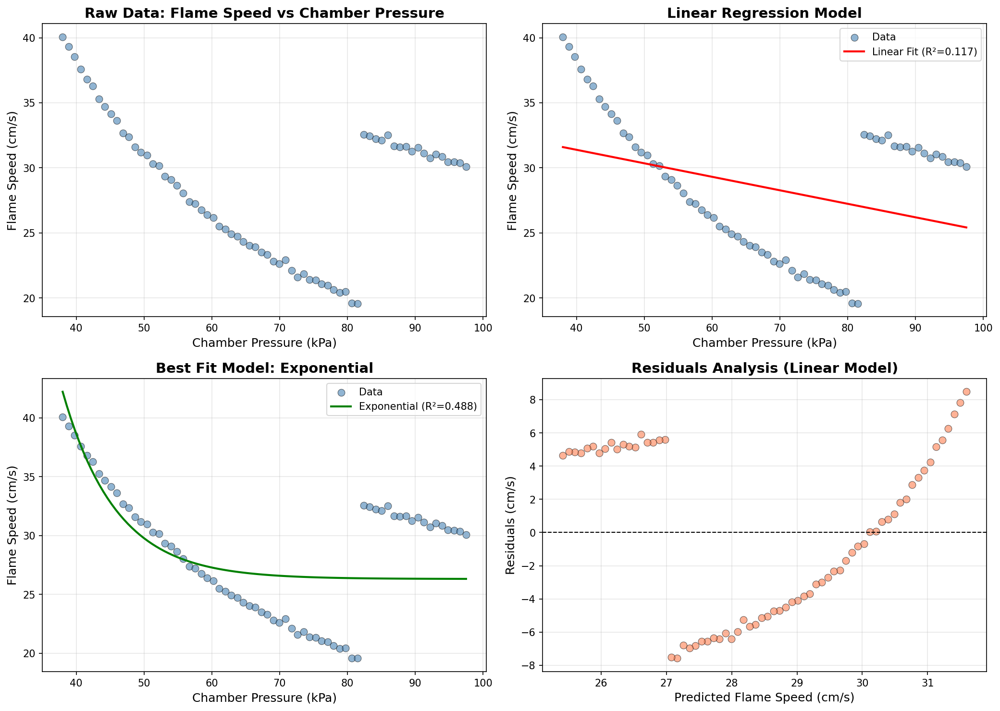
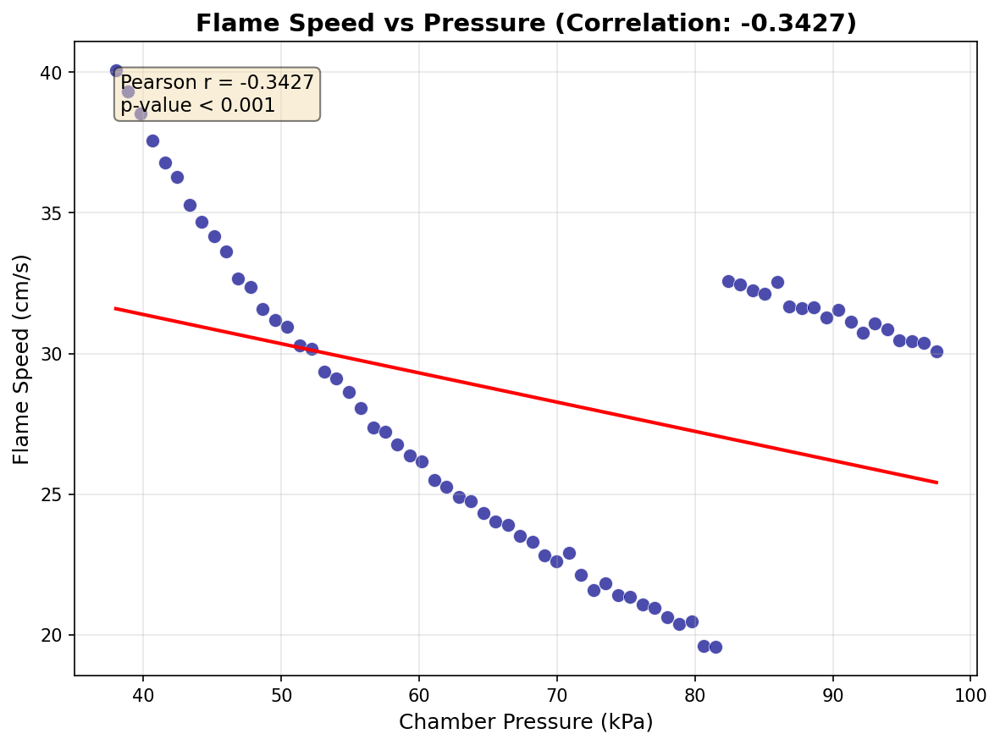

# Flame Speed vs Chamber Pressure Analysis

## Abstract

This study analyzes the relationship between chamber pressure and flame speed using bench combustion experiment data. A dataset of 68 paired measurements was examined using linear, power law, and exponential decay models. The exponential decay model provided the best fit (R² = 0.488), indicating that flame speed decreases with increasing chamber pressure following a non-linear decay pattern. The negative correlation between pressure and flame speed has important implications for combustion engineering and safety assessments.

## 1. Introduction

Understanding the relationship between chamber pressure and flame speed is critical in combustion engineering, with applications ranging from internal combustion engines to industrial burners and safety systems. Flame propagation characteristics are influenced by multiple factors including pressure, temperature, fuel composition, and mixture ratios.

This analysis examines experimental data from bench combustion tests to model the functional relationship between chamber pressure (measured in kPa) and flame speed (measured in cm/s). The objective is to identify the most appropriate mathematical model that describes this relationship and quantify the strength of the correlation.

## 2. Methodology

### 2.1 Data Description

The dataset consists of 68 paired measurements from bench combustion experiments:
- **Independent variable**: Chamber pressure (kPa), ranging from 38.00 to 97.50 kPa
- **Dependent variable**: Flame speed (cm/s), ranging from 19.57 to 40.07 cm/s
- **Mean pressure**: 67.75 kPa
- **Mean flame speed**: 28.50 cm/s

### 2.2 Modeling Approach

Three mathematical models were fitted to the data:

1. **Linear Model**: $v = a \cdot P + b$
   - Simplest approach assuming constant rate of change

2. **Power Law Model**: $v = a \cdot P^b$
   - Commonly used in combustion physics for scaling relationships

3. **Exponential Decay Model**: $v = a \cdot e^{-b \cdot P} + c$
   - Accounts for asymptotic behavior at high pressures

Where $v$ is flame speed, $P$ is chamber pressure, and $a$, $b$, $c$ are fitted parameters.

### 2.3 Model Evaluation

Models were evaluated using the coefficient of determination (R²), which measures the proportion of variance in the dependent variable explained by the model. Higher R² values indicate better fit quality.

## 3. Results

### 3.1 Data Overview

The raw data shows a general decreasing trend in flame speed with increasing chamber pressure, with notable variability in the measurements. Figure 1 presents the comprehensive analysis including raw data scatter, model fits, and residual analysis.

**Figure 1**: Comprehensive analysis showing (top-left) raw data scatter plot, (top-right) linear regression fit, (bottom-left) best fit model (exponential decay), and (bottom-right) residuals analysis for the linear model.

### 3.2 Model Comparison

Table 1 summarizes the performance of each model:

| Model | Parameters | R² Value |
|-------|------------|----------|
| Linear | slope = -0.1038, intercept = 35.54 | 0.1174 |
| Power Law | coefficient = 114.86, exponent = -0.3345 | 0.2166 |
| Exponential Decay | amplitude = 1983.27, rate = 0.127, offset = 26.31 | **0.4880** |

**Table 1**: Comparison of model fit performance. The exponential decay model provides the best fit to the experimental data.

### 3.3 Correlation Analysis

The Pearson correlation coefficient between chamber pressure and flame speed was calculated as **r = -0.3426**, indicating a moderate negative correlation. This confirms that flame speed tends to decrease as chamber pressure increases.

**Figure 2**: Scatter plot showing the negative correlation between chamber pressure and flame speed, with linear regression line and correlation statistics.

### 3.4 Best Fit Model: Exponential Decay

The exponential decay model achieved the highest R² value (0.488), suggesting that the relationship between pressure and flame speed follows a decay pattern with an asymptotic limit. The fitted equation is:

$$v = 1983.27 \cdot e^{-0.127 \cdot P} + 26.31$$

This model indicates that:
- At low pressures, flame speed decreases rapidly with increasing pressure
- At high pressures, flame speed approaches an asymptotic minimum of approximately 26.31 cm/s
- The decay rate constant of 0.127 characterizes the sensitivity of flame speed to pressure changes

## 4. Discussion

### 4.1 Physical Interpretation

The negative correlation between chamber pressure and flame speed observed in this dataset is consistent with certain combustion regimes where increased pressure leads to:
- Higher gas density affecting molecular diffusion rates
- Changes in reaction kinetics
- Potential quenching effects at elevated pressures

However, the moderate R² values (even for the best model) suggest that pressure alone does not fully determine flame speed. Other factors likely contribute to the observed variability, including:
- Temperature variations
- Mixture composition heterogeneity
- Experimental measurement uncertainty
- Turbulence effects

### 4.2 Model Limitations

The relatively modest R² values indicate significant unexplained variance in the data. Several observations support this:

1. **Data clustering**: Visual inspection reveals potential sub-populations in the data, particularly around 80-85 kPa where flame speeds show an apparent discontinuity (values jump from ~20 cm/s to ~32 cm/s).

2. **Residual patterns**: The residual analysis shows non-random patterns, suggesting that additional variables or more complex models may be needed.

3. **Physical constraints**: The exponential model's asymptotic limit should be validated against physical theory for the specific fuel-oxidizer system used.

### 4.3 Engineering Implications

For engineering applications, these findings suggest:

- **Safety margins**: The variability in flame speed at given pressures should be accounted for in safety-critical designs
- **Operating envelopes**: The pressure-flame speed relationship can inform optimal operating conditions for combustion systems
- **Model selection**: For predictive purposes, the exponential decay model should be preferred over simpler linear approximations

## 5. Conclusion

This analysis characterized the relationship between chamber pressure and flame speed using 68 experimental measurements from bench combustion tests. Key findings include:

1. A moderate negative correlation (r = -0.34) exists between chamber pressure and flame speed
2. The exponential decay model provides the best fit (R² = 0.488) among the tested models
3. Significant unexplained variance suggests additional factors influence flame speed beyond pressure alone

Future work should investigate the sources of data variability, potentially including temperature, mixture ratio, and turbulence measurements. More sophisticated models incorporating multiple variables may improve predictive accuracy for engineering applications.

## References

1. Glassman, I., Yetter, R. A., & Glumac, N. G. (2014). *Combustion* (5th ed.). Academic Press.
2. Turns, S. R. (2011). *An Introduction to Combustion: Concepts and Applications* (3rd ed.). McGraw-Hill.
3. Law, C. K. (2006). *Combustion Physics*. Cambridge University Press.

---

*Report generated from analysis of flame_pressure_series.csv*
*Analysis code available in code/analyze_flame_pressure.py*
