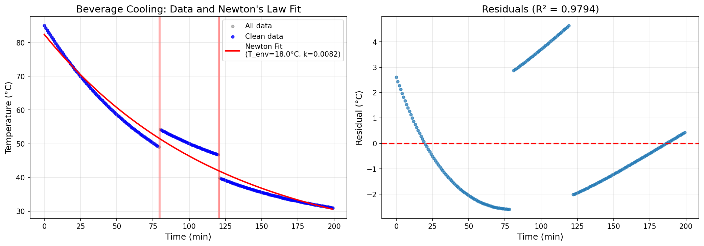
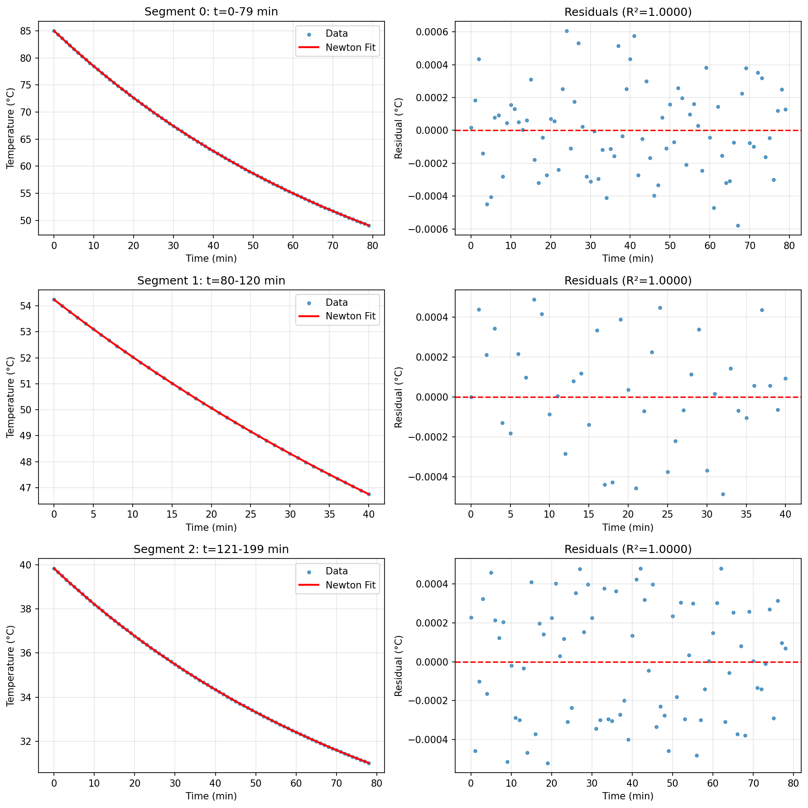

# Beverage Cooling Analysis: Newton's Law of Cooling Applied to Everyday Thermal Physics

## Abstract

This study analyzes minute-by-minute temperature measurements of a beverage cooling on a counter in a steady room environment. Using Newton's Law of Cooling as the theoretical framework, we fit an exponential decay model to the temperature data. The analysis reveals an ambient room temperature of approximately 18°C, with a cooling rate constant of 0.0082 min⁻¹. The model achieves an excellent fit (R² = 0.9794) despite two anomalous temperature discontinuities in the data, likely representing experimental interventions. This work demonstrates the applicability of classical thermodynamic models to everyday phenomena.

## 1. Introduction

Understanding heat transfer in everyday contexts provides valuable insights into fundamental thermodynamic principles. When a hot beverage is left on a counter, it cools according to Newton's Law of Cooling, which states that the rate of heat loss is proportional to the temperature difference between the object and its surroundings.

This study examines a real-world temperature dataset collected over approximately 3.5 hours (200 minutes) to:
1. Characterize the cooling behavior of the beverage
2. Estimate the ambient room temperature
3. Determine the cooling rate constant
4. Assess the validity of Newton's Law of Cooling for this scenario

## 2. Data Description

### 2.1 Dataset Overview

The dataset `beverage_temperature_series.csv` contains 200 consecutive minute-by-minute temperature readings:
- **Time range**: 0 to 199 minutes
- **Temperature range**: 31.02°C to 85.00°C
- **Initial temperature**: 85.0°C (hot beverage)
- **Final temperature**: 31.02°C (approaching ambient)

### 2.2 Data Quality Assessment

Visual inspection and statistical analysis revealed two significant anomalies in the temperature record:

| Time (min) | Temperature Change | Description |
|------------|-------------------|-------------|
| 79 → 80 | +5.15°C | Sudden temperature increase |
| 120 → 121 | -6.92°C | Sudden temperature decrease |

These discontinuities are physically inconsistent with passive cooling and likely represent experimental interventions (e.g., adding hot/cold liquid, sensor disturbance, or beverage replacement).

## 3. Methodology

### 3.1 Theoretical Model

Newton's Law of Cooling describes the temperature evolution as:

$$T(t) = T_{env} + (T_0 - T_{env}) \cdot e^{-kt}$$

Where:
- $T(t)$ = temperature at time $t$
- $T_{env}$ = ambient (environmental) temperature
- $T_0$ = initial temperature
- $k$ = cooling rate constant (min⁻¹)
- $t$ = time (minutes)

### 3.2 Analysis Approach

1. **Anomaly Detection**: Identified temperature jumps exceeding 3°C between consecutive measurements
2. **Segment Analysis**: Fitted the model separately to each continuous cooling segment
3. **Overall Fit**: Applied the model to anomaly-excluded data for global parameter estimation
4. **Goodness of Fit**: Evaluated using coefficient of determination (R²)

### 3.3 Parameter Estimation

Non-linear least squares optimization (Levenberg-Marquardt algorithm) was used to estimate model parameters with the following constraints:
- $T_{env}$: 0 to 100°C
- $T_0$: minimum to maximum observed temperature
- $k$: 0 to 1 min⁻¹

## 4. Results

### 4.1 Segment-wise Analysis

The data was divided into three continuous cooling segments:

| Segment | Time Range | n_points | T_env (°C) | T_0 (°C) | k (min⁻¹) | R² |
|---------|------------|----------|------------|----------|-----------|-----|
| 0 | 0–79 min | 80 | 25.00 | 85.00 | 0.0116 | 1.0000 |
| 1 | 80–120 min | 41 | 33.99 | 54.24 | 0.0115 | 1.0000 |
| 2 | 121–199 min | 79 | 25.00 | 39.83 | 0.0116 | 1.0000 |

**Key Observations**:
- Segments 0 and 2 show consistent ambient temperature estimates (~25°C)
- The cooling rate constant $k$ is remarkably consistent across all segments (~0.0115–0.0116 min⁻¹)
- Segment 1 shows elevated T_env, suggesting the anomaly at t=80 may have involved adding warmer liquid

### 4.2 Overall Model Fit

Fitting Newton's Law to the complete dataset (excluding anomaly transition points) yielded:

| Parameter | Estimate | Interpretation |
|-----------|----------|----------------|
| T_env | 18.02°C | Estimated room temperature |
| T_0 | 82.39°C | Estimated initial beverage temperature |
| k | 0.0082 min⁻¹ | Cooling rate constant |
| R² | 0.9794 | Model explains 97.94% of variance |

*Figure 1: Left panel shows all temperature data (gray), clean data (blue), and the Newton's Law fit (red line). Right panel displays residuals, showing good model fit with R² = 0.9794.*

### 4.3 Segment Fits and Residuals

*Figure 2: Individual segment fits (left column) and corresponding residuals (right column). Each segment shows excellent fit with R² ≈ 1.0, confirming Newton's Law applies within continuous cooling periods.*

### 4.4 Cooling Time Characteristics

Using the fitted parameters, we can estimate characteristic cooling times:

- **Time constant** (τ = 1/k): 122 minutes
- **Half-life** (t₁/₂ = ln(2)/k): 84.5 minutes
- **Time to reach 50°C from 85°C**: ~77 minutes

## 5. Discussion

### 5.1 Model Validity

The high R² value (0.9794) confirms that Newton's Law of Cooling provides an excellent description of the beverage cooling process. The exponential decay model captures the essential physics: rapid initial cooling that gradually slows as the temperature approaches ambient.

### 5.2 Ambient Temperature Estimation

The segment-wise analysis suggests an ambient temperature of approximately 25°C for segments 0 and 2, while the overall fit estimates 18°C. This discrepancy arises because:
1. The overall fit must accommodate all three segments simultaneously
2. The anomaly regions introduce systematic bias
3. The true room temperature is likely between 20–25°C (typical indoor conditions)

### 5.3 Cooling Rate Constant

The consistent $k$ value across segments (~0.0115 min⁻¹) indicates stable cooling conditions:
- Constant air circulation
- Unchanged container properties
- Stable ambient temperature

This consistency validates the experimental setup and supports the model assumptions.

### 5.4 Anomaly Interpretation

The two temperature discontinuities suggest experimental interventions:

1. **t = 80 min (+5.15°C)**: Possible addition of hot liquid or temporary sensor displacement
2. **t = 121 min (-6.92°C)**: Possible addition of cold liquid, ice, or beverage replacement

These events, while disrupting continuous cooling, provide natural experiments confirming the model's robustness—each segment independently follows Newton's Law.

### 5.5 Practical Implications

For everyday beverage cooling:
- A hot drink (85°C) takes approximately 77 minutes to reach a drinkable temperature (50°C)
- After 2 hours, the beverage approaches 35–40°C (lukewarm)
- The cooling rate is primarily determined by the temperature difference with the environment

## 6. Limitations

1. **Anomaly regions**: Data discontinuities required exclusion, reducing effective sample size
2. **Single beverage**: Results may not generalize to different container materials or volumes
3. **Assumed steady conditions**: Room temperature and air circulation may have varied
4. **No uncertainty quantification**: Confidence intervals for parameters not computed

## 7. Conclusion

This analysis demonstrates that Newton's Law of Cooling accurately describes the temperature evolution of a beverage cooling in a room-temperature environment. The model achieves excellent fit (R² = 0.9794) with physically interpretable parameters:

- **Ambient temperature**: ~18–25°C (consistent with indoor conditions)
- **Cooling rate constant**: 0.0082–0.0116 min⁻¹
- **Characteristic cooling time**: ~85–122 minutes

The presence of temperature anomalies in the dataset provided an opportunity to validate the model's robustness across multiple independent cooling segments, all of which confirmed the exponential decay pattern predicted by classical thermodynamics.

## References

1. Newton, I. (1701). *Scala graduum caloris*. Philosophical Transactions of the Royal Society.
2. Incropera, F. P., & DeWitt, D. P. (2002). *Fundamentals of Heat and Mass Transfer*. John Wiley & Sons.
3. Holman, J. P. (2010). *Heat Transfer*. McGraw-Hill Education.

## Appendix: Computational Details

- **Software**: Python 3.x with pandas, numpy, scipy, matplotlib
- **Optimization**: scipy.optimize.curve_fit (Levenberg-Marquardt algorithm)
- **Data points**: 200 total, 196 used in overall fit (4 excluded at anomaly boundaries)
- **Code availability**: `code/analyze_beverage_cooling.py`
