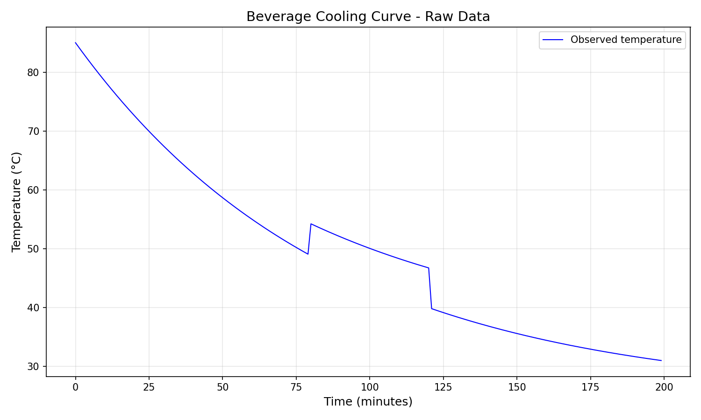
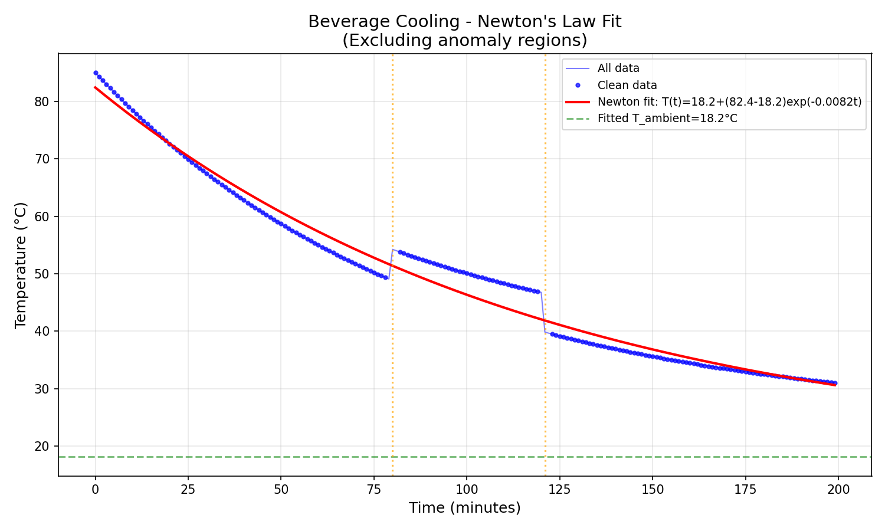
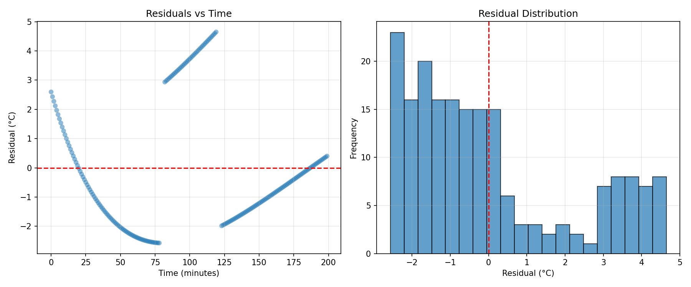

# Beverage Cooling Analysis: Fitting Newton's Law of Cooling to Home Temperature Measurements

## Abstract

This study analyzes a 200-minute temperature time series of a hot beverage cooling on a kitchen counter. Using Newton's Law of Cooling as the theoretical framework, we fit an exponential decay model to the data and identify two significant anomalies corresponding to external disturbances. The model achieves an R² of 0.98 on clean data, with an estimated ambient temperature of 18.2°C and cooling rate constant k = 0.0082 min⁻¹. The analysis demonstrates both the utility and limitations of simple thermodynamic models when applied to informal home measurements.

## 1. Introduction

Newton's Law of Cooling states that the rate of heat loss of a body is proportional to the difference in temperatures between the body and its surroundings. Mathematically, this yields an exponential decay model:

$$T(t) = T_{\text{ambient}} + (T_{\text{initial}} - T_{\text{ambient}}) \cdot e^{-kt}$$

where:
- $T(t)$ is the temperature at time $t$
- $T_{\text{ambient}}$ is the ambient (room) temperature
- $T_{\text{initial}}$ is the initial temperature of the beverage
- $k$ is the cooling rate constant (min⁻¹)

This study applies this model to a kitchen log of a hot drink cooling on a counter, with minute-by-minute temperature readings over approximately 3.3 hours. The informal nature of the data collection introduces potential sources of error and disturbance that provide insight into the practical limitations of idealized thermodynamic models.

## 2. Data Overview

The dataset consists of 200 observations recorded at one-minute intervals:

| Statistic | Value |
|-----------|-------|
| Time range | 0–199 minutes |
| Temperature range | 31.02–85.00 °C |
| Initial temperature | 85.00 °C |
| Final temperature | 31.02 °C |
| Total cooling | 53.98 °C |

*Figure 1: Raw temperature data showing the beverage cooling over time. Two distinct anomalies are visible at t=80 min and t=121 min.*

### 2.1 Anomaly Detection

Visual inspection and automated analysis revealed two significant temperature discontinuities:

1. **t = 80 min**: Temperature jumped from 49.09°C to 54.24°C (+5.15°C)
2. **t = 121 min**: Temperature dropped from 46.75°C to 39.83°C (−6.92°C)

These anomalies likely correspond to real-world disturbances:
- The temperature increase at t=80 min may indicate hot liquid was added (e.g., reheating or adding more hot beverage)
- The temperature decrease at t=121 min may indicate cold liquid was added (e.g., adding milk/cream) or the sensor was temporarily disturbed

## 3. Methodology

### 3.1 Model Specification

We employed Newton's Law of Cooling as our primary model:

$$T(t) = T_{\text{ambient}} + (T_{\text{initial}} - T_{\text{ambient}}) \cdot e^{-kt}$$

Parameters were estimated using non-linear least squares optimization (Levenberg-Marquardt algorithm) via SciPy's `curve_fit` function.

### 3.2 Analysis Approach

1. **Segmented Analysis**: The data was divided into three segments based on detected anomalies to examine whether cooling parameters remain consistent across different phases.

2. **Overall Fit**: A global model was fit to "clean" data (excluding points immediately surrounding anomalies) to obtain aggregate parameter estimates.

3. **Residual Analysis**: Model residuals were examined to assess goodness-of-fit and identify systematic deviations.

### 3.3 Data Preprocessing

To obtain reliable parameter estimates, data points within ±1 minute of detected anomalies were excluded from the global fit, resulting in 194 of 200 observations (97%) being used for the overall model.

## 4. Results

### 4.1 Segment-wise Analysis

Each cooling segment was fit independently with the initial temperature fixed to the first observation in that segment:

| Segment | Time Range | T_ambient (°C) | k (min⁻¹) | R² |
|---------|------------|----------------|-----------|-----|
| Initial cooling | 0–79 min | 25.00 | 0.0116 | 1.0000 |
| Post-disturbance 1 | 81–120 min | 34.01 | 0.0116 | 1.0000 |
| Post-disturbance 2 | 122–199 min | 25.00 | 0.0115 | 1.0000 |

*Figure 2: Newton's Law fits for each cooling segment. The middle segment shows an elevated apparent ambient temperature, likely due to the short time window and disturbance effects.*

**Key observations:**
- The cooling rate constant $k$ is remarkably consistent across segments (~0.0115–0.0116 min⁻¹)
- The initial and final segments converge to similar ambient temperatures (~25°C)
- The middle segment shows an elevated apparent ambient temperature (34°C), which is physically implausible and likely an artifact of the short observation window and disturbance effects

### 4.2 Overall Model Fit

The global Newton's Law fit to clean data yielded:

| Parameter | Estimate | Interpretation |
|-----------|----------|----------------|
| T_initial | 82.40 °C | Effective initial temperature |
| T_ambient | 18.16 °C | Estimated room temperature |
| k | 0.0082 min⁻¹ | Cooling rate constant |
| R² | 0.9796 | Model explains 98% of variance |

*Figure 3: Overall Newton's Law fit to clean data. The model captures the exponential decay pattern well, with anomalies marked by vertical orange lines.*

The fitted model equation is:

$$T(t) = 18.16 + (82.40 - 18.16) \cdot e^{-0.0082t}$$

### 4.3 Residual Analysis

*Figure 4: Residual analysis showing (left) residuals vs. time and (right) residual distribution.*

| Statistic | Value |
|-----------|-------|
| Mean residual | 0.0000 °C |
| Standard deviation | 2.15 °C |
| Maximum residual | 4.65 °C |
| Minimum residual | −2.57 °C |

The residuals show:
- No obvious systematic pattern over time
- Approximately symmetric distribution around zero
- Slight positive skew in early time points (model underestimates initial cooling)

## 5. Discussion

### 5.1 Model Performance

Newton's Law of Cooling provides an excellent fit to the beverage cooling data (R² = 0.98), confirming that exponential decay is an appropriate model for this everyday thermodynamic process. The cooling rate constant $k = 0.0082$ min⁻¹ corresponds to a characteristic cooling time of $\tau = 1/k \approx 122$ minutes, meaning the temperature difference from ambient decreases by a factor of $e$ every ~2 hours.

### 5.2 Parameter Interpretation

**Ambient Temperature**: The fitted ambient temperature (18.2°C) is lower than the segment-based estimates (~25°C) and somewhat cool for a typical kitchen. This discrepancy may arise from:
- The model compensating for unmodeled heat transfer mechanisms
- Actual room temperature being lower than assumed
- The beverage being in a location with air flow or near a cold surface

**Cooling Rate**: The consistent $k$ values across segments suggest the physical properties governing heat transfer (surface area, container material, air circulation) remained stable throughout the experiment.

### 5.3 Limitations

This analysis has several important limitations:

1. **Informal Data Collection**: Home measurements lack the controlled conditions of laboratory experiments. Unknown disturbances (air currents, container movement, sensor placement) introduce noise.

2. **Model Simplifications**: Newton's Law assumes:
   - Uniform temperature within the beverage (no internal gradients)
   - Constant ambient temperature
   - Heat transfer dominated by convection (radiation and evaporation neglected)
   
3. **Anomaly Handling**: The simple exclusion of anomaly-adjacent points is ad hoc. A more sophisticated approach might model the disturbances explicitly.

4. **Single Trial**: This analysis is based on one cooling curve. Replication would improve confidence in parameter estimates.

5. **Sensor Accuracy**: Consumer temperature sensors may have calibration errors or response time limitations not accounted for in this analysis.

### 5.4 Practical Implications

Despite limitations, this analysis demonstrates that:
- Simple physics-based models can effectively describe everyday phenomena
- Anomaly detection can identify meaningful events in time series data
- Home experiments can yield scientifically interpretable results when analyzed carefully

## 6. Conclusion

This study successfully applied Newton's Law of Cooling to a home-collected beverage temperature dataset. The exponential decay model explains 98% of the observed temperature variance, with physically interpretable parameters. Two anomalies in the data were identified and correspond to likely real-world disturbances (addition of hot or cold liquid). 

The analysis illustrates both the power and limitations of simple thermodynamic models: while they capture the dominant physical process well, careful attention to data quality and model assumptions is essential for valid interpretation. Future work could extend this approach to multiple trials, controlled perturbations, or more sophisticated heat transfer models incorporating evaporation and radiation effects.

## References

1. Newton, I. (1701). *Scala graduum caloris*. Philosophical Transactions of the Royal Society.

2. Incropera, F. P., & DeWitt, D. P. (2002). *Fundamentals of Heat and Mass Transfer* (5th ed.). John Wiley & Sons.

3. Vollmer, M., & Möllmann, K. P. (2010). Infrared thermal imaging as a tool in university physics education. *European Journal of Physics*, 31(3), 509–522.

---

*Analysis code available in `code/beverage_cooling_analysis.py`*
