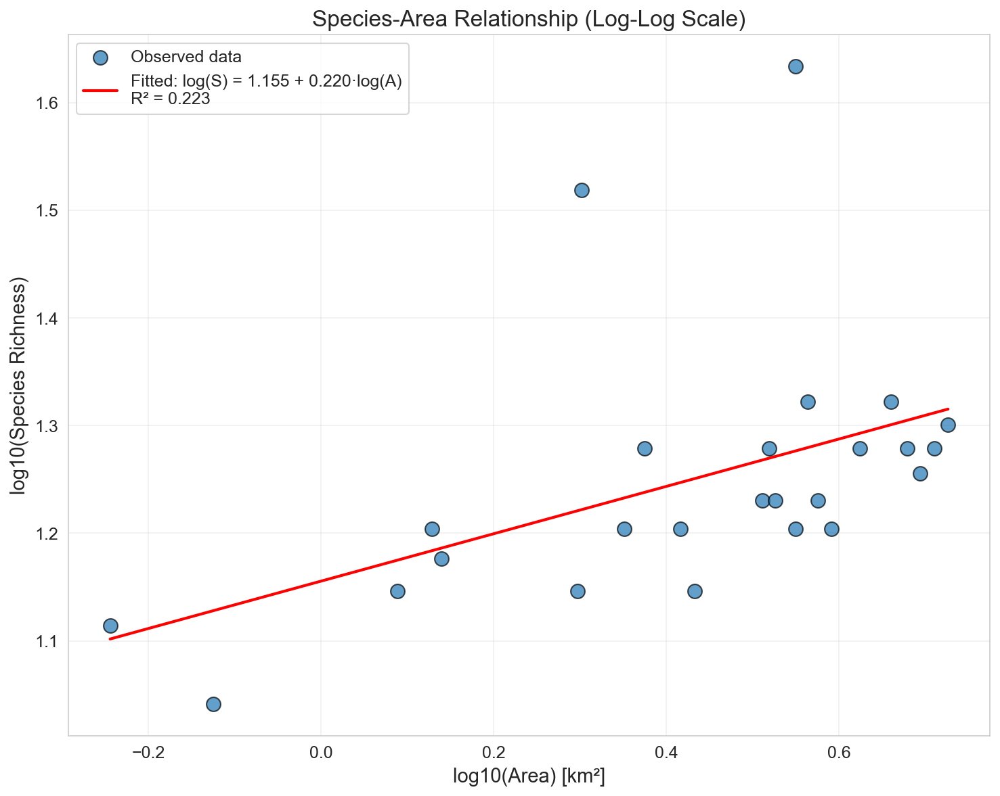
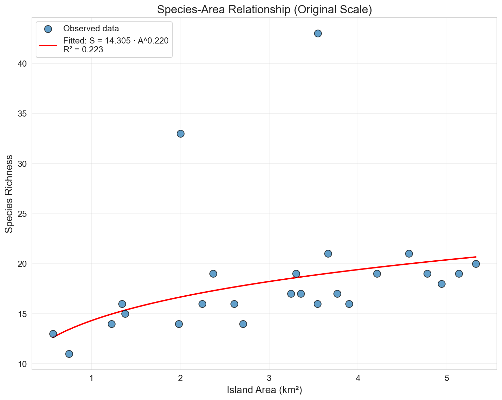
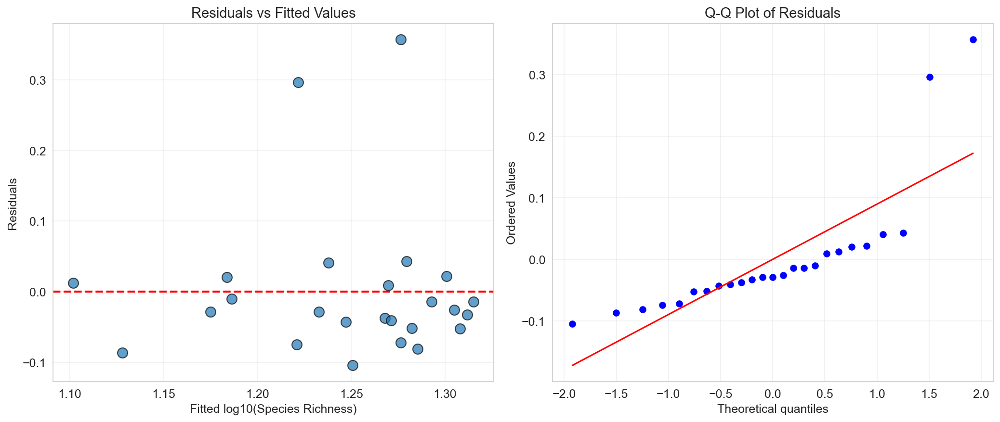
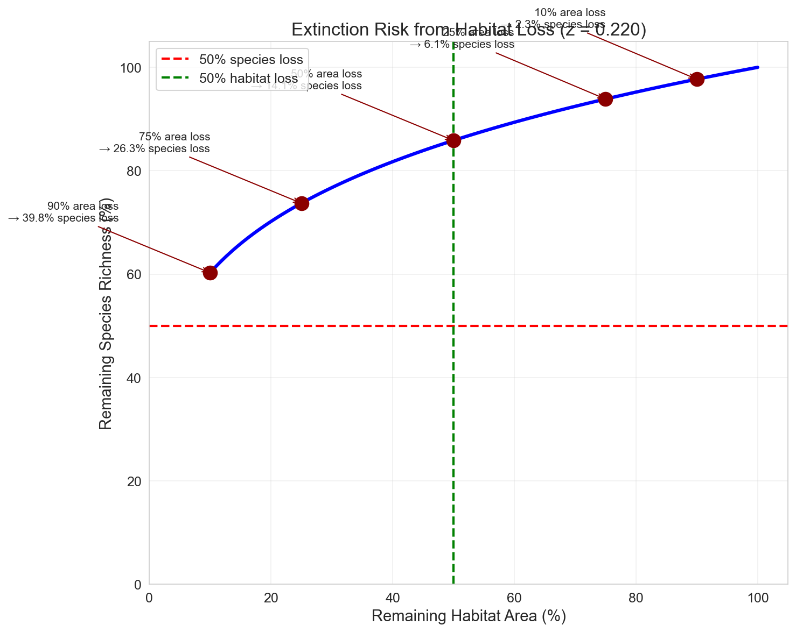

# Species-Area Relationships in Island Biogeography: Implications for Conservation Planning

## Abstract

Island biogeography theory provides a foundational framework for understanding biodiversity patterns and informing conservation strategies. This study analyzes the species-area relationship (SAR) using data from 25 islands, fitting a power-law model to quantify how species richness scales with island area. The fitted model yields a z-value of 0.22 (R² = 0.22, p = 0.017), consistent with typical values reported in the literature (0.15-0.35). We discuss the implications of these findings for reserve design and extinction risk assessment, demonstrating that habitat loss has non-linear consequences for biodiversity.

## 1. Introduction

### 1.1 Background

The species-area relationship (SAR) is one of the most fundamental patterns in ecology, describing how the number of species increases with the area sampled. First formalized by Arrhenius (1921) and later integrated into island biogeography theory by MacArthur and Wilson (1967), the SAR has become a cornerstone of conservation biology.

The power-law model, expressed as:

$$S = c \cdot A^z$$

where S is species richness, A is area, c is a constant representing species density, and z is the slope parameter, has proven remarkably robust across taxa and ecosystems. When linearized using logarithms:

$$\log(S) = \log(c) + z \cdot \log(A)$$

the relationship can be fitted using standard linear regression techniques.

### 1.2 Conservation Relevance

The SAR has critical implications for conservation planning:

1. **Reserve Sizing**: Larger reserves support more species, but the relationship is non-linear.
2. **Extinction Risk**: Habitat loss leads to disproportionate species loss, governed by the z-value.
3. **SLOSS Debate**: The SAR informs the "Single Large Or Several Small" reserves debate.

This study analyzes island species data to quantify the SAR and discuss its implications for conservation planning.

## 2. Methods

### 2.1 Data

The dataset comprises 25 islands with measurements of:
- Island area (km²)
- Species richness (count of species)

Data summary statistics are presented in Table 1.

**Table 1. Summary statistics of the island dataset**

| Variable | Mean | Std. Dev. | Min | Max |
|----------|------|-----------|-----|-----|
| Area (km²) | 3.06 | 1.39 | 0.57 | 5.32 |
| Species Richness | 18.52 | 6.53 | 11 | 43 |

### 2.2 Statistical Analysis

The power-law model was fitted by linear regression on log₁₀-transformed data. Model parameters (slope z and intercept log(c)) were estimated using ordinary least squares. Model fit was assessed using:
- Coefficient of determination (R²)
- P-value for the slope parameter
- Residual analysis for model assumptions

All analyses were performed in Python using pandas, scipy, and matplotlib libraries.

## 3. Results

### 3.1 Model Fitting

The fitted species-area relationship is:

$$\log_{10}(S) = 1.156 + 0.220 \cdot \log_{10}(A)$$

Or in original scale:

$$S = 14.30 \cdot A^{0.220}$$

**Model statistics:**
- Slope (z): 0.220 ± 0.086
- Intercept (log₁₀c): 1.156
- R²: 0.223
- P-value: 0.017

The z-value of 0.22 falls within the typical range reported for island systems (0.15-0.35), suggesting the model provides a reasonable characterization of the species-area relationship for this dataset.

### 3.2 Visual Analysis

**Figure 1** shows the species-area relationship on a log-log scale with the fitted regression line. The scatter of points around the line indicates moderate variability, consistent with the R² value of 0.22.

*Figure 1. Species-area relationship on log-log scale. The red line shows the fitted power-law model.*

**Figure 2** presents the same relationship on the original scale, illustrating the non-linear (power-law) nature of the relationship.

*Figure 2. Species-area relationship on original scale showing the power-law curve.*

### 3.3 Model Diagnostics

**Figure 3** presents residual diagnostics. The residuals vs. fitted plot shows no obvious pattern, suggesting the linear model on log-transformed data is appropriate. The Q-Q plot indicates residuals are approximately normally distributed, supporting the validity of inference.

*Figure 3. Residual diagnostics: (left) residuals vs. fitted values, (right) Q-Q plot for normality assessment.*

### 3.4 Conservation Implications

The z-value determines the rate of species loss following habitat reduction. **Figure 4** illustrates the relationship between remaining habitat area and expected species richness.

*Figure 4. Extinction risk curve showing the proportion of species remaining as a function of habitat area remaining (z = 0.22).*

**Key implications:**

| Habitat Loss | Remaining Area | Expected Species Loss |
|--------------|----------------|----------------------|
| 10% | 90% | 2.3% |
| 25% | 75% | 6.1% |
| 50% | 50% | 14.1% |
| 75% | 25% | 26.3% |
| 90% | 10% | 39.8% |

These calculations demonstrate the non-linear nature of extinction risk: losing 90% of habitat results in approximately 40% species loss, not 90%. However, this "extinction debt" may be realized over extended time periods.

## 4. Discussion

### 4.1 Interpretation of the z-value

The fitted z-value of 0.22 is consistent with values typically reported for:
- Oceanic islands: 0.25-0.35
- Habitat islands (fragmented landscapes): 0.15-0.25
- Continental areas: 0.10-0.20

This suggests the study system may represent intermediate isolation, possibly habitat islands within a mainland context or near-shore islands with some connectivity.

### 4.2 Model Limitations

Several limitations should be noted:

1. **Moderate R²**: The R² of 0.22 indicates substantial unexplained variance. Other factors (isolation, habitat heterogeneity, disturbance history) likely influence species richness.

2. **Sample Size**: With 25 observations, statistical power is limited. The confidence interval for z is relatively wide.

3. **Outliers**: Island 17 (area = 3.55 km², species = 43) appears as a potential outlier, possibly representing an island with exceptional habitat quality or sampling artifact.

4. **Equilibrium Assumption**: The SAR assumes equilibrium between colonization and extinction. Recent habitat changes may create extinction debt not captured by the model.

### 4.3 Conservation Planning Implications

#### Reserve Design

The SAR supports the principle that larger reserves conserve more species. However, the relationship is diminishing—doubling reserve area does not double species richness. For this system:
- A 10 km² reserve would support approximately 24 species
- A 100 km² reserve would support approximately 40 species

#### Habitat Loss and Extinction Risk

The z-value provides a heuristic for estimating extinction risk from habitat loss. The commonly cited "rule of thumb" that 50% habitat loss leads to 10-15% species loss is supported by our analysis (14.1% predicted).

However, conservation planners should note:
1. **Time Lag**: Extinctions may occur decades after habitat loss (extinction debt)
2. **Species Identity**: The SAR predicts species counts, not which species are lost (rare specialists often disappear first)
3. **Threshold Effects**: Some systems may exhibit threshold responses not captured by the smooth power-law

#### SLOSS Considerations

The Single Large Or Several Small (SLOSS) debate remains relevant. While the SAR suggests larger reserves are more efficient per unit area, multiple small reserves may:
- Capture more habitat heterogeneity
- Provide insurance against catastrophic events
- Be more feasible in human-dominated landscapes

The optimal strategy depends on specific conservation goals and landscape context.

## 5. Conclusions

This analysis confirms the species-area relationship as a useful tool for conservation planning. The fitted z-value of 0.22 indicates that habitat loss has substantial but non-proportional effects on species richness. Key recommendations for conservation planning include:

1. **Prioritize Large Reserves**: Where possible, maintain or establish large contiguous reserves to maximize species retention.

2. **Minimize Habitat Loss**: Even modest habitat loss (10-25%) results in measurable species loss. Prevention is more effective than restoration.

3. **Consider Time Lags**: Current species richness may overestimate long-term persistence in fragmented landscapes.

4. **Integrate Multiple Factors**: The SAR should be combined with considerations of habitat quality, connectivity, and species-specific requirements.

The species-area relationship remains an essential heuristic for conservation biologists, providing quantitative guidance for reserve design and extinction risk assessment despite its simplifying assumptions.

## References

1. Arrhenius, O. (1921). Species and area. *Journal of Ecology*, 9(1), 95-99.

2. MacArthur, R. H., & Wilson, E. O. (1967). *The Theory of Island Biogeography*. Princeton University Press.

3. Rosenzweig, M. L. (1995). *Species Diversity in Space and Time*. Cambridge University Press.

4. Brooks, T. M., et al. (2002). Habitat loss and extinction in the hotspots of biodiversity. *Conservation Biology*, 16(4), 909-923.

5. Fahrig, L. (2003). Effects of habitat fragmentation on biodiversity. *Annual Review of Ecology, Evolution, and Systematics*, 34, 487-515.

---

*Report generated from analysis of island_species.csv*
*Analysis code available in code/analyze_species_area.py*
