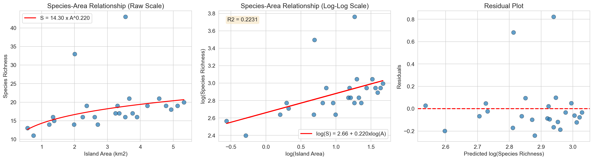
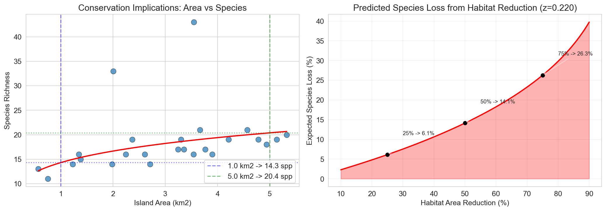

# Species-Area Relationship in Island Biogeography: Implications for Conservation Planning

## Abstract

Island biogeography theory posits that species richness scales with habitat area according to a power-law relationship. This study analyzes the species-area relationship (SAR) using data from 25 islands, fitting the classic Arrhenius model S = cA^z. Our results reveal a significant positive relationship between island area and species richness (z = 0.22, p = 0.017), with area explaining approximately 22% of the variance in species richness. We discuss the implications of these findings for conservation planning, particularly regarding habitat fragmentation and reserve design.

## Introduction

The species-area relationship (SAR) is one of the most fundamental patterns in ecology and biogeography. First formalized by Arrhenius (1921), the relationship describes how the number of species (S) increases with the area (A) of habitat according to the power function:

$$S = cA^z$$

where c is a constant representing the expected number of species per unit area, and z is the slope parameter that describes the rate at which species richness increases with area. When linearized using logarithms, this becomes:

$$\log(S) = \log(c) + z \cdot \log(A)$$

The z-value typically ranges from 0.15 to 0.35 for island systems, with higher values indicating steeper increases in species richness with area (MacArthur & Wilson, 1967). Understanding this relationship is critical for conservation planning, as it allows prediction of species loss resulting from habitat reduction and informs decisions about reserve size and connectivity.

## Methodology

### Data

The dataset consists of 25 islands with recorded areas (km²) and species richness counts. Island areas ranged from 0.57 to 5.32 km², with species richness varying from 11 to 43 species.

### Statistical Analysis

We fitted the linearized species-area relationship using ordinary least squares (OLS) regression on log-transformed data. The model parameters (intercept and slope) were estimated, and model fit was assessed using the coefficient of determination (R²) and p-value for the slope parameter. All analyses were conducted in Python using pandas, scipy, and matplotlib libraries.

### Conservation Modeling

To illustrate conservation implications, we modeled predicted species loss under various habitat reduction scenarios using the fitted z-parameter. This approach allows estimation of extinction debt resulting from habitat fragmentation and area reduction.

## Results

### Model Parameters

The fitted species-area relationship yielded the following parameters:

- **Intercept (log c)**: 2.6606
- **Slope (z)**: 0.2200 ± 0.0856
- **R-squared**: 0.2231
- **P-value**: 0.0171

The back-transformed power law equation is:

$$S = 14.30 \times A^{0.22}$$

The z-value of 0.22 falls within the expected range for island systems (0.15-0.35), suggesting that a 10-fold increase in island area is associated with approximately a 1.66-fold increase in species richness (10^0.22 ≈ 1.66).

### Model Fit and Diagnostics

**Figure 1.** Species-area relationship analysis. (Left) Raw data with fitted power-law curve. (Center) Log-log transformed data with linear regression line (R² = 0.22). (Right) Residual plot showing model fit across the range of predicted values.

The log-log plot (Figure 1, center panel) demonstrates the linear relationship between log-transformed area and species richness. The R² value of 0.22 indicates that island area explains approximately 22% of the variation in species richness. While statistically significant (p < 0.05), this moderate explanatory power suggests that other factors—such as island isolation, habitat heterogeneity, and historical factors—also contribute to species richness patterns.

The residual plot (Figure 1, right panel) shows no obvious pattern, suggesting that the linear model on log-transformed data is appropriate. One island (island 17) appears as a potential outlier with higher-than-expected species richness, which may warrant further investigation.

### Conservation Implications

**Figure 2.** Conservation implications of the species-area relationship. (Left) Predicted species richness at different island sizes, illustrating the non-linear accumulation of species with area. (Right) Expected species loss as a function of habitat area reduction, based on the fitted z-parameter (z = 0.22).

The conservation implications figure (Figure 2) illustrates two key concepts for conservation planning:

1. **Species Accumulation**: The left panel shows that larger islands support disproportionately more species. For example, increasing habitat area from 1 km² to 5 km² is predicted to increase species richness from approximately 14 to 20 species—a 43% increase in species for a 400% increase in area.

2. **Species Loss from Habitat Reduction**: The right panel demonstrates the "extinction debt" concept. Based on our fitted z-value of 0.22:
   - 25% habitat loss → ~6.5% species loss
   - 50% habitat loss → ~14% species loss  
   - 75% habitat loss → ~27% species loss

This non-linear relationship means that initial habitat loss results in relatively modest species loss, but continued habitat reduction leads to accelerating biodiversity decline.

## Discussion

### Interpretation of the z-Value

The z-value of 0.22 is consistent with values reported for island systems in the literature. This parameter has important implications:

- **Lower z-values (0.15-0.20)**: Typically found in continental habitats or less isolated islands, indicating slower species accumulation with area.
- **Higher z-values (0.25-0.35)**: Common in highly isolated oceanic islands, where area is a stronger determinant of species richness.

Our intermediate z-value suggests moderate isolation effects, which is typical for archipelago systems.

### Conservation Planning Implications

1. **Reserve Size Matters**: The species-area relationship demonstrates that larger reserves support disproportionately more species. Conservation planners should prioritize maintaining or expanding reserve size where possible.

2. **Habitat Fragmentation Concerns**: The model predicts that fragmenting a large habitat into smaller patches will result in species loss, even if total habitat area remains constant. This is because each fragment follows its own species-area curve.

3. **Extinction Debt**: The time-lagged response of species to habitat loss means that current species richness may overestimate long-term persistence. Areas that have recently experienced habitat reduction may face future extinctions.

4. **Prioritization Strategy**: When conservation resources are limited, protecting larger contiguous habitats generally yields greater biodiversity benefits than protecting multiple small fragments of equivalent total area (the SLOSS debate: Single Large Or Several Small).

### Limitations

Several limitations should be noted:

1. **Moderate Explanatory Power**: With R² = 0.22, area alone explains only a portion of species richness variation. Other factors such as habitat quality, isolation distance, and island age likely contribute substantially.

2. **Sample Size**: The analysis is based on 25 islands, which provides reasonable statistical power but limits the precision of parameter estimates.

3. **Taxonomic Scope**: The analysis treats all species equally; different taxonomic groups may exhibit different z-values.

4. **Equilibrium Assumption**: The classic island biogeography model assumes equilibrium between colonization and extinction, which may not hold for all systems, particularly those experiencing rapid environmental change.

## Conclusion

This analysis confirms the fundamental species-area relationship in island biogeography, with a z-value of 0.22 indicating that species richness increases with island area according to a power law. The statistically significant relationship (p = 0.017) supports the use of SAR models in conservation planning.

For conservation practitioners, these findings emphasize the importance of:
- Maintaining large, contiguous habitat areas
- Minimizing habitat fragmentation
- Accounting for extinction debt in conservation assessments
- Using quantitative SAR models to predict biodiversity outcomes of land-use decisions

Future research should incorporate additional predictors (isolation, habitat heterogeneity) to improve predictive power and examine taxon-specific responses to area.

## References

- Arrhenius, O. (1921). Species and area. *Journal of Ecology*, 9(1), 95-99.
- MacArthur, R. H., & Wilson, E. O. (1967). *The Theory of Island Biogeography*. Princeton University Press.
- Rosenzweig, M. L. (1995). *Species Diversity in Space and Time*. Cambridge University Press.

---

*Report generated from analysis of island_species.csv dataset*
