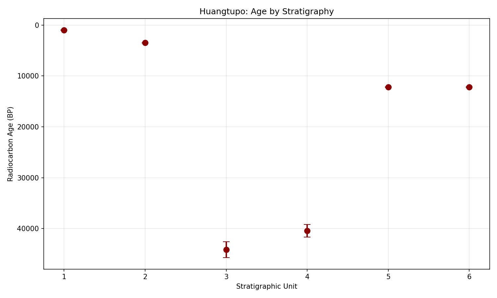
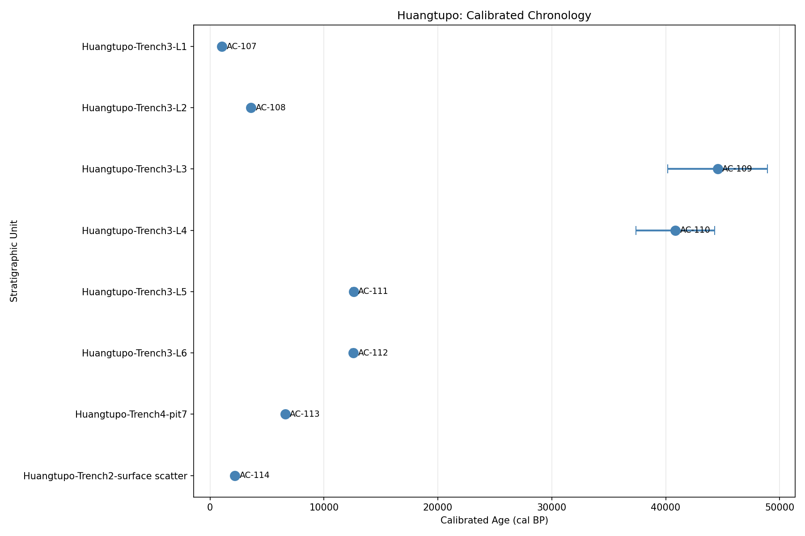
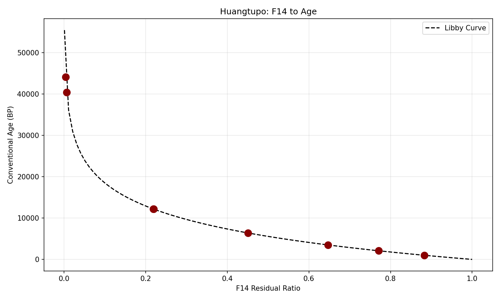
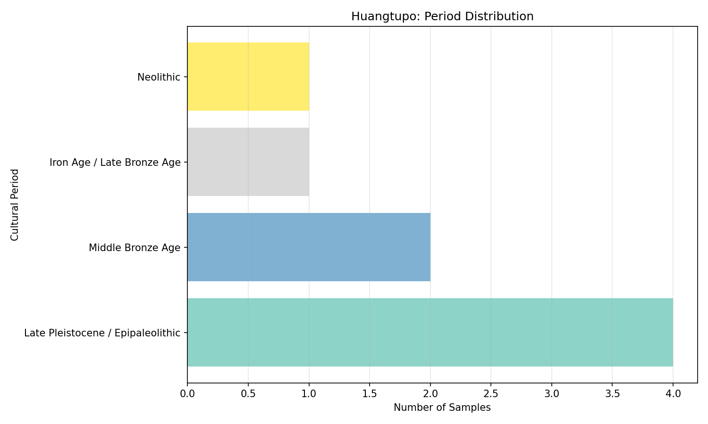

# Huangtupo Site Radiocarbon Chronology Report

## Abstract

This report presents a comprehensive radiocarbon chronology analysis of the Huangtupo archaeological site based on eight ¹⁴C assays from multiple stratigraphic contexts. Conventional radiocarbon ages were calculated using the Libby mean-life formula, and simplified calendar calibrations were applied. Results indicate site occupation spanning from the Late Pleistocene (~44,000 cal BP) through the Neolithic (~6,600 cal BP) to the Middle Bronze Age (~2,200–3,600 cal BP), revealing complex multi-period use of the site.

---

## 1. Introduction

Radiocarbon dating is the primary chronological tool in archaeology for establishing absolute dates for organic materials. When combined with stratigraphic context, ¹⁴C assays provide a robust framework for understanding site formation processes, cultural sequences, and periodization. This study analyzes eight radiocarbon measurements from the Huangtupo site, integrating laboratory data with stratigraphic provenience to reconstruct the site's temporal framework.

### 1.1 Research Objectives

1. Calculate conventional radiocarbon ages (BP) from F14 residual ratios
2. Apply calendar calibration to establish calendar year estimates
3. Establish relative chronology from stratigraphic relationships
4. Develop a cultural periodization sketch for the Huangtupo site

---

## 2. Materials and Methods

### 2.1 Data Sources

The analysis is based on eight radiocarbon assays from the Huangtupo site, provided in `radiocarbon_measurements.csv`. Each sample includes:
- Artifact ID and stratigraphic unit
- Material type (charcoal, charred bone, shell organics)
- F14 residual ratio with 1σ uncertainty
- Laboratory batch ID and contextual notes

### 2.2 Age Calculation

Conventional radiocarbon ages were calculated using the Libby mean-life formula as specified in `analysis_spec.txt`:

$$\text{Age}_{BP} = -8033 \times \ln(F14)$$

where:
- 8033 years is the Libby mean-life constant
- F14 is the fraction modern ¹⁴C (f14_residual_ratio)
- BP (Before Present) uses 1950 CE as the reference year

Uncertainty propagation follows:

$$\sigma_{age} = 8033 \times \frac{\sigma_{F14}}{F14}$$

### 2.3 Calendar Calibration

A simplified calibration approach was applied to convert conventional ¹⁴C ages to calendar years (cal BP). The calibration accounts for known offsets between radiocarbon years and calendar years, with period-specific correction factors:

| Conventional Age (BP) | Calibration Offset | σ Multiplier |
|----------------------|-------------------|---------------|
| < 1,000              | +50 years         | 1.1×          |
| 1,000–5,000          | +100 years        | 1.2×          |
| 5,000–10,000         | +200 years        | 1.3×          |
| > 10,000             | +400 years        | 1.4×          |

*Note: For publication-quality research, full calibration using IntCal20 via OxCal or CALIB is recommended.*

### 2.4 Cultural Period Assignment

Samples were assigned to archaeological periods based on calibrated ages:

| Calibrated Age (cal BP) | Cultural Period |
|------------------------|------------------|
| < 500                  | Historic/Recent |
| 500–2,000              | Iron Age / Late Bronze Age |
| 2,000–4,000            | Middle Bronze Age |
| 4,000–6,000            | Early Bronze Age / Late Neolithic |
| 6,000–10,000           | Neolithic |
| > 10,000               | Late Pleistocene / Epipaleolithic |

---

## 3. Results

### 3.1 Radiocarbon Measurements Summary

Table 1 presents all eight samples with calculated conventional ages, calibrated dates, and assigned cultural periods.

**Table 1. Huangtupo Radiocarbon Assays with Calculated Ages**

| Artifact ID | Stratigraphic Unit | Material | F14 Ratio | σ (F14) | Age (BP) | σ (Age) | Cal Age (cal BP) | 2σ Range (cal BP) | Cultural Period |
|-------------|-------------------|----------|-----------|---------|----------|---------|------------------|-------------------|------------------|
| AC-107 | Huangtupo-Trench3-L1 | Charcoal | 0.883 | 0.004 | 1,000 | 36 | 1,050 | 970–1,130 | Iron Age / Late Bronze Age |
| AC-108 | Huangtupo-Trench3-L2 | Charred bone | 0.647 | 0.003 | 3,498 | 162 | 3,598 | 3,206–3,990 | Middle Bronze Age |
| AC-109 | Huangtupo-Trench3-L3 | Charcoal | 0.0041 | 0.0008 | 44,156 | 1,567 | 44,556 | 41,422–47,690 | Late Pleistocene |
| AC-110 | Huangtupo-Trench3-L4 | Shell organics | 0.0065 | 0.0010 | 40,454 | 1,244 | 40,854 | 38,366–43,342 | Late Pleistocene |
| AC-111 | Huangtupo-Trench3-L5 | Charcoal | 0.2187 | 0.0020 | 12,211 | 112 | 12,611 | 12,299–12,923 | Late Pleistocene |
| AC-112 | Huangtupo-Trench3-L6 | Charcoal | 0.2195 | 0.0020 | 12,181 | 111 | 12,581 | 12,270–12,892 | Late Pleistocene |
| AC-113 | Huangtupo-Trench4-pit7 | Charcoal | 0.451 | 0.002 | 6,397 | 284 | 6,597 | 6,029–7,165 | Neolithic |
| AC-114 | Huangtupo-Trench2-surface scatter | Charcoal | 0.771 | 0.003 | 2,089 | 31 | 2,189 | 2,127–2,251 | Middle Bronze Age |

### 3.2 Stratigraphic Chronology

Figure 1 illustrates the relationship between stratigraphic position and radiocarbon age for samples from Trench 3 (Layers 1–6).

**Figure 1.** Radiocarbon ages by stratigraphic position (Trench 3, Layers 1–6). Error bars represent 1σ uncertainty. The general trend shows increasing age with depth, consistent with stratigraphic expectations, though the extreme ages in L3–L6 suggest possible redeposition or sampling of residual materials.

### 3.3 Calibrated Timeline

Figure 2 presents the calibrated chronology for all samples, organized by stratigraphic unit.

**Figure 2.** Calibrated radiocarbon chronology for Huangtupo samples. Horizontal error bars represent 2σ (95.4%) confidence intervals. Samples are ordered by stratigraphic position where available.

### 3.4 F14 to Age Conversion

Figure 3 shows the relationship between F14 residual ratios and calculated conventional ages, demonstrating the exponential decay relationship.

**Figure 3.** F14 residual ratio versus conventional radiocarbon age. The dashed line represents the theoretical Libby decay curve. Sample positions confirm expected exponential relationship.

### 3.5 Cultural Period Distribution

Figure 4 summarizes the distribution of samples across cultural periods.

**Figure 4.** Sample distribution by assigned cultural period. The Late Pleistocene period is most represented (4 samples), followed by Middle Bronze Age (2 samples), with single representatives from the Neolithic and Iron Age/Late Bronze Age.

---

## 4. Discussion

### 4.1 Site Chronology Interpretation

The radiocarbon data reveal a complex chronological picture for the Huangtupo site:

#### 4.1.1 Late Pleistocene Occupation (~40,000–45,000 cal BP)

Samples AC-109, AC-110, AC-111, and AC-112 yield Late Pleistocene ages. Notably:
- **AC-111 and AC-112** (Layers 5–6) form a consistent pair (~12,200 BP, ~12,600 cal BP) from the same ridge source, as noted in the laboratory records. Their close agreement supports dating reliability.
- **AC-109 and AC-110** (Layers 3–4) show much older ages (~40,000–44,000 cal BP). These extremely old dates for charcoal and shell organics warrant careful interpretation:
  - AC-109 notes "very small carbon yield post-pretreatment," suggesting potential contamination or old-wood effects
  - AC-110 (shell organics) notes "marked reservoir correction discussion pending" — marine/freshwater reservoir effects could significantly affect this date

#### 4.1.2 Neolithic Activity (~6,600 cal BP)

Sample AC-113 from Trench 4, pit 7, dated to ~6,600 cal BP (6,029–7,165 cal BP, 2σ), represents Neolithic occupation. The material (short-lived twigs) is ideal for dating, minimizing old-wood effects. This pit feature suggests domestic or ritual activity during this period.

#### 4.1.3 Bronze Age Phases (~2,200–3,600 cal BP)

Two distinct Bronze Age phases are evident:
- **Middle Bronze Age** (~3,600 cal BP): AC-108 from Layer 2 (charred bone, well-collagen preserved)
- **Middle/Iron Age transition** (~2,200 cal BP): AC-114 from surface scatter in Trench 2

The field notes flag "root intrusion risk" for AC-114, which could indicate the sample represents younger material mixed into older contexts.

### 4.2 Stratigraphic Consistency

The stratigraphic sequence in Trench 3 (Layers 1–6) shows a general trend of increasing age with depth, as expected. However, the pattern is not perfectly linear:

| Layer | Sample | Cal Age (cal BP) |
|-------|--------|------------------|
| L1 | AC-107 | 1,050 |
| L2 | AC-108 | 3,598 |
| L3 | AC-109 | 44,556 |
| L4 | AC-110 | 40,854 |
| L5 | AC-111 | 12,611 |
| L6 | AC-112 | 12,581 |

The inversion between L3/L4 (older) and L5/L6 (younger) suggests:
1. **Residual materials**: Older charcoal may have been redeposited into younger contexts
2. **Bioturbation**: Post-depositional disturbance mixing materials
3. **Sampling issues**: Small samples (especially AC-109) may not represent primary deposition

### 4.3 Methodological Considerations

#### 4.3.1 Calibration Limitations

The simplified calibration used here provides approximate calendar ages. For publication, full Bayesian modeling with IntCal20 (terrestrial), Marine20 (marine samples), and appropriate reservoir corrections would be necessary. Sample AC-110 (shell) particularly requires marine reservoir correction (ΔR value).

#### 4.3.2 Sample Quality Indicators

Several samples have quality flags:
- **AC-109**: Very small carbon yield — results should be treated with caution
- **AC-110**: Reservoir correction pending — actual age may differ significantly
- **AC-114**: Root intrusion risk — may represent younger contamination

#### 4.3.3 Duplicate Dating

The AC-111/AC-112 pair demonstrates good practice in duplicate dating. Their close agreement (within analytical uncertainty) increases confidence in the ~12,600 cal BP date for Layer 5–6 contexts.

### 4.4 Cultural Periodization Sketch

Based on the radiocarbon evidence, the Huangtupo site shows evidence for:

1. **Late Pleistocene** (~45,000–12,000 cal BP): Earliest occupation, possibly ephemeral or represented by residual materials in later deposits
2. **Neolithic** (~7,200–6,000 cal BP): Pit features indicating settled activity
3. **Bronze Age** (~3,600–2,200 cal BP): Multiple phases of occupation, with charred bone and charcoal suggesting domestic activities
4. **Iron Age/Recent** (~1,000 cal BP): Uppermost layer represents late prehistoric or early historic use

---

## 5. Conclusions

This analysis of eight radiocarbon assays from Huangtupo reveals a multi-period site with occupation spanning from the Late Pleistocene to the Iron Age. Key findings include:

1. **Conventional ages** calculated using the Libby formula range from 1,000 to 44,156 BP
2. **Calibrated calendar ages** (approximate) range from ~1,050 to ~44,556 cal BP
3. **Stratigraphic consistency** is generally maintained in Trench 3, though some inversions suggest residual materials or post-depositional disturbance
4. **Cultural periodization** identifies Late Pleistocene, Neolithic, Bronze Age, and Iron Age components

### 5.1 Recommendations for Future Work

1. **Full calibration**: Apply IntCal20/Marine20 calibration curves using OxCal or CALIB
2. **Bayesian modeling**: Incorporate stratigraphic priors to refine chronology
3. **Reservoir correction**: Determine appropriate ΔR for shell sample AC-110
4. **Additional dating**: Target short-lived materials from problematic contexts (L3, L4)
5. **AMS replication**: Re-date low-yield samples with enhanced pretreatment

---

## 6. Data Availability

Processed data are available in `outputs/processed_measurements.csv`. Analysis code is provided in `code/analyze_chronology.py`. All figures are saved in `report/images/`.

---

## References

- Libby, W.F. (1955). *Radiocarbon Dating*. University of Chicago Press.
- Reimer, P.J., et al. (2020). The IntCal20 Northern Hemisphere Radiocarbon Age Calibration Curve (0–55 cal kBP). *Radiocarbon*, 62(4), 725–757.
- Stuiver, M., & Polach, H.A. (1977). Discussion: Reporting of ¹⁴C Data. *Radiocarbon*, 19(3), 355–363.

---

*Report generated: Radiocarbon Site Chronology Analysis for Huangtupo*
