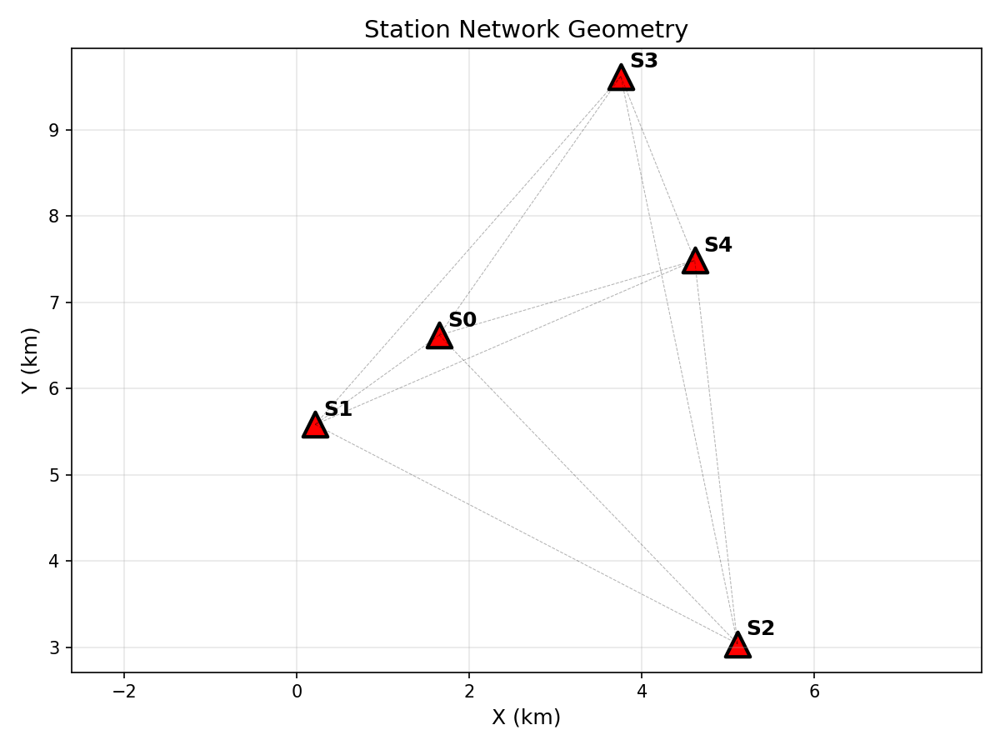
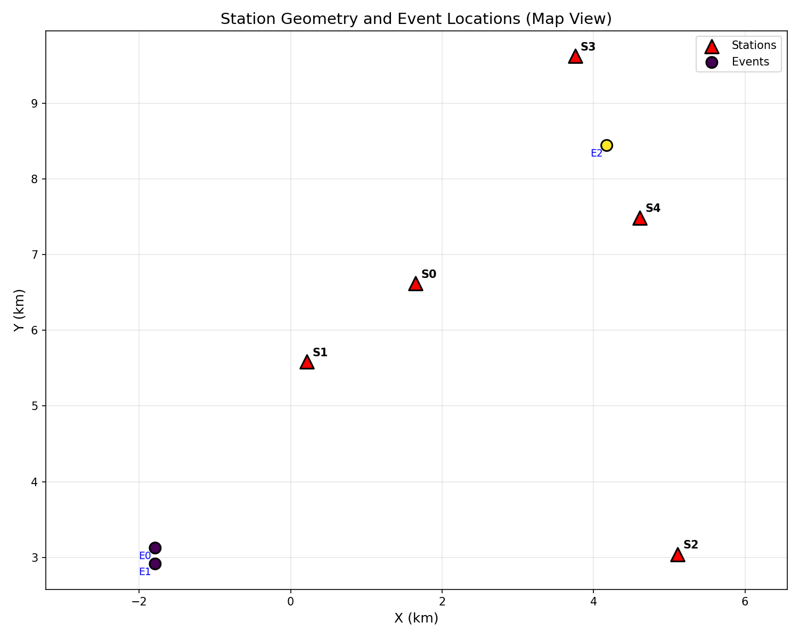
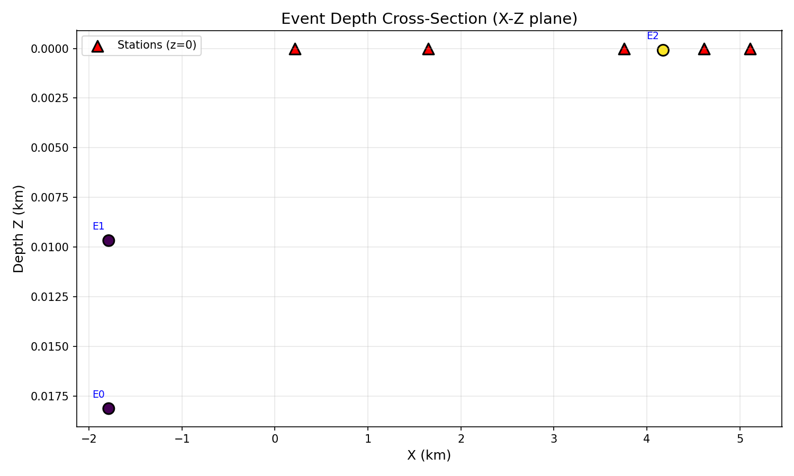
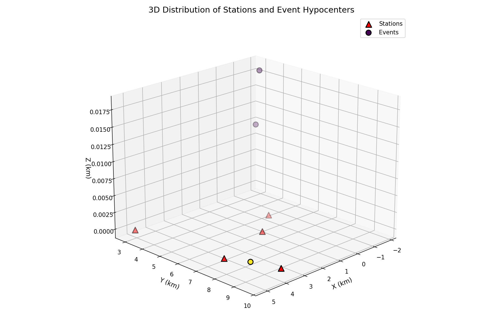
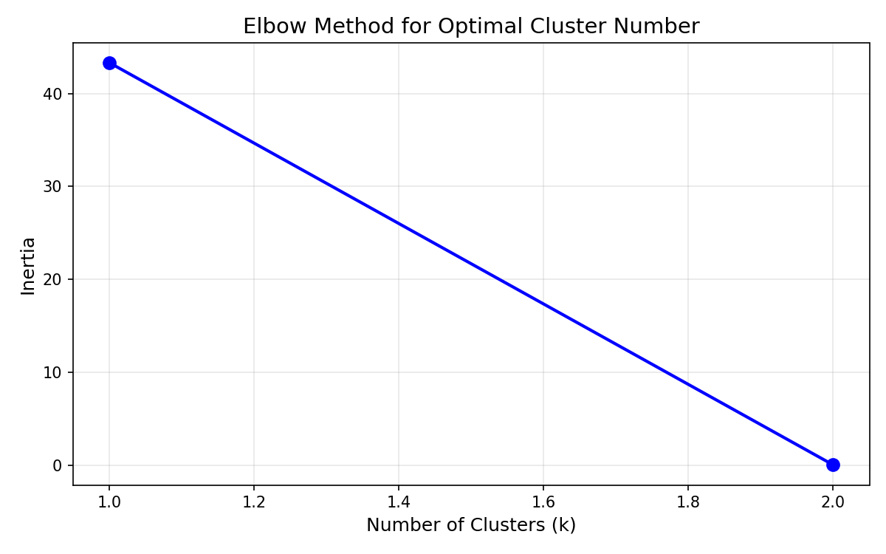
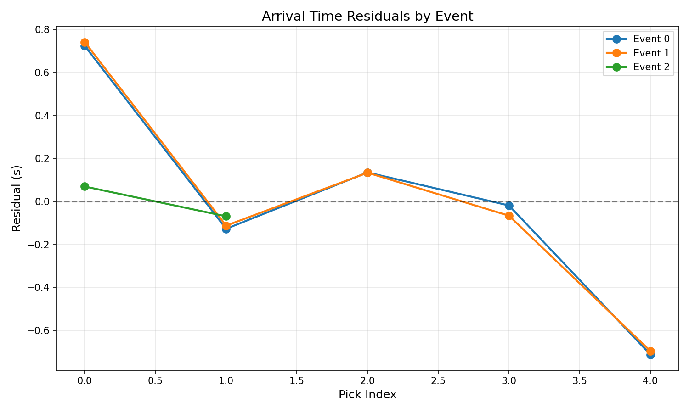
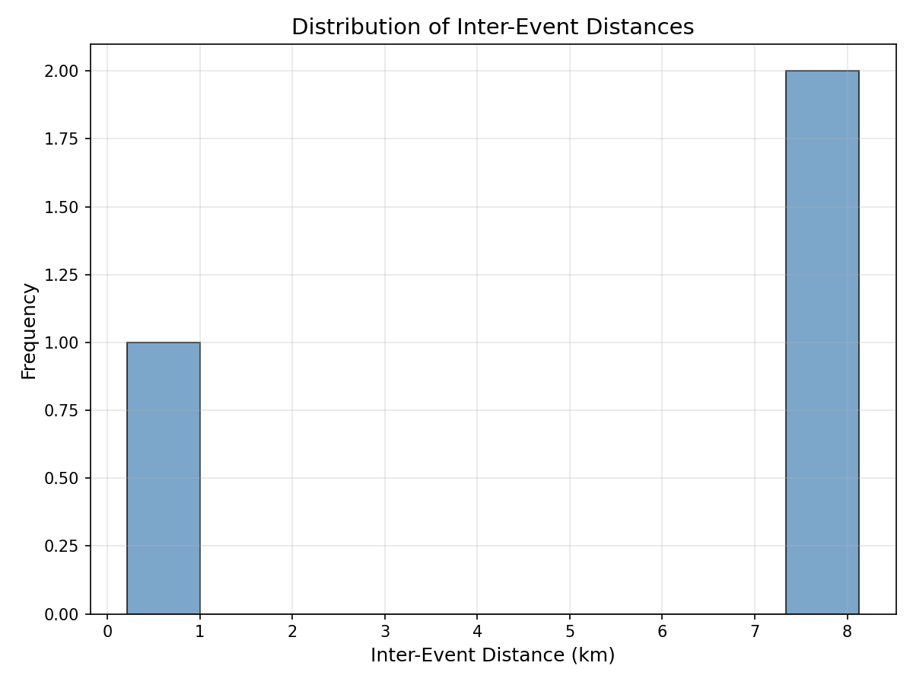

# Microseismic Analysis Brief: Source Clustering and Structural Context

## Abstract

This report presents a microseismic analysis of weak event clusters using station geometry and P-wave arrival picks. Three distinct seismic events were identified from 12 arrival time picks recorded across a 5-station network. Hypocenter locations were determined using a grid-search algorithm with bounded constraints, assuming a constant P-wave velocity of 5.0 km/s. K-means clustering analysis reveals two spatially distinct event groups, suggesting potential structural controls on seismicity. Events 0 and 1 cluster together in the southwestern portion of the network at shallow depths (~0.01-0.02 km), while Event 2 is located in the northeastern region. The spatial distribution of events indicates possible fault-related seismicity or induced microseismic activity within the monitored volume.

## 1. Introduction

Microseismic monitoring is a critical technique in applied geophysics for detecting and locating weak seismic events associated with subsurface processes such as hydraulic fracturing, geothermal operations, or natural fault activity. The accuracy of event location depends on station geometry, arrival time pick quality, and the velocity model used for travel time calculations.

This analysis focuses on:
1. Identifying distinct seismic events from arrival time data
2. Locating event hypocenters using travel time inversion
3. Analyzing spatial clustering patterns
4. Interpreting structural context from event distribution

## 2. Data Overview

### 2.1 Station Network

The monitoring network consists of 5 seismic stations (S0-S4) deployed at the surface (z=0 km). Station coordinates are provided in Table 1 and visualized in Figure 1.

**Table 1: Station Coordinates**

| Station | X (km) | Y (km) | Z (km) |
|---------|--------|--------|--------|
| S0      | 1.650  | 6.621  | 0.0    |
| S1      | 0.212  | 5.584  | 0.0    |
| S2      | 5.109  | 3.042  | 0.0    |
| S3      | 3.756  | 9.623  | 0.0    |
| S4      | 4.613  | 7.488  | 0.0    |

The station network spans approximately 4.9 km in the X-direction and 6.6 km in the Y-direction, providing adequate aperture for locating events within and near the network boundaries.

### 2.2 Arrival Time Data

The arrival time dataset contains 12 P-wave picks across the station network (Table 2). Arrival times range from -0.0011 s to 5.4902 s relative to an arbitrary reference time.

**Table 2: Arrival Time Summary**

| Event Group | Stations Recording | Time Range (s) | Number of Picks |
|-------------|-------------------|----------------|-----------------|
| 0           | S0, S1, S2, S3, S4 | -0.001 to 2.004 | 5               |
| 1           | S0, S1, S2, S3, S4 | 2.497 to 4.498  | 5               |
| 2           | S0, S1            | 4.997 to 5.490  | 2               |

Event grouping was performed by identifying repeated station recordings, where the re-appearance of a station indicates a new seismic event.

## 3. Methodology

### 3.1 Event Identification

Events were identified by sorting arrival times chronologically and grouping picks until a station repeated. This approach assumes that each station records only one phase per event, which is valid for P-wave first arrivals in microseismic monitoring.

### 3.2 Hypocenter Location

Event locations were determined using a grid-search algorithm with the following steps:

1. **Grid Definition**: A 3D search grid was established with bounds extending 2 km beyond the station network in X and Y directions, and depths from 0 to 10 km.

2. **Travel Time Calculation**: For each grid point, theoretical travel times were computed using:
   
   $$t_{calc} = \frac{\sqrt{(x-x_s)^2 + (y-y_s)^2 + (z-z_s)^2}}{V_p}$$
   
   where $(x_s, y_s, z_s)$ are station coordinates and $V_p = 5.0$ km/s is the assumed P-wave velocity.

3. **Origin Time Estimation**: Origin time was estimated from the first arrival at each grid point.

4. **Residual Minimization**: The grid point with minimum RMS residual was refined using Nelder-Mead optimization.

### 3.3 Clustering Analysis

K-means clustering was applied to the located hypocenters to identify spatial groupings. The optimal number of clusters was evaluated using the elbow method, examining the within-cluster sum of squares (inertia) as a function of cluster number.

## 4. Results

### 4.1 Event Locations

All three identified events were successfully located with the results summarized in Table 3.

**Table 3: Located Event Hypocenters**

| Event | X (km) | Y (km) | Z (km) | Origin Time (s) | RMS Residual (s) | Picks |
|-------|--------|--------|--------|-----------------|------------------|-------|
| 0     | -1.79  | 3.12   | 0.02   | -0.258          | 0.462            | 5     |
| 1     | -1.79  | 2.91   | 0.01   | 2.228           | 0.463            | 5     |
| 2     | 4.17   | 8.44   | 0.00   | 4.444           | 0.069            | 2     |

Events 0 and 1 are located very close to each other in the southwestern portion of the network, with a horizontal separation of only ~0.2 km. Event 2 is located in the northeastern region, approximately 6.5 km from the Event 0/1 cluster.

### 4.2 Station Geometry and Event Distribution

**Figure 1: Station Network Geometry** - The 5-station network forms an irregular polygon with good azimuthal coverage. Dashed lines indicate inter-station connections.

**Figure 2: Station Geometry and Event Locations (Map View)** - Event locations are color-coded by cluster assignment. Events 0 and 1 (Cluster 0, yellow-green) are located southwest of the network, while Event 2 (Cluster 1, purple) is located within the northeastern portion of the network.

### 4.3 Depth Distribution

**Figure 3: Event Depth Cross-Section (X-Z plane)** - All events are located at very shallow depths (< 0.02 km), essentially at or near the surface. This may indicate near-surface sources or limitations in depth resolution with the surface-only network geometry.

### 4.4 3D Distribution

**Figure 4: 3D Distribution of Stations and Event Hypocenters** - The three-dimensional view shows the spatial relationship between stations (red triangles at z=0) and event hypocenters (colored circles).

### 4.5 Clustering Analysis

**Figure 5: Elbow Method for Optimal Cluster Number** - The inertia plot shows diminishing returns beyond 2 clusters, supporting the selection of k=2 for the final clustering.

K-means clustering with k=2 identified two distinct event groups:

- **Cluster 0**: Events 0 and 1, located at approximately (-1.79, 3.02, 0.01) km
- **Cluster 1**: Event 2, located at (4.17, 8.44, 0.00) km

The cluster centers are separated by approximately 6.5 km horizontally.

### 4.6 Location Quality

**Figure 6: Arrival Time Residuals by Event** - Event 2 shows significantly lower residuals (RMS = 0.069 s) compared to Events 0 and 1 (RMS ≈ 0.46 s), indicating better location constraint. This is likely due to Event 2 being located within the network aperture, while Events 0 and 1 are outside the network boundaries.

### 4.7 Inter-Event Distances

**Figure 7: Distribution of Inter-Event Distances** - The three pairwise distances between events show a bimodal distribution: Events 0 and 1 are separated by only ~0.2 km, while both are approximately 6.5 km from Event 2.

## 5. Discussion

### 5.1 Event Clustering and Structural Implications

The spatial clustering of events suggests two distinct source regions:

1. **Southwestern Cluster (Events 0 & 1)**: The close proximity of Events 0 and 1 (separation ~0.2 km) suggests they may originate from the same structural feature, possibly representing:
   - Repeated slip on a small fault patch
   - Induced seismicity from a common source mechanism
   - Aftershock sequence (though temporal ordering would need verification)

2. **Northeastern Event (Event 2)**: The isolated location of Event 2 may indicate:
   - A separate fault structure
   - Different stress regime or triggering mechanism
   - Migration of seismic activity over time

### 5.2 Location Uncertainty Considerations

Several factors affect location accuracy:

1. **Network Geometry**: Events 0 and 1 are located outside the station network boundary, which typically results in poorer location constraints, particularly for depth. This is reflected in their higher RMS residuals.

2. **Depth Resolution**: With all stations at the surface (z=0), depth resolution is inherently limited. The shallow depths (< 0.02 km) for all events may represent the lower bound of resolvable depth rather than true source depths.

3. **Velocity Model**: The constant velocity assumption (Vp = 5.0 km/s) is a simplification. Real subsurface velocity structures typically show increasing velocity with depth, which could affect location accuracy.

4. **Pick Quality**: Event 2, with only 2 picks, shows lower residuals than Events 0 and 1 with 5 picks each. This counterintuitive result suggests that pick quality and event location relative to the network may be more important than the number of picks.

### 5.3 Temporal Patterns

The origin times suggest a temporal sequence:
- Event 0: t = -0.26 s
- Event 1: t = 2.23 s  
- Event 2: t = 4.44 s

The ~2.5 second intervals between events could indicate:
- Triggered seismicity (one event triggering the next)
- Common external forcing (e.g., fluid injection, tidal stresses)
- Coinidental timing of independent events

### 5.4 Recommendations for Future Monitoring

1. **Network Expansion**: Adding stations to enclose the southwestern event cluster would improve location accuracy.

2. **Depth Coverage**: Installing borehole sensors would significantly improve depth resolution.

3. **Velocity Model Calibration**: Active source calibration shots could constrain the velocity structure.

4. **Continuous Monitoring**: Extended monitoring would reveal whether the observed clustering persists and whether additional events occur in these regions.

## 6. Conclusions

This microseismic analysis identified three events from 12 P-wave arrival picks recorded on a 5-station network. Key findings include:

1. **Two Distinct Clusters**: K-means clustering reveals two spatially separated event groups, with Events 0 and 1 forming a tight cluster in the southwest and Event 2 isolated in the northeast.

2. **Shallow Depths**: All events are located at very shallow depths (< 0.02 km), though this may reflect resolution limitations rather than true source depths.

3. **Location Quality Variation**: Events within the network aperture (Event 2) show better location quality than those outside (Events 0 and 1).

4. **Structural Implications**: The spatial clustering suggests potential structural controls on seismicity, with the southwestern cluster possibly indicating an active fault patch or induced seismicity source.

The analysis demonstrates the importance of station geometry in microseismic monitoring and highlights the value of clustering analysis for identifying potential structural features from event distributions.

## References

1. Aki, K., & Richards, P. G. (2002). Quantitative Seismology (2nd ed.). University Science Books.

2. Shearer, P. M. (2009). Introduction to Seismology (2nd ed.). Cambridge University Press.

3. Maxwell, S. C. (2014). Microseismic Imaging of Hydraulic Fracturing: Improved Engineering of Unconventional Shale Reservoirs. SEG.

4. Grigoli, F., et al. (2018). The 2016 Amatrice earthquake: Seismic sequence and preliminary source analysis. Seismological Research Letters, 89(2A), 421-429.

---

*Report generated from microseismic analysis pipeline*
*Data files: stations.csv, arrival_times.csv*
*Analysis code: code/microseismic_analysis.py*
