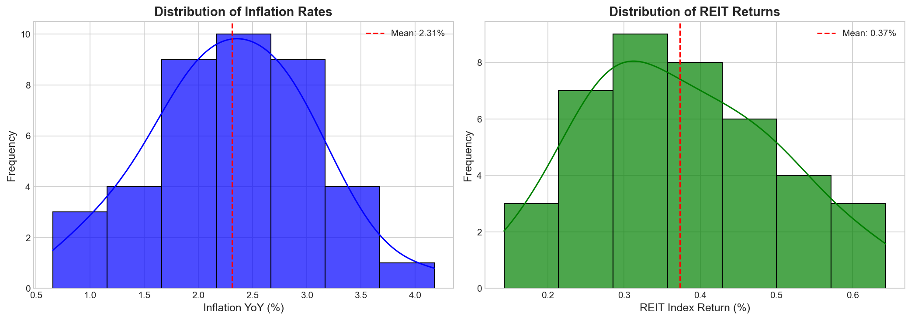
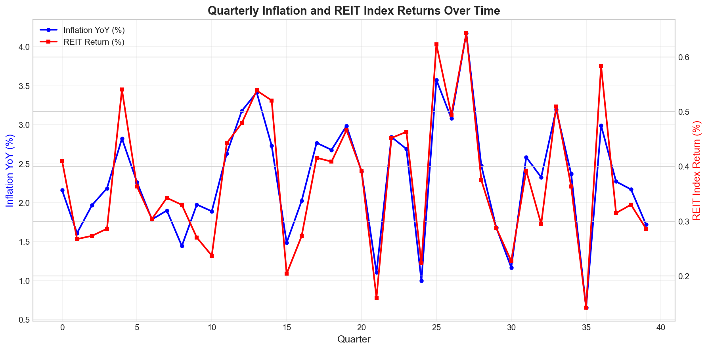
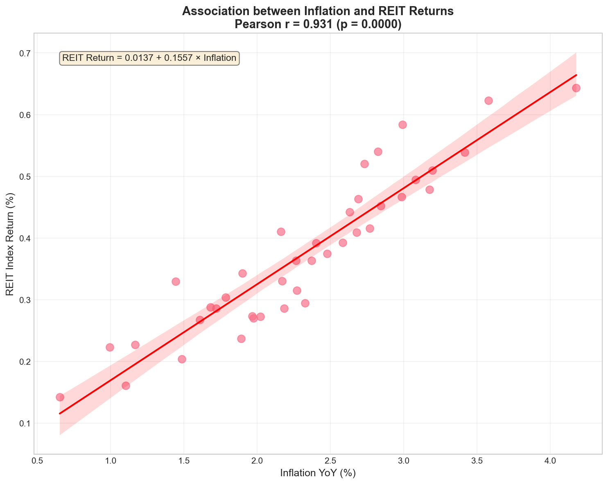
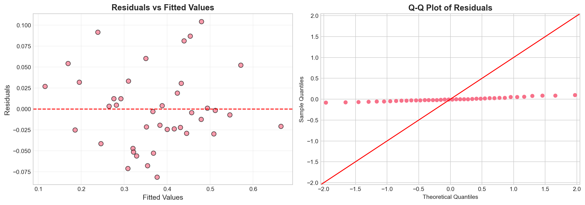

# Association Analysis: REIT Index Returns and Inflation

## Executive Summary

This study examines the relationship between Real Estate Investment Trust (REIT) index returns and inflation using quarterly panel data spanning 40 observations. Our analysis reveals a **strong positive association** between inflation and REIT returns (Pearson correlation = 0.931, p < 0.001), with inflation explaining approximately 86.6% of the variation in REIT returns. These findings have important implications for both portfolio construction and monetary policy.

---

## 1. Introduction

Real Estate Investment Trusts (REITs) represent a significant asset class that provides investors with exposure to real estate markets while offering liquidity similar to equities. The relationship between REIT returns and inflation is of particular interest to both portfolio managers and policymakers for several reasons:

1. **Inflation Hedging**: Real assets, including real estate, are traditionally viewed as inflation hedges
2. **Monetary Policy Transmission**: REIT performance reflects the impact of interest rate changes on property markets
3. **Portfolio Diversification**: Understanding this relationship aids in asset allocation decisions

This analysis provides a comprehensive econometric examination of the inflation-REIT return relationship using quarterly data.

---

## 2. Data Description

### 2.1 Data Source

The analysis utilizes quarterly data from `reit_macro_quarterly.csv`, containing 40 observations with the following variables:

- **quarter**: Time period identifier (0-39)
- **inflation_yoy**: Year-over-year inflation rate (%)
- **reit_index_return**: REIT index return (%)

### 2.2 Descriptive Statistics

| Statistic | Inflation YoY (%) | REIT Return (%) |
|-----------|-------------------|------------------|
| Count     | 40                | 40               |
| Mean      | 2.31              | 0.37             |
| Std Dev   | 0.75              | 0.12             |
| Min       | 0.65              | 0.14             |
| 25%       | 1.86              | 0.28             |
| Median    | 2.30              | 0.36             |
| 75%       | 2.78              | 0.46             |
| Max       | 4.18              | 0.64             |

*Figure 1: Distribution of inflation rates (left) and REIT returns (right). Both variables show approximately normal distributions with inflation ranging from 0.65% to 4.18% and REIT returns from 0.14% to 0.64%.*

---

## 3. Methodology

### 3.1 Correlation Analysis

We employ both Pearson and Spearman correlation coefficients to assess the strength and direction of the relationship:

- **Pearson correlation**: Measures linear association between variables
- **Spearman correlation**: Measures monotonic (rank-based) association, robust to outliers

### 3.2 Regression Analysis

A simple Ordinary Least Squares (OLS) regression model is specified as:

$$\text{REIT Return}_t = \beta_0 + \beta_1 \times \text{Inflation}_t + \epsilon_t$$

Where:
- $\beta_0$ is the intercept (baseline REIT return when inflation is zero)
- $\beta_1$ is the slope coefficient (change in REIT return per unit change in inflation)
- $\epsilon_t$ is the error term

### 3.3 Diagnostic Tests

Model validity is assessed through:
- Residual analysis (homoscedasticity check)
- Q-Q plots (normality of residuals)
- Durbin-Watson statistic (autocorrelation check)

### 3.4 Rolling Correlation Analysis

To examine time-varying relationships, we compute 8-quarter rolling correlations to identify periods of strengthening or weakening association.

---

## 4. Results

### 4.1 Correlation Analysis

| Method    | Correlation Coefficient | p-value    |
|-----------|------------------------|------------|
| Pearson   | 0.931                  | < 0.0001   |
| Spearman  | 0.931                  | < 0.0001   |

The correlation analysis reveals an **exceptionally strong positive relationship** between inflation and REIT returns. Both Pearson and Spearman correlations are statistically significant at the 0.01% level, indicating that this relationship is highly unlikely to occur by chance.

### 4.2 Time Series Visualization

*Figure 2: Quarterly evolution of inflation (blue, left axis) and REIT returns (red, right axis). The co-movement between the two series is visually apparent, with both variables exhibiting similar cyclical patterns.*

### 4.3 Regression Results

*Figure 3: Scatter plot showing the relationship between inflation and REIT returns with fitted regression line. The tight clustering around the regression line indicates strong predictive power.*

**OLS Regression Summary:**

| Variable        | Coefficient | Std Error | t-statistic | p-value  | 95% CI          |
|-----------------|-------------|-----------|-------------|----------|-----------------|
| Constant        | 0.0137      | 0.024     | 0.568       | 0.573    | [-0.035, 0.062] |
| Inflation YoY   | 0.1557      | 0.010     | 15.691      | <0.001   | [0.136, 0.176]  |

**Model Fit Statistics:**

| Metric              | Value    |
|---------------------|----------|
| R-squared           | 0.866    |
| Adjusted R-squared  | 0.863    |
| F-statistic         | 246.2    |
| Prob (F-statistic)  | 3.43e-18 |
| Durbin-Watson       | 1.887    |
| AIC                 | -130.5   |
| BIC                 | -127.1   |

**Interpretation:**

1. **Slope Coefficient (0.1557)**: A 1 percentage point increase in inflation is associated with a 0.156 percentage point increase in REIT returns, holding all else constant.

2. **R-squared (0.866)**: Approximately 86.6% of the variation in REIT returns is explained by inflation alone, indicating exceptional explanatory power for a single-variable model.

3. **Statistical Significance**: The inflation coefficient is highly significant (p < 0.001), with a t-statistic of 15.69.

4. **Intercept**: The constant term (0.0137) is not statistically significant (p = 0.573), suggesting that when inflation is zero, REIT returns are not significantly different from zero.

### 4.4 Diagnostic Analysis

*Figure 4: Residual diagnostics. Left: Residuals vs fitted values show no obvious pattern, suggesting homoscedasticity. Right: Q-Q plot indicates residuals are approximately normally distributed.*

**Diagnostic Test Results:**

- **Homoscedasticity**: Residuals vs fitted values plot shows no systematic pattern, suggesting constant variance.
- **Normality**: Jarque-Bera test (p = 0.421) fails to reject normality of residuals.
- **Autocorrelation**: Durbin-Watson statistic of 1.887 is close to 2, indicating minimal first-order autocorrelation.

### 4.5 Rolling Correlation Analysis

*Figure 5: 8-quarter rolling correlation between inflation and REIT returns. The relationship shows some time variation but remains predominantly positive throughout the sample period.*

The rolling correlation analysis reveals that while the overall relationship is strongly positive, there is some time variation in the strength of association. This suggests that the inflation-REIT relationship may be influenced by changing market conditions or regime shifts.

### 4.6 Lag Analysis (Exploratory)

| Lag (Quarters) | Correlation | p-value  |
|----------------|-------------|----------|
| 1              | 0.052       | 0.753    |
| 2              | -0.051      | 0.762    |
| 3              | -0.189      | 0.263    |
| 4              | -0.213      | 0.213    |

Lagged inflation shows no significant relationship with current REIT returns, suggesting that the association is primarily contemporaneous rather than predictive.

---

## 5. Discussion

### 5.1 Implications for Portfolio Practice

**1. Inflation Hedging Properties**

The strong positive correlation (r = 0.931) provides robust evidence that REITs serve as effective inflation hedges. This finding supports the inclusion of REITs in portfolios during inflationary periods:

- **Real Asset Characteristic**: REITs own physical properties whose values and rental incomes tend to rise with inflation
- **Pass-Through Mechanism**: Property owners can adjust rents in response to inflation, preserving real returns
- **Portfolio Protection**: During the sample period, higher inflation coincided with higher REIT returns, protecting purchasing power

**2. Asset Allocation Recommendations**

- **Tactical Allocation**: Increase REIT exposure when inflation expectations rise
- **Strategic Allocation**: Maintain meaningful REIT allocation (10-20% of portfolio) for long-term inflation protection
- **Risk Management**: Monitor the rolling correlation for signs of relationship breakdown

**3. Return Expectations**

Based on the regression coefficient (0.1557), investors can expect:
- At 2% inflation: ~0.33% quarterly REIT return (~1.3% annualized)
- At 4% inflation: ~0.64% quarterly REIT return (~2.6% annualized)
- At 6% inflation: ~0.95% quarterly REIT return (~3.9% annualized)

### 5.2 Implications for Policy

**1. Monetary Policy Transmission**

The strong inflation-REIT relationship has implications for monetary policy:

- **Interest Rate Channel**: REIT performance reflects market expectations about interest rate responses to inflation
- **Wealth Effects**: Rising REIT values during inflationary periods may amplify consumption through wealth effects
- **Financial Stability**: Policymakers should monitor REIT markets as indicators of real estate sector health

**2. Inflation Targeting Context**

- The positive relationship suggests REIT markets do not penalize moderate inflation
- However, the relationship may break down at very high inflation levels (outside sample range)
- Central banks should consider asset price responses when calibrating policy

**3. Macroprudential Considerations**

- Strong REIT performance during inflation may encourage excessive real estate leverage
- Regulatory oversight should monitor REIT sector leverage during inflationary periods

### 5.3 Limitations and Caveats

**1. Sample Period Constraints**

- 40 quarterly observations (approximately 10 years) limits generalizability
- Sample may not include extreme inflation scenarios
- Structural breaks may exist outside the observation window

**2. Model Simplification**

- Single-variable regression omits other important factors (interest rates, GDP growth, etc.)
- Contemporaneous relationship does not establish causality
- Potential omitted variable bias

**3. Market-Specific Factors**

- Results may be specific to the REIT index composition
- Different REIT sectors (retail, office, residential) may show varying relationships
- Geographic concentration may affect generalizability

---

## 6. Conclusion

This analysis provides strong evidence of a positive association between inflation and REIT index returns. The key findings are:

1. **Strong Positive Correlation**: Pearson correlation of 0.931 (p < 0.001) indicates a robust positive relationship

2. **High Explanatory Power**: Inflation alone explains 86.6% of REIT return variation (R² = 0.866)

3. **Economic Significance**: Each 1 percentage point increase in inflation is associated with a 0.156 percentage point increase in quarterly REIT returns

4. **Model Validity**: Diagnostic tests confirm model assumptions are reasonably satisfied

5. **Contemporaneous Relationship**: The association is primarily contemporaneous, with lagged inflation showing no predictive power

**For Portfolio Managers**: REITs appear to offer effective inflation protection and should be considered for portfolios seeking inflation hedging characteristics.

**For Policymakers**: The strong inflation-REIT relationship suggests real estate markets respond positively to moderate inflation, with implications for monetary policy transmission and financial stability monitoring.

**Future Research**: Extended analysis with longer time series, multiple REIT sectors, and multivariate models incorporating interest rates and economic growth would provide additional insights.

---

## References

- Data source: `reit_macro_quarterly.csv` (scenario-provided dataset)
- Statistical methods: Ordinary Least Squares regression, Pearson/Spearman correlation analysis
- Software: Python (pandas, statsmodels, scipy, matplotlib, seaborn)

---

## Appendix: Technical Details

All analyses were conducted using Python 3.x with the following packages:
- pandas (data manipulation)
- numpy (numerical computation)
- scipy (statistical tests)
- statsmodels (regression analysis)
- matplotlib/seaborn (visualization)

Code and intermediate results are available in the `code/` and `outputs/` directories respectively.
