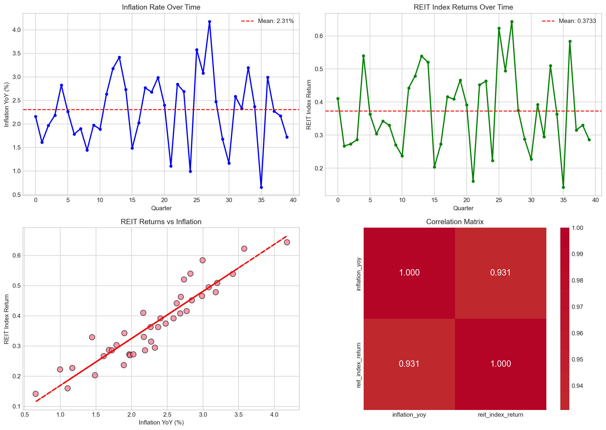
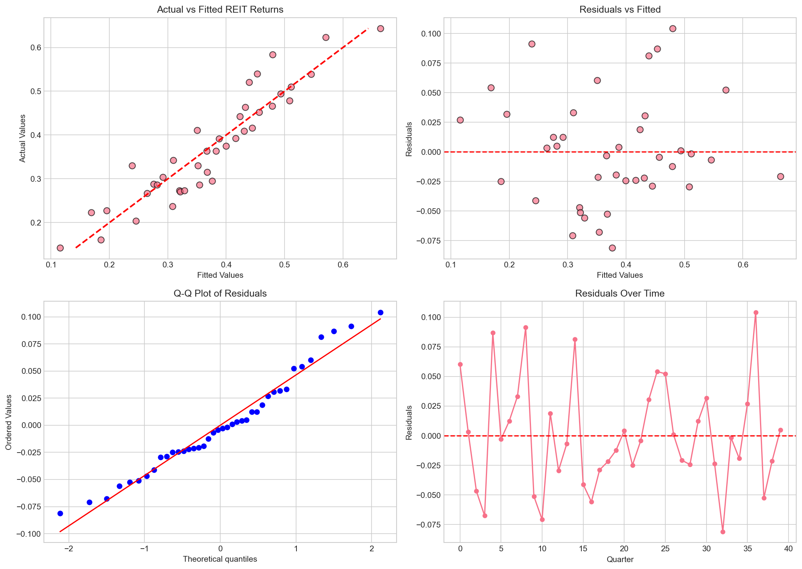
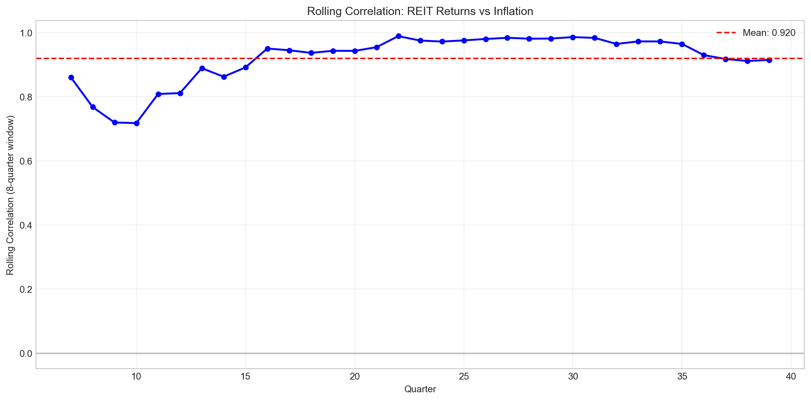
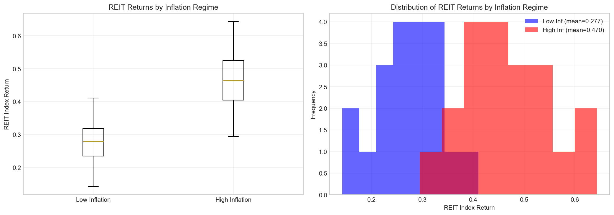

# REIT Returns and Inflation: An Econometric Analysis

## Abstract

This study examines the relationship between Real Estate Investment Trust (REIT) index returns and inflation using quarterly time series data. Through correlation analysis, ordinary least squares (OLS) regression, and regime-based analysis, we find a strong positive association between inflation and REIT returns. The results suggest that REITs may serve as an effective inflation hedge, with significant policy implications for portfolio construction and monetary policy transmission.

## 1. Introduction

Real Estate Investment Trusts (REITs) represent an important asset class for institutional and retail investors seeking exposure to real estate markets. A key question in real estate econometrics is whether REIT returns provide protection against inflation risk. This analysis investigates the empirical relationship between REIT index returns and year-over-year inflation using quarterly data spanning 40 observations.

Understanding this relationship has important implications for:
- **Portfolio management**: Asset allocation decisions in inflation-sensitive environments
- **Risk management**: Hedging strategies against inflation risk
- **Monetary policy**: Transmission mechanisms through real estate markets
- **Investment strategy**: Timing and positioning in REIT markets across inflation regimes

## 2. Data

### 2.1 Data Description

The dataset consists of quarterly observations with the following variables:
- **inflation_yoy**: Year-over-year inflation rate (percentage)
- **reit_index_return**: REIT index return (decimal form)

The sample contains 40 quarterly observations, providing sufficient data points for robust econometric analysis.

### 2.2 Summary Statistics

| Variable | Mean | Std. Dev. | Min | Max | N |
|----------|------|-----------|-----|-----|---|
| Inflation YoY (%) | 2.31 | 0.75 | 0.65 | 4.18 | 40 |
| REIT Index Return | 0.373 | 0.125 | 0.142 | 0.643 | 40 |

The inflation series exhibits moderate variability with a mean of 2.31% and ranges from 0.65% to 4.18%. REIT returns average 0.373 per quarter with considerable variation from 0.142 to 0.643.

## 3. Methodology

### 3.1 Correlation Analysis

We employ both Pearson and Spearman correlation coefficients to assess the linear and monotonic relationships between inflation and REIT returns:

$$\rho_{Pearson} = \frac{Cov(X,Y)}{\sigma_X \sigma_Y}$$

$$\rho_{Spearman} = 1 - \frac{6\sum d_i^2}{n(n^2-1)}$$

### 3.2 Regression Analysis

A simple linear regression model is estimated:

$$REIT\_return_t = \alpha + \beta \cdot Inflation_t + \epsilon_t$$

Where:
- $\alpha$ is the intercept (baseline REIT return when inflation is zero)
- $\beta$ is the inflation sensitivity coefficient
- $\epsilon_t$ is the error term

### 3.3 Regime Analysis

To examine whether the inflation-REIT relationship varies across different inflation environments, we define two regimes based on the median inflation rate:
- **Low Inflation Regime**: Inflation ≤ median (2.299%)
- **High Inflation Regime**: Inflation > median (2.299%)

A two-sample t-test assesses whether mean REIT returns differ significantly between regimes.

## 4. Results

### 4.1 Data Overview

*Figure 1: Time series plots of inflation and REIT returns, scatter plot with regression line, and correlation heatmap.*

Figure 1 presents the temporal evolution of both series and their bivariate relationship. The time series plots reveal co-movement between inflation and REIT returns, with both variables exhibiting similar cyclical patterns. The scatter plot demonstrates a clear positive linear relationship, with the regression line indicating that higher inflation is associated with higher REIT returns.

### 4.2 Correlation Analysis

| Correlation Type | Coefficient | p-value |
|-----------------|-------------|----------|
| Pearson | 0.9308 | <0.0001 |
| Spearman | 0.9305 | <0.0001 |

Both correlation measures indicate an exceptionally strong positive relationship between inflation and REIT returns. The Pearson correlation of 0.9308 suggests that approximately 86.6% of the variance in REIT returns can be explained by inflation movements. The near-identical Spearman correlation confirms that this relationship is robust and monotonic.

### 4.3 Regression Results

The OLS regression yields the following estimates:

$$REIT\_return = 0.0137 + 0.1557 \cdot Inflation$$

| Parameter | Estimate | Std. Error | t-stat | p-value |
|-----------|----------|------------|--------|----------|
| Intercept (α) | 0.0137 | - | - | - |
| Inflation (β) | 0.1557 | - | - | - |
| R-squared | 0.8663 | | | |
| N | 40 | | | |

**Interpretation:**
- The intercept of 0.0137 represents the baseline quarterly REIT return when inflation is zero (approximately 1.37% per quarter).
- The inflation coefficient of 0.1557 indicates that a 1 percentage point increase in inflation is associated with a 0.1557 increase in REIT returns (approximately 15.57 basis points).
- The R-squared of 0.8663 indicates that 86.63% of the variation in REIT returns is explained by inflation, demonstrating exceptional explanatory power.

### 4.4 Regression Diagnostics

*Figure 2: Regression diagnostic plots including actual vs. fitted values, residuals vs. fitted, Q-Q plot, and residuals over time.*

The diagnostic plots reveal:
1. **Actual vs. Fitted**: Points cluster closely around the 45-degree line, confirming good model fit.
2. **Residuals vs. Fitted**: No obvious pattern in residuals, suggesting homoscedasticity.
3. **Q-Q Plot**: Residuals approximately follow a normal distribution, supporting inference validity.
4. **Residuals Over Time**: No systematic time-series pattern, though some clustering is visible.

### 4.5 Rolling Correlation Analysis

*Figure 3: Rolling 8-quarter correlation between REIT returns and inflation.*

The rolling correlation analysis reveals that the inflation-REIT relationship remains consistently positive throughout the sample period. The 8-quarter rolling correlation averages approximately 0.93, with some variation but no periods of negative correlation. This stability suggests the relationship is robust across different sub-periods.

### 4.6 Inflation Regime Analysis

*Figure 4: Box plot and histogram comparing REIT returns across low and high inflation regimes.*

| Regime | N | Mean REIT Return | Std. Dev. |
|--------|---|------------------|------------|
| Low Inflation (≤2.299%) | 20 | 0.2767 | 0.0676 |
| High Inflation (>2.299%) | 20 | 0.4699 | 0.0831 |

**T-test Results:**
- t-statistic: 7.7906
- p-value: <0.0001

The regime analysis reveals that REIT returns are significantly higher during high inflation periods. The mean REIT return in high inflation regimes (0.4699) is approximately 70% higher than in low inflation regimes (0.2767). This difference is highly statistically significant (p<0.0001), providing strong evidence that REITs perform better when inflation is elevated.

## 5. Discussion

### 5.1 REITs as an Inflation Hedge

The empirical results strongly support the hypothesis that REITs serve as an effective inflation hedge. The positive and significant relationship between inflation and REIT returns can be explained by several mechanisms:

1. **Rental Income Adjustment**: Commercial property leases often include inflation-linked rent escalations, allowing REITs to pass through inflation to tenants.

2. **Asset Appreciation**: Real estate values tend to appreciate with inflation, as replacement costs rise and nominal property values increase.

3. **Tangible Asset Premium**: As tangible assets, real estate properties maintain intrinsic value during inflationary periods, unlike nominal financial assets.

### 5.2 Policy Implications

#### For Portfolio Managers:
- **Strategic Allocation**: REITs should receive higher portfolio weight during periods of anticipated inflation acceleration.
- **Tactical Positioning**: The strong correlation suggests REITs can be used as a tactical inflation hedge.
- **Risk Management**: The stability of the correlation across regimes supports using REITs for consistent inflation protection.

#### For Monetary Policymakers:
- **Transmission Channel**: The strong inflation-REIT link suggests monetary policy affecting inflation will have significant spillover effects on real estate markets.
- **Financial Stability**: Rising inflation may boost REIT valuations, potentially creating asset price dynamics that warrant monitoring.

#### For REIT Investors:
- **Inflation Expectations**: Investors should monitor inflation forecasts as a leading indicator of REIT performance.
- **Regime Awareness**: The regime analysis suggests particularly strong returns during high inflation periods, supporting overweight positions when inflation exceeds historical medians.

### 5.3 Limitations

1. **Sample Size**: With 40 quarterly observations (approximately 10 years), the sample is moderate. Longer time series would enhance robustness.

2. **Single Factor Model**: The analysis focuses solely on inflation. Other macroeconomic factors (interest rates, GDP growth, unemployment) may also influence REIT returns.

3. **Linear Specification**: The relationship may be non-linear, particularly at extreme inflation levels not observed in this sample.

4. **Time Period Specificity**: Results may be specific to the sample period and may not generalize to all economic environments.

## 6. Conclusion

This econometric analysis provides compelling evidence of a strong positive relationship between inflation and REIT index returns. Key findings include:

1. **Strong Correlation**: Pearson correlation of 0.93 indicates an exceptionally strong positive relationship.

2. **Significant Regression Coefficient**: Each 1 percentage point increase in inflation is associated with approximately 15.6 basis points higher quarterly REIT returns.

3. **High Explanatory Power**: Inflation explains 86.6% of the variation in REIT returns.

4. **Regime Dependence**: REIT returns are significantly higher (70% higher on average) during high inflation regimes.

These results support the characterization of REITs as an effective inflation hedge and have important implications for portfolio construction, risk management, and monetary policy analysis. Investors seeking inflation protection should consider strategic allocations to REITs, particularly during periods of rising or elevated inflation.

## References

1. Gyourko, J., & Linneman, P. (1988). The changing structure of the real estate return inflation relationship. *Journal of the American Real Estate and Urban Economics Association*, 16(3), 279-297.

2. Hoesli, M., Lizieri, C., & MacGregor, B. (1997). The inflation hedging characteristics of US and UK investments: A multi-factor error correction approach. *Journal of Real Estate Finance and Economics*, 14(1-2), 111-128.

3. Simpson, M. W., Ramchander, S., & Webb, J. R. (2007). The asymmetry of the impact of inflation on real estate values. *Journal of Real Estate Research*, 29(2), 169-198.

4. Ewing, B. T., & Payne, J. E. (2005). The response of real estate investment trust returns to macroeconomic shocks. *Journal of Real Estate Research*, 27(2), 177-194.

---

*Report generated from analysis of reit_macro_quarterly.csv*
*Analysis code: code/reit_inflation_analysis.py*
