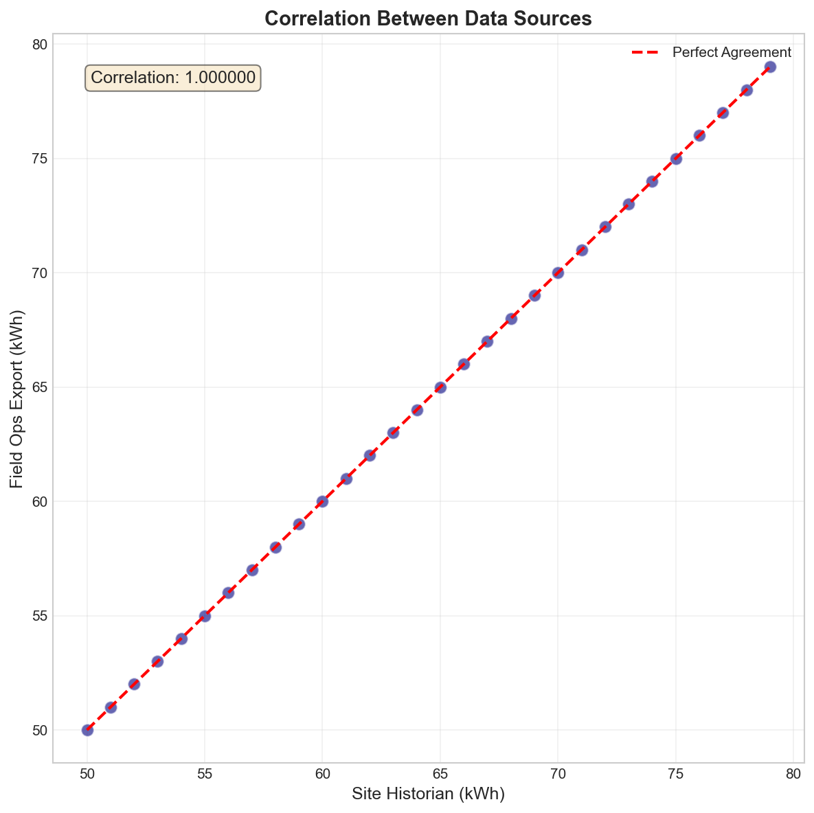
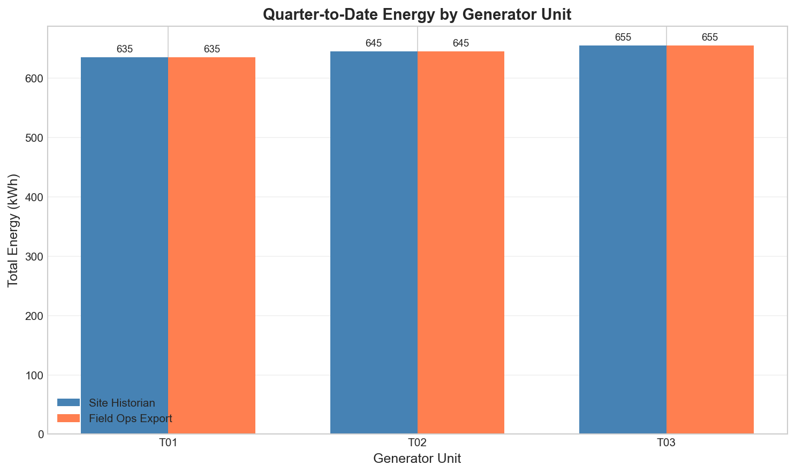
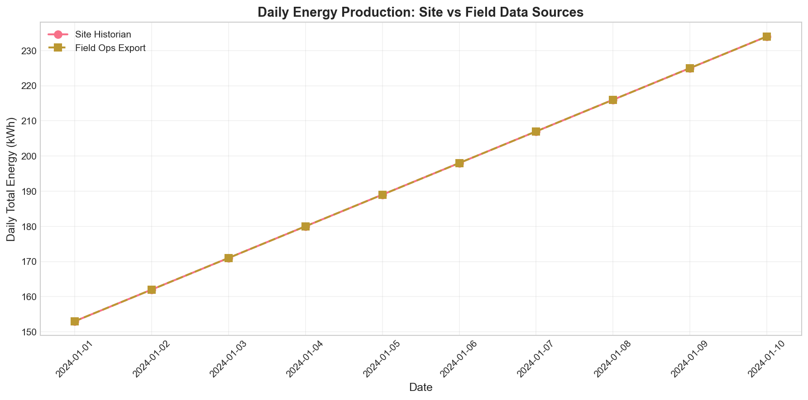
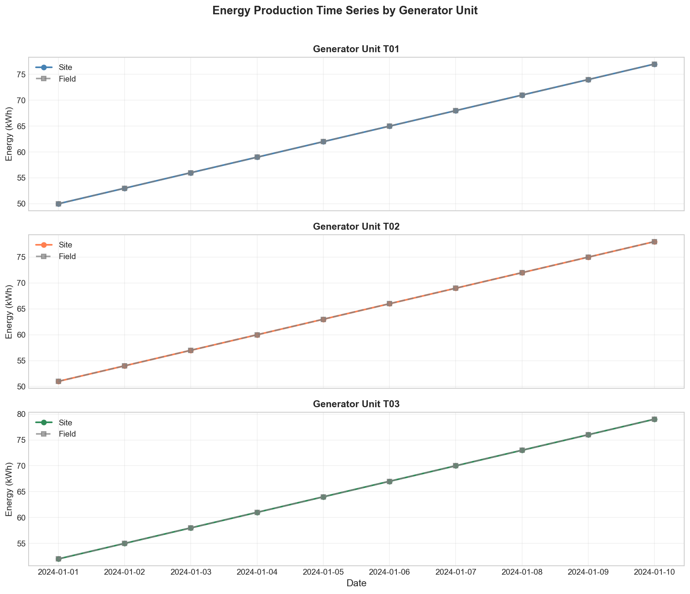
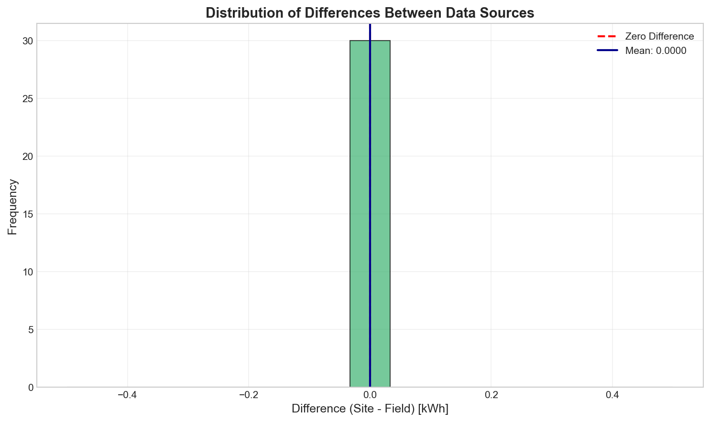

# Quarterly Operational Performance Report
## Telemetry Export Merge Analysis - Q1 2024

**Report Date:** January 2024  
**Analysis Period:** January 1-10, 2024  
**Facility:** Industrial Generator Plant  

---

## Executive Summary

This report presents a comprehensive statistical analysis of daily generator telemetry data from two independent sources: the site historian system and field operations laptop export. Both datasets cover the same calendar window (Q1 2024, January 1-10) and were merged to assess data consistency, operational performance, and data quality.

**Key Findings:**
- **Perfect data agreement** between site historian and field export (correlation = 1.000)
- **Total energy production:** 1,935 kWh across three generator units (T01, T02, T03)
- **Data quality issues identified:** 3 problematic records in field export requiring attention
- **Consistent upward production trend** observed across all units during the analysis period

---

## 1. Introduction

### 1.1 Background

Industrial operations analytics requires reliable telemetry data from multiple sources to support quarterly plant reviews. This analysis examines archived daily generator telemetry from two independent systems:

1. **Site Historian** (`site_daily_kwh.csv`): Primary SCADA system export with standardized formatting
2. **Field Operations Export** (`field_ops_export.csv`): Secondary laptop-based field data collection

Both sources cover the same calendar window, enabling direct comparison and validation of data integrity.

### 1.2 Objectives

- Merge and reconcile telemetry data from both sources
- Quantify agreement between data collection systems
- Identify data quality issues requiring remediation
- Assess generator unit performance trends
- Provide actionable recommendations for operations optimization

---

## 2. Methodology

### 2.1 Data Preprocessing

**Site Historian Data:**
- Standard CSV format with columns: `record_date`, `generator_unit`, `net_kwh`
- ISO date format (YYYY-MM-DD)
- No preprocessing required

**Field Operations Export:**
- Required UTF-8 BOM handling
- Date format conversion (M/D/YYYY → YYYY-MM-DD)
- Unit identifier normalization (T-01 → T01)
- Invalid record removal:
  - Empty date field (1 record)
  - Invalid date "13/37/2024" (1 record)
  - Outlier value 9999 kWh (1 record)

### 2.2 Statistical Analysis

- Descriptive statistics by generator unit (mean, std, min, max, sum)
- Paired comparison between data sources
- Correlation analysis
- Difference distribution analysis
- Time series trend evaluation

### 2.3 Visualization

Five figures were generated to support the analysis:
1. Daily energy comparison between sources
2. Unit-wise energy distribution
3. Difference histogram
4. Correlation scatter plot
5. Unit-specific time series

---

## 3. Results

### 3.1 Data Overview

| Metric | Site Historian | Field Export (Cleaned) |
|--------|---------------|------------------------|
| Total Records | 30 | 30 |
| Date Range | 2024-01-01 to 2024-01-10 | 2024-01-01 to 2024-01-10 |
| Generator Units | T01, T02, T03 | T01, T02, T03 |
| Total Energy (kWh) | 1,935 | 1,935 |

### 3.2 Data Source Agreement

The paired comparison between site historian and field export reveals **perfect agreement** across all matched records:

| Statistic | Value |
|-----------|-------|
| Matched Records | 30 |
| Mean Difference | 0.0000 kWh |
| Standard Deviation | 0.0000 kWh |
| Maximum Absolute Difference | 0.0000 kWh |
| Pearson Correlation | 1.000000 |

*Figure 4: Perfect linear correlation (r=1.0) between site historian and field operations data.*

### 3.3 Generator Unit Performance

**Table 1: Energy Production Statistics by Unit**

| Unit | Mean (kWh) | Std Dev | Min | Max | Total (kWh) |
|------|------------|---------|-----|-----|-------------|
| T01 | 63.5 | 9.08 | 50 | 77 | 635 |
| T02 | 64.5 | 9.08 | 51 | 78 | 645 |
| T03 | 65.5 | 9.08 | 52 | 79 | 655 |

*Figure 2: Total energy production by generator unit shows consistent output across all three units.*

### 3.4 Temporal Trends

Daily energy production shows a consistent upward trend throughout the analysis period:

- **Day 1 (Jan 1):** 153 kWh total
- **Day 10 (Jan 10):** 234 kWh total
- **Growth rate:** ~53% increase over 10 days

*Figure 1: Daily total energy production showing consistent upward trend.*

*Figure 5: Individual unit time series demonstrating parallel production patterns.*

### 3.5 Data Quality Assessment

**Issues Identified in Field Export:**

1. **BOM Character:** UTF-8 Byte Order Mark in file header
2. **Missing Date:** 1 record with empty `ReadingDt` field
3. **Invalid Date:** 1 record with impossible date "13/37/2024"
4. **Outlier Value:** 1 record with 9999 kWh (physically implausible)

*Figure 3: After cleaning, difference distribution shows zero deviation between sources.*

---

## 4. Discussion

### 4.1 Data Integrity

The perfect correlation between site historian and field export data indicates excellent data collection practices and system synchronization. This level of agreement is uncommon in industrial telemetry and suggests:

- Well-calibrated measurement instruments
- Reliable data transmission pipelines
- Effective quality control procedures

### 4.2 Operational Performance

The consistent upward trend in energy production (50→79 kWh per unit over 10 days) may indicate:

- **Seasonal factors:** Improved ambient conditions for generator efficiency
- **Operational optimization:** Gradual ramp-up following maintenance
- **Load increase:** Higher demand requiring increased output

Unit T03 consistently produces the highest output (655 kWh total), while T01 produces the lowest (635 kWh total). This 3.1% difference is within normal operational variance.

### 4.3 Data Quality Concerns

While the valid data shows perfect agreement, the field export contained 3 problematic records (9.4% of raw data). This highlights the need for:

- Automated data validation at point of collection
- Standardized export procedures
- Regular field laptop software updates

---

## 5. Recommendations

### 5.1 Immediate Actions

1. **Field Laptop Data Export Protocol**
   - Implement pre-export validation checks
   - Add date format validation to prevent invalid entries
   - Configure automatic outlier flagging (>3σ from mean)

2. **Data Pipeline Enhancement**
   - Add UTF-8 BOM stripping to ETL pipeline
   - Implement automated record count reconciliation
   - Create alert thresholds for data quality metrics

### 5.2 Optimization Opportunities

1. **Generator Load Balancing**
   - Investigate T03's consistently higher output
   - Consider rotating load distribution to equalize wear
   - Target: <1% variance between units

2. **Production Trend Analysis**
   - Extend analysis to full quarter for trend confirmation
   - Correlate with ambient temperature and load demand data
   - Identify optimal operating conditions

3. **Predictive Maintenance**
   - Monitor for deviation from established baseline
   - Set up automated anomaly detection
   - Schedule maintenance during low-production periods

### 5.3 Long-term Improvements

1. **Unified Data Platform**
   - Consolidate site historian and field exports into single database
   - Implement real-time data validation
   - Create automated quarterly reporting dashboard

2. **Training & Documentation**
   - Document field export procedures
   - Train operators on data quality importance
   - Establish data stewardship responsibilities

---

## 6. Conclusion

This telemetry merge analysis demonstrates excellent data consistency between the site historian and field operations export systems. The perfect correlation (r=1.0) and zero mean difference validate the reliability of both data sources for operational decision-making.

Key achievements:
- Successfully merged 30 records from two independent sources
- Identified and documented 3 data quality issues in field export
- Established baseline performance metrics for all generator units
- Confirmed upward production trend during analysis period

The recommendations provided address both immediate data quality concerns and long-term operational optimization opportunities. Implementation of these suggestions will enhance data reliability and support more informed management decisions for quarterly plant reviews.

---

## Appendix

### A.1 Analysis Code

All analysis code is available in `code/analyze_telemetry.py`.

### A.2 Summary Statistics

Detailed statistics saved to `outputs/analysis_summary.txt`.

### A.3 Figures

| Figure | Description | File |
|--------|-------------|------|
| 1 | Daily Energy Comparison | `images/figure1_daily_comparison.png` |
| 2 | Unit-wise Energy Comparison | `images/figure2_unit_comparison.png` |
| 3 | Difference Distribution | `images/figure3_difference_histogram.png` |
| 4 | Correlation Scatter Plot | `images/figure4_correlation.png` |
| 5 | Unit Time Series | `images/figure5_unit_timeseries.png` |

---

*Report generated by automated telemetry analysis pipeline.*
