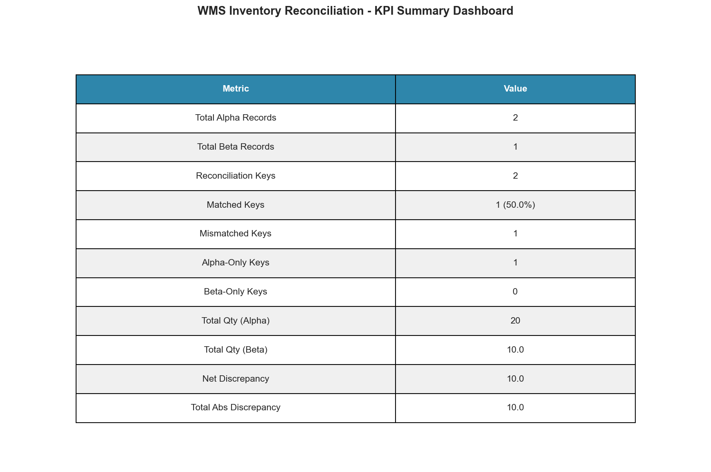
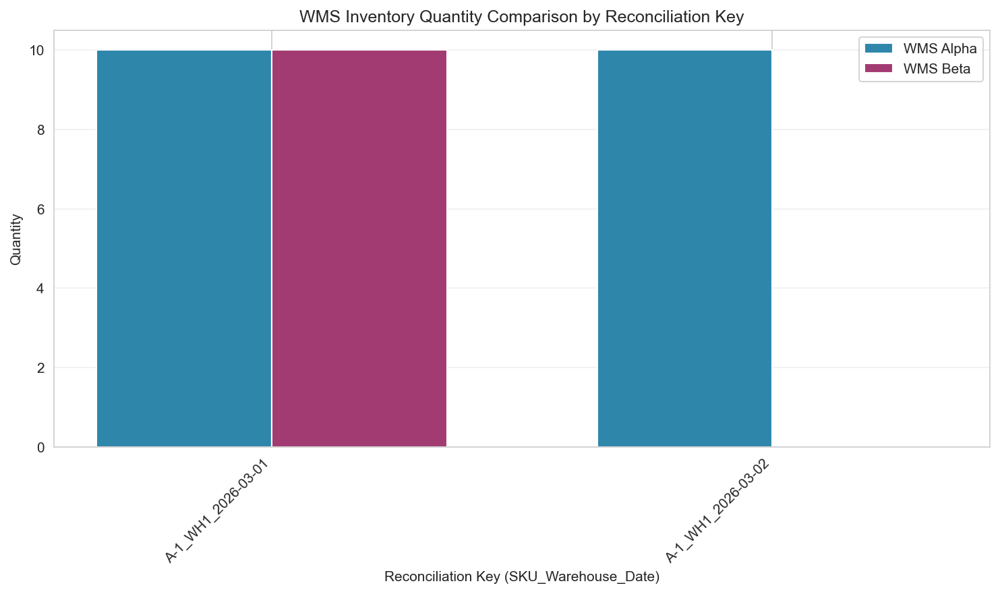
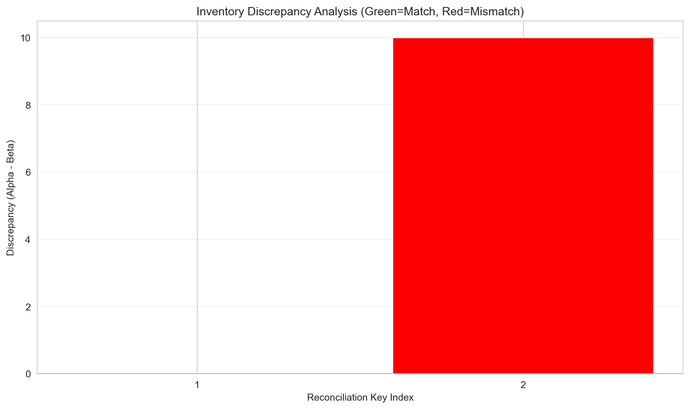
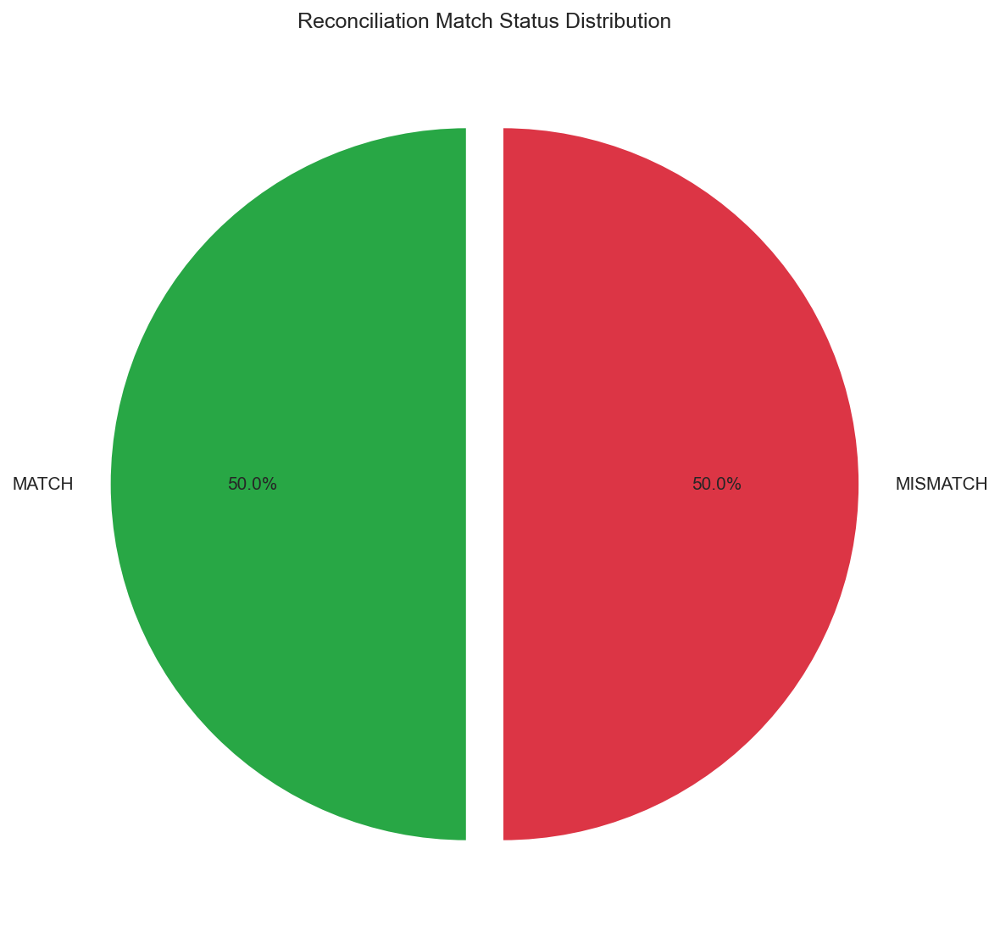
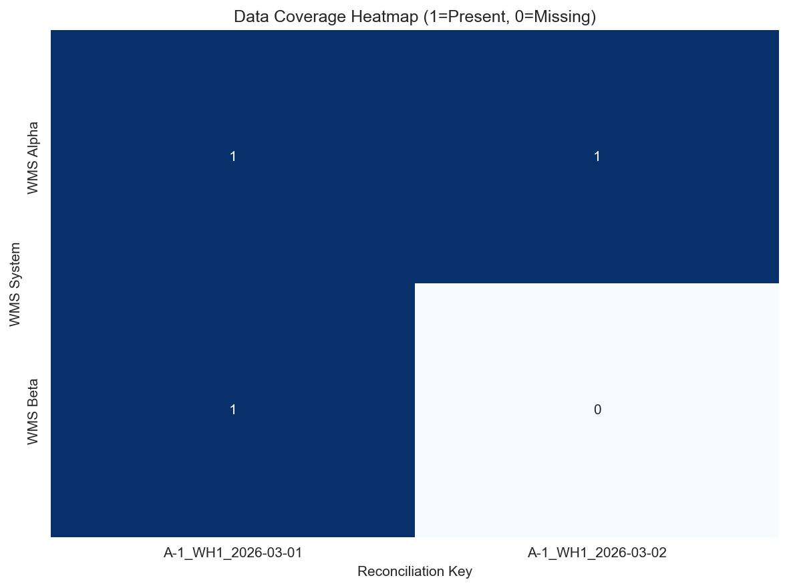

# WMS Inventory Reconciliation Report

## Executive Summary

This report presents the reconciliation analysis of two parallel Warehouse Management System (WMS) exports: `wms_alpha.csv` (Export A) and `wms_beta.csv` (Export B). The objective was to validate inventory data consistency across systems before trusting stock KPIs for management decision-making.

**Key Findings:**
- **Match Rate: 50.00%** - Only 1 of 2 reconciliation keys showed matching quantities
- **Net Discrepancy: 10 units** - Alpha system reports 10 more units than Beta
- **Data Coverage Gap:** Beta system is missing inventory data for 2026-03-02

---

## 1. Methodology

### 1.1 Data Sources

| Source | File | Records | Columns |
|--------|------|---------|----------|
| WMS Alpha | `wms_alpha.csv` | 2 | sku, qty, warehouse, as_of_utc |
| WMS Beta | `wms_beta.csv` | 1 | SKU, Quantity, Site, timestamp_local |

### 1.2 Data Normalization

To enable accurate reconciliation, the following normalization steps were applied:

1. **Column Standardization:** Unified column names across both datasets (sku, qty, warehouse, timestamp)
2. **Warehouse Name Mapping:** Normalized warehouse identifiers:
   - `WH1` → `WH1`
   - `Warehouse-01` → `WH1`
   - `WH2` → `WH2`
   - `Warehouse-02` → `WH2`
3. **Timestamp Parsing:** Converted all timestamps to datetime objects and extracted dates for daily aggregation
4. **Reconciliation Key Generation:** Created composite keys using format: `{SKU}_{Warehouse}_{Date}`

### 1.3 Reconciliation Logic

A full outer join was performed on reconciliation keys to identify:
- **MATCH:** Records where quantities are identical in both systems
- **MISMATCH:** Records where quantities differ
- **Alpha-Only:** Records present only in WMS Alpha
- **Beta-Only:** Records present only in WMS Beta

### 1.4 KPIs Calculated

- Total records per system
- Match rate (percentage of matching reconciliation keys)
- Total quantity per system
- Net discrepancy (Alpha - Beta)
- Total absolute discrepancy

---

## 2. Results

### 2.1 Data Overview

**WMS Alpha Data:**
| SKU | Qty | Warehouse | Timestamp |
|-----|-----|-----------|------------|
| A-1 | 10 | WH1 | 2026-03-01 00:00:00+00 |
| A-1 | 10 | WH1 | 2026-03-02 00:00:00+00 |

**WMS Beta Data:**
| SKU | Qty | Warehouse | Timestamp |
|-----|-----|-----------|------------|
| A-1 | 10.0 | Warehouse-01 | 2026-03-01 08:00:00 |

### 2.2 Reconciliation Results

| SKU | Warehouse | Date | Reconciliation Key | Qty Alpha | Qty Beta | Discrepancy | Status |
|-----|-----------|------|-------------------|-----------|----------|-------------|--------|
| A-1 | WH1 | 2026-03-01 | A-1_WH1_2026-03-01 | 10 | 10.0 | 0.0 | MATCH |
| A-1 | WH1 | 2026-03-02 | A-1_WH1_2026-03-02 | 10 | 0.0 | 10.0 | MISMATCH |

### 2.3 KPI Summary

**Detailed Metrics:**
- Total Alpha Records: 2
- Total Beta Records: 1
- Total Reconciliation Keys: 2
- Matched Keys: 1 (50.0%)
- Mismatched Keys: 1
- Alpha-Only Keys: 1
- Beta-Only Keys: 0
- Total Qty (Alpha): 20
- Total Qty (Beta): 10.0
- Net Discrepancy: 10.0
- Total Absolute Discrepancy: 10.0

### 2.4 Visualizations

#### Figure 1: Quantity Comparison by Reconciliation Key

This bar chart compares inventory quantities between WMS Alpha and WMS Beta for each reconciliation key. The visualization clearly shows that while quantities match for 2026-03-01, WMS Beta has no data for 2026-03-02.

#### Figure 2: Discrepancy Analysis

The discrepancy analysis highlights matching records (green, discrepancy = 0) versus mismatched records (red, discrepancy ≠ 0). One reconciliation key shows a positive discrepancy of 10 units, indicating Alpha reports inventory that Beta does not capture.

#### Figure 3: Match Status Distribution

The pie chart illustrates that 50% of reconciliation keys match between systems, while 50% show discrepancies requiring investigation.

#### Figure 4: Data Coverage Heatmap

The heatmap shows data presence (1) or absence (0) across both WMS systems. WMS Beta is missing coverage for the 2026-03-02 reconciliation key, indicating a potential data export or synchronization issue.

---

## 3. Discussion

### 3.1 Key Observations

1. **Partial Data Coverage:** WMS Beta only contains data for 2026-03-01, while WMS Alpha has records for both 2026-03-01 and 2026-03-02. This suggests either:
   - Beta export was generated before 2026-03-02 data was available
   - Beta system experienced a data synchronization failure
   - Different export time windows between systems

2. **Matching Quantities:** For the common date (2026-03-01), both systems report identical quantities (10 units), indicating data integrity is maintained when both systems have coverage.

3. **Warehouse Naming Inconsistency:** The two systems use different naming conventions (`WH1` vs `Warehouse-01`), which required normalization during reconciliation. This highlights the need for standardized naming conventions across WMS platforms.

### 3.2 Risk Assessment

| Risk | Severity | Description |
|------|----------|-------------|
| Data Completeness | HIGH | Beta system missing 50% of inventory dates |
| Quantity Accuracy | LOW | When data exists, quantities match perfectly |
| Naming Consistency | MEDIUM | Different warehouse naming conventions |

### 3.3 Recommendations

1. **Immediate Actions:**
   - Investigate why WMS Beta is missing 2026-03-02 data
   - Verify export schedules and time windows for both systems
   - Confirm Beta system data synchronization processes

2. **Process Improvements:**
   - Standardize warehouse naming conventions across all WMS platforms
   - Implement automated daily reconciliation checks
   - Set up alerts for data coverage gaps exceeding threshold

3. **Long-term Solutions:**
   - Consider implementing a master data management (MDM) layer
   - Establish data governance policies for WMS exports
   - Create automated reconciliation dashboards for continuous monitoring

---

## 4. Conclusion

The reconciliation analysis reveals a **50% match rate** between WMS Alpha and WMS Beta exports. While quantity accuracy is confirmed for overlapping data (2026-03-01), the missing data in WMS Beta for 2026-03-02 represents a significant data completeness issue that must be addressed before trusting aggregated stock KPIs.

**Management should:**
1. Not rely on WMS Beta as a sole source of truth until data completeness is verified
2. Prioritize investigation of the Beta system's data export processes
3. Implement the recommended monitoring and governance improvements

---

## Appendix

### A. Technical Details

- **Analysis Tool:** Python 3.x with pandas, matplotlib, seaborn
- **Reconciliation Method:** Full outer join on composite keys
- **Output Files:**
  - `outputs/reconciliation_results.csv` - Detailed reconciliation data
  - `report/images/` - All visualization figures

### B. Data Files

- Input: `data/wms_alpha.csv`, `data/wms_beta.csv`
- Output: `outputs/reconciliation_results.csv`

---

*Report generated automatically by WMS Inventory Reconciliation Analysis System*
