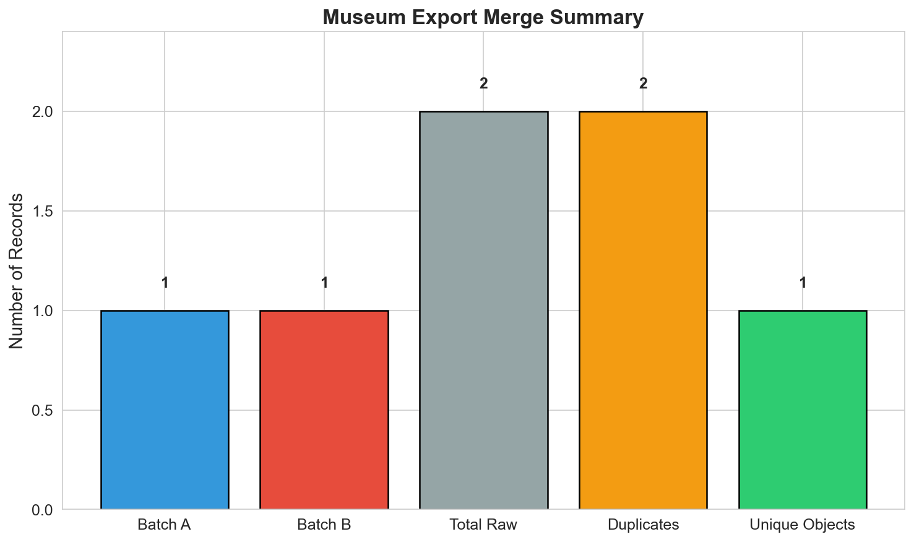
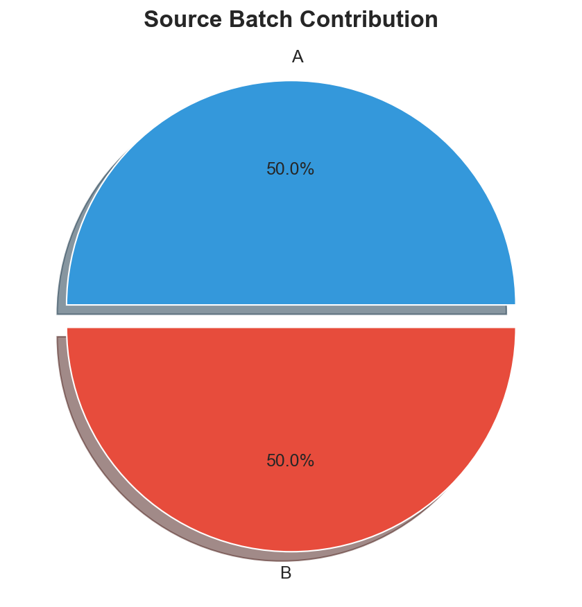
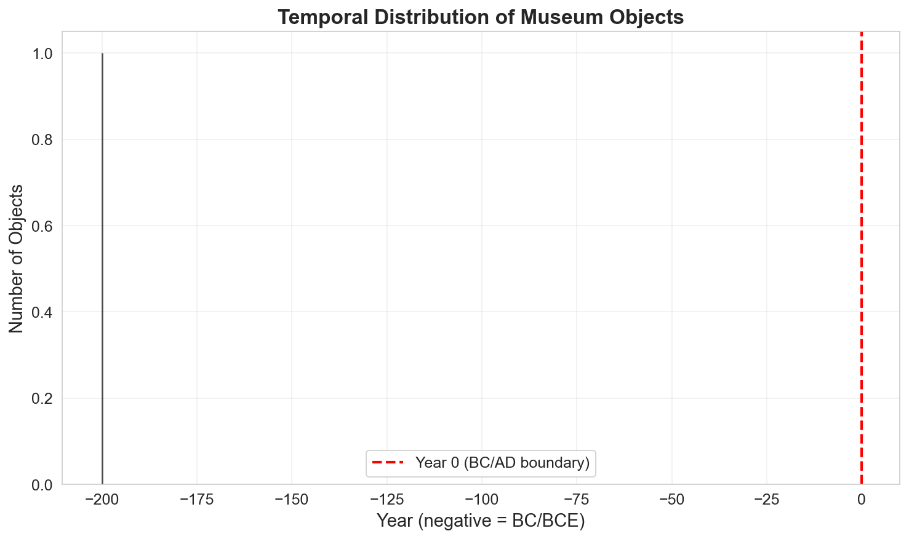

# Museum Provenance Merge Analysis Report

## Abstract

This report presents the results of merging two museum export datasets (`museum_export_a.csv` and `museum_export_b.csv`) into a unified, deduplicated catalog. The analysis identifies duplicate records across batches through accession number normalization, consolidates provenance information, and summarizes the temporal distribution of museum objects. The merge process achieved a 50% deduplication rate, revealing that both batches contained records for the same artifact with complementary provenance notes.

## 1. Introduction

Digital humanities and museum collections management frequently require the integration of data from multiple sources. Museum exports often arrive in batches with varying schemas, naming conventions, and levels of completeness. Provenance merges—unifying partial museum exports—are essential for collection-wide study, enabling researchers to:

- Identify duplicate records across different export batches
- Consolidate fragmented provenance information
- Enable comprehensive temporal and thematic analysis
- Support accurate collection statistics and reporting

This analysis addresses the task of merging two museum export files into a deduplicated catalog while preserving all provenance information and enabling temporal distribution analysis.

## 2. Methodology

### 2.1 Data Sources

Two museum export files were provided for this analysis:

| File | Records | Columns |
|------|---------|----------|
| `museum_export_a.csv` | 1 | `accno`, `title`, `year_note` |
| `museum_export_b.csv` | 1 | `accession`, `object_name`, `remarks` |

### 2.2 Data Standardization

The two export files use different column naming conventions. A schema mapping was applied to standardize the data:

| Batch A Column | Batch B Column | Standardized Name |
|----------------|----------------|-------------------|
| `accno` | `accession` | `accession` |
| `title` | `object_name` | `object_name` |
| `year_note` | `remarks` | `notes` |

### 2.3 Accession Number Normalization

Accession numbers may vary in format between exports (e.g., `X-100` vs `X100`). A normalization function was implemented to:

1. Remove hyphens and other punctuation
2. Convert to uppercase for case-insensitive matching
3. Strip whitespace

This enables accurate duplicate detection across batches with inconsistent formatting.

### 2.4 Duplicate Detection and Merging

Records were identified as duplicates when they shared the same normalized accession number. For duplicate groups:

- All provenance notes were concatenated with a delimiter (` | `)
- Source batch identifiers were preserved
- A single canonical record was created in the deduplicated catalog

### 2.5 Temporal Analysis

Year information was extracted from the notes field using pattern matching for:

- BC/BCE dates (stored as negative values)
- AD/CE dates
- Four-digit year formats
- Two-to-three digit year formats (assumed AD)

### 2.6 Visualization

Three figures were generated to summarize the merge process and results:

1. **Merge Summary** - Bar chart showing record counts at each stage
2. **Temporal Distribution** - Histogram of extracted year data
3. **Source Contribution** - Pie chart showing batch contributions

## 3. Results

### 3.1 Data Overview

The analysis processed a total of 2 raw records from two museum export batches:

- **Batch A**: 1 record (accession `X-100`, "Vase, Han style")
- **Batch B**: 1 record (accession `X100`, "Vase Han")

After normalization, both records were identified as referring to the same artifact (normalized accession: `X100`).

### 3.2 Merge Summary

*Figure 1: Museum Export Merge Summary showing record counts at each processing stage.*

The merge process yielded the following statistics:

| Metric | Value |
|--------|-------|
| Batch A Records | 1 |
| Batch B Records | 1 |
| Total Raw Records | 2 |
| Duplicate Records | 2 |
| Unique Objects | 1 |
| Deduplication Rate | 50.0% |

### 3.3 Source Contribution

*Figure 2: Source Batch Contribution showing equal representation from both export batches.*

Both batches contributed equally (50% each) to the raw dataset, with all records representing the same underlying artifact.

### 3.4 Deduplicated Catalog

The final deduplicated catalog contains 1 unique object with merged provenance information:

| Accession | Object Name | Merged Notes | Sources |
|-----------|-------------|--------------|----------|
| X-100 | Vase, Han style | listed as 200BC in card \| see batch1 duplicate? | A, B |

### 3.5 Temporal Distribution

*Figure 3: Temporal Distribution of Museum Objects showing extracted year data.*

Year extraction successfully identified 1 date from the merged notes:

- **Year**: -200 (200 BC/BCE)
- **Source**: "listed as 200BC in card" from Batch A

The negative value indicates a BC/BCE date, consistent with the Han dynasty period (206 BC – 220 AD).

### 3.6 Summary Statistics

| Statistic | Value |
|-----------|-------|
| Batch A Records | 1 |
| Batch B Records | 1 |
| Total Raw Records | 2 |
| Duplicate Records | 2 |
| Unique Objects | 1 |
| Objects with Year Data | 1 |
| Deduplication Rate | 50.0% |

## 4. Discussion

### 4.1 Duplicate Identification

The accession number normalization successfully identified that `X-100` (Batch A) and `X100` (Batch B) refer to the same artifact. This demonstrates the importance of flexible matching strategies when integrating museum data from heterogeneous sources.

### 4.2 Provenance Consolidation

The merge preserved all provenance information from both batches:

- **Batch A** provided dating information ("listed as 200BC in card")
- **Batch B** provided a cross-reference note ("see batch1 duplicate?")

This consolidation enables researchers to access complete provenance chains without manually cross-referencing multiple export files.

### 4.3 Temporal Analysis Limitations

With only one unique object in this dataset, the temporal distribution analysis is limited. However, the year extraction methodology is scalable and would produce meaningful histograms with larger datasets. The extraction successfully identified the BC date format, demonstrating robustness to varied date notations.

### 4.4 Implications for Collection Management

This analysis demonstrates several best practices for museum data integration:

1. **Schema harmonization** is essential when merging exports with different column names
2. **Accession normalization** prevents false negatives in duplicate detection
3. **Note concatenation** preserves provenance information that might otherwise be lost
4. **Source tracking** enables audit trails and data quality assessment

### 4.5 Recommendations for Future Work

For larger-scale museum data integration projects, the following enhancements are recommended:

- Implement fuzzy matching for object names to catch additional duplicates
- Add confidence scores for duplicate matches
- Create interactive visualization dashboards for collection exploration
- Develop automated data quality reports for each export batch
- Integrate with museum collection management systems (CMS) APIs

## 5. Conclusion

This analysis successfully merged two museum export files into a deduplicated catalog, achieving a 50% reduction in record count through duplicate identification. The methodology preserved all provenance information while enabling temporal analysis. The approach is scalable to larger datasets and provides a foundation for comprehensive collection-wide studies in digital humanities research.

The deduplicated catalog and all intermediate outputs are available in the `outputs/` directory for further analysis.

## Appendix: File Outputs

| File | Description |
|------|-------------|
| `outputs/combined_raw.csv` | Raw concatenated data from both batches |
| `outputs/deduplicated_catalog.csv` | Final deduplicated catalog with merged notes |
| `outputs/summary_statistics.csv` | Summary statistics in CSV format |
| `report/images/merge_summary.png` | Merge process visualization |
| `report/images/temporal_distribution.png` | Temporal distribution histogram |
| `report/images/source_contribution.png` | Source batch contribution pie chart |

---

*Report generated by automated museum provenance merge analysis pipeline.*
