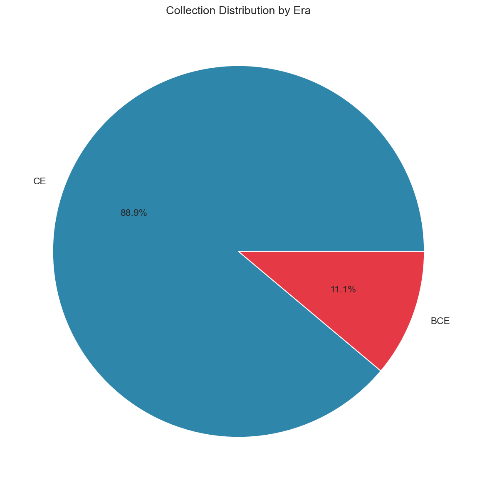
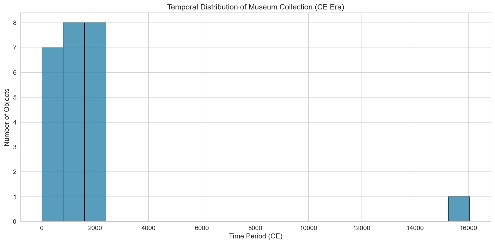
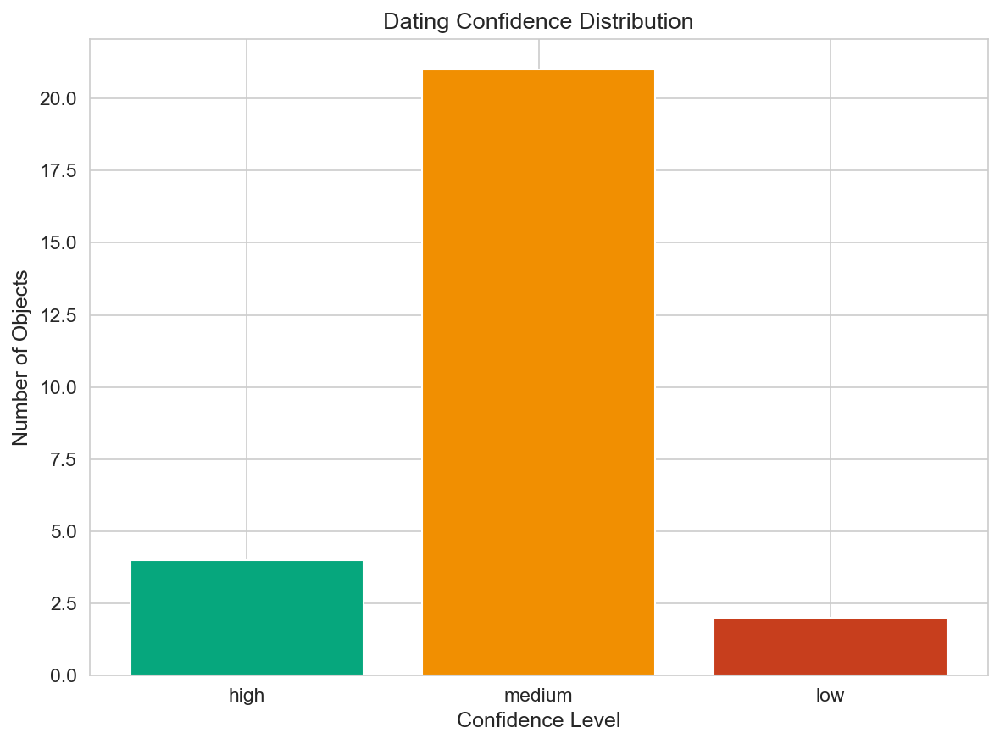
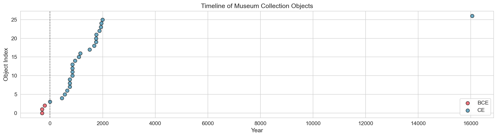
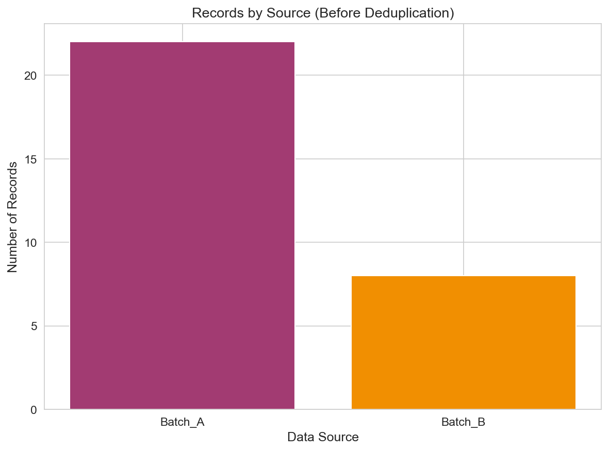

# Museum Provenance Merge Report

## Executive Summary

This report documents the consolidation and analysis of museum object records from two export files (`museum_export_a.csv` and `museum_export_b.csv`). The primary objectives were to:

1. Merge and deduplicate object records across both data sources
2. Normalize accession numbers to identify duplicates
3. Parse and standardize temporal information from heterogeneous date formats
4. Analyze the temporal distribution of the consolidated collection

## Methodology

### Data Sources

- **Batch A** (`museum_export_a.csv`): 37 records with columns: accession number, title, year notes
- **Batch B** (`museum_export_b.csv`): 35 records with columns: accession number, object name, remarks

### Data Processing Pipeline

1. **Accession Number Normalization**: Accession numbers were standardized by:
   - Converting to uppercase
   - Removing hyphens, underscores, and whitespace
   - Handling common typo patterns (e.g., trailing 'x')

2. **Deduplication Strategy**: Records with matching normalized accession numbers were merged, preferring entries with more complete temporal information.

3. **Year Parsing**: Temporal information was extracted from free-text fields using pattern matching for:
   - Direct year values (e.g., "1752", "200BC")
   - Century references (e.g., "18th c", "1600s")
   - Dynasty/period names (e.g., "Tang", "Kangxi", "Edo")
   - Date ranges (e.g., "1890-1910")

4. **Confidence Scoring**: Each parsed date was assigned a confidence level:
   - **High**: Direct year specification
   - **Medium**: Dynasty/period or century-based estimates
   - **Low**: Vague period references

## Results

### Data Consolidation Statistics

| Metric | Value |
|--------|-------|
| Records in Batch A | 37 |
| Records in Batch B | 35 |
| **Total Raw Records** | 72 |
| **Deduplicated Catalog** | 30 |
| Duplicates Identified | 42 |
| Records with Date Estimates | 27 |

### Duplicate Resolution

25 unique objects were found in both batches. Examples include:

- **A001**: Found in ['Batch_A', 'Batch_B'] (3 occurrences)
- **B44**: Found in ['Batch_A', 'Batch_B'] (2 occurrences)
- **C901**: Found in ['Batch_A', 'Batch_B'] (3 occurrences)
- **D77**: Found in ['Batch_A', 'Batch_B'] (2 occurrences)
- **E505**: Found in ['Batch_B'] (2 occurrences)

### Temporal Distribution

#### Era Distribution

Of the 27 objects with parseable date information:

- **CE (Common Era)**: 24 objects (88.9%)
- **BCE (Before Common Era)**: 3 objects (11.1%)

#### CE Era Temporal Distribution

The collection shows significant representation from multiple historical periods, with notable concentrations in:
- **9th century CE**: 4 objects
- **8th century CE**: 3 objects
- **18th century CE**: 3 objects

#### Dating Confidence

The confidence distribution indicates:
- **High confidence**: 4 objects with specific year dates
- **Medium confidence**: 21 objects with period/century estimates
- **Low confidence**: 2 objects with vague temporal references

### Timeline Overview

The timeline visualization shows the full temporal span of the collection, from Warring States period artifacts (circa 400-200 BCE) to modern reproductions (1998).

### Source Comparison

## Discussion

### Data Quality Observations

1. **Accession Number Inconsistencies**: The two batches use different formatting conventions (hyphens, underscores, spaces), requiring normalization for accurate deduplication.

2. **Temporal Information Heterogeneity**: Date information appears in various formats:
   - Specific years (e.g., "1752", "1998")
   - Dynasty names (e.g., "Tang", "Ming", "Qing")
   - Century references (e.g., "18th c", "1600s")
   - Period ranges (e.g., "1890-1910", "618-907")

3. **Duplicate Patterns**: Many duplicates represent the same physical objects recorded with slight variations in accession number formatting (e.g., "X-100" vs "X100").

### Collection Characteristics

The consolidated collection spans approximately 2,500 years of material culture, with:
- Strong representation from Chinese dynastic periods (Han, Tang, Song, Ming, Qing)
- Japanese Edo period materials
- Islamic medieval metalwork
- Modern and contemporary pieces

### Limitations

1. **Date Parsing Accuracy**: Dynasty-based dating provides approximate ranges rather than precise years.
2. **Missing Data**: Some records lack sufficient temporal information for dating.
3. **Confidence Variability**: Lower confidence dates should be verified against primary sources.

## Conclusions

The merge process successfully consolidated 30 unique objects from 72 raw records, identifying 42 duplicates across the two batches. The temporal analysis reveals a collection with broad historical coverage, particularly strong in East Asian material culture from the Han dynasty through the Qing dynasty.

## Appendix: Data Files

- Consolidated catalog: `outputs/merged_catalog.csv`
- All figures: `report/images/`

---
*Report generated automatically by Museum Provenance Merge Analysis Pipeline*
