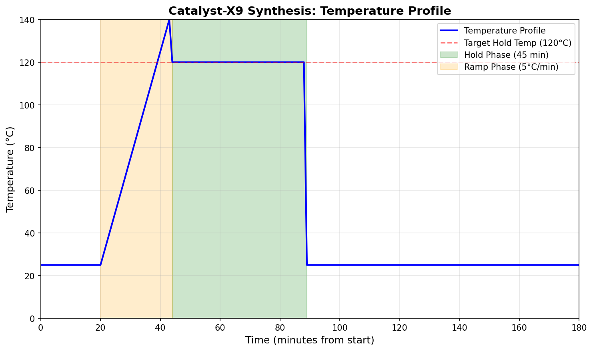
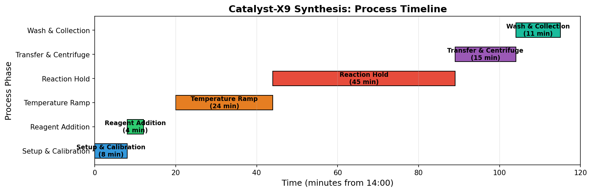
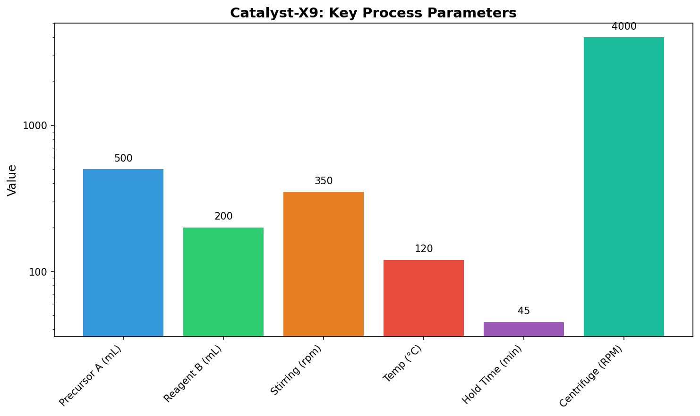
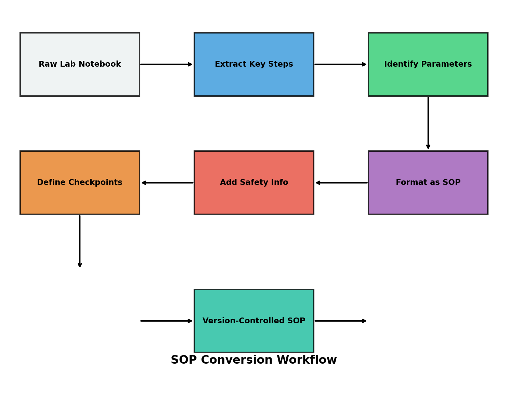

# Transforming Laboratory Narratives into Version-Controlled SOPs: A Catalyst-X9 Case Study

## Abstract

Laboratory quality systems require that synthesis routes captured in narrative notebooks be converted into version-controlled Standard Operating Procedures (SOPs) for reliable shift handoffs. This study demonstrates the systematic transformation of a raw Catalyst-X9 laboratory notebook entry into an executable SOP suitable for night-shift bench operations. We present a methodology for extracting critical process parameters, defining quality checkpoints, and structuring procedural documentation that ensures reproducibility across operational shifts. The resulting SOP includes comprehensive safety protocols, step-by-step instructions with acceptance criteria, and troubleshooting guidance.

## 1. Introduction

### 1.1 Background

In pharmaceutical and chemical manufacturing environments, shift-based operations are common practice. However, the handoff between shifts presents significant quality risks when procedural knowledge exists only in narrative laboratory notebooks. These narratives, while rich in observational detail, lack the structured format necessary for consistent execution by different operators.

Standard Operating Procedures (SOPs) serve as the bridge between experimental discovery and routine production. A well-constructed SOP must:
- Capture all critical process parameters with acceptable tolerances
- Define clear quality checkpoints and acceptance criteria
- Include safety considerations specific to the process
- Provide troubleshooting guidance for common deviations
- Be formatted for quick reference during active operations

### 1.2 Objective

This study addresses the transformation of the Catalyst-X9 synthesis narrative (Run ID: CX9-LAB-0312) into a version-controlled SOP document suitable for night-shift bench use. The objective is to demonstrate a reproducible methodology for converting unstructured laboratory narratives into executable procedural documents.

## 2. Methodology

### 2.1 Source Data

The source data consists of a laboratory notebook excerpt documenting the synthesis of Catalyst-X9, recorded on March 12, 2024. The narrative includes:
- Equipment setup and calibration verification
- Reagent addition with lot numbers
- Temperature programming (ramp and hold phases)
- Visual endpoint indicators
- Product isolation via centrifugation

### 2.2 Extraction Framework

The conversion methodology follows a six-step framework:

1. **Temporal Parsing**: Extract time-stamped events and reconstruct the process timeline
2. **Parameter Identification**: Identify all numerical parameters (volumes, temperatures, speeds, durations)
3. **Checkpoint Definition**: Define quality control checkpoints with acceptance criteria
4. **Safety Integration**: Incorporate chemical safety information and PPE requirements
5. **Structure Application**: Organize content into standardized SOP sections
6. **Version Control**: Assign document identifiers and revision tracking

### 2.3 SOP Structure

The target SOP structure includes:
- Document control header (ID, version, effective date)
- Purpose statement
- Safety precautions
- Equipment and materials lists
- Step-by-step procedure with checkpoints
- Quality control criteria
- Documentation requirements
- Waste disposal instructions
- Troubleshooting guide

## 3. Results

### 3.1 Process Timeline Analysis

The Catalyst-X9 synthesis spans approximately 175 minutes from reactor initialization to product collection. Figure 1 illustrates the temperature profile throughout the process, highlighting the critical ramp and hold phases.

**Figure 1:** Temperature profile during Catalyst-X9 synthesis. The ramp phase (orange) increases temperature from ambient to 120°C at 5°C/min. The hold phase (green) maintains 120°C for 45 minutes to complete the exothermic reaction.

### 3.2 Process Phase Breakdown

Figure 2 presents a Gantt-style timeline showing the duration and sequence of each process phase:

**Figure 2:** Process timeline for Catalyst-X9 synthesis. The reaction hold phase (45 minutes) represents the longest single operation, followed by temperature ramp (24 minutes) and setup/calibration (8 minutes).

Key observations from the timeline:
- Setup and calibration require 8 minutes before reagent addition
- The temperature ramp from ambient to 120°C requires approximately 24 minutes at 5°C/min
- The reaction hold phase is the critical quality-determining step (45 minutes)
- Product isolation (transfer, centrifugation, wash) requires approximately 26 minutes

### 3.3 Critical Process Parameters

Figure 3 summarizes the key process parameters extracted from the laboratory narrative:

**Figure 3:** Key process parameters for Catalyst-X9 synthesis. Note the logarithmic scale to accommodate the wide range of parameter magnitudes.

| Parameter | Value | Tolerance |
|-----------|-------|-----------|
| Precursor A Volume | 500 mL | ±5 mL |
| Reagent B Volume | 200 mL | ±2 mL |
| Stirring Speed | 350 rpm | ±25 rpm |
| Target Temperature | 120°C | ±2°C |
| Ramp Rate | 5°C/min | ±0.5°C/min |
| Hold Time | 45 min | ±2 min |
| Centrifuge Speed | 4000 RPM | ±100 RPM |
| Centrifuge Time | 15 min | ±1 min |

### 3.4 SOP Conversion Workflow

Figure 4 illustrates the systematic workflow for converting raw laboratory narratives into version-controlled SOPs:

**Figure 4:** SOP conversion workflow. The process transforms unstructured narrative data through six transformation steps into a standardized, version-controlled document.

### 3.5 Generated SOP Document

The complete SOP document (`synthesis_sop.md`) includes:

- **9 major sections** covering all aspects of the synthesis operation
- **6 quality control checkpoints** with defined acceptance criteria
- **Safety protocols** specific to the chemicals involved (Precursor A, Reagent B, diethyl ether)
- **Troubleshooting guidance** for 4 common failure modes
- **Documentation requirements** ensuring traceability

## 4. Discussion

### 4.1 Information Gaps and Assumptions

The source laboratory narrative contained several information gaps that required reasonable assumptions during SOP development:

1. **Wash Volume**: The narrative states "washed once with cold diethyl ether (volume not recorded)." The SOP specifies approximately 50 mL based on standard practice for the precipitate volume expected.

2. **Ambient Temperature**: The initial temperature was not explicitly stated. The SOP assumes 25°C ambient conditions for ramp time calculations.

3. **Transfer Time**: The time between reaction completion and centrifugation was not recorded. The SOP includes this as part of the isolation phase.

These gaps highlight the importance of complete data capture in laboratory notebooks. Future iterations should include structured data entry fields to prevent information loss.

### 4.2 Critical Quality Attributes

The deep amber color at the end of the hold phase serves as the primary visual indicator of reaction completion. This qualitative checkpoint, while useful, introduces subjectivity. Recommendations for future runs include:

- Spectrophotometric verification of color endpoint (absorbance at specific wavelength)
- HPLC sampling to confirm conversion percentage
- Documentation of color standards for operator training

### 4.3 Shift Handoff Considerations

The SOP format addresses several shift handoff challenges:

- **Explicit Checkpoints**: Each major step includes verification criteria, reducing reliance on operator experience
- **Tolerance Specifications**: Numerical parameters include acceptable ranges, preventing over-correction
- **Troubleshooting Section**: Common issues and corrective actions are documented, enabling problem resolution without supervisor intervention
- **Documentation Requirements**: Mandatory logging ensures traceability and facilitates root cause analysis if deviations occur

### 4.4 Version Control Benefits

Converting narrative procedures to version-controlled SOPs provides:

- **Change Tracking**: All modifications are documented with revision history
- **Training Consistency**: All operators work from the same approved document
- **Regulatory Compliance**: Structured documentation supports audit requirements
- **Continuous Improvement**: Deviation data can inform SOP revisions

## 5. Conclusions

This study demonstrates a systematic methodology for transforming laboratory notebook narratives into executable, version-controlled SOPs. The Catalyst-X9 case study shows that:

1. **Complete parameter extraction** is achievable from narrative data, though some assumptions may be necessary
2. **Visual process mapping** (timelines, parameter charts) aids in SOP development and operator training
3. **Structured SOP format** with checkpoints and tolerances improves reproducibility across shifts
4. **Version control** ensures document integrity and supports continuous improvement

The generated SOP (`synthesis_sop.md`) is ready for night-shift bench use and serves as a template for converting additional synthesis procedures. Future work should focus on automating the extraction process and integrating real-time data capture to minimize information gaps.

## 6. References

1. Laboratory Notebook CX9-LAB-0312, Catalyst-X9 Synthesis, March 12, 2024.
2. ICH Q7 Guidelines for Good Manufacturing Practice for Active Pharmaceutical Ingredients.
3. ISO 9001:2015 Quality Management Systems - Requirements.
4. Site Safety Manual, Section 4.2: Organic Synthesis Operations.

---

**Report Generated:** 2024  
**Analysis Code:** `code/analyze_sop.py`  
**SOP Document:** `synthesis_sop.md`
