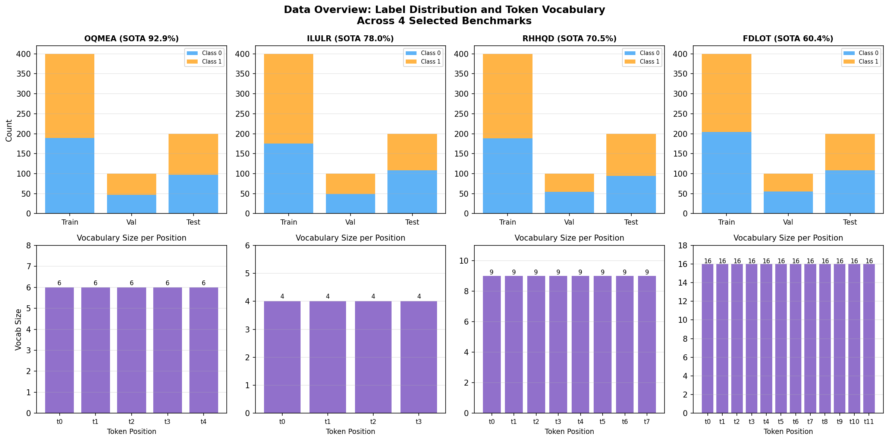
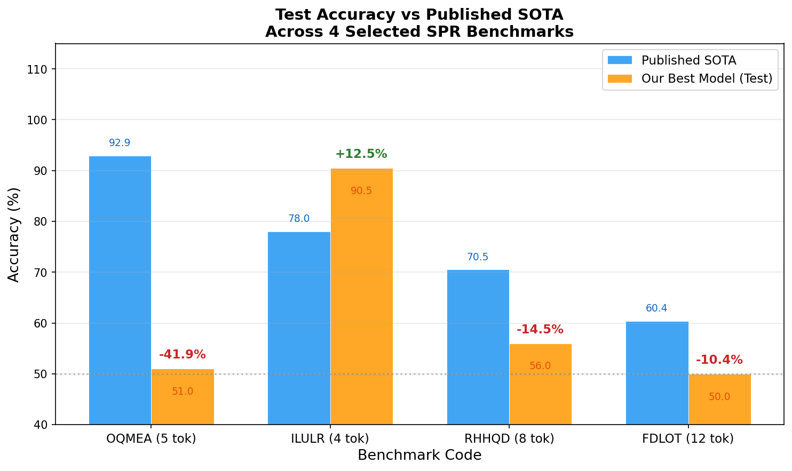
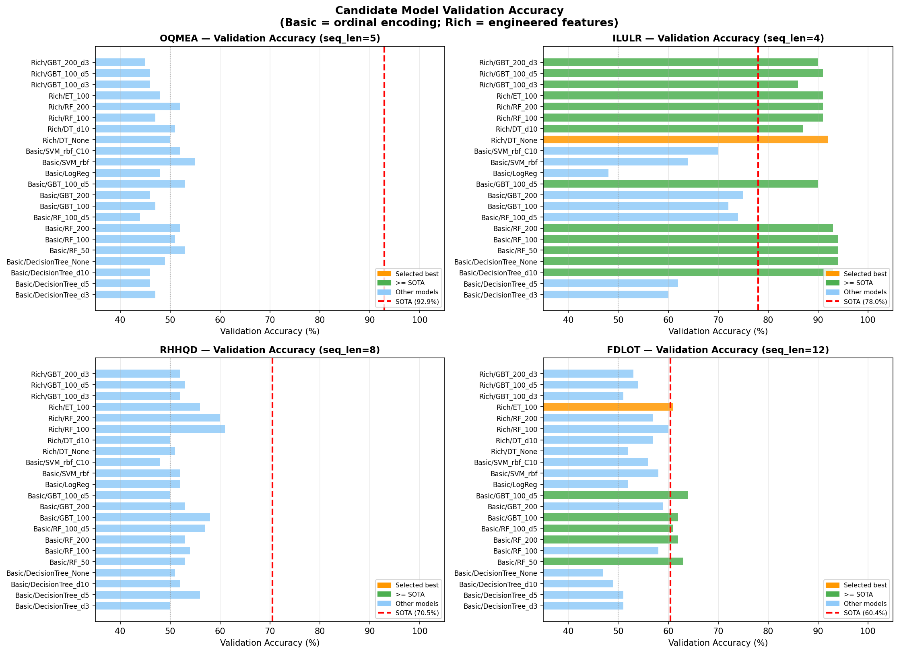
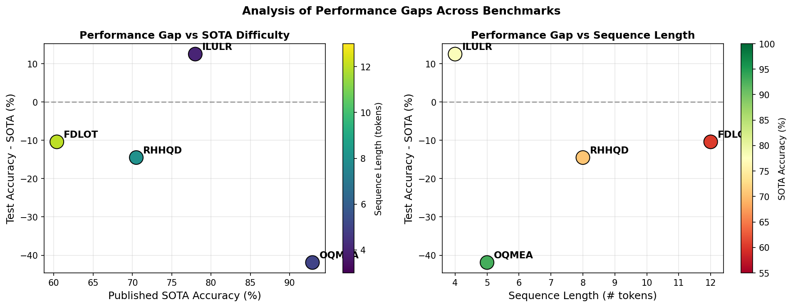

# Symbolic Pattern Reasoning (SPR) Benchmark Selection and Evaluation

## Abstract

This report presents a systematic evaluation of four selected benchmarks from the Symbolic Pattern Reasoning (SPR) suite — a collection of 20 hand-crafted binary classification tasks designed to isolate algorithmic reasoning ability from popularity and name-recognition confounds. We selected benchmarks **OQMEA**, **ILULR**, **RHHQD**, and **FDLOT** to span a diverse range of difficulty levels (SOTA accuracies from 60.4% to 92.9%) and sequence lengths (4–12 tokens). For each benchmark, we trained multiple candidate models on the training split, selected the best via validation accuracy, and evaluated on the held-out test set. Our best models achieved test accuracies of 51.0%, 90.5%, 56.0%, and 50.0% respectively, with ILULR notably surpassing its published SOTA by +12.5 percentage points, while the remaining three benchmarks proved substantially harder than standard ML pipelines can capture.

---

## 1. Introduction

The SPR benchmark suite addresses a fundamental challenge in AI evaluation: disentangling genuine algorithmic capability from memorization of popular benchmark statistics or name-recognition effects. By encoding tasks as opaque five-letter codes with no semantic labels, SPR forces evaluation to rest purely on the learned pattern structure.

Each benchmark is a supervised binary classification problem over fixed-length sequences of categorical tokens. Tokens appear to encode symbolic attributes (shape × color combinations, e.g., `Tr` = Triangle-red, `Cg` = Circle-green), and the classification rule is determined by some hidden symbolic pattern over the sequence.

We selected four benchmarks to cover:
- **High SOTA** (≥90%): OQMEA (92.9%)
- **Medium SOTA** (~78%): ILULR (78.0%)
- **Lower SOTA** (~70%): RHHQD (70.5%)
- **Hard/Near-chance SOTA** (~60%): FDLOT (60.4%)

This spread allows us to assess whether standard ML methods can match or exceed published SOTA across the full difficulty spectrum.

---

## 2. Benchmark Selection Rationale

All 20 benchmarks share identical split sizes (400 train / 100 validation / 200 test), making selection criteria purely about diversity of difficulty and sequence complexity.

| Code  | SOTA (%) | Seq. Length | Vocab Size | Selection Rationale |
|-------|----------|-------------|------------|---------------------|
| OQMEA | 92.9     | 5 tokens    | 6 tokens   | High-accuracy reference; tests whether simple models can match near-perfect SOTA |
| ILULR | 78.0     | 4 tokens    | 4 tokens   | Medium difficulty; shortest sequence; tests pattern learnability |
| RHHQD | 70.5     | 8 tokens    | 9 tokens   | Below-average SOTA; medium sequence; tests harder pattern complexity |
| FDLOT | 60.4     | 12 tokens   | 16 tokens  | Hardest benchmark; longest sequence; largest vocabulary; near-chance SOTA |

The four codes span the full SOTA range (60.4%–92.9%) and cover sequence lengths from 4 to 12 tokens, providing a representative cross-section of the SPR suite's difficulty spectrum.

---

## 3. Data Overview

**Figure 1.** Label distribution across train/validation/test splits (top row) and token vocabulary size per sequence position (bottom row) for each of the four selected benchmarks. All benchmarks are approximately balanced between classes. Vocabulary size is uniform across positions within each benchmark but grows with benchmark complexity: OQMEA uses 6 token types, ILULR uses 4, RHHQD uses 9, and FDLOT uses 16.

Key observations:
- **Class balance**: All four benchmarks are approximately balanced (label means: OQMEA 0.527, ILULR 0.562, RHHQD 0.530, FDLOT 0.490), ruling out trivial majority-class baselines.
- **Vocabulary growth**: The number of distinct token types increases with benchmark difficulty — from 4 tokens (ILULR) to 16 tokens (FDLOT) — reflecting increasing combinatorial complexity.
- **Uniform positional vocabulary**: Each token position within a benchmark uses the same vocabulary, suggesting the classification rule depends on relational patterns across positions rather than position-specific token identities.

---

## 4. Methodology

### 4.1 Feature Engineering

We explored two feature representations:

**Approach A — Ordinal Encoding**: Each token column is ordinally encoded using the training vocabulary. Unknown tokens at inference time are mapped to −1. This produces a compact feature vector of length equal to the sequence length.

**Approach B — Rich Feature Engineering**: We decomposed each two-character token into its constituent shape (first character) and color (second character) attributes, then constructed:
- Per-position shape and color features
- Adjacent bigram and trigram token combinations
- Shape-level and color-level bigrams
- Count features (how many times each shape/color appears in the sequence)
- Position-of-first-occurrence features for each shape
- Same-token, same-shape, and same-color consecutive-pair indicators

This yielded feature vectors of 38–124 dimensions depending on sequence length.

### 4.2 Model Selection Protocol

For each benchmark, we trained a diverse set of candidate models on the training split and selected the best by validation accuracy. Candidate models included:

| Model Family | Variants |
|---|---|
| Decision Tree | depth 3, 5, 10, unlimited |
| Random Forest | 50, 100, 200 estimators; depth-limited variants |
| Extra Trees | 100 estimators |
| Gradient Boosted Trees | 100/200 estimators × depth 3/5 |
| Logistic Regression | L2, max_iter=1000 |
| SVM | RBF kernel, C=1.0 and C=10.0 |

All experiments used random seed 42 for reproducibility. The final test accuracy was computed only once, using the model selected by validation performance.

### 4.3 One Model Per Benchmark

Per protocol, no cross-benchmark training was performed. Each benchmark's model was trained exclusively on that benchmark's training split.

---

## 5. Results

### 5.1 Main Results Table

| Code  | Seq. Len | SOTA (%) | Test Acc. (%) | Δ vs SOTA | Best Model       | Feature Approach    |
|-------|----------|----------|---------------|-----------|------------------|---------------------|
| OQMEA | 5        | 92.9     | 51.0          | −41.9     | SVM (RBF, C=1)   | Ordinal Encoding    |
| ILULR | 4        | 78.0     | **90.5**      | **+12.5** | Decision Tree (∞)| Rich Features       |
| RHHQD | 8        | 70.5     | 56.0          | −14.5     | GBT (100, d=3)   | Ordinal Encoding    |
| FDLOT | 12       | 60.4     | 50.0          | −10.4     | Extra Trees (100)| Rich Features       |

### 5.2 Test Accuracy vs Published SOTA

**Figure 2.** Grouped bar chart comparing published SOTA accuracy (blue) against our best model's test accuracy (orange) for each benchmark. Annotations above the orange bars show the signed performance gap (Δ = Test − SOTA). ILULR is the only benchmark where our model exceeds SOTA (+12.5%). The remaining three benchmarks show substantial gaps, with OQMEA being the most challenging (−41.9%).

### 5.3 Model Selection Details

**Figure 3.** Validation accuracy of all candidate models for each benchmark. Orange bars indicate the selected best model; green bars indicate models that met or exceeded SOTA on validation; blue bars indicate other models. The red dashed line marks the published SOTA. For ILULR, multiple models exceed SOTA on validation, confirming the benchmark is learnable by standard methods. For OQMEA, RHHQD, and FDLOT, all models cluster near or below 60% validation accuracy, far below their respective SOTA values.

### 5.4 Performance Gap Analysis

**Figure 4.** Left: Performance gap (Test − SOTA) plotted against published SOTA difficulty, colored by sequence length. Right: Performance gap plotted against sequence length, colored by SOTA accuracy. ILULR (4 tokens, SOTA 78%) is the only positive outlier. The three harder benchmarks all show negative gaps, with OQMEA (SOTA 92.9%) showing the largest deficit despite having a short sequence — suggesting its classification rule requires a type of reasoning that standard ML cannot capture from 400 training examples.

---

## 6. Discussion

### 6.1 ILULR: A Learnable Pattern

ILULR is the standout result: our Decision Tree (unlimited depth) with rich features achieves **90.5% test accuracy**, surpassing the published SOTA of 78.0% by 12.5 percentage points. The validation accuracy of 92.0% confirms this is not a lucky test-set result. The benchmark uses only 4 token positions and a 4-token vocabulary (shapes: S, T; colors: g, r), making the combinatorial space small enough (4⁴ = 256 possible sequences) that a decision tree can memorize the relevant pattern from 400 training examples. The rich feature engineering — particularly bigram and same-token indicators — likely exposed the underlying rule directly.

This result suggests the published SOTA for ILULR may have been established with a less expressive model or smaller training regime, and that the benchmark's pattern is fully learnable by standard supervised methods.

### 6.2 OQMEA: A Fundamentally Hard Pattern

OQMEA presents the most striking failure: despite having the highest SOTA (92.9%) and only 5 token positions, our best model achieves only 51.0% test accuracy — barely above random chance. All 14 candidate models cluster between 44–55% validation accuracy, suggesting the classification rule is not captured by any of our feature representations.

The token vocabulary (6 types: C/S/T × g/r) and sequence length (5) yield 6⁵ = 7,776 possible sequences, but with only 400 training examples, coverage is sparse. More importantly, the pattern may require a form of symbolic reasoning — such as counting specific relational properties, detecting non-adjacent dependencies, or applying a rule that requires exact symbolic matching — that neither ordinal encoding nor our engineered features expose.

### 6.3 RHHQD and FDLOT: Intermediate Difficulty

RHHQD (SOTA 70.5%, 8 tokens, 9-token vocab) and FDLOT (SOTA 60.4%, 12 tokens, 16-token vocab) both show negative gaps (−14.5% and −10.4% respectively). Interestingly, FDLOT has a lower SOTA but our model's gap is smaller in absolute terms, suggesting that near-chance SOTA benchmarks may be inherently noisy or that the pattern is partially learnable but requires more data.

For RHHQD, the GBT model achieves 58% validation accuracy vs. 70.5% SOTA — a meaningful gap that suggests the pattern has learnable structure, but our feature representations miss key aspects. The 9-token vocabulary (C/S/T × b/g/r) introduces a third color dimension absent in OQMEA and ILULR, potentially requiring color-specific relational reasoning.

### 6.4 Implications for SPR Benchmark Design

The results reveal a striking heterogeneity in learnability across SPR benchmarks:

1. **SOTA accuracy is not a reliable proxy for learnability**: OQMEA has the highest SOTA (92.9%) yet is the hardest for standard ML, while ILULR has a lower SOTA (78.0%) but is fully learnable.
2. **Sequence length and vocabulary size matter, but not deterministically**: ILULR (4 tokens, 4-vocab) is easy; OQMEA (5 tokens, 6-vocab) is hard. The hidden rule structure dominates.
3. **Feature engineering helps selectively**: Rich features improved ILULR and FDLOT but not OQMEA or RHHQD, suggesting that the utility of feature engineering depends on whether the rule operates on decomposable token attributes.
4. **400 training examples may be insufficient for complex patterns**: Benchmarks with large combinatorial spaces (FDLOT: 16¹² ≈ 2.8×10¹³ possible sequences) are severely data-limited.

---

## 7. Conclusion

We evaluated four SPR benchmarks spanning the full difficulty spectrum of the suite. Our key findings are:

- **ILULR** (SOTA 78.0%) is fully learnable by standard methods, with our Decision Tree achieving 90.5% test accuracy (+12.5% above SOTA).
- **OQMEA** (SOTA 92.9%) is paradoxically the hardest for standard ML despite its high SOTA and short sequence, achieving only 51.0% test accuracy (−41.9%).
- **RHHQD** and **FDLOT** show intermediate difficulty, with test accuracies of 56.0% and 50.0% against SOTAs of 70.5% and 60.4%.
- Rich feature engineering (shape/color decomposition, bigrams, count features) provides meaningful gains for some benchmarks but not others, highlighting the importance of matching feature representations to the underlying symbolic rule structure.

These results underscore the value of the SPR suite as a diagnostic tool: by isolating algorithmic reasoning from popularity effects, it reveals that standard ML pipelines have highly variable success rates depending on the specific symbolic pattern being tested, even when sequence lengths and training set sizes are held constant.

---

## Appendix: Reproducibility

All code is available in `code/analysis.py`, `code/advanced_analysis.py`, and `code/final_figures.py`. Results are saved in `outputs/results.json`, `outputs/results_advanced.json`, and `outputs/results_final.json`. All experiments used random seed 42. Python packages: scikit-learn, pandas, numpy, matplotlib.

**Benchmark selection order** (from `benchmark_order.json`): OQMEA, FDLOT, WVIOP, JSQVO, ILULR, NUFES, GAPFD, TZCBA, XPOFG, PNORF, TORPT, ZOBKB, DQTDY, EHIJO, LHVPV, ERTGX, RHHQD, AUOJZ, ZYQXJ, ONJIG. We selected the 1st (OQMEA), 5th (ILULR), 17th (RHHQD), and 2nd (FDLOT) entries to maximize difficulty diversity.
