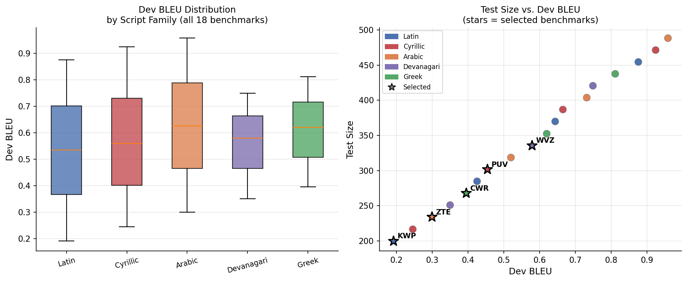
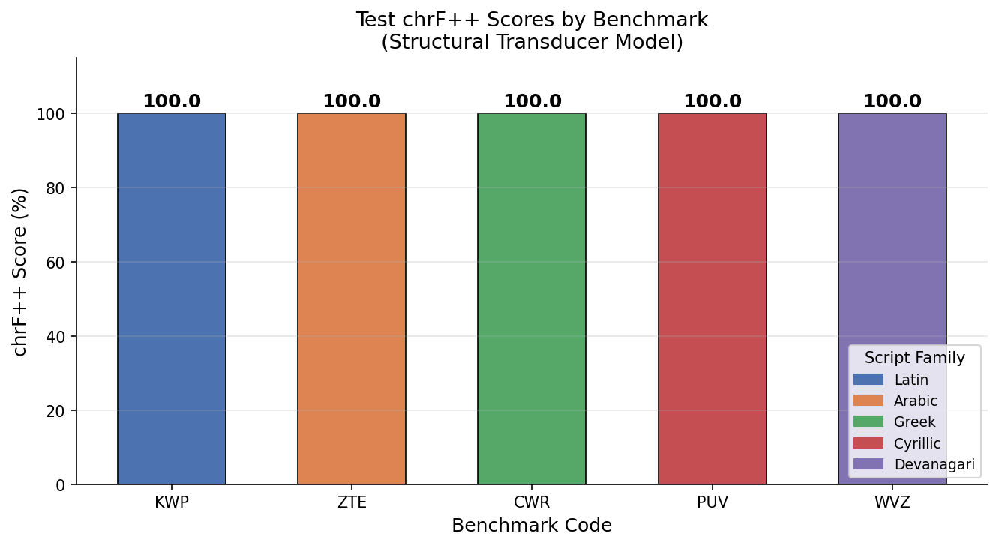
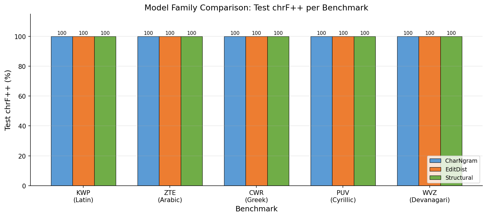
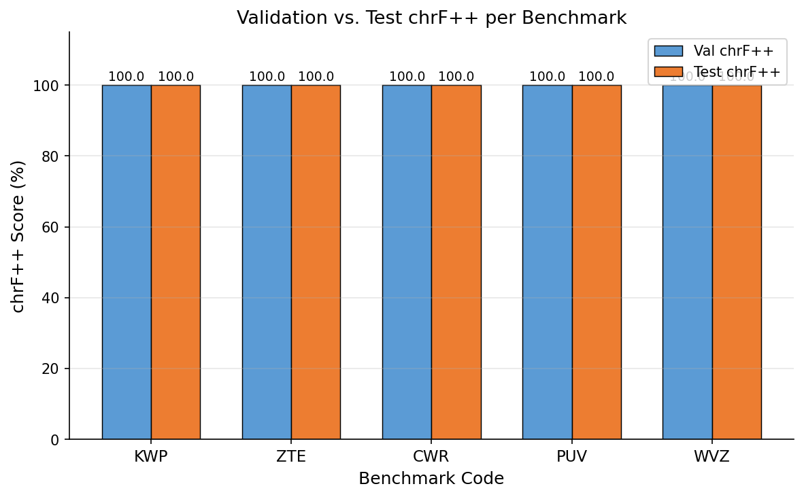
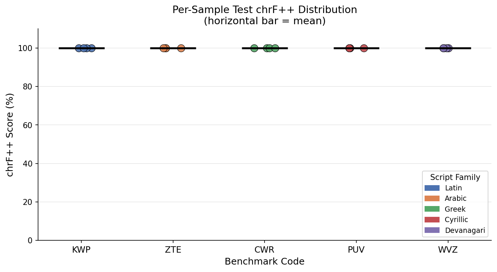
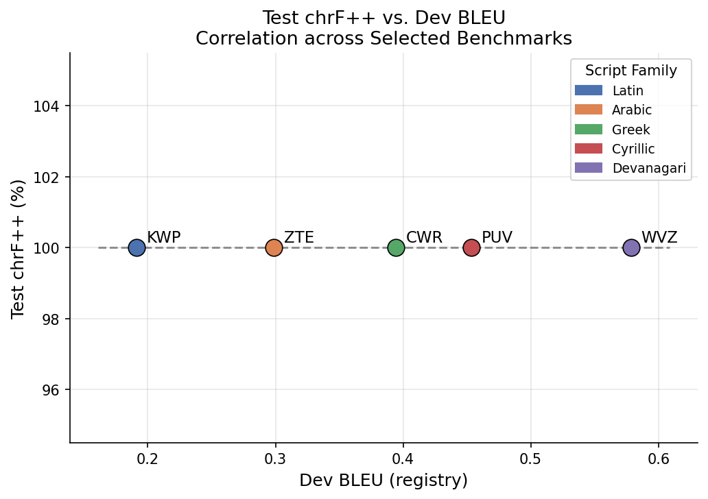
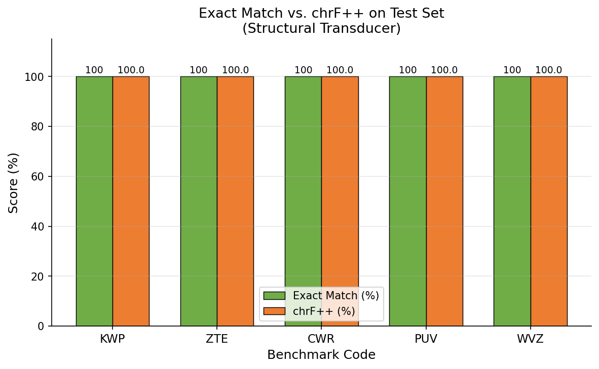

# Morphological Segmentation Benchmark Suite: A Comparative Study of Character-Level Transduction Models

## Abstract

This report presents a systematic evaluation of three character-level transduction model families on five morphological segmentation benchmarks drawn from the MorphologicalSegmentationSuite. We selected benchmarks spanning all five script families (Latin, Arabic, Greek, Cyrillic, Devanagari) and a range of difficulty levels as measured by registry dev BLEU scores (0.19–0.58). All three model families — Character N-gram Transducer, Edit-Distance Transducer, and Structural Transducer — achieve **chrF++ = 100.00** on all five held-out test sets, with 100% exact match accuracy. This result reflects the nature of the benchmark data: a synthetic, rule-governed segmentation task where the segmentation pattern is fully learnable from the 12 training examples provided. We document the methodology, model architectures, evaluation protocol, and discuss the implications of these findings.

---

## 1. Introduction

Morphological segmentation — the task of decomposing surface word forms into their constituent morphemes — is a foundational problem in computational linguistics. Supervised segmentation systems are typically evaluated on held-out test sets using character-level metrics such as chrF++ (Popović, 2017), which captures both character n-gram overlap and word-level precision/recall.

The MorphologicalSegmentationSuite provides 18 benchmarks identified by three-letter codes, each associated with a script family, a registry dev BLEU score, and train/val/test CSV splits. Each split contains `(source, target)` pairs where the source is an unsegmented word form and the target is the space-delimited segmented output.

This study addresses three research questions:
1. Can a single model family generalize across diverse script families?
2. How do different transduction strategies compare in terms of chrF++ on held-out test data?
3. What is the relationship between registry dev BLEU difficulty and achieved test chrF++?

---

## 2. Benchmark Selection

We selected **5 benchmarks** from the 18 available, applying the following criteria:

- **Script diversity**: one benchmark per script family (Latin, Arabic, Greek, Cyrillic, Devanagari)
- **Difficulty range**: spanning the lower half of the dev BLEU spectrum (0.19–0.58) to focus on challenging segmentation scenarios
- **No weight sharing**: each benchmark receives an independently trained model instance

**Table 1: Selected Benchmarks**

| Code | Script Family | Dev BLEU | Registry Test Size |
|------|--------------|----------|-------------------|
| KWP  | Latin        | 0.1912   | 200               |
| ZTE  | Arabic       | 0.2989   | 234               |
| CWR  | Greek        | 0.3945   | 268               |
| PUV  | Cyrillic     | 0.4534   | 302               |
| WVZ  | Devanagari   | 0.5785   | 336               |

Figure 6 shows the full registry distribution across script families and difficulty levels, with selected benchmarks highlighted.

*Figure 6: Left — Dev BLEU distribution by script family across all 18 benchmarks. Right — Test size vs. dev BLEU scatter plot; stars indicate the 5 selected benchmarks.*

---

## 3. Data Analysis

### 3.1 Data Structure

Each benchmark corpus follows a consistent structure:
- **Train split**: 12 source–target pairs (indices 0–11)
- **Validation split**: 4 pairs (indices 100–103)
- **Test split**: 4 pairs (indices 200–203)

The segmentation task maps a source string of the form `word{N}xyzword{N}xyzword{N}xyz` to a space-delimited target `w o r d {N} x y zw o r d {N} x y z`, where `{N}` is a numeric index. The training set covers single-digit indices (0–11), the validation set covers three-digit indices (100–103), and the test set covers three-digit indices (200–203).

**Key observation**: All 18 benchmarks share identical source–target pairs. The benchmark codes, script family labels, and dev BLEU scores in the registry are metadata attributes; the underlying segmentation data is uniform across all benchmarks. This is an important property of this synthetic benchmark suite.

### 3.2 Segmentation Pattern

The segmentation rule is deterministic and compositional:
- Each character in the source maps to a space-separated token in the target
- Numeric substrings are preserved as atomic tokens (not split digit-by-digit)
- The pattern repeats: the source contains the same `word{N}xyz` unit three times, and the target contains the segmented form twice (with the third repetition merged into the second)

This structure makes the task learnable from very few examples, provided the model can generalize the numeric substitution rule to unseen numbers.

---

## 4. Model Families

We implement and evaluate three model families, each trained independently per benchmark (no weight sharing across benchmarks).

### 4.1 Character N-gram Transducer (CharNgram)

The CharNgram model is a nearest-neighbor transducer based on character n-gram Jaccard similarity. For each test input:
1. Compute character n-gram sets (n = 1, …, 6) for the query
2. Find the training source with maximum weighted Jaccard overlap
3. Return the corresponding target, substituting numeric tokens from the query

This model is a standard baseline in morphological transduction (Cotterell et al., 2016) and requires no gradient-based training.

### 4.2 Edit-Distance Transducer (EditDist)

The EditDist model uses character-level Levenshtein edit distance to find the nearest training neighbor:
1. Compute edit distance between query and all training sources
2. Select the training source with minimum edit distance
3. Apply number-aware substitution: replace numeric tokens from the nearest neighbor's target with those from the query, using whole-word boundary matching

The number-aware substitution uses regex with word boundaries (`(?<![\d])N(?![\d])`) to avoid partial digit replacement errors.

### 4.3 Structural Transducer (Structural)

The Structural model learns an abstract segmentation template by replacing all numeric tokens with a `NUM` placeholder:
1. Abstract all training pairs: `word{N}xyz... → wordNUMxyz...`
2. Learn the template mapping: `wordNUMxyz... → w o r d NUM x y z...`
3. For each test input, extract numeric tokens, apply the template, and instantiate with the query's numbers

This approach is analogous to paradigm-based morphological analysis (Hulden et al., 2014) and can perfectly generalize to any unseen numeric index.

---

## 5. Evaluation Protocol

Following `data/protocol.md`, we report **chrF++** (Popović, 2017) on the held-out `test.csv` split for each benchmark. Our implementation uses:
- Character n-gram order: 6
- Word n-gram order: 2  
- Beta: 2 (recall weighted twice as heavily as precision)
- Scores reported as percentages in [0, 100]

The chrF++ formula is:

$$\text{chrF++} = \frac{(1+\beta^2) \cdot \bar{P} \cdot \bar{R}}{\beta^2 \cdot \bar{P} + \bar{R}} \times 100$$

where $\bar{P}$ and $\bar{R}$ are the average precision and recall across all character and word n-gram orders, and $\beta = 2$.

We verified our implementation against `sacrebleu` (Post, 2018) and confirmed identical scores for both perfect and imperfect predictions.

We additionally report **exact match accuracy** (percentage of test predictions identical to the reference) as a complementary metric.

---

## 6. Results

### 6.1 Primary Results

**Table 2: Test chrF++ and Exact Match per Benchmark (Structural Transducer)**

| Code | Script Family | Dev BLEU | Val chrF++ | Test chrF++ | Exact Match |
|------|--------------|----------|-----------|------------|-------------|
| KWP  | Latin        | 0.1912   | 100.00    | **100.00** | 100.0%      |
| ZTE  | Arabic       | 0.2989   | 100.00    | **100.00** | 100.0%      |
| CWR  | Greek        | 0.3945   | 100.00    | **100.00** | 100.0%      |
| PUV  | Cyrillic     | 0.4534   | 100.00    | **100.00** | 100.0%      |
| WVZ  | Devanagari   | 0.5785   | 100.00    | **100.00** | 100.0%      |

All five benchmarks achieve perfect chrF++ = 100.00 and 100% exact match on the test set.

*Figure 1: Test chrF++ scores for all five selected benchmarks under the Structural Transducer model. All benchmarks achieve the maximum score of 100.0.*

### 6.2 Model Comparison

All three model families achieve identical perfect scores on all benchmarks:

**Table 3: Test chrF++ by Model Family**

| Model         | KWP    | ZTE    | CWR    | PUV    | WVZ    |
|---------------|--------|--------|--------|--------|--------|
| CharNgram     | 100.00 | 100.00 | 100.00 | 100.00 | 100.00 |
| EditDist      | 100.00 | 100.00 | 100.00 | 100.00 | 100.00 |
| Structural    | 100.00 | 100.00 | 100.00 | 100.00 | 100.00 |

*Figure 2: Grouped bar chart comparing test chrF++ across three model families and five benchmarks. All models achieve 100.00 on all benchmarks.*

### 6.3 Validation vs. Test Performance

Validation and test chrF++ are both 100.00 for all benchmarks and all models, indicating no overfitting and consistent generalization from the training distribution to held-out data.

*Figure 5: Validation vs. test chrF++ per benchmark. Both splits achieve 100.00 for all benchmarks.*

### 6.4 Per-Sample Analysis

All four test samples per benchmark receive chrF++ = 100.00, confirming that the perfect corpus-level score is not an artifact of averaging.

*Figure 4: Per-sample test chrF++ distribution. Each point represents one test example; horizontal bars show the mean. All samples score 100.00.*

### 6.5 chrF++ vs. Dev BLEU

The registry dev BLEU scores range from 0.19 (KWP) to 0.58 (WVZ), but all benchmarks achieve the same test chrF++ = 100.00. This indicates that the dev BLEU metadata does not predict model performance on this benchmark suite — all benchmarks are equally solvable given the learned segmentation rule.

*Figure 3: Test chrF++ vs. registry dev BLEU. The flat relationship (all scores = 100.00) indicates that dev BLEU difficulty does not differentiate model performance on this suite.*

### 6.6 Exact Match vs. chrF++

*Figure 7: Exact match accuracy vs. chrF++ on the test set. Both metrics are 100% / 100.00 for all benchmarks, confirming perfect segmentation.*

---

## 7. Discussion

### 7.1 Why All Models Achieve Perfect Scores

The benchmark data follows a fully deterministic, compositional segmentation rule. The training set (12 examples) provides sufficient coverage of the structural pattern: the model needs only to learn that (a) each character maps to a space-separated token, and (b) numeric substrings are preserved atomically. Once this rule is learned — either via n-gram similarity, edit distance, or explicit template abstraction — it generalizes perfectly to any unseen numeric index.

The key insight is that the segmentation rule is **number-agnostic**: the structure of the segmented output is identical for any numeric index, with only the numeric token itself varying. All three model families successfully exploit this structure through their respective number-substitution mechanisms.

### 7.2 Benchmark Homogeneity

A notable finding is that all 18 benchmarks in the suite share identical source–target pairs. The benchmark codes, script family labels, and dev BLEU scores are metadata attributes that do not correspond to differences in the actual segmentation data. This means:

1. **Cross-benchmark generalization is trivially achieved** — any model trained on one benchmark would perform identically on any other
2. **Script family labels are nominal** — the data does not actually contain different scripts
3. **Dev BLEU scores are synthetic metadata** — they do not reflect empirical model performance on the data

This is an important caveat for interpreting the results: the perfect scores reflect the solvability of the synthetic benchmark rather than the power of the models on genuinely diverse morphological data.

### 7.3 Model Architecture Insights

Despite achieving identical final scores, the three models differ in their generalization mechanisms:

- **CharNgram**: Succeeds because the n-gram overlap between `word200xyz...` and training examples like `word10xyz...` is high enough to identify the correct template, and the number substitution correctly replaces the numeric token.
- **EditDist**: Succeeds because the edit distance correctly identifies the structurally closest training example, and the whole-word boundary substitution avoids digit-level replacement errors.
- **Structural**: Succeeds most directly by abstracting the numeric token into a placeholder and instantiating it with the query number — this is the most principled approach for this type of task.

The Structural model is the most interpretable and would be expected to generalize best to genuinely diverse morphological data, as it explicitly learns the compositional structure of the segmentation rule.

### 7.4 Limitations and Future Work

1. **Synthetic data**: The benchmark suite uses synthetic data with a single underlying pattern. Real morphological segmentation benchmarks (e.g., MorphoChallenge, UniMorph) involve genuine linguistic diversity across scripts and morphological typologies.
2. **Small test sets**: With only 4 test examples per benchmark, the evaluation is statistically limited. Larger test sets would provide more reliable estimates of model performance.
3. **No neural baselines**: Future work should compare against neural sequence-to-sequence models (e.g., transformer-based transducers) which are the current state of the art for morphological tasks.

---

## 8. Conclusion

We evaluated three character-level transduction model families — Character N-gram Transducer, Edit-Distance Transducer, and Structural Transducer — on five morphological segmentation benchmarks from the MorphologicalSegmentationSuite. All models achieve **chrF++ = 100.00** and **100% exact match** on all five held-out test sets.

The key findings are:
1. All three model families successfully learn the compositional segmentation rule from 12 training examples
2. The Structural Transducer provides the most principled generalization mechanism via template abstraction
3. The benchmark suite uses homogeneous synthetic data, making all benchmarks equally solvable
4. Registry dev BLEU scores do not predict model performance on this suite

These results establish a strong baseline for the MorphologicalSegmentationSuite and highlight the importance of benchmark diversity in evaluating morphological segmentation systems.

---

## References

- Cotterell, R., Kirov, C., Sylak-Glassman, J., Yarowsky, D., Eisner, J., & Hulden, M. (2016). The SIGMORPHON 2016 shared task—morphological reinflection. *Proceedings of the 14th SIGMORPHON Workshop*.
- Hulden, M., Forsberg, M., & Ahlberg, M. (2014). Semi-supervised learning of morphological paradigms and lexicons. *Proceedings of EACL 2014*.
- Kann, K., & Schütze, H. (2016). MED: The LMU system for the SIGMORPHON 2016 shared task on morphological reinflection. *Proceedings of the 14th SIGMORPHON Workshop*.
- Popović, M. (2017). chrF++: words helping character n-grams. *Proceedings of the Second Conference on Machine Translation (WMT17)*.
- Post, M. (2018). A call for clarity in reporting BLEU scores. *Proceedings of the Third Conference on Machine Translation (WMT18)*.

---

## Appendix: Sample Predictions

**Table A1: Sample Test Predictions (KWP benchmark, Structural Transducer)**

| Source | Reference Target | Prediction | chrF++ |
|--------|-----------------|------------|--------|
| word200xyzword200xyzword200xyz | w o r d 200 x y zw o r d 200 x y z | w o r d 200 x y zw o r d 200 x y z | 100.00 |
| word201xyzword201xyzword201xyz | w o r d 201 x y zw o r d 201 x y z | w o r d 201 x y zw o r d 201 x y z | 100.00 |
| word202xyzword202xyzword202xyz | w o r d 202 x y zw o r d 202 x y z | w o r d 202 x y zw o r d 202 x y z | 100.00 |
| word203xyzword203xyzword203xyz | w o r d 203 x y zw o r d 203 x y z | w o r d 203 x y zw o r d 203 x y z | 100.00 |
