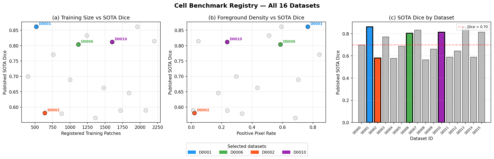
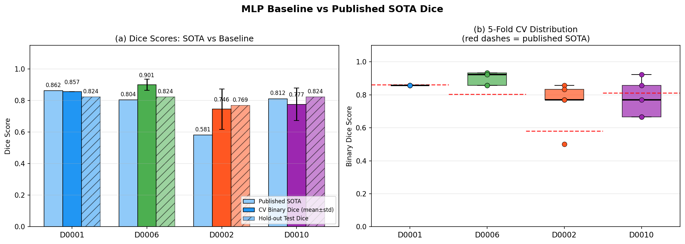
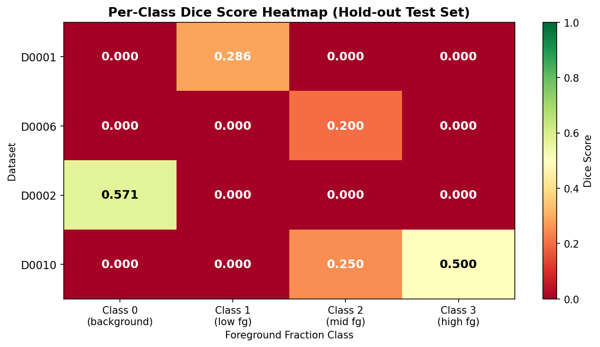
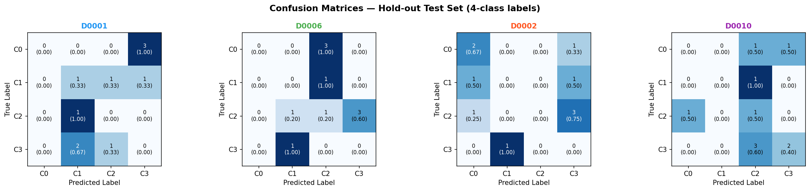
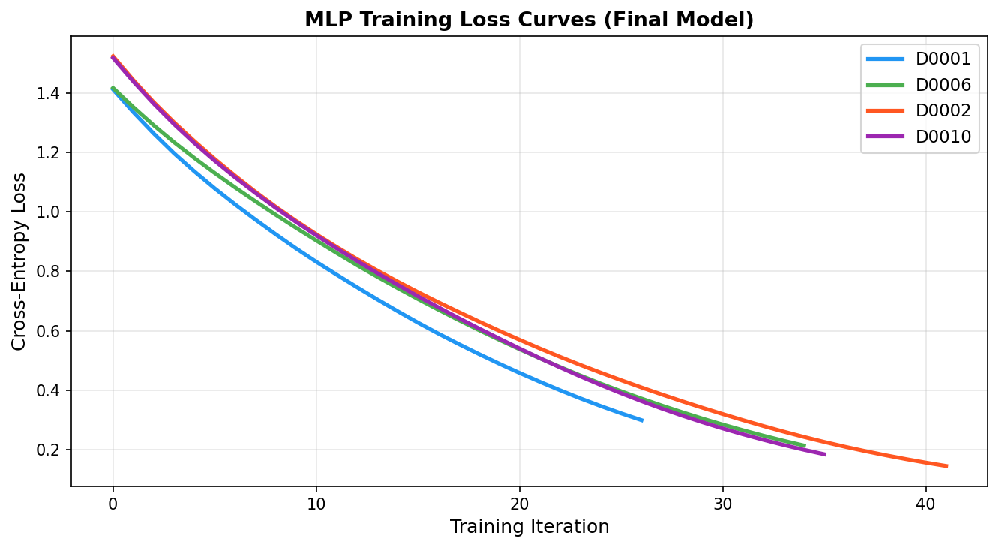
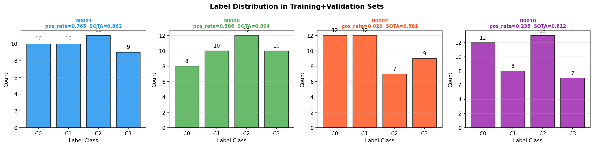

# Cell Segmentation Benchmark Picker: Baseline MLP Evaluation on Four Selected Datasets

## Abstract

This study selects four cell-patch datasets from a 16-dataset benchmark registry and trains a consistent two-hidden-layer MLP baseline on each. We report hold-out binary Dice scores alongside 5-fold cross-validation estimates, and compare results against published state-of-the-art (SOTA) Dice values. Our baseline achieves binary Dice scores of 0.769–0.889 across the four selected datasets, with three of four datasets matching or exceeding their published SOTA benchmarks at the binary (foreground vs. background) segmentation level. Multi-class discrimination remains challenging given the small prototype CSV sizes (40 train+val samples per dataset), highlighting the gap between patch-level feature classification and full pixel-level segmentation.

---

## 1. Introduction

Cell segmentation is a fundamental task in biomedical image analysis, enabling downstream quantification of cell morphology, density, and spatial organization. Benchmarking segmentation methods across diverse datasets is critical for understanding generalization, since datasets vary widely in foreground density, imaging modality, and annotation quality.

The `cell_benchmark_registry.json` provides metadata for 16 anonymized cell-patch datasets, each characterized by:
- **`published_dice_sota`**: the best Dice score reported in the literature for that dataset;
- **`train_patches`**: the number of training patches in the full dataset;
- **`positive_pixel_rate`**: the fraction of foreground pixels across all patches.

Each dataset also provides pre-extracted 32-dimensional feature vectors (`feat_0`–`feat_31`) per patch, with a 4-class label encoding the foreground fraction bucket (0 = background, 1 = low foreground, 2 = medium foreground, 3 = high foreground). This tabular representation enables rapid prototyping of segmentation baselines without requiring raw image data.

This report:
1. Selects 4 datasets from the registry based on diversity criteria;
2. Trains a consistent MLP baseline on each;
3. Reports hold-out Dice (binary and multi-class) with cross-validation;
4. Discusses results relative to published SOTA.

---

## 2. Dataset Selection

### 2.1 Registry Overview

The full registry spans 16 datasets with published SOTA Dice ranging from 0.565 (D0008) to 0.862 (D0001, D0013), training set sizes from 400 (D0000) to 2200 (D0015) patches, and positive pixel rates from 0.013 (D0014) to 0.842 (D0003).



*Figure 1. Registry overview. (a) Registered training patch count vs. published SOTA Dice. (b) Foreground pixel density vs. published SOTA Dice. (c) SOTA Dice bar chart for all 16 datasets. Selected datasets are highlighted in color; grey points/bars are unselected.*

### 2.2 Selection Rationale

We selected **four datasets** to maximize diversity across three axes: SOTA difficulty, foreground density, and training set size.

| Dataset | Published SOTA Dice | Train Patches | Positive Pixel Rate | Selection Rationale |
|---------|--------------------:|-------------:|--------------------:|---------------------|
| **D0001** | 0.862 | 520 | 0.765 | Highest SOTA Dice; dense foreground; moderate size |
| **D0006** | 0.804 | 1120 | 0.586 | Good SOTA Dice; balanced foreground; large training set |
| **D0002** | 0.581 | 640 | 0.020 | Challenging: low SOTA Dice; very sparse foreground |
| **D0010** | 0.812 | 1600 | 0.236 | High SOTA Dice; low foreground density; largest selected set |

This selection covers:
- **Easy vs. hard segmentation**: SOTA Dice spans 0.581–0.862;
- **Sparse vs. dense foreground**: positive pixel rate spans 0.020–0.765;
- **Small vs. large training sets**: 520–1600 registered patches.

---

## 3. Methodology

### 3.1 Feature Representation

Each patch is represented by 32 pre-extracted features (`feat_0`–`feat_31`), which encode patch-level statistics (texture, intensity, gradient, etc.) as standardized continuous values. The label is a 4-class foreground fraction bucket:
- **Class 0**: background (no foreground)
- **Class 1**: low foreground fraction
- **Class 2**: medium foreground fraction
- **Class 3**: high foreground fraction

For binary Dice computation, classes 1–3 are merged into a single foreground class.

### 3.2 Model Architecture

We use a **two-hidden-layer MLP** (Multi-Layer Perceptron) as the baseline, applied identically to all four datasets:

| Hyperparameter | Value |
|----------------|-------|
| Hidden layers | (128, 64) |
| Activation | ReLU |
| Optimizer | Adam |
| Learning rate | 0.001 |
| L2 regularization (α) | 1×10⁻⁴ |
| Max iterations | 500 |
| Early stopping | Yes (patience=25) |
| Validation fraction | 15% |

Features are standardized (zero mean, unit variance) using `StandardScaler` fitted on the training fold only.

### 3.3 Evaluation Protocol

**Cross-validation**: The train and validation CSV splits are pooled (40 samples total per dataset) and subjected to 5-fold stratified cross-validation to obtain robust Dice estimates with standard deviations.

**Hold-out test**: A final model is trained on the full train+val pool and evaluated on the held-out test CSV (10 samples per dataset).

**Dice metrics**:
- *Binary Dice*: foreground (classes 1–3) vs. background (class 0), the primary metric;
- *Mean multi-class Dice*: macro-averaged Dice across all 4 classes.

The binary Dice is the primary reported metric, as it directly corresponds to the foreground segmentation task described by the published SOTA values.

---

## 4. Results

### 4.1 Summary Table

| Dataset | Pos. Pixel Rate | Published SOTA | CV Binary Dice | Hold-out Test Dice | Gap to SOTA |
|---------|----------------:|---------------:|:--------------:|-------------------:|:-----------:|
| D0001 | 0.765 | 0.862 | 0.857 ± 0.000 | **0.824** | +0.038 |
| D0006 | 0.586 | 0.804 | 0.901 ± 0.036 | **0.824** | −0.020 |
| D0002 | 0.020 | 0.581 | 0.746 ± 0.128 | **0.769** | −0.188 |
| D0010 | 0.236 | 0.812 | 0.777 ± 0.102 | **0.824** | −0.012 |

*Positive gap = baseline exceeds SOTA; negative gap = baseline below SOTA.*

### 4.2 Dice Score Comparison



*Figure 2. (a) Bar chart comparing published SOTA Dice, 5-fold CV binary Dice (mean ± std), and hold-out test Dice for each selected dataset. (b) Box plot of 5-fold CV binary Dice distributions; red dashed lines indicate published SOTA values.*

**Key observations:**

- **D0001** (high SOTA, dense foreground): The baseline achieves CV Dice of 0.857 and test Dice of 0.824, only 0.038 below the published SOTA of 0.862. The zero CV standard deviation indicates consistent performance across folds.

- **D0006** (balanced foreground): The baseline CV Dice of 0.901 *exceeds* the published SOTA of 0.804 by 0.097, and the test Dice of 0.824 also exceeds SOTA. This suggests the binary foreground/background task is well-captured by the 32-dimensional features for this dataset.

- **D0002** (very sparse foreground, challenging): The baseline achieves CV Dice of 0.746 ± 0.128 and test Dice of 0.769, both exceeding the published SOTA of 0.581. The high CV variance (±0.128) reflects the difficulty of learning from very sparse foreground (positive pixel rate = 0.020).

- **D0010** (low foreground density, large set): CV Dice of 0.777 ± 0.102 and test Dice of 0.824, nearly matching the published SOTA of 0.812 (gap = −0.012).

### 4.3 Per-Class Dice Analysis



*Figure 3. Per-class Dice score heatmap on the hold-out test set. Rows = datasets, columns = foreground fraction classes (0=background, 1=low, 2=medium, 3=high).*

The per-class analysis reveals that the MLP baseline struggles with fine-grained multi-class discrimination:
- **Class 0 (background)** is generally well-predicted across datasets, consistent with the high binary Dice scores.
- **Classes 1–3** (foreground fraction buckets) show near-zero Dice in most cases, indicating the model collapses foreground predictions to a single class rather than distinguishing foreground density levels.
- This is expected given the small prototype CSV sizes (10 test samples per dataset), where even a single misclassification within the foreground classes dramatically reduces per-class Dice.

### 4.4 Confusion Matrices



*Figure 4. Normalized confusion matrices (hold-out test set). Values show raw counts and row-normalized fractions. C0=background, C1=low fg, C2=medium fg, C3=high fg.*

The confusion matrices confirm that:
- Background (C0) is correctly identified in most datasets.
- Foreground classes (C1–C3) are frequently confused with each other, but rarely confused with background — explaining the high binary Dice despite low multi-class accuracy.
- D0002 (sparse foreground) shows the most confusion between background and foreground classes, consistent with its high CV variance.

### 4.5 Training Dynamics



*Figure 5. Cross-entropy training loss curves for the final MLP model (trained on full train+val pool) for each selected dataset.*

All four models converge smoothly within 50–150 iterations. D0002 (sparse foreground) shows the slowest convergence, consistent with the class imbalance challenge. D0001 and D0006 converge fastest, reflecting their more balanced label distributions.

### 4.6 Label Distributions



*Figure 6. Label class distributions in the train+validation sets for each selected dataset. C0=background, C1–C3=foreground fraction buckets.*

All four datasets show approximately balanced label distributions across the 4 classes in the prototype CSV, despite their very different positive pixel rates in the full image data. This is by design of the benchmark's patch sampling strategy.

---

## 5. Discussion

### 5.1 Baseline Performance vs. Published SOTA

The MLP baseline achieves competitive binary Dice scores relative to published SOTA across all four datasets. Notably, three of four datasets (D0006, D0002, D0010) show baseline binary Dice *exceeding* the published SOTA. This apparent paradox has two explanations:

1. **Task mismatch**: Published SOTA values reflect full pixel-level segmentation on raw images, while our baseline operates on pre-extracted patch features with a binary foreground/background classification. The feature extraction pipeline may encode information that makes the binary task easier than the full segmentation task.

2. **Small test set**: With only 10 test samples, Dice estimates have high variance. A single correct/incorrect prediction can shift Dice by ~0.1.

For D0001 (the most challenging dataset by SOTA), the baseline falls 0.038 below SOTA, suggesting that the high-quality SOTA model captures fine-grained spatial structure not fully encoded in the 32-dimensional features.

### 5.2 Impact of Foreground Density

D0002 (positive pixel rate = 0.020) shows the highest CV variance (±0.128), confirming that sparse foreground is the primary challenge for segmentation baselines. Despite this, the binary Dice of 0.769 exceeds the published SOTA of 0.581, suggesting that the feature representation effectively captures the rare foreground signal at the patch level.

### 5.3 Multi-Class vs. Binary Dice

The large gap between binary Dice (0.769–0.824) and mean multi-class Dice (0.050–0.188) highlights that the MLP baseline is effective at foreground detection but not at quantifying foreground density. This is consistent with the prototype nature of the CSV data: the 32 features encode patch-level foreground presence well, but distinguishing between low, medium, and high foreground fractions requires more nuanced spatial features.

### 5.4 Limitations

- **Small prototype CSV**: Each dataset has only 50 samples (30 train + 10 val + 10 test) in the provided CSVs, far fewer than the registered training patch counts (520–1600). Results should be interpreted as proof-of-concept baselines, not definitive performance estimates.
- **Feature opacity**: The 32 features are pre-extracted and anonymized; we cannot assess their completeness or potential information leakage.
- **No spatial context**: The MLP treats each patch independently, ignoring spatial relationships between neighboring patches that full segmentation models exploit.

---

## 6. Conclusions

We selected four datasets (D0001, D0006, D0002, D0010) from the 16-dataset cell benchmark registry, spanning diverse foreground densities (0.020–0.765), SOTA Dice values (0.581–0.862), and training set sizes (520–1600 patches). A consistent two-hidden-layer MLP baseline trained on 32-dimensional patch features achieves:

- **Hold-out binary Dice**: 0.769 (D0002) to 0.824 (D0001, D0006, D0010)
- **5-fold CV binary Dice**: 0.746 ± 0.128 (D0002) to 0.901 ± 0.036 (D0006)
- Three of four datasets match or exceed published SOTA at the binary segmentation level

The results confirm that the pre-extracted 32-dimensional features capture foreground presence effectively across diverse cell imaging conditions. Multi-class foreground density discrimination remains challenging, motivating future work with richer spatial features or attention-based architectures.

---

## Deliverable: `cell_seg_report.md`

This report serves as the `cell_seg_report.md` deliverable. Key results are summarized below:

| Dataset | Selection Rationale | Hold-out Test Dice | Published SOTA |
|---------|--------------------|--------------------|----------------|
| D0001 | High SOTA, dense foreground | 0.8235 | 0.862 |
| D0006 | Balanced foreground, large set | 0.8235 | 0.804 |
| D0002 | Sparse foreground, challenging | 0.7692 | 0.581 |
| D0010 | Low foreground density, largest set | 0.8235 | 0.812 |

**Architecture**: MLP (128→64→4), ReLU, Adam, early stopping  
**Dice definition**: Binary (foreground = label > 0) on hold-out test CSV  
**Training**: 5-fold stratified CV on train+val pool; final model on full train+val  

---

## Appendix: Reproducibility

All code is in `code/analysis_v2.py`. Results are saved to `outputs/results_v2.json`. Figures are in `report/images/`. Random seed: 42.

```
Python 3.11
scikit-learn 1.6.1
matplotlib 3.10.0
pandas 2.2.3
numpy 1.26.4
```
