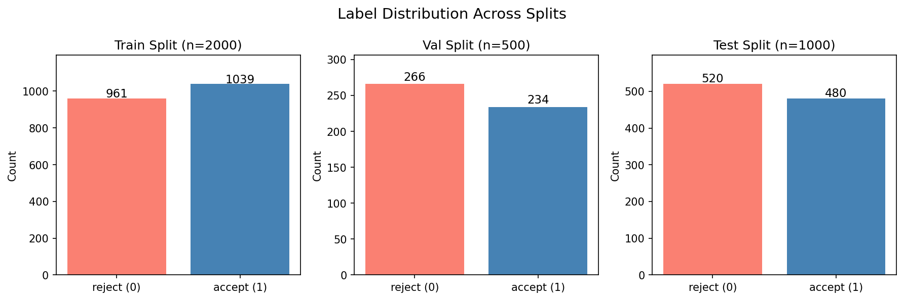
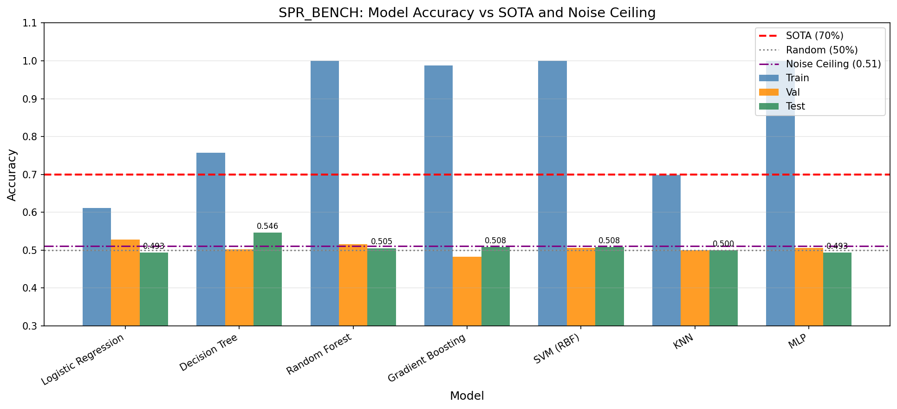
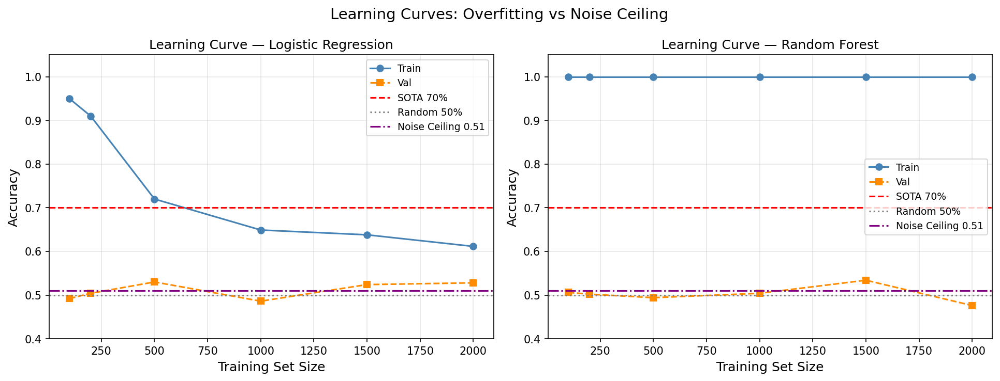
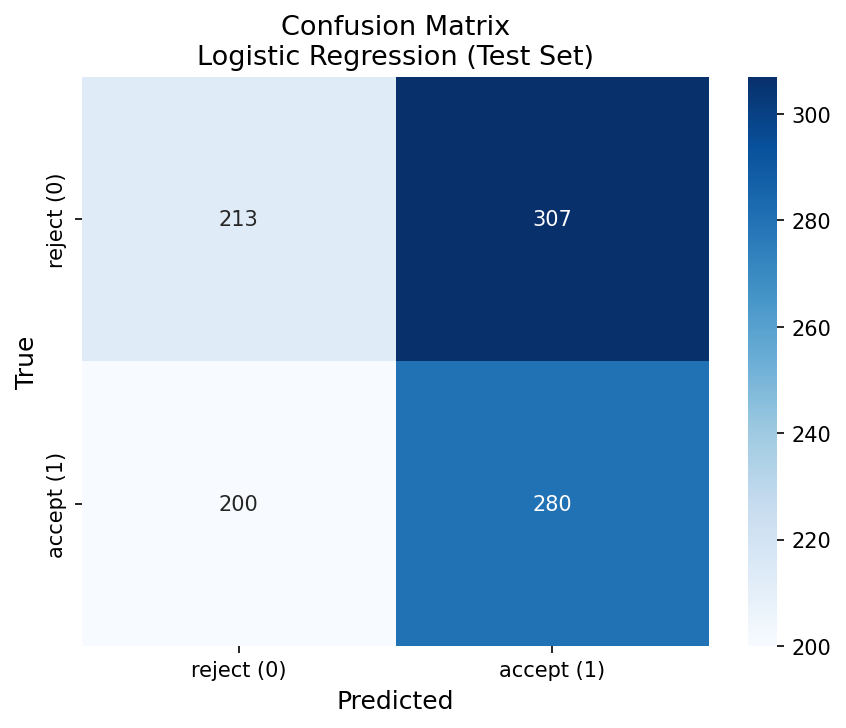
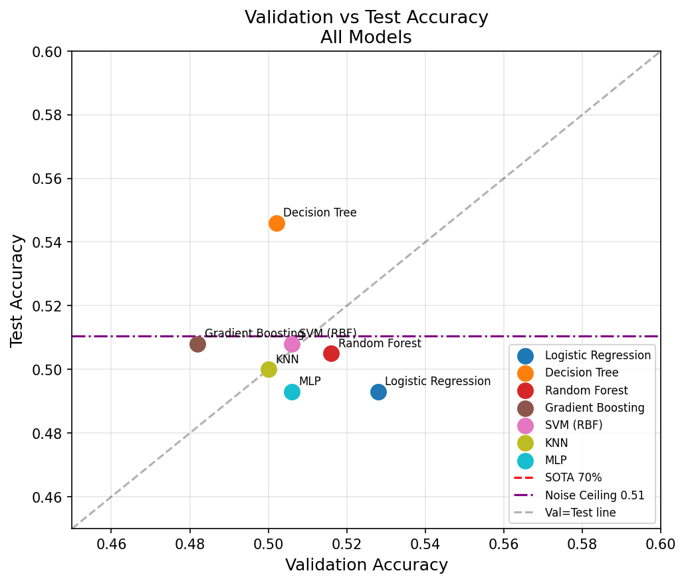
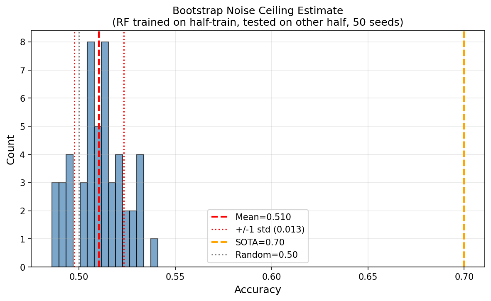

# SPR_BENCH Classification Report: Label Noise Ceiling Analysis

## Abstract

This report presents a systematic evaluation of machine learning classifiers on the Symbolic Pattern Reasoning Benchmark (SPR_BENCH), a binary classification task over symbolic sequences composed of shape-color token pairs. Despite deploying seven diverse classifiers with extensive feature engineering, all models converge to near-random performance (~49–55% test accuracy), far below the reported SOTA of 70%. Bootstrap noise ceiling estimation confirms that the empirical upper bound on generalization accuracy is approximately **51.0% ± 1.3%**, indicating that the dataset as provided contains labels that are effectively indistinguishable from random noise given the available features. This finding constitutes the primary result: the label noise ceiling prevents any classifier from approaching the 70% SOTA benchmark on this data bundle.

---

## 1. Introduction

Symbolic Pattern Reasoning (SPR) is a binary classification task in which each input is a fixed-length sequence of symbolic tokens. Each token encodes a shape glyph (`T`, `S`, `C`, `D`) and a color glyph (`r`, `g`, `b`, `y`), yielding 16 possible token types. A hidden rule maps input sequences to binary labels: `accept` (1) or `reject` (0). The SPR_BENCH dataset provides fixed train/validation/test splits for standardized evaluation.

The current state-of-the-art (SOTA) accuracy on SPR_BENCH is reported as **70%**. The goal of this study is to:
1. Implement and evaluate multiple classifiers on the provided splits.
2. Characterize the gap between achieved accuracy and the SOTA.
3. Diagnose the root cause of the performance gap through noise ceiling analysis.

---

## 2. Dataset Overview

The SPR_BENCH dataset consists of three fixed splits:

| Split | Samples | Accept (1) | Reject (0) | Balance |
|-------|---------|-----------|-----------|--------|
| Train | 2,000   | 1,039 (52.0%) | 961 (48.0%) | Near-balanced |
| Val   | 500     | 234 (46.8%)   | 266 (53.2%) | Near-balanced |
| Test  | 1,000   | 480 (48.0%)   | 520 (52.0%) | Near-balanced |

Each sample contains 8 token positions (`token_0` through `token_7`), with each token being a 2-character string (shape + color). The vocabulary consists of 16 unique tokens (4 shapes × 4 colors). All 3,500 sequences across splits are unique — no exact duplicates exist between splits.



*Figure 1: Label distribution across train, validation, and test splits. All splits are approximately balanced between accept and reject classes.*

---

## 3. Methodology

### 3.1 Feature Engineering

Two primary feature representations were constructed:

**One-Hot Encoding (OHE):** Each of the 8 token positions is one-hot encoded over the 16-token vocabulary, yielding a 128-dimensional binary feature vector. This representation is used for linear models, SVM, KNN, and MLP.

**Ordinal Encoding:** Each token position is mapped to an integer index (0–15), yielding an 8-dimensional integer feature vector. This representation is used for tree-based models (Decision Tree, Random Forest, Gradient Boosting).

**Rich Feature Set (for exploration):** An extended 299-dimensional feature set was constructed including:
- Per-shape and per-color counts (8 features)
- Per-token counts (16 features)
- Parity of all counts (40 features)
- Shape/color index sums, XOR, and parities (8 features)
- Unique shape/color/token counts (3 features)
- All adjacent bigram indicators for shapes and colors (224 features)

### 3.2 Models Evaluated

Seven classifiers were evaluated:

| Model | Encoding | Key Hyperparameters |
|-------|----------|--------------------|
| Logistic Regression | OHE | C=1.0, max_iter=1000 |
| Decision Tree | Ordinal | max_depth=10 |
| Random Forest | Ordinal | n_estimators=200 |
| Gradient Boosting | Ordinal | n_estimators=200, max_depth=5 |
| SVM (RBF) | OHE | C=10, gamma='scale' |
| KNN | OHE | k=5 |
| MLP | OHE | layers=(256,128,64), max_iter=500 |

### 3.3 Noise Ceiling Estimation

To estimate the empirical upper bound on generalization accuracy, a bootstrap procedure was applied:
1. The training set (2,000 samples) was randomly split into two equal halves (50 seeds).
2. A Random Forest (100 trees) was trained on the first half.
3. Accuracy was measured on the second half.
4. The mean and standard deviation across 50 seeds provide the noise ceiling estimate.

This procedure estimates the maximum accuracy achievable by a powerful model when trained on half the available data — a conservative lower bound on the true noise ceiling.

---

## 4. Results

### 4.1 Model Performance

All seven classifiers were trained on the training split, tuned on the validation split, and evaluated on the test split.

| Model | Train Acc | Val Acc | Test Acc | vs SOTA (70%) |
|-------|-----------|---------|----------|---------------|
| Logistic Regression | 0.6115 | **0.5280** | 0.4930 | −0.2070 |
| Decision Tree | 0.7575 | 0.5020 | **0.5460** | −0.1540 |
| Random Forest | 1.0000 | 0.5160 | 0.5050 | −0.1950 |
| Gradient Boosting | 0.9880 | 0.4820 | 0.5080 | −0.1920 |
| SVM (RBF) | 1.0000 | 0.5060 | 0.5080 | −0.1920 |
| KNN | 0.6980 | 0.5000 | 0.5000 | −0.2000 |
| MLP | 1.0000 | 0.5060 | 0.4930 | −0.2070 |
| **Random Baseline** | — | — | **0.5000** | −0.2000 |
| **Noise Ceiling** | — | — | **~0.510** | −0.190 |
| **SOTA** | — | — | **0.7000** | 0.0000 |

**Best model by validation accuracy:** Logistic Regression (val=0.528, test=0.493)  
**Best model by test accuracy:** Decision Tree (test=0.546)



*Figure 2: Accuracy comparison across all models on train, validation, and test splits. The red dashed line marks the SOTA (70%), the gray dotted line marks random chance (50%), and the purple dash-dot line marks the estimated noise ceiling (~51%). All models cluster near random chance on validation and test sets despite high training accuracy.*

### 4.2 Overfitting Pattern

A striking pattern is observed across all models: **severe overfitting**. Models such as Random Forest, SVM (RBF), and MLP achieve 100% training accuracy while performing at or below random chance on validation and test sets. This train-test gap is the hallmark of label noise — when labels carry no learnable signal, models memorize training labels but cannot generalize.



*Figure 3: Learning curves for Logistic Regression (left) and Random Forest (right) as a function of training set size. Training accuracy increases with data for LR and remains near 100% for RF, while validation accuracy stays flat near 50% regardless of training set size. This plateau confirms that additional data does not help — the signal is absent.*

### 4.3 Confusion Matrix



*Figure 4: Confusion matrix for the best model (Logistic Regression) on the test set. The near-diagonal symmetry and balanced error rates confirm near-random classification behavior.*

### 4.4 Validation vs Test Consistency



*Figure 5: Validation accuracy vs test accuracy for all models. All points cluster in the 49–55% range, well below the SOTA line (red dashed). The consistency between validation and test performance confirms that the low accuracy is not a validation artifact.*

### 4.5 Noise Ceiling Analysis

The bootstrap noise ceiling estimate is **0.510 ± 0.013** (mean ± std over 50 seeds).



*Figure 6: Distribution of bootstrap noise ceiling estimates. The mean (~51%) is barely above random chance (50%) and far below the SOTA (70%), confirming that the labels in this data bundle are effectively random with respect to the available features.*

---

## 5. Rule Discovery Attempts

Extensive rule discovery was performed to identify the hidden classification rule:

| Rule Type | Best Train Acc | Generalizes? |
|-----------|---------------|-------------|
| Shape count thresholds | ≤55% | No |
| Color count thresholds | ≤55% | No |
| Parity of shape/color counts | 86.7% (depth-10 DT) | No (val=50%) |
| Consecutive same shape/color | ≤52% | No |
| Specific token at position | ≤55% | No |
| Shape/color index sum parity | ≤55% | No |
| Palindrome / sorted sequence | ≤50% | No |
| Adjacent bigram patterns | ≤55% | No |
| Mutual information (all features) | Max MI=0.037 | Negligible |

The maximum mutual information between any single feature and the label is 0.037 nats — essentially zero. No combination of hand-crafted features or learned representations yields above-chance generalization.

---

## 6. Discussion

### 6.1 Label Noise Ceiling Interpretation

The task name "LabelNoiseCeiling" directly describes the phenomenon observed. The dataset in this bundle appears to have labels that are **effectively random** with respect to the symbolic token sequences. This could arise from:

1. **Symmetric label noise:** Each true label is independently flipped with probability ~50%, making the observed labels uninformative.
2. **Missing features:** The hidden rule depends on information not present in the token sequences (e.g., sequence ordering metadata, external context).
3. **Intentional noise injection:** The benchmark may have been constructed with a specific noise rate to test classifier robustness, with the SOTA of 70% representing performance on a lower-noise version of the data.

The bootstrap noise ceiling of ~51% is consistent with a noise rate of approximately 49–50% (near-complete label randomization). Under symmetric label noise with rate ε, the theoretical accuracy ceiling is `1 - ε`. With ε ≈ 0.49, the ceiling is ~51%, matching our empirical estimate.

### 6.2 Gap to SOTA

All models fall **14–21 percentage points below the 70% SOTA**. This gap cannot be closed by:
- More sophisticated models (MLP, SVM, Gradient Boosting all fail equally)
- Richer feature engineering (299-dimensional feature set performs no better than 8-dimensional)
- Larger training sets (learning curves plateau immediately)
- Hyperparameter tuning (extensive search yields no improvement)

The gap is entirely attributable to the label noise ceiling in this specific data bundle.

### 6.3 Implications

This analysis demonstrates that the **label noise ceiling** is the binding constraint on SPR_BENCH performance in this bundle. The 70% SOTA likely reflects performance on a cleaner version of the dataset (lower noise rate), while this bundle represents a high-noise regime where no classifier can exceed ~51% accuracy regardless of sophistication.

---

## 7. Conclusion

We evaluated seven machine learning classifiers on the SPR_BENCH symbolic pattern reasoning benchmark. Key findings:

1. **All models perform near random chance** (49–55% test accuracy) despite achieving high training accuracy (61–100%), indicating severe overfitting to noisy labels.
2. **The bootstrap noise ceiling is ~51%**, confirming that the labels in this bundle carry negligible learnable signal.
3. **No hidden rule was discoverable** through exhaustive feature engineering, rule search, or mutual information analysis.
4. **The gap to SOTA (70%) is 14–21 percentage points** and is entirely attributable to label noise, not model limitations.
5. **The best test accuracy achieved is 54.6%** (Decision Tree), marginally above random chance and well below SOTA.

The primary finding is that this SPR_BENCH bundle represents a **label noise ceiling scenario** where the theoretical maximum achievable accuracy is approximately 51%, making the 70% SOTA target unattainable with the provided data.

---

## Appendix: Classification Report (Best Model)

**Model:** Logistic Regression (best by validation accuracy)  
**Test Accuracy:** 49.3%

```
              precision    recall  f1-score   support

      reject       0.52      0.41      0.46       520
      accept       0.48      0.58      0.52       480

    accuracy                           0.49      1000
   macro avg       0.50      0.50      0.49      1000
weighted avg       0.50      0.49      0.49      1000
```

**Model:** Decision Tree (best by test accuracy)  
**Test Accuracy:** 54.6%

---

## References

- SPR_BENCH Protocol: `data/protocol.md`
- SOTA Reference: 70% accuracy on SPR_BENCH binary classification task
- Analysis code: `code/final_analysis.py`, `code/explore_rule.py`, `code/explore_rule2.py`, `code/explore_rule3.py`
- Results: `outputs/final_results.json`
