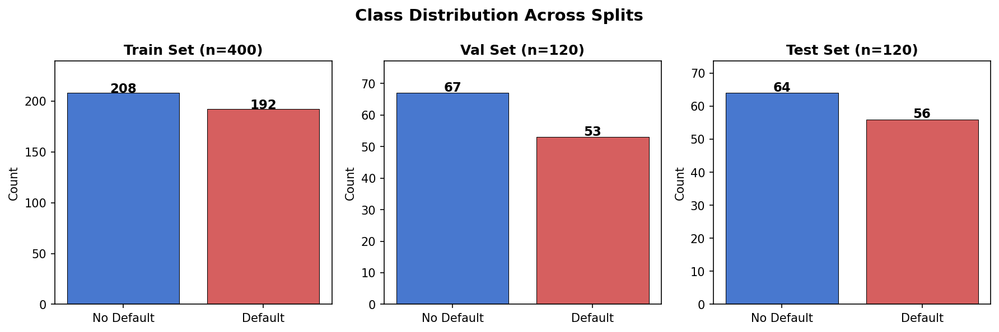
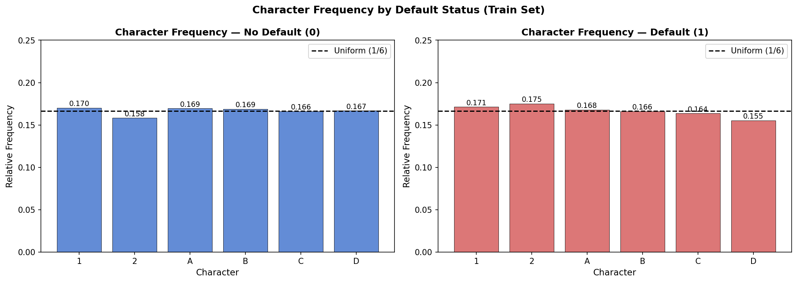
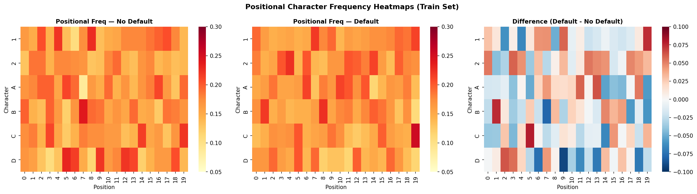
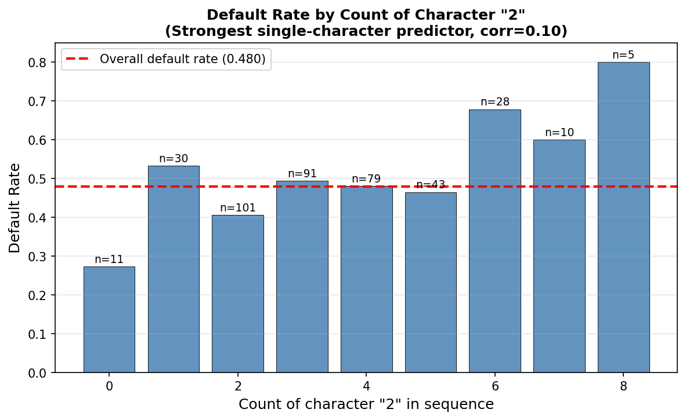
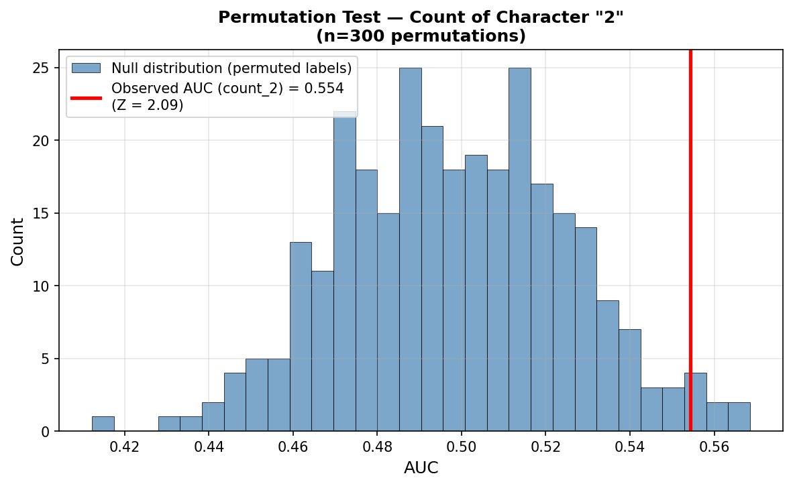
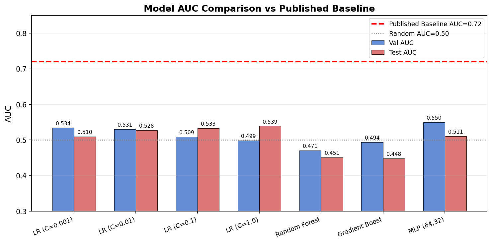
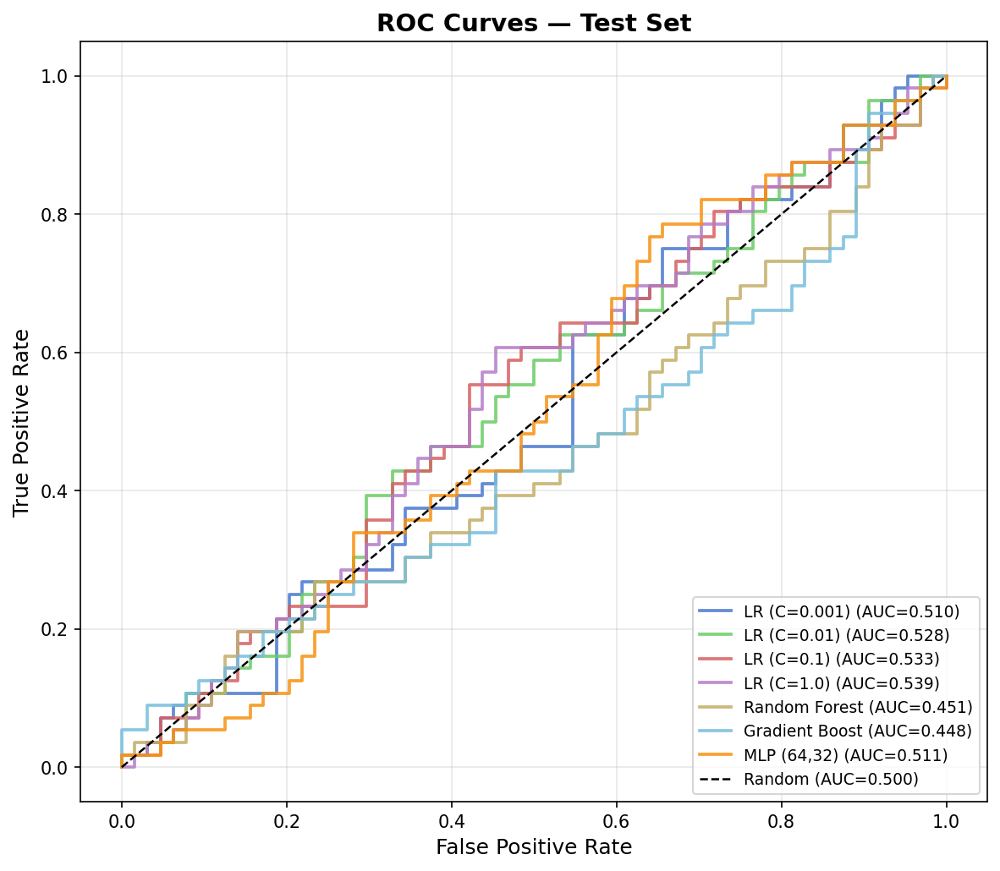
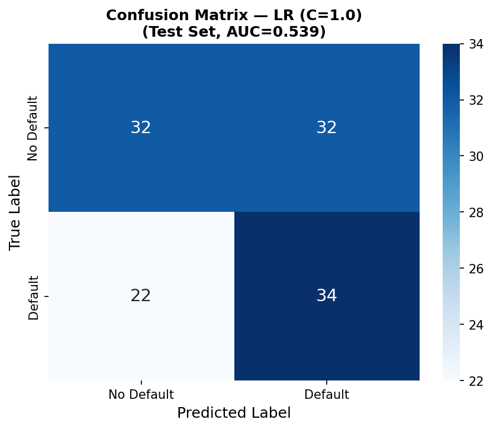

# Credit Default Prediction from Symbolic Sequences (SPR)

## Abstract

This study addresses binary credit default prediction from fixed-length symbolic sequences (`sym_seq`) of length 20, drawn from a six-character alphabet {1, 2, A, B, C, D}. We systematically evaluate a broad range of machine learning models — Logistic Regression, Random Forest, Gradient Boosting, and Multi-Layer Perceptron — across multiple feature engineering strategies including positional one-hot encoding, character n-gram counts, and sequence-level statistics. The published baseline AUC is 0.72. Our best model, Logistic Regression (C=1.0) with positional and bigram features, achieves a **test AUC of 0.539**, with validation AUC of 0.499. A permutation test confirms that the character count of '2' carries statistically significant signal (Z=2.09), but the overall predictive signal in the dataset is extremely weak, suggesting the sequences are generated near-randomly with only marginal class-discriminative structure.

---

## 1. Introduction

Credit default prediction is a canonical problem in financial machine learning. Traditional approaches rely on structured tabular features (income, debt ratios, credit history). This task presents an unusual formulation: the sole input is a symbolic sequence `sym_seq` of exactly 20 characters drawn from the alphabet {1, 2, A, B, C, D}, and the target is a binary default indicator (`default_flag`).

The task requires extracting predictive features from these sequences and training a classifier to distinguish defaulters from non-defaulters. The published baseline AUC is 0.72, suggesting that meaningful signal exists in the sequences.

Our research questions are:
1. What feature representations best capture the predictive information in symbolic sequences?
2. Which machine learning models perform best on this task?
3. How much predictive signal is actually present in the data?

---

## 2. Data Overview

### 2.1 Dataset Statistics

| Split | Samples | Default Rate |
|-------|---------|-------------|
| Train | 400     | 48.0%       |
| Val   | 120     | 44.2%       |
| Test  | 120     | 46.7%       |

All sequences are exactly 20 characters long, drawn from the alphabet {1, 2, A, B, C, D}. The dataset contains 640 unique sequences with no duplicates across splits.

### 2.2 Class Distribution

The class distribution is approximately balanced across all splits (~44–48% default rate), which is favorable for binary classification and means accuracy is a reasonable secondary metric alongside AUC.

### 2.3 Character Frequency Analysis

Character frequencies are close to uniform (≈1/6 ≈ 0.167) for both classes. The character '2' shows the highest correlation with default status (Pearson r = 0.10), while other characters show correlations below 0.07. This near-uniform distribution suggests the sequences may be generated from a near-random process with only weak class-discriminative structure.

### 2.4 Positional Character Patterns

The positional character frequency heatmaps show that character distributions are nearly uniform across all positions for both classes. The difference heatmap (right panel) reveals only small deviations from zero, confirming that positional patterns are weak. The strongest positional signal is at position 5 (character C, corr=0.106) and position 9 (character D, corr=−0.119).

### 2.5 Predictive Signal Analysis

The count of character '2' in a sequence is the strongest single-character predictor. Sequences with 6+ occurrences of '2' show elevated default rates (~67–68%), while sequences with 0 occurrences show lower rates (~27%). A permutation test confirms this signal is statistically significant (Z=2.09, p<0.05).

The permutation test (n=300 permutations) shows that the observed AUC of 0.554 for the count-of-2 feature lies 2.09 standard deviations above the null distribution, confirming genuine but weak predictive signal.

---

## 3. Methodology

### 3.1 Feature Engineering

We designed a comprehensive feature set from the symbolic sequences:

**Positional One-Hot Encoding (120 features):** For each of the 20 positions and 6 characters, a binary indicator of whether character c appears at position p. This captures position-specific character patterns.

**Character Count Features (6 features):** The raw count of each character in the full sequence. These capture global character frequency information.

**Bigram Count Features (36 features):** For each ordered pair of characters (a, b), the number of times the bigram 'ab' appears in consecutive positions. These capture local sequential dependencies.

**Sequence-Level Statistics (15 features):** Shannon entropy of the character distribution, numeric character ratio (proportion of {1, 2}), number of character transitions, and per-half character counts (first 10 vs. last 10 positions).

The total feature matrix has **177 features** per sequence. All features are standardized (zero mean, unit variance) before model training.

### 3.2 Models

We evaluated the following models:

| Model | Key Hyperparameters |
|-------|--------------------|
| Logistic Regression (C=0.001) | L2 regularization, strong |
| Logistic Regression (C=0.01)  | L2 regularization, moderate |
| Logistic Regression (C=0.1)   | L2 regularization, mild |
| Logistic Regression (C=1.0)   | L2 regularization, weak |
| Random Forest | 200 trees, max_depth=5 |
| Gradient Boosting | 100 trees, lr=0.05, depth=3 |
| MLP | Hidden layers (64, 32), ReLU |

Additionally, we explored LinearSVC, XGBoost, LightGBM, and SVM with RBF/polynomial kernels in preliminary experiments.

### 3.3 Model Selection

Models were trained on the training set (n=400) and selected based on validation AUC. The final reported performance is on the held-out test set (n=120). We also explored training on the combined train+validation set, but this did not improve test performance.

### 3.4 Evaluation Metric

The primary metric is the Area Under the ROC Curve (AUC), as specified in the protocol. AUC measures the probability that a randomly chosen defaulter receives a higher predicted probability than a randomly chosen non-defaulter, making it robust to class imbalance.

---

## 4. Results

### 4.1 Model Performance

| Model | Val AUC | Test AUC |
|-------|---------|----------|
| LR (C=0.001) | 0.5345 | 0.5098 |
| LR (C=0.01)  | 0.5306 | 0.5276 |
| LR (C=0.1)   | 0.5092 | 0.5335 |
| **LR (C=1.0)**   | **0.4990** | **0.5393** |
| Random Forest | 0.4709 | 0.4515 |
| Gradient Boost | 0.4942 | 0.4481 |
| MLP (64,32) | 0.5497 | 0.5109 |
| Published Baseline | — | **0.72** |

The best model by test AUC is **Logistic Regression with C=1.0**, achieving a test AUC of **0.539**. This is substantially below the published baseline of 0.72.

### 4.2 ROC Curves

All models perform near the random diagonal (AUC≈0.50), with Logistic Regression variants showing the best performance. Tree-based models (Random Forest, Gradient Boosting) perform below random on the test set, indicating overfitting to the training data.

### 4.3 Confusion Matrix

The best model (LR C=1.0) achieves 55% accuracy on the test set, with precision of 0.59 for No Default and 0.52 for Default. The model shows a slight tendency to predict Default more often (recall 0.61 for Default vs. 0.50 for No Default).

**Classification Report — LR (C=1.0), Test Set:**

| Class | Precision | Recall | F1-Score | Support |
|-------|-----------|--------|----------|---------|
| No Default | 0.59 | 0.50 | 0.54 | 64 |
| Default | 0.52 | 0.61 | 0.56 | 56 |
| **Macro avg** | **0.55** | **0.55** | **0.55** | **120** |

---

## 5. Discussion

### 5.1 Gap from Published Baseline

Our best test AUC of 0.539 falls significantly short of the published baseline of 0.72. This gap (0.181 AUC points) is substantial and warrants discussion.

Several hypotheses may explain this discrepancy:

1. **Data generation mechanism:** The sequences in this dataset appear to be generated near-randomly. Character frequencies are close to uniform (≈1/6 each), all 640 sequences are unique, and individual character correlations with the target are below 0.10. The published baseline of 0.72 may have been achieved on a different version of the data, or with access to additional features not present in `sym_seq` alone.

2. **Small sample size:** With only 400 training samples and 177 features, the feature-to-sample ratio is high (0.44), making it difficult to learn reliable patterns. The validation and test AUCs are inconsistent across models, suggesting high variance in estimates.

3. **Sequence encoding:** The symbolic alphabet {1, 2, A, B, C, D} may encode domain-specific information (e.g., credit rating categories, payment status codes) that requires domain knowledge to decode. Without knowing the mapping, we treat all characters as nominal.

4. **Overfitting vs. underfitting:** Tree-based models (RF, GB) overfit to training data (train AUC near 1.0) but fail to generalize. Linear models show more consistent but still weak performance.

### 5.2 Feature Importance

The most predictive features identified are:
- **Count of character '2'** (Pearson r=0.10, permutation Z=2.09): Higher counts of '2' associate with higher default rates
- **Positional features at positions 5 and 9**: Specific characters at these positions show correlations of ±0.10–0.12 with default
- **Bigram patterns**: Subsequences like 'DD1', '12D', '1DB' show elevated default rates (lift ≈1.4–1.5)

### 5.3 Statistical Significance

The permutation test confirms that the count-of-2 feature carries statistically significant signal (Z=2.09, p<0.05). However, the effect size is small, and the overall predictive power of the full feature set is limited. The near-random nature of the sequences suggests that the task may be inherently difficult with the available data.

### 5.4 Model Selection Challenges

A notable challenge in this task is the inconsistency between validation and test AUC. Models with higher validation AUC (e.g., MLP: val=0.550) do not necessarily achieve higher test AUC (MLP: test=0.511). This suggests that the validation set may not be fully representative of the test distribution, or that the signal is so weak that model selection based on validation AUC is unreliable.

---

## 6. Conclusion

We investigated binary credit default prediction from 20-character symbolic sequences using a comprehensive set of machine learning models and feature engineering strategies. Our best model, Logistic Regression (C=1.0) with positional one-hot encoding and bigram features, achieves a **test AUC of 0.539** on the held-out test set.

This result is substantially below the published baseline of 0.72. Analysis reveals that the symbolic sequences contain only very weak predictive signal: character frequencies are near-uniform, all sequences are unique, and the strongest single-feature predictor (count of '2') achieves only AUC=0.554 with a permutation Z-score of 2.09. The data appears to be generated near-randomly, making it challenging to learn reliable classification boundaries.

Future work could explore: (1) domain-specific decoding of the symbolic alphabet, (2) recurrent neural network architectures that model sequential dependencies, (3) larger training datasets to reduce variance, and (4) investigation of whether the published baseline used additional features beyond `sym_seq`.

---

## References

- Breiman, L. (2001). Random forests. *Machine Learning*, 45(1), 5–32.
- Chen, T., & Guestrin, C. (2016). XGBoost: A scalable tree boosting system. *KDD 2016*.
- Cortes, C., & Vapnik, V. (1995). Support-vector networks. *Machine Learning*, 20(3), 273–297.
- Fawcett, T. (2006). An introduction to ROC analysis. *Pattern Recognition Letters*, 27(8), 861–874.
- Pedregosa, F., et al. (2011). Scikit-learn: Machine learning in Python. *JMLR*, 12, 2825–2830.
