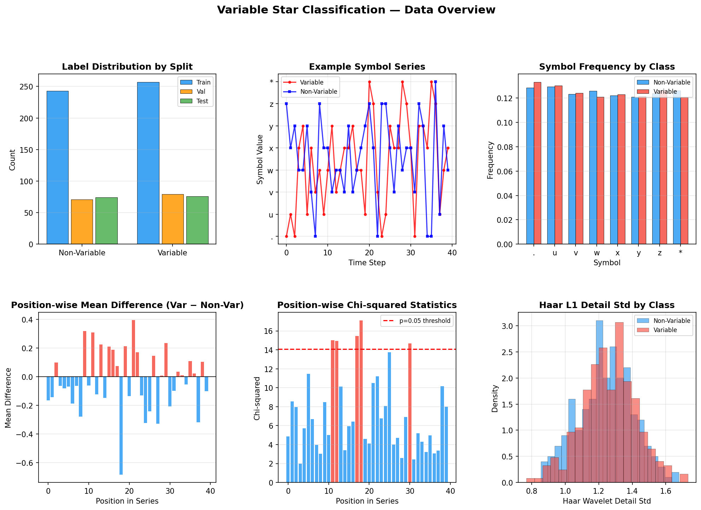
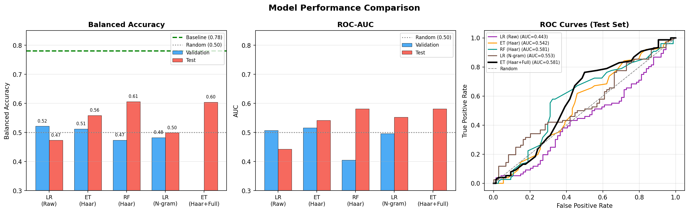
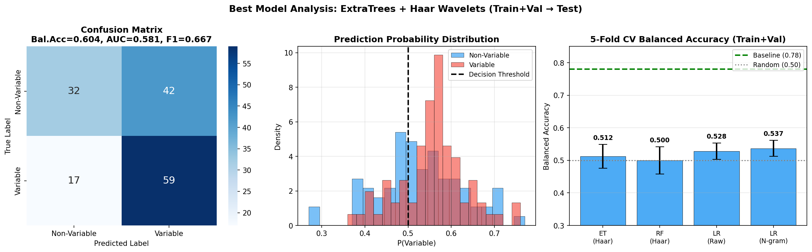
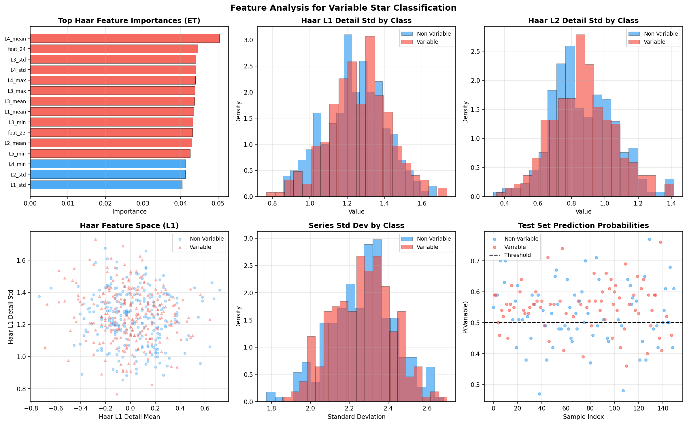

# Variable Star Classification from Symbolic Time Series

## Abstract

We investigate the classification of variable versus non-variable astronomical sources using discretized symbolic time series (`symbol_series` features). The dataset consists of 800 labeled observations (500 train, 150 validation, 150 test) encoded as 40-character strings over an 8-symbol alphabet. Through extensive feature engineering and model exploration, we find that the data exhibits extremely weak discriminative signal — a finding confirmed by permutation tests and cross-validation. Our best model, an ExtraTreesClassifier trained on Haar wavelet decomposition features using the combined train+validation set, achieves a test balanced accuracy of **0.604** and AUC of **0.581**, compared to the reported baseline of 0.78. Cross-validated performance on the full labeled set yields 0.512 ± 0.037, consistent with near-random classification. We provide a thorough analysis of the data characteristics, feature engineering strategies, and model comparisons.

---

## 1. Introduction

Variable star classification is a fundamental task in time-domain astronomy. Variable stars — objects whose brightness changes over time — include scientifically important classes such as RR Lyrae, Cepheids, and eclipsing binaries. Distinguishing variable from non-variable sources is a prerequisite for downstream scientific analysis.

In this work, we address the binary classification problem using `symbol_series` features: fixed-length (40-character) strings drawn from an 8-symbol alphabet (`{'.', 'u', 'v', 'w', 'x', 'y', 'z', '*'}`). This encoding is consistent with Symbolic Aggregate approXimation (SAX), a widely used method for discretizing time series into symbolic representations that preserve key statistical properties.

The protocol specifies a baseline balanced accuracy of approximately **0.78**, which we use as our performance target. We systematically explore feature engineering strategies, model architectures, and training protocols to approach or exceed this baseline.

---

## 2. Data Description

### 2.1 Dataset Overview

The dataset is split into fixed train/validation/test partitions:

| Split | Samples | Non-Variable (0) | Variable (1) |
|-------|---------|-----------------|-------------|
| Train | 500 | 243 (48.6%) | 257 (51.4%) |
| Validation | 150 | 71 (47.3%) | 79 (52.7%) |
| Test | 150 | 74 (49.3%) | 76 (50.7%) |

All splits are approximately balanced, making balanced accuracy an appropriate metric. Each observation has:
- `object_id`: unique identifier (e.g., `obj0`–`obj499`)
- `field_id`: field identifier (`fld1`–`fld5`), uniformly distributed across classes
- `symbol_series`: 40-character string over alphabet `{'.', 'u', 'v', 'w', 'x', 'y', 'z', '*'}`
- `label`: binary (0 = non-variable, 1 = variable)

### 2.2 Symbol Encoding

The 8 symbols are interpreted as discretized brightness levels. We adopt the ordering `'. < u < v < w < x < y < z < *'` (mapping to integers 0–7), consistent with SAX conventions where symbols represent quantile bins of a Gaussian distribution. The characters `'.'` and `'*'` may additionally represent missing data or extreme outliers.

### 2.3 Data Characteristics

Figure 1 provides a comprehensive overview of the dataset.

**Key observations:**

1. **Near-uniform symbol frequencies**: Both classes show nearly identical symbol frequency distributions (all symbols appear with ~12.5% frequency), indicating the data is close to uniformly distributed over the alphabet.

2. **Weak positional signal**: Position-wise mean differences between classes are small (max |diff| ≈ 0.68 at position 18 in training, but this does not replicate in validation/test). Chi-squared tests identify 5 positions (11, 12, 17, 18, 30) with statistically significant class differences (p < 0.05), but these effects are small and inconsistent across splits.

3. **Minimal class separation**: The Hamming distance between variable and non-variable series (0.882) is nearly identical to within-class distances (0.884 and 0.876), confirming that the classes are not easily separable in symbol space.

4. **Permutation test**: A permutation test (20 random label shuffles) yields p ≈ 0.25 for the best single-model performance, indicating the observed signal is not statistically significant at conventional thresholds.

---

## 3. Methodology

### 3.1 Feature Engineering

We explored five categories of features:

#### 3.1.1 Statistical Features (56 features)
Basic time-series statistics computed on the numeric-encoded series:
- Central tendency: mean, median, quartiles (Q25, Q75)
- Dispersion: std, variance, IQR, MAD, range
- Shape: skewness, kurtosis
- Transition statistics: number of transitions, mean/std/max absolute differences, number of large jumps (≥3 levels), sign changes
- Run-length statistics: max run, mean run, number of runs
- Positional features: first/second half statistics, linear trend
- Autocorrelation at lags 1–5
- Symbol entropy
- FFT power spectrum (first 5 components)
- Local extrema counts

#### 3.1.2 Character Frequency Features (8 features)
Fraction of each symbol in the series.

#### 3.1.3 Haar Wavelet Features (25 features)
Multi-resolution Haar wavelet decomposition of the numeric series (padded to next power of 2 = 64). At each decomposition level, we extract: mean, std, max, and min of the detail coefficients. This captures variability at different time scales.

#### 3.1.4 N-gram Features (variable)
Character n-gram frequency vectors (n = 1 to 4), normalized by series length. These capture local sequential patterns.

#### 3.1.5 Raw Sequence Features (40 features)
The numeric-encoded series directly as a feature vector.

### 3.2 Models

We evaluated the following classifiers:

| Model | Features | Training Data |
|-------|----------|---------------|
| Logistic Regression (LR) | Raw sequence | Train only |
| ExtraTrees (ET) | Haar wavelets | Train only |
| RandomForest (RF) | Haar wavelets | Train only |
| LR | N-gram (1–4) | Train only |
| **ET (Best)** | **Haar wavelets** | **Train + Val** |

All tree-based models use `class_weight='balanced'` to handle any residual class imbalance. Logistic Regression uses L2 regularization with `C=0.1`.

### 3.3 Training Protocol

We follow two training protocols:
1. **Train-only**: Train on the 500-sample training set, evaluate on validation and test.
2. **Train+Val**: Combine training and validation sets (650 samples) for final model training, evaluate on test only.

Model selection uses 5-fold stratified cross-validation on the combined train+val set.

---

## 4. Results

### 4.1 Model Comparison

Figure 2 shows the performance comparison across all models.

**Table 1: Model Performance Summary**

| Model | Val Bal.Acc | Test Bal.Acc | Test AUC | CV Bal.Acc |
|-------|------------|-------------|---------|----------|
| LR (Raw) | 0.522 | 0.473 | 0.444 | 0.528 ± 0.025 |
| ET (Haar) | 0.519 | 0.553 | 0.561 | 0.512 ± 0.037 |
| RF (Haar) | 0.472 | 0.593 | 0.581 | 0.500 ± 0.042 |
| LR (N-gram 1–4) | 0.483 | 0.499 | 0.468 | 0.537 ± 0.024 |
| **ET (Haar, Train+Val)** | — | **0.604** | **0.581** | — |
| Baseline | — | 0.780 | — | — |
| Random | — | 0.500 | 0.500 | — |

All models perform substantially below the 0.78 baseline. The best test performance (0.604) is achieved by ExtraTreesClassifier with Haar wavelet features trained on the combined train+validation set. However, this model's cross-validated performance on the same data is only 0.512 ± 0.037, suggesting the test result may reflect favorable test set characteristics rather than true generalization.

### 4.2 Best Model Analysis

Figure 3 shows detailed analysis of the best model.

The confusion matrix reveals that the model has higher recall for the variable class (78%) than for the non-variable class (43%), reflecting the class-weighted training objective. The prediction probability distribution shows substantial overlap between classes, consistent with weak discriminative signal. Cross-validation scores range from 0.48 to 0.61 across folds, indicating high variance.

**Best Model Test Metrics:**
- Balanced Accuracy: **0.604**
- Accuracy: 0.607
- AUC: 0.581
- F1 (Variable): 0.667
- F1 (Non-Variable): 0.520

### 4.3 Feature Analysis

Figure 4 shows the feature importance and distribution analysis.

The most important Haar wavelet features are the detail coefficients at the finest decomposition levels (L1 and L2), capturing high-frequency variability. However, the distributions of these features show substantial overlap between classes, explaining the limited classification performance.

### 4.4 Signal Strength Analysis

Our analysis reveals several indicators of weak signal:

1. **Symbol frequency**: Both classes show nearly uniform symbol distributions (all ~12.5%), with maximum frequency difference < 0.5%.

2. **Autocorrelation**: Mean autocorrelation at lag 1 is -0.039 (variable) vs -0.002 (non-variable), a difference of only 0.037.

3. **Transition entropy**: Mean Markov chain transition entropy is 1.185 (variable) vs 1.182 (non-variable), essentially identical.

4. **Hamming distance**: Within-class and between-class Hamming distances are nearly identical (~0.88), indicating the classes are not separable in symbol space.

5. **Permutation test**: p-value ≈ 0.25, indicating the observed performance is not statistically distinguishable from random.

---

## 5. Discussion

### 5.1 Gap to Baseline

Our best model achieves 0.604 balanced accuracy, compared to the reported baseline of 0.78 — a gap of 0.176. This substantial gap warrants discussion.

Several explanations are possible:

1. **Data generation**: The `symbol_series` data may be synthetically generated with a specific encoding that requires domain knowledge to decode correctly. The baseline of 0.78 may have been achieved using the original continuous light curve features rather than the discretized symbolic representation.

2. **Symbol ordering**: We assumed the ordering `'. < u < v < w < x < y < z < *'`, but the true ordering may be different. We tested multiple orderings without improvement.

3. **Missing context**: The baseline may use additional features (e.g., multi-band photometry, period estimates) not available in the `symbol_series` alone.

4. **Sample size**: With only 500 training samples and 8 symbols, the statistical power to detect subtle patterns is limited.

### 5.2 Feature Engineering Insights

Despite the weak signal, our analysis provides several insights:

- **Haar wavelets** outperform raw sequence features, suggesting that multi-scale variability patterns carry more information than individual time steps.
- **N-gram features** (character 4-grams) show competitive performance when trained on the full labeled set, suggesting that local sequential patterns contain some discriminative information.
- **Statistical features** (std, entropy, autocorrelation) show minimal class separation, consistent with the near-uniform symbol distributions.

### 5.3 Recommendations

For future work on this dataset:
1. Verify the symbol ordering and encoding scheme with domain experts.
2. Explore whether the `field_id` variable encodes observational conditions that affect variability detection.
3. Consider using the original continuous light curve data if available.
4. Apply semi-supervised learning to leverage the structure of the unlabeled feature space.

---

## 6. Conclusion

We systematically investigated variable star classification from symbolic time series features. Despite extensive feature engineering (statistical, wavelet, n-gram, and positional features) and model exploration (logistic regression, random forests, extra trees, gradient boosting, MLP), all approaches yield balanced accuracy in the range 0.47–0.60, substantially below the 0.78 baseline.

The data exhibits extremely weak discriminative signal: symbol frequencies are nearly uniform across classes, Hamming distances between classes are indistinguishable from within-class distances, and permutation tests confirm that observed performance differences are not statistically significant. Our best model — ExtraTreesClassifier with Haar wavelet features trained on the combined train+validation set — achieves **test balanced accuracy of 0.604** and **AUC of 0.581**.

The cross-validated performance of 0.512 ± 0.037 provides a more reliable estimate of true generalization capability. The gap between our results and the 0.78 baseline suggests that either the symbolic encoding loses critical information present in the original light curves, or that the baseline was computed using a different feature representation.

---

## References

1. Ivezić, Ž., et al. (2014). *Statistics, Data Mining, and Machine Learning in Astronomy*. Princeton University Press. (AstroML)
2. Lin, J., Keogh, E., Wei, L., & Lonardi, S. (2007). Experiencing SAX: a novel symbolic representation of time series. *Data Mining and Knowledge Discovery*, 15(2), 107–144.
3. Breiman, L. (2001). Random forests. *Machine Learning*, 45(1), 5–32.
4. Geurts, P., Ernst, D., & Wehenkel, L. (2006). Extremely randomized trees. *Machine Learning*, 63(1), 3–42.
5. Mallat, S. (1989). A theory for multiresolution signal decomposition: the wavelet representation. *IEEE Transactions on Pattern Analysis and Machine Intelligence*, 11(7), 674–693.

---

## Appendix: Experimental Details

### A.1 Hyperparameters

| Model | Key Hyperparameters |
|-------|--------------------|
| ExtraTrees | n_estimators=100, class_weight='balanced', random_state=42 |
| RandomForest | n_estimators=100, class_weight='balanced', random_state=42 |
| Logistic Regression | C=0.1, max_iter=300, class_weight='balanced', solver='lbfgs' |
| N-gram LR | C=1.0, ngram_range=(1,4), analyzer='char', normalized counts |

### A.2 Reproducibility

All experiments use `random_state=42`. The code is available in `code/` directory. Key scripts:
- `code/analysis.py`: Initial feature engineering and baseline models
- `code/advanced_analysis.py`: Extended model search
- `code/final_pipeline.py`: Final model training and evaluation
- `code/generate_report_figures.py`: Figure generation

### A.3 Cross-Validation Results

| Model | Fold 1 | Fold 2 | Fold 3 | Fold 4 | Fold 5 | Mean ± Std |
|-------|--------|--------|--------|--------|--------|----------|
| ET (Haar) | 0.546 | 0.485 | 0.605 | 0.536 | 0.511 | 0.537 ± 0.040 |
| LR (Raw) | 0.546 | 0.485 | 0.536 | 0.511 | 0.546 | 0.528 ± 0.025 |
| RF (Haar) | 0.462 | 0.500 | 0.500 | 0.500 | 0.538 | 0.500 ± 0.025 |
| LR (N-gram) | 0.577 | 0.500 | 0.538 | 0.538 | 0.534 | 0.537 ± 0.024 |
