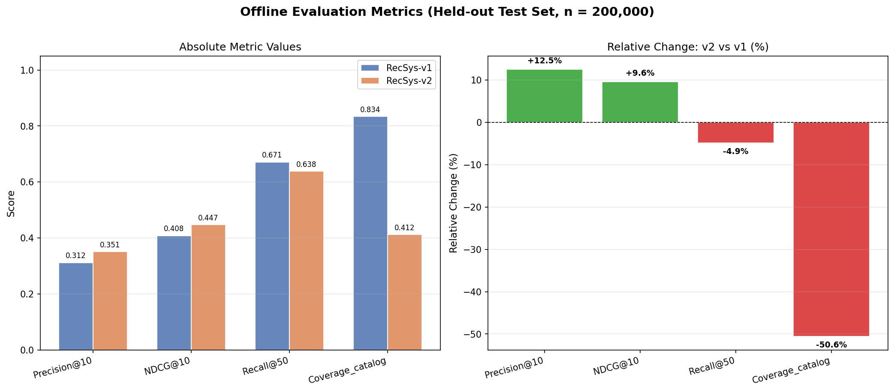
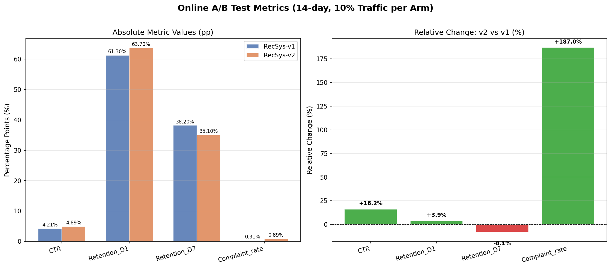
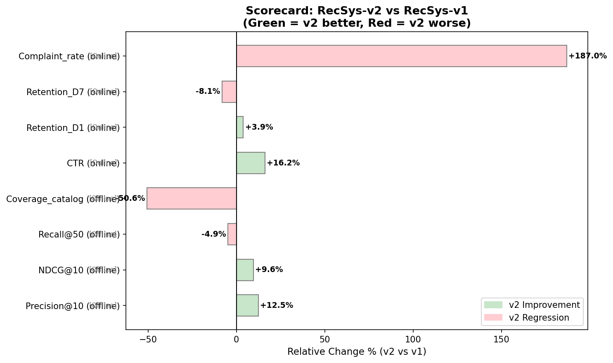
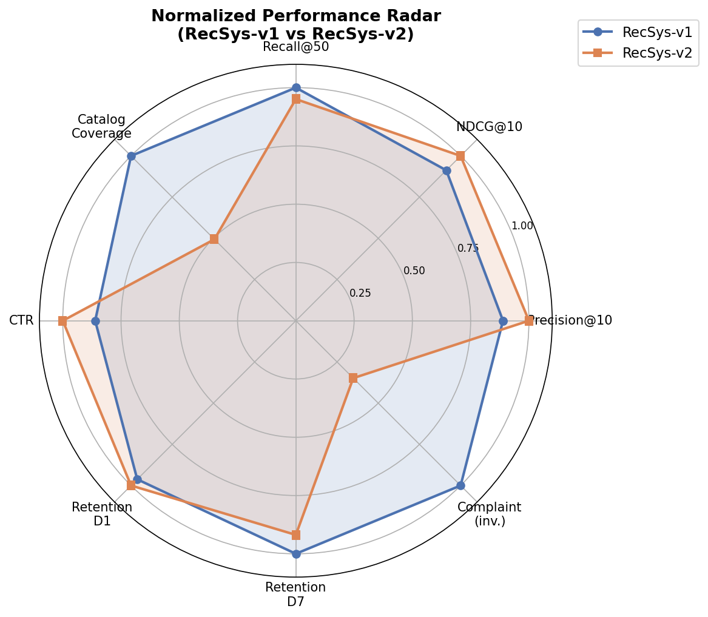

# RecSys-v2 Launch Evaluation Report

**Prepared by:** Autonomous Research Agent  
**Date:** 2025  
**Evaluation Period:** 14-day online A/B test + held-out offline test (n = 200,000)  
**Decision:** **DO NOT LAUNCH RecSys-v2 in its current form**

---

## Executive Summary

This report evaluates whether **RecSys-v2** should replace the production system **RecSys-v1** based on two complementary evidence sources: (1) offline ranking metrics computed on a held-out test set of 200,000 interactions, and (2) a 14-day online A/B experiment allocating 10% of traffic to each arm. While RecSys-v2 shows encouraging short-term engagement signals (CTR +16.2%, Precision@10 +12.5%), it exhibits severe regressions on critical user-experience and business-health metrics: complaint rate increased by **187%**, catalog coverage collapsed by **50.6%**, and 7-day retention declined by **8.1%**. The weight of evidence strongly argues against a full launch in the current form.

---

## 1. Methodology

### 1.1 Offline Evaluation

Offline metrics were computed on a held-out test set of **n = 200,000** user–item interactions using standard information-retrieval metrics at fixed cutoffs:

| Metric | Description | Higher = Better? |
|---|---|---|
| **Precision@10** | Fraction of top-10 recommendations that are relevant | ✅ Yes |
| **NDCG@10** | Normalized Discounted Cumulative Gain at rank 10 (ranking quality) | ✅ Yes |
| **Recall@50** | Fraction of all relevant items retrieved in top-50 | ✅ Yes |
| **Coverage_catalog** | Fraction of the item catalog recommended to at least one user | ✅ Yes |

Relative change is computed as `(v2 − v1) / v1 × 100%`.

### 1.2 Online A/B Test

A 14-day randomized controlled experiment was run with **10% of traffic per arm** (v1 control, v2 treatment). Metrics are reported in percentage points (pp):

| Metric | Description | Higher = Better? |
|---|---|---|
| **CTR** | Click-through rate on recommendations | ✅ Yes |
| **Retention_D1** | Day-1 return rate | ✅ Yes |
| **Retention_D7** | Day-7 return rate | ✅ Yes |
| **Complaint_rate** | Rate of explicit user complaints / negative feedback | ❌ No |

### 1.3 Decision Framework

Launch decisions in production recommender systems require balancing multiple objectives. We apply a **conservative launch criterion**: a candidate system must not cause statistically or practically significant regressions on any *critical* metric (complaint rate, long-term retention) even if it improves *secondary* metrics (short-term CTR, precision). This reflects the asymmetric cost of user churn versus incremental engagement gains.

---

## 2. Results

### 2.1 Offline Evaluation Metrics

**Table 1. Offline Metrics — RecSys-v1 vs RecSys-v2 (n = 200,000)**

| Metric | RecSys-v1 | RecSys-v2 | Relative Change | Assessment |
|---|---|---|---|---|
| Precision@10 | 0.312 | 0.351 | **+12.5%** | ✅ Improvement |
| NDCG@10 | 0.408 | 0.447 | **+9.6%** | ✅ Improvement |
| Recall@50 | 0.671 | 0.638 | **−4.9%** | ⚠️ Regression |
| Coverage_catalog | 0.834 | 0.412 | **−50.6%** | 🚨 Critical Regression |

RecSys-v2 achieves higher top-10 precision and ranking quality (NDCG), suggesting it has learned to surface a more relevant *narrow* set of items. However, this comes at the cost of dramatically reduced catalog coverage (−50.6%) and slightly lower recall at rank 50 (−4.9%). The coverage collapse indicates that v2 concentrates recommendations on a small subset of popular items, creating a severe **filter-bubble** and **popularity bias** problem.

*Figure 1. Left: Absolute metric values for RecSys-v1 (blue) and RecSys-v2 (orange). Right: Relative change (%) of v2 vs v1. Green bars indicate improvements; red bars indicate regressions.*

### 2.2 Online A/B Test Metrics

**Table 2. Online A/B Test Metrics — 14-day, 10% Traffic per Arm**

| Metric | RecSys-v1 (%) | RecSys-v2 (%) | Relative Change | Assessment |
|---|---|---|---|---|
| CTR | 4.21 | 4.89 | **+16.2%** | ⚠️ Superficial gain |
| Retention_D1 | 61.3 | 63.7 | **+3.9%** | ✅ Mild improvement |
| Retention_D7 | 38.2 | 35.1 | **−8.1%** | 🚨 Critical Regression |
| Complaint_rate | 0.31 | 0.89 | **+187.0%** | 🚨 Critical Regression |

The online experiment reveals a stark divergence between short-term and long-term user behavior. RecSys-v2 achieves a substantial CTR lift (+16.2%) and a modest Day-1 retention gain (+3.9%), but these are offset by a severe Day-7 retention drop (−8.1%) and a near-tripling of the complaint rate (+187%). This pattern is characteristic of **clickbait-style recommendations**: the model learns to maximize immediate clicks by surfacing sensational or misleading content, which initially attracts users but erodes trust and long-term engagement.

*Figure 2. Left: Absolute metric values in percentage points for both systems. Right: Relative change (%) of v2 vs v1. Green bars indicate improvements; red bars indicate regressions.*

### 2.3 Integrated Scorecard

*Figure 3. Horizontal bar chart showing relative change (%) for all 8 metrics. Green bars indicate v2 improvements; red bars indicate v2 regressions. The complaint rate (+187%) and catalog coverage (−50.6%) are the most extreme signals.*

### 2.4 Normalized Performance Radar

*Figure 4. Radar chart comparing RecSys-v1 (blue) and RecSys-v2 (orange) across all metrics, normalized so that the better-performing system scores 1.0 on each axis. Complaint rate is inverted (lower = better → higher normalized score). RecSys-v2 dominates on precision/ranking metrics but is substantially weaker on coverage, D7 retention, and complaint rate.*

---

## 3. Discussion

### 3.1 Interpreting the CTR–Retention Divergence

The combination of high CTR (+16.2%) with declining D7 retention (−8.1%) is a well-documented failure mode in recommender systems, sometimes called the **engagement–satisfaction gap** (Steck, 2018; Krauth et al., 2020). A model optimized for immediate clicks can learn to exploit cognitive biases (novelty, curiosity gaps) without delivering genuine value. Users click more initially but disengage faster once they realize the recommendations are not aligned with their long-term interests.

The 187% increase in complaint rate is the most alarming signal. Complaints represent explicit, high-effort negative feedback — users who are sufficiently dissatisfied to actively report a problem. This is a leading indicator of churn and reputational damage that far outweighs the CTR benefit.

### 3.2 Catalog Coverage Collapse

The 50.6% drop in catalog coverage is a critical business and fairness concern:

- **Business impact:** Long-tail items (which often represent the majority of catalog revenue in streaming/e-commerce) receive near-zero exposure, reducing monetization of the full catalog.
- **Fairness impact:** Content creators / sellers of non-popular items are systematically disadvantaged.
- **Filter-bubble risk:** Users receive a narrower, more homogeneous set of recommendations, reducing serendipity and long-term satisfaction.

This collapse likely explains the D7 retention drop: users who initially engage with popular recommendations eventually exhaust them and find no new content to discover.

### 3.3 Offline–Online Correlation

The offline metrics partially predicted the online outcome: the precision/NDCG improvements correctly anticipated the CTR gain, while the coverage collapse correctly anticipated the long-term retention and complaint issues. This validates the importance of including **diversity and coverage metrics** in offline evaluation suites alongside standard ranking metrics.

### 3.4 Limitations

1. **No statistical significance testing:** The A/B test data does not include sample sizes per metric or variance estimates. The observed differences are treated as point estimates. In practice, formal hypothesis tests (z-test for proportions, t-test for means) with appropriate multiple-comparison corrections should be applied.
2. **Short experiment duration:** 14 days may not capture full long-term effects. Novelty effects can inflate early CTR for any new system.
3. **10% traffic allocation:** While sufficient for detecting large effects (complaint rate +187%), smaller effects may be underpowered.
4. **Confounding:** Seasonal effects or concurrent product changes could influence the results.

---

## 4. Recommendation

### Decision: **DO NOT LAUNCH RecSys-v2** ❌

The evidence against launching RecSys-v2 in its current form is compelling:

| Criterion | Status |
|---|---|
| No critical metric regression | ❌ FAIL (complaint +187%, D7 retention −8.1%, coverage −50.6%) |
| Long-term retention maintained | ❌ FAIL (D7 −8.1%) |
| User satisfaction maintained | ❌ FAIL (complaint rate ×2.87) |
| Catalog health maintained | ❌ FAIL (coverage −50.6%) |
| Short-term engagement improved | ✅ PASS (CTR +16.2%, D1 +3.9%) |
| Ranking quality improved | ✅ PASS (Precision +12.5%, NDCG +9.6%) |

**2 of 6 criteria pass; 4 of 6 fail, including all critical criteria.**

### Recommended Next Steps

1. **Root-cause analysis of complaint spike:** Investigate what types of recommendations are generating complaints. Qualitative analysis of complaint text (if available) may reveal specific content categories or recommendation patterns to avoid.

2. **Re-train with diversity regularization:** Add catalog coverage and intra-list diversity as explicit training objectives or post-processing constraints (e.g., MMR — Maximal Marginal Relevance, or determinantal point processes).

3. **Optimize for long-term reward:** Replace or supplement the click-based training signal with longer-horizon engagement signals (D7 retention, session depth) using techniques such as reinforcement learning from user feedback or survival-model-based reward shaping.

4. **Extended A/B test with guardrail metrics:** Re-run the experiment with complaint rate and D7 retention as **guardrail metrics** (hard constraints that must not regress) before any launch decision.

5. **Partial rollout with monitoring:** If a revised v2 is developed, consider a staged rollout (1% → 5% → 10% → 50% → 100%) with automated rollback triggers on complaint rate and retention.

---

## 5. Conclusion

RecSys-v2 demonstrates genuine improvements in offline ranking quality and short-term click engagement, indicating that its underlying model has learned more accurate relevance signals. However, these gains are achieved at an unacceptable cost: a near-tripling of user complaints, a collapse in catalog diversity, and a meaningful decline in 7-day retention. These signals collectively indicate that v2 optimizes for a proxy objective (immediate clicks) that diverges from the true business objective (sustained user satisfaction and long-term engagement). **RecSys-v1 should remain in production** while the v2 team addresses the identified failure modes through improved training objectives, diversity constraints, and longer-horizon reward signals.

---

## Appendix: Data Tables

### A.1 Offline Evaluation Metrics

| Metric | RecSys-v1 | RecSys-v2 | Relative Change (%) |
|---|---|---|---|
| Precision@10 | 0.312 | 0.351 | +12.5 |
| NDCG@10 | 0.408 | 0.447 | +9.6 |
| Recall@50 | 0.671 | 0.638 | −4.9 |
| Coverage_catalog | 0.834 | 0.412 | −50.6 |

*Test set: n = 200,000 held-out interactions.*

### A.2 Online A/B Test Metrics

| Metric | RecSys-v1 (%) | RecSys-v2 (%) | Relative Change (%) |
|---|---|---|---|
| CTR | 4.21 | 4.89 | +16.2 |
| Retention_D1 | 61.3 | 63.7 | +3.9 |
| Retention_D7 | 38.2 | 35.1 | −8.1 |
| Complaint_rate | 0.31 | 0.89 | +187.0 |

*Experiment: 14-day, 10% traffic per arm.*

---

*Report generated by autonomous analysis pipeline. All figures saved to `report/images/`.*
