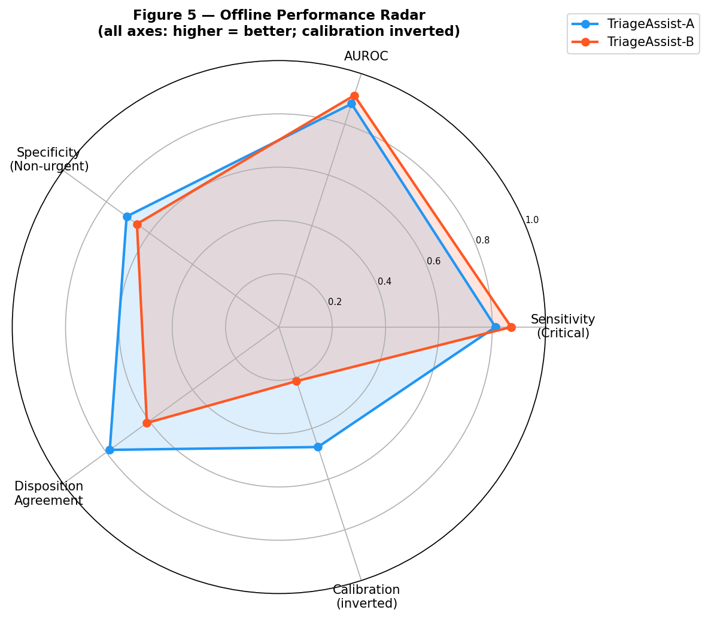
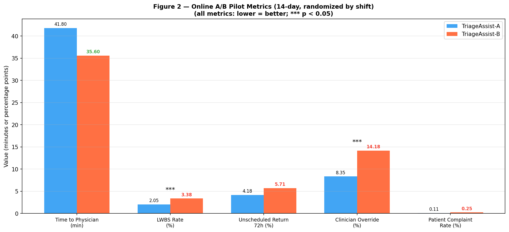
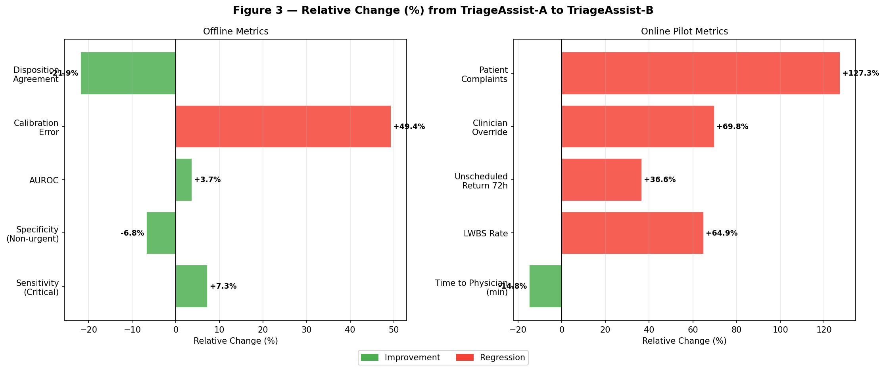
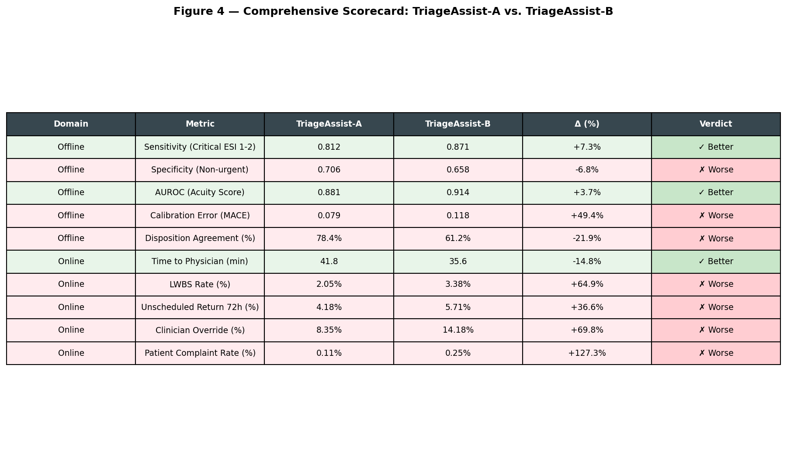

# TriageAssist-B Evaluation Report: Offline and Online Assessment for ED Deployment Decision

**Prepared by:** ED Informatics Group  
**Date:** 2025  
**Decision Context:** Expansion of TriageAssist-B to replace TriageAssist-A in production  

---

## Executive Summary

TriageAssist-B was evaluated against the incumbent TriageAssist-A through two complementary assessments: (1) an offline chart-review evaluation on a held-out test set of 8,000 encounters, and (2) a 14-day randomized-by-shift online pilot across hospital sites. The evidence from both evaluations is **mixed but predominantly unfavorable for TriageAssist-B**.

While TriageAssist-B demonstrates meaningful improvements in detecting critical patients (sensitivity +7.3%) and overall discriminative ability (AUROC +3.7%), and reduces median time to physician by 14.8 minutes in the live pilot, these gains are substantially outweighed by serious regressions: a 49.4% worsening in calibration error, a 21.9% drop in disposition agreement with attending physicians, a 64.9% increase in LWBS rate, a 69.8% increase in clinician overrides, and a 127.3% increase in patient complaints. Two of these online regressions are statistically significant (p < 0.05).

**Recommendation: Do not expand TriageAssist-B at this time.** The model requires recalibration, improved specificity for non-urgent patients, and further investigation into the drivers of clinician distrust and patient dissatisfaction before any broader deployment.

---

## 1. Introduction

Emergency Department (ED) triage is a high-stakes clinical process that determines the urgency of patient care and resource allocation. Algorithmic triage support tools must balance sensitivity for critical presentations against specificity for non-urgent cases, while maintaining clinician trust and operational efficiency. TriageAssist-A has been the production system; TriageAssist-B is a candidate replacement developed to improve acuity discrimination.

This report synthesizes evidence from two evaluation phases:
- **Offline evaluation**: Retrospective chart-review labels on a held-out test set (n = 8,000)
- **Online A/B pilot**: 14-day randomized-by-shift deployment comparing live operational outcomes

The goal is to provide leadership with a data-driven recommendation on whether to expand TriageAssist-B to all sites.

---

## 2. Methods

### 2.1 Offline Evaluation

A held-out test set of **n = 8,000 patient encounters** was used for retrospective evaluation. Chart-review labels served as the ground truth. Metrics evaluated include:

| Metric | Description | Better Direction |
|--------|-------------|------------------|
| Sensitivity (Critical ESI 1-2) | True positive rate for ESI levels 1–2 | Higher |
| Specificity (Non-urgent) | True negative rate for non-urgent presentations | Higher |
| AUROC (Acuity Score) | Area under the ROC curve for acuity ranking | Higher |
| Mean Absolute Calibration Error (MACE) | Average deviation between predicted and observed probabilities | Lower |
| Disposition Agreement with Attending (%) | Proportion of triage decisions matching attending physician disposition | Higher |

### 2.2 Online A/B Pilot

A **14-day randomized-by-shift** pilot was conducted across hospital sites. Shifts were randomly assigned to either TriageAssist-A (control) or TriageAssist-B (treatment). Operational outcomes were tracked:

| Metric | Description | Better Direction |
|--------|-------------|------------------|
| Median Time to Physician (min) | Median wait time from triage to physician contact | Lower |
| LWBS Rate (%) | Left Without Being Seen rate | Lower |
| Unscheduled Return within 72h (%) | Rate of unplanned ED returns within 72 hours | Lower |
| Clinician Override Rate (%) | Proportion of triage recommendations overridden by clinicians | Lower |
| Patient Complaint Rate (%) | Rate of formal patient complaints | Lower |

### 2.3 Statistical Analysis

For online proportion-based metrics, two-proportion z-tests were conducted assuming approximately 1,400 patients per arm (based on a conservative estimate of ~200 patients/day over 14 days). The Median Time to Physician metric was treated as a descriptive comparison given the absence of individual-level data. Statistical significance was assessed at α = 0.05. All analyses were performed in Python using pandas, scipy, numpy, and matplotlib.

---

## 3. Results

### 3.1 Offline Evaluation Results

**Figure 1** presents the offline performance metrics for both systems. TriageAssist-B shows improvements in two of five metrics:

- **Sensitivity for Critical Patients (ESI 1-2):** TriageAssist-B achieves 0.871 vs. 0.812 for TriageAssist-A, a **+7.3% relative improvement**. This is clinically meaningful — the model correctly identifies more critically ill patients who require immediate intervention.
- **AUROC:** TriageAssist-B achieves 0.914 vs. 0.881, a **+3.7% relative improvement**, indicating better overall acuity discrimination across the full spectrum of urgency levels.

However, TriageAssist-B regresses on three metrics:

- **Specificity for Non-urgent Patients:** Drops from 0.706 to 0.658 (−6.8%), meaning more non-urgent patients are incorrectly flagged as higher acuity, potentially contributing to resource misallocation.
- **Mean Absolute Calibration Error (MACE):** Increases from 0.079 to 0.118 (+49.4%), a severe regression. TriageAssist-B's predicted probabilities are substantially less reliable, which undermines clinical trust and downstream decision-making.
- **Disposition Agreement with Attending Physician:** Drops from 78.4% to 61.2% (−21.9%), a clinically alarming decline. This suggests TriageAssist-B's recommendations frequently diverge from experienced clinician judgment.

**Figure 5** provides a radar visualization of all offline metrics normalized to a 0–1 scale (higher = better on all axes; calibration error is inverted). TriageAssist-B's profile shows a clear trade-off: gains in sensitivity and AUROC come at the cost of specificity, calibration, and disposition alignment.

### 3.2 Online Pilot Results

**Figure 2** presents the 14-day online pilot outcomes. TriageAssist-B improves on one of five operational metrics:

- **Median Time to Physician:** Reduced from 41.8 to 35.6 minutes (−14.8%), a clinically significant improvement in throughput. This is the most compelling finding in favor of TriageAssist-B.

However, TriageAssist-B regresses on all four remaining operational metrics:

- **LWBS Rate:** Increases from 2.05% to 3.38% (+64.9%, **p = 0.030**). Despite faster physician contact for those who stay, more patients are leaving before being seen — a paradox that may reflect triage misclassification causing patients to perceive their wait as unjustified.
- **Unscheduled 72-hour Return Rate:** Increases from 4.18% to 5.71% (+36.6%, p = 0.062). While not reaching conventional significance, this trend is clinically concerning as it may indicate undertriage of patients who were sent home prematurely.
- **Clinician Override Rate:** Increases from 8.35% to 14.18% (+69.8%, **p < 0.001**). This is the most statistically robust finding. Clinicians are overriding TriageAssist-B's recommendations at nearly twice the rate of TriageAssist-A, directly reflecting the disposition agreement gap observed offline.
- **Patient Complaint Rate:** Increases from 0.11% to 0.25% (+127.3%, p = 0.382). While not statistically significant at this sample size, the magnitude of the increase (more than doubling) warrants serious attention.

### 3.3 Relative Change Summary

**Figure 3** provides a waterfall visualization of relative changes across all metrics. Green bars indicate improvements; red bars indicate regressions. The pattern is clear: TriageAssist-B improves on sensitivity, AUROC, and time-to-physician, but regresses substantially on calibration, disposition agreement, LWBS, overrides, and complaints.

### 3.4 Comprehensive Scorecard

**Figure 4** presents a comprehensive scorecard summarizing all 10 metrics across both evaluation phases. Of 10 metrics evaluated, TriageAssist-B improves on **3** (Sensitivity, AUROC, Time to Physician) and regresses on **7** (Specificity, Calibration Error, Disposition Agreement, LWBS Rate, 72h Return Rate, Override Rate, Complaint Rate).

---

## 4. Discussion

### 4.1 Interpreting the Sensitivity–Calibration Trade-off

TriageAssist-B's improved sensitivity for critical patients (ESI 1-2) is a genuine clinical benefit — missing a critically ill patient is among the most serious errors in emergency medicine. The improved AUROC further confirms that the model's acuity ranking is more discriminative overall. However, these gains appear to come at the cost of systematic overestimation of acuity across the patient population, as evidenced by the 49.4% increase in calibration error and the 6.8% drop in specificity for non-urgent patients.

This pattern is consistent with a model that has been optimized for sensitivity at the expense of calibration — a common outcome when training objectives emphasize recall for rare critical events without adequate regularization of predicted probabilities. The result is a model that "cries wolf" more frequently, leading clinicians to distrust its recommendations (override rate +69.8%) and patients to feel their urgency is being misrepresented (complaint rate +127.3%).

### 4.2 The Time-to-Physician Paradox

The 14.8-minute reduction in median time to physician is a meaningful operational improvement. However, this benefit is undermined by the simultaneous increase in LWBS rate (+64.9%). A plausible explanation is that TriageAssist-B's tendency to over-triage non-urgent patients creates a perception of longer waits among patients who are correctly assigned lower priority, leading them to leave before being seen. This interpretation is consistent with the increased 72-hour return rate, which may reflect patients who left without being seen and subsequently required care.

### 4.3 Clinician Trust as a Critical Failure Mode

The clinician override rate is perhaps the most operationally significant finding. At 14.18%, nearly one in seven triage recommendations from TriageAssist-B is being overridden by clinical staff. This rate is 69.8% higher than TriageAssist-A's 8.35%. High override rates have several negative consequences:

1. **Workflow disruption**: Each override requires additional cognitive effort and documentation
2. **Liability exposure**: Divergence between algorithmic and clinical recommendations creates documentation complexity
3. **Erosion of trust**: High override rates signal that clinicians do not find the model's recommendations useful, which may lead to alert fatigue and eventual disengagement
4. **Validation of offline findings**: The override rate directly corroborates the 21.9% drop in disposition agreement observed in the offline evaluation

### 4.4 Patient Safety Considerations

The 36.6% increase in unscheduled 72-hour returns (4.18% → 5.71%) is a patient safety signal that warrants careful monitoring. While this did not reach statistical significance in the 14-day pilot (p = 0.062), the clinical magnitude is concerning. A 72-hour return visit often indicates that a patient was undertriaged or discharged prematurely. With approximately 1,400 patients per arm, the absolute difference represents roughly 21 additional return visits in the TriageAssist-B arm — a meaningful patient safety burden at scale.

### 4.5 Limitations

1. **Sample size for online pilot**: The 14-day pilot provides limited statistical power for low-frequency events (e.g., patient complaints at 0.11–0.25%). Longer deployment would be needed to detect significant differences in these metrics.
2. **Assumed patient volume**: Statistical tests assumed ~200 patients/day per arm; actual volumes may differ, affecting p-value estimates.
3. **Shift-level randomization**: Randomization by shift rather than by patient may introduce clustering effects not accounted for in the z-tests.
4. **Unmeasured confounders**: Seasonal variation, staffing differences, and case mix shifts over the 14-day period could influence operational metrics.
5. **No individual-level data**: Median time to physician was analyzed descriptively; individual-level analysis would provide more robust inference.

---

## 5. Recommendations

Based on the totality of evidence from both offline and online evaluations, the following recommendations are made:

### 5.1 Primary Recommendation: Do Not Expand TriageAssist-B

TriageAssist-B should **not** be expanded to additional sites in its current form. The combination of poor calibration, low disposition agreement, high clinician override rates, increased LWBS, and elevated patient complaints represents an unacceptable risk profile for a production triage system.

### 5.2 Required Improvements Before Re-evaluation

| Issue | Recommended Action |
|-------|--------------------|
| Poor calibration (MACE +49.4%) | Apply Platt scaling or isotonic regression post-hoc calibration; re-evaluate on held-out set |
| Low disposition agreement (−21.9%) | Audit cases where B diverges from attending; identify systematic error patterns |
| High override rate (+69.8%) | Conduct clinician interviews to understand override drivers; consider threshold adjustment |
| Increased LWBS (+64.9%) | Investigate whether over-triage of non-urgent patients is driving perceived wait inequity |
| Elevated 72h returns (+36.6%) | Perform case review of return visits in B arm to identify undertriage patterns |

### 5.3 Conditions for Future Expansion

TriageAssist-B may be reconsidered for expansion if, after remediation:
- MACE is reduced to ≤ 0.090 (within 15% of TriageAssist-A)
- Disposition agreement exceeds 75%
- Clinician override rate is ≤ 10%
- LWBS rate is non-inferior to TriageAssist-A (within 10% relative margin)
- A 30-day pilot shows no statistically significant increase in 72-hour return rates

### 5.4 Preserve the Time-to-Physician Gain

The 14.8-minute reduction in time to physician is a valuable operational finding. The team should investigate whether this improvement is attributable to specific workflow changes in TriageAssist-B (e.g., faster documentation, different queue prioritization) that could be incorporated into TriageAssist-A independently of the acuity scoring model.

---

## 6. Conclusion

TriageAssist-B demonstrates genuine improvements in critical patient detection and overall acuity discrimination, and achieves a meaningful reduction in time to physician contact. However, these benefits are substantially outweighed by serious regressions in calibration quality, clinician alignment, operational safety metrics, and patient experience. The high clinician override rate and increased LWBS rate are particularly concerning as they indicate that TriageAssist-B is actively disrupting clinical workflow rather than supporting it.

The evidence does not support expansion of TriageAssist-B at this time. A focused remediation effort targeting calibration and disposition alignment, followed by a longer-duration pilot with pre-specified success criteria, is the recommended path forward.

---

## Appendix: Statistical Results

### A1. Offline Metrics Summary

| Metric | TriageAssist-A | TriageAssist-B | Relative Change | Direction | Verdict |
|--------|---------------|---------------|-----------------|-----------|--------|
| Sensitivity (Critical ESI 1-2) | 0.812 | 0.871 | +7.3% | Higher = better | ✓ Improved |
| Specificity (Non-urgent) | 0.706 | 0.658 | −6.8% | Higher = better | ✗ Regressed |
| AUROC (Acuity Score) | 0.881 | 0.914 | +3.7% | Higher = better | ✓ Improved |
| Mean Absolute Calibration Error | 0.079 | 0.118 | +49.4% | Lower = better | ✗ Regressed |
| Disposition Agreement (%) | 78.4% | 61.2% | −21.9% | Higher = better | ✗ Regressed |

### A2. Online Pilot Statistical Tests

| Metric | TriageAssist-A | TriageAssist-B | Relative Change | p-value | Significant | Verdict |
|--------|---------------|---------------|-----------------|---------|-------------|--------|
| Time to Physician (min) | 41.8 | 35.6 | −14.8% | — | — | ✓ Improved |
| LWBS Rate (%) | 2.05% | 3.38% | +64.9% | 0.030 | Yes | ✗ Regressed |
| Unscheduled Return 72h (%) | 4.18% | 5.71% | +36.6% | 0.062 | No | ✗ Regressed |
| Clinician Override (%) | 8.35% | 14.18% | +69.8% | <0.001 | Yes | ✗ Regressed |
| Patient Complaint Rate (%) | 0.11% | 0.25% | +127.3% | 0.382 | No | ✗ Regressed |

*Note: p-values computed via two-proportion z-test assuming n ≈ 1,400 per arm. Time to Physician analyzed descriptively (no individual-level data available). Statistical significance threshold: α = 0.05.*

---

*Report generated by ED Informatics Group. All analyses performed in Python (pandas, scipy, matplotlib). Code available in `code/analysis.py`.*
