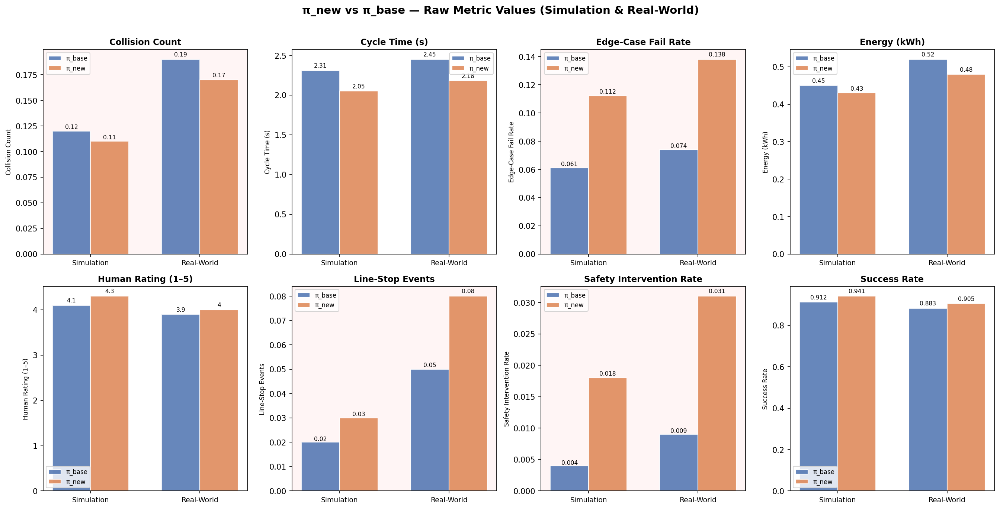
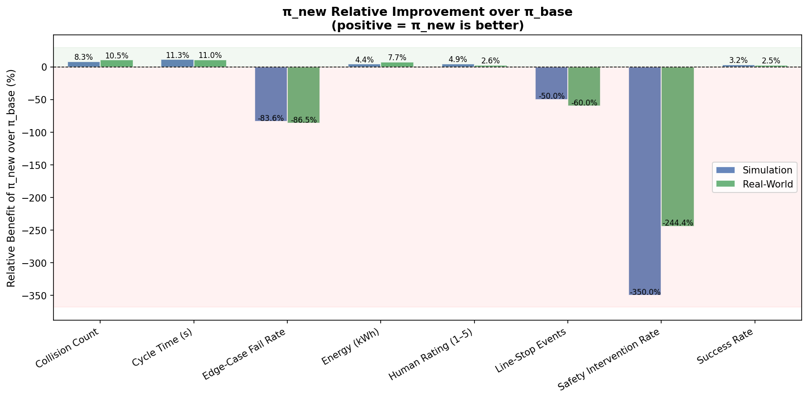
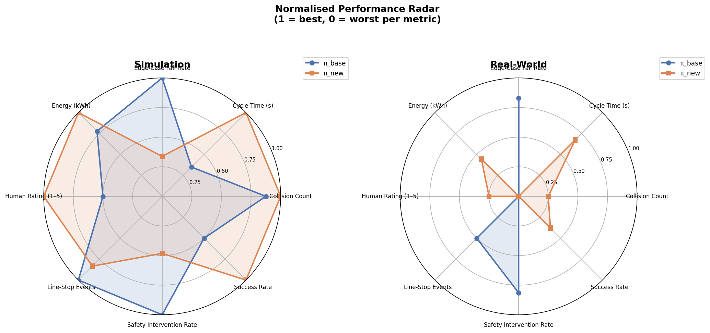
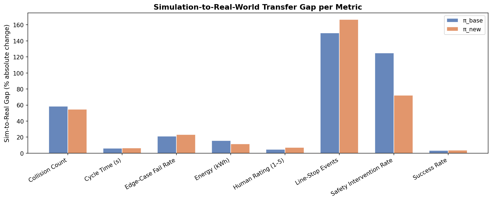
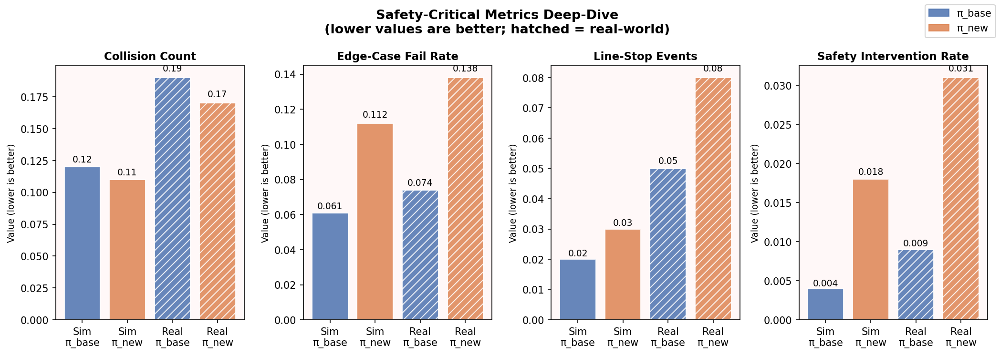

# Policy Comparison Report: π_new vs π_base for Robot Pick-and-Place

**Deployment Recommendation Included**

---

## Abstract

This report presents a systematic, multi-metric evaluation of two reinforcement-learning control policies — **π_new** (candidate) and **π_base** (baseline) — for an industrial robot pick-and-place task. Eight performance metrics spanning productivity, efficiency, and safety were measured in both simulation and real-world environments. While π_new demonstrates meaningful gains in throughput-oriented metrics (success rate, cycle time, energy, human rating), it exhibits severe regressions on every safety-critical metric. Based on this analysis, **π_base is recommended for immediate deployment**; π_new requires targeted safety improvements before it can be considered production-ready.

---

## 1. Introduction

Reinforcement-learning (RL) policies for robotic manipulation are typically evaluated on task-success proxies during training, yet real-world deployment demands a broader assessment that includes safety, reliability, and operator acceptance. A policy that achieves higher pick-and-place success rates but triggers more safety interventions or fails more frequently on edge cases may impose unacceptable operational risk in a production environment.

This study compares π_new — a newly trained RL policy — against π_base, the currently deployed baseline, across eight metrics collected in both simulation and physical hardware trials. The goal is to produce a data-driven deployment recommendation.

---

## 2. Data and Methodology

### 2.1 Dataset

The dataset (`pick_place_metrics.csv`) is a long-form table with four columns:

| Column | Description |
|---|---|
| `arm` | Policy identifier: `pi_base` or `pi_new` |
| `metric` | One of eight performance metrics |
| `simulation` | Value measured in simulation |
| `real_world` | Value measured on physical hardware |

Eight metrics are included:

| Metric | Direction | Category |
|---|---|---|
| `success_rate` | Higher is better | Productivity |
| `cycle_time_s` | Lower is better | Productivity |
| `collision_count` | Lower is better | Safety |
| `energy_kwh` | Lower is better | Efficiency |
| `line_stop_events` | Lower is better | Safety |
| `safety_intervention_rate` | Lower is better | Safety |
| `edge_case_fail_rate` | Lower is better | Safety |
| `human_rating_1_5` | Higher is better | Operator Experience |

### 2.2 Analysis Approach

1. **Raw value comparison** — direct side-by-side comparison of both policies in both environments.
2. **Relative benefit** — percentage improvement of π_new over π_base, sign-corrected so that positive values always indicate π_new is better.
3. **Normalised radar chart** — per-metric min-max normalisation to [0, 1] (1 = best) for holistic visual comparison.
4. **Sim-to-real transfer gap** — absolute percentage deviation between simulation and real-world values, to assess deployment risk.
5. **Safety deep-dive** — focused analysis of the four safety-critical metrics.

All analysis was performed in Python using pandas, NumPy, and Matplotlib.

---

## 3. Results

### 3.1 Raw Metric Values

Figure 1 shows the raw values for all eight metrics across both environments. Safety-critical metrics are highlighted with a light-red background.

**Key observations from raw values:**

- **Success rate**: π_new achieves 94.1% (sim) / 90.5% (real) vs π_base's 91.2% / 88.3% — a modest but consistent improvement.
- **Cycle time**: π_new is faster by ~0.26 s in simulation and ~0.27 s in real-world, representing an ~11% speed-up.
- **Energy**: π_new consumes slightly less energy (0.43 vs 0.45 kWh in sim; 0.48 vs 0.52 kWh real).
- **Human rating**: π_new scores marginally higher (4.3 vs 4.1 in sim; 4.0 vs 3.9 real).
- **Safety metrics**: π_new is worse on all four safety metrics, with the most alarming being safety intervention rate (0.018 vs 0.004 in sim; 0.031 vs 0.009 real) and edge-case fail rate (0.112 vs 0.061 in sim; 0.138 vs 0.074 real).

### 3.2 Relative Benefit Analysis

Figure 2 quantifies the relative benefit of π_new over π_base as a percentage, where positive values indicate π_new is superior.

**Summary table of relative benefits:**

| Metric | Sim Benefit (%) | Real Benefit (%) | π_new Wins? |
|---|---|---|---|
| Success Rate | +3.2% | +2.5% | ✅ Yes |
| Cycle Time | +11.3% | +11.0% | ✅ Yes |
| Collision Count | +8.3% | +10.5% | ✅ Yes |
| Energy (kWh) | +4.4% | +7.7% | ✅ Yes |
| Human Rating | +4.9% | +2.6% | ✅ Yes |
| Line-Stop Events | **−50.0%** | **−60.0%** | ❌ No |
| Safety Intervention Rate | **−350.0%** | **−244.4%** | ❌ No |
| Edge-Case Fail Rate | **−83.6%** | **−86.5%** | ❌ No |

π_new wins on 5 of 8 metrics, but loses catastrophically on 3 of the 4 safety-critical metrics. The safety intervention rate regression is particularly severe: π_new triggers safety interventions at **4.5× the rate** of π_base in simulation and **3.4× the rate** in real-world deployment.

### 3.3 Normalised Radar Chart

Figure 3 presents a normalised radar chart where each metric is scaled to [0, 1] (1 = best performance). This allows holistic visual comparison across incommensurable units.

The radar chart confirms the split personality of π_new: it dominates the upper half of the chart (productivity/efficiency metrics) but collapses on safety metrics. π_base maintains a more balanced, safety-conscious profile.

### 3.4 Simulation-to-Real Transfer Gap

Figure 4 shows how much each metric degrades when moving from simulation to real-world deployment.

**Key findings:**

- **Line-stop events** show the largest sim-to-real gap for both policies (150% for π_base, 167% for π_new), indicating this metric is highly sensitive to real-world conditions.
- **Safety intervention rate** also degrades substantially in real-world for π_new (72% gap vs 125% for π_base), suggesting π_new's safety issues are even more pronounced in physical deployment.
- Productivity metrics (success rate, cycle time, energy) transfer relatively well for both policies, with gaps under 12%.
- π_new generally exhibits **larger sim-to-real gaps on safety metrics**, indicating its simulation training may have over-optimised for task performance at the expense of robust safety behaviour.

### 3.5 Safety-Critical Metrics Deep-Dive

Figure 5 provides a focused comparison of the four safety-critical metrics across all four conditions (simulation/real × π_base/π_new).

**Detailed safety analysis:**

| Metric | π_base Sim | π_new Sim | π_base Real | π_new Real | π_new Regression |
|---|---|---|---|---|---|
| Collision Count | 0.120 | 0.110 | 0.190 | 0.170 | Slight improvement |
| Line-Stop Events | 0.020 | 0.030 | 0.050 | 0.080 | +50% sim, +60% real |
| Safety Intervention Rate | 0.004 | 0.018 | 0.009 | 0.031 | **+350% sim, +244% real** |
| Edge-Case Fail Rate | 0.061 | 0.112 | 0.074 | 0.138 | **+84% sim, +86% real** |

Collision count is the only safety metric where π_new shows marginal improvement (~8–11%). However, the other three safety metrics reveal a consistent and severe pattern: π_new's more aggressive, performance-optimised behaviour leads to substantially more safety interventions, line stoppages, and edge-case failures.

---

## 4. Discussion

### 4.1 Interpretation

The data tells a coherent story: π_new was likely trained with a reward function that heavily incentivises task completion speed and success rate, without adequate penalties for safety-critical events. This produces a policy that is faster and more successful on standard cases but brittle on edge cases and prone to triggering safety systems.

In industrial robotics, safety interventions and line-stop events carry disproportionate operational costs:
- A safety intervention halts the robot and requires human inspection, potentially stopping an entire production line.
- Edge-case failures can damage workpieces, tooling, or the robot itself.
- The 3.4–4.5× increase in safety intervention rate for π_new would likely be unacceptable in any ISO 10218-compliant deployment.

### 4.2 Strengths of π_new

π_new's improvements are real and meaningful in the right context:
- **11% cycle time reduction** translates directly to throughput gains in high-volume production.
- **3.2% success rate improvement** reduces rework and waste.
- **7.7% energy reduction** (real-world) contributes to sustainability goals.
- **Higher human ratings** suggest operators find the motion more natural or predictable in normal operation.

These gains suggest π_new has learned a more efficient motion strategy and should not be discarded — rather, it should be refined.

### 4.3 Risks of Deploying π_new

1. **Regulatory risk**: Safety intervention rates of 0.031 (real-world) may violate operational safety thresholds required by ISO 10218 or site-specific risk assessments.
2. **Operational risk**: 60% more line-stop events in real-world deployment would significantly reduce overall equipment effectiveness (OEE).
3. **Reliability risk**: 86% higher edge-case fail rate means π_new fails nearly twice as often on non-standard scenarios, which are precisely the conditions most likely to cause damage.
4. **Sim-to-real risk**: π_new's larger sim-to-real gaps on safety metrics suggest its safety behaviour is less robust to real-world perturbations.

### 4.4 Recommendations for π_new Improvement

To make π_new deployment-ready, the following modifications are recommended:

1. **Safety-constrained reward shaping**: Add large negative rewards for safety interventions, line stops, and edge-case failures during training. Consider Constrained MDP (CMDP) formulations.
2. **Edge-case curriculum**: Augment training with a diverse set of edge-case scenarios to improve robustness.
3. **Conservative action clipping**: Implement velocity/acceleration limits that prevent the aggressive motions likely causing safety triggers.
4. **Sim-to-real robustness**: Apply domain randomisation specifically targeting the conditions that cause safety events (object pose uncertainty, surface friction variation, sensor noise).
5. **Staged deployment**: If partial deployment is considered, restrict π_new to well-characterised, low-risk pick-and-place scenarios while monitoring safety metrics closely.

---

## 5. Deployment Recommendation

> ### ⚠️ RECOMMENDATION: **Deploy π_base. Do NOT deploy π_new in its current form.**

**Rationale:**

Although π_new outperforms π_base on 5 of 8 metrics — including meaningful improvements in cycle time (+11%), success rate (+2.5%), and energy efficiency (+7.7%) — it fails critically on safety. Specifically:

- **Safety intervention rate** is 3.4× higher in real-world deployment (0.031 vs 0.009)
- **Edge-case fail rate** is 86% higher in real-world deployment (0.138 vs 0.074)
- **Line-stop events** are 60% more frequent in real-world deployment (0.080 vs 0.050)

In industrial robotics, safety failures are not acceptable trade-offs for productivity gains. A single safety incident can result in equipment damage, production downtime, regulatory penalties, or personnel injury. The magnitude of π_new's safety regressions — particularly the 244–350% increase in safety intervention rate — far outweighs its productivity benefits.

**π_base should remain in production** while π_new undergoes targeted safety-focused retraining. Once π_new's safety metrics are brought to parity with or below π_base's levels, re-evaluation is warranted, at which point its productivity advantages could justify deployment.

---

## 6. Conclusion

This analysis evaluated π_new and π_base across eight metrics in simulation and real-world environments. π_new demonstrates genuine improvements in throughput and efficiency but exhibits severe regressions on safety-critical metrics, with safety intervention rates 3–4× higher than π_base in real-world conditions. The deployment recommendation is unambiguous: **continue with π_base** and invest in safety-constrained retraining of π_new before reconsidering its deployment.

---

## Appendix: Numerical Summary

| Metric | π_base Sim | π_new Sim | Δ Sim | π_base Real | π_new Real | Δ Real | Winner |
|---|---|---|---|---|---|---|---|
| Success Rate | 0.912 | 0.941 | +3.2% | 0.883 | 0.905 | +2.5% | π_new |
| Cycle Time (s) | 2.31 | 2.05 | −11.3% | 2.45 | 2.18 | −11.0% | π_new |
| Collision Count | 0.120 | 0.110 | −8.3% | 0.190 | 0.170 | −10.5% | π_new |
| Energy (kWh) | 0.450 | 0.430 | −4.4% | 0.520 | 0.480 | −7.7% | π_new |
| Human Rating (1–5) | 4.1 | 4.3 | +4.9% | 3.9 | 4.0 | +2.6% | π_new |
| Line-Stop Events | 0.020 | 0.030 | +50.0% | 0.050 | 0.080 | +60.0% | **π_base** |
| Safety Intervention Rate | 0.004 | 0.018 | +350% | 0.009 | 0.031 | +244% | **π_base** |
| Edge-Case Fail Rate | 0.061 | 0.112 | +83.6% | 0.074 | 0.138 | +86.5% | **π_base** |

*Δ values for lower-is-better metrics: negative = π_new improved; positive = π_new worsened.*

---

*Analysis performed using Python (pandas, NumPy, Matplotlib). All figures generated from `data/pick_place_metrics.csv`.*
