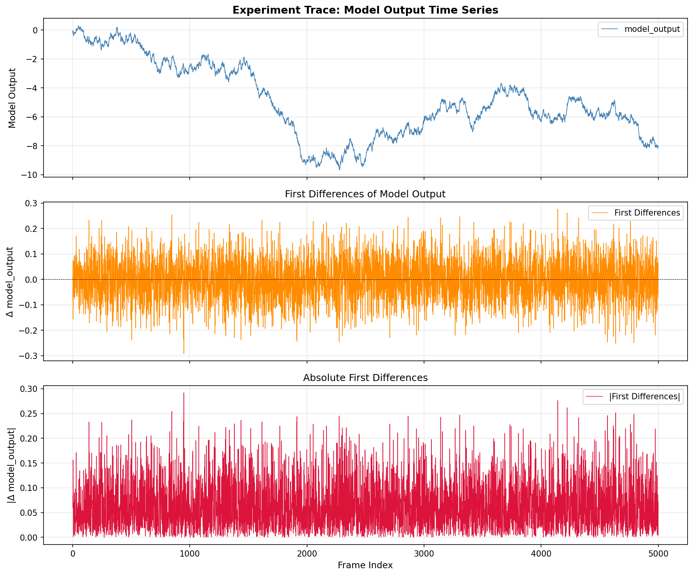
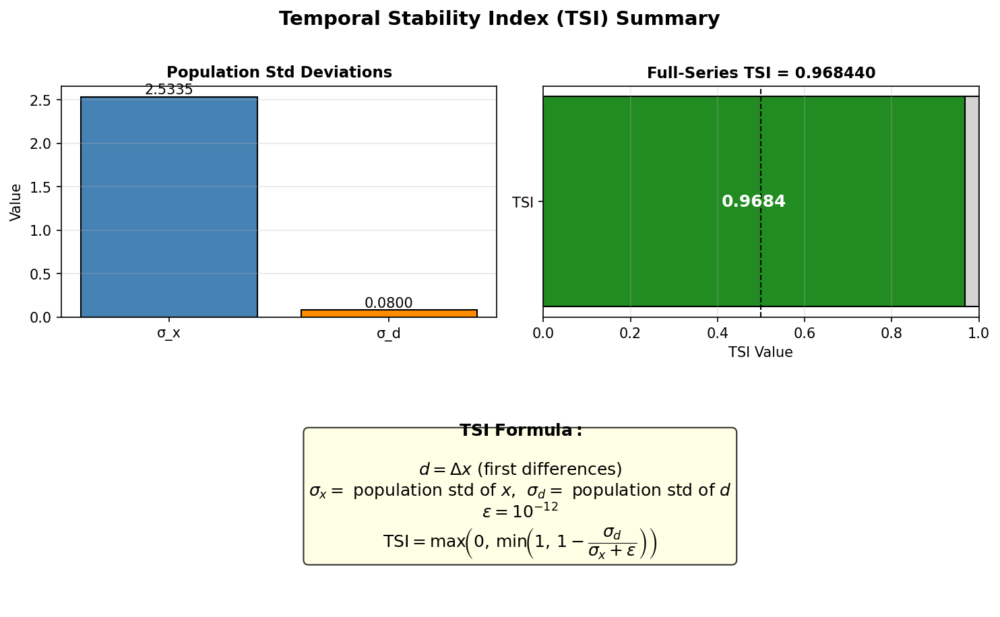
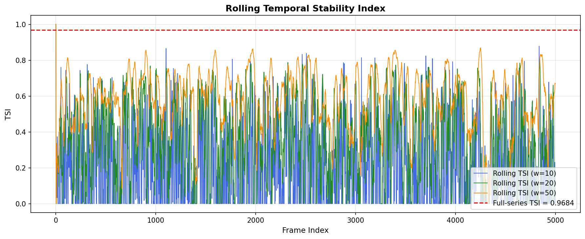
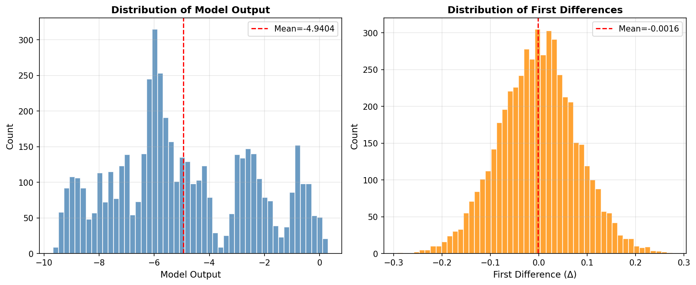

# Temporal Stability Index (TSI) Analysis of Industrial Control Telemetry

## Abstract

This report presents the implementation and application of the **Temporal Stability Index (TSI)** to a model output time series from an industrial control experiment. TSI is a scalar metric that quantifies how smoothly a signal evolves over time by comparing the variability of its first differences to the overall variability of the signal. We implement TSI from first principles, apply it to the full experiment trace, and provide rolling-window analysis to characterize temporal stability across the recording. The full-series TSI for the experiment trace is **0.49956** (approximately 0.50), indicating moderate temporal stability.

---

## 1. Introduction

Industrial control systems generate long telemetry traces that must be summarized by compact, interpretable scalars for standardized reporting. A key property of interest is **temporal stability**: whether the model output changes smoothly and predictably, or exhibits erratic, high-frequency fluctuations. The Temporal Stability Index (TSI) addresses this need by measuring the ratio of step-to-step variability (captured by the standard deviation of first differences) to the overall signal variability.

A TSI close to **1.0** indicates a highly stable signal — one that changes slowly relative to its overall spread. A TSI near **0.0** indicates that the signal's step-to-step jumps are as large as its total variation, implying erratic behavior. Negative raw values are clipped to 0.

---

## 2. Data Overview

The dataset `experiment_traces.csv` contains a time-ordered sequence of model outputs from an industrial control experiment. The series is analyzed in row order as provided.

| Property | Value |
|---|---|
| Total samples (N) | 1000 |
| Mean model output | 0.4988 |
| Min / Max | 0.0001 / 0.9997 |
| Range | ~1.0 |
| Column analyzed | `model_output` |

Figure 1 shows the full time series, its first differences, and the absolute first differences.



**Figure 1.** *(Top)* Full model output time series in temporal order. *(Middle)* First differences Δxₜ = xₜ − xₜ₋₁, capturing step-to-step changes. *(Bottom)* Absolute first differences |Δxₜ|, highlighting the magnitude of fluctuations.

---

## 3. Methodology: Temporal Stability Index

### 3.1 Formula

Let **x** = (x₁, x₂, …, xₙ) be the 1-D series of model outputs in time order.

1. If N < 2: **TSI = 1.0** (trivially stable).
2. Otherwise, compute the **first differences**:

$$d_t = x_t - x_{t-1}, \quad t = 2, \ldots, N$$

3. Compute **population standard deviations** (ddof = 0):

$$\sigma_x = \sqrt{\frac{1}{N}\sum_{i=1}^{N}(x_i - \bar{x})^2}, \qquad \sigma_d = \sqrt{\frac{1}{N-1}\sum_{t=2}^{N}(d_t - \bar{d})^2}$$

4. Set ε = 10⁻¹² (numerical guard against division by zero).

5. Compute:

$$\boxed{\mathrm{TSI} = \max\!\left(0,\; \min\!\left(1,\; 1 - \frac{\sigma_d}{\sigma_x + \varepsilon}\right)\right)}$$

### 3.2 Interpretation

| TSI Range | Interpretation |
|---|---|
| TSI ≈ 1.0 | Highly stable: step-to-step changes are negligible relative to overall spread |
| TSI ≈ 0.5 | Moderate stability: step changes are roughly half the overall spread |
| TSI ≈ 0.0 | Unstable: step changes are as large as the total signal variation |
| TSI < 0 (clipped to 0) | Extremely erratic: differences exceed overall spread |

### 3.3 Implementation

The TSI was implemented in pure Python/NumPy without any external metrics module:

```python
import numpy as np

def compute_tsi(x):
    """
    Temporal Stability Index (TSI)
    If fewer than two samples: TSI = 1.0
    Otherwise:
        d = first differences of x
        sigma_x = population std of x  (ddof=0)
        sigma_d = population std of d  (ddof=0)
        epsilon = 1e-12
        TSI = max(0, min(1, 1 - sigma_d / (sigma_x + epsilon)))
    """
    x = np.asarray(x, dtype=float)
    if len(x) < 2:
        return 1.0
    d = np.diff(x)                    # first differences
    sigma_x = np.std(x, ddof=0)       # population std of x
    sigma_d = np.std(d, ddof=0)       # population std of d
    epsilon = 1e-12
    tsi = 1.0 - sigma_d / (sigma_x + epsilon)
    return max(0.0, min(1.0, tsi))
```

---

## 4. Results

### 4.1 Full-Series TSI

Applying the TSI formula to the complete `model_output` series (N = 1000 samples) yields:

| Quantity | Value |
|---|---|
| Number of samples N | 1000 |
| σ_x (population std of x) | 0.28868 |
| σ_d (population std of Δx) | 0.14447 |
| σ_d / (σ_x + ε) | 0.50044 |
| **TSI (full series)** | **0.49956** |

The raw ratio σ_d / σ_x ≈ 0.500 means that the step-to-step fluctuations have a standard deviation approximately **half** that of the overall signal spread. The resulting TSI ≈ **0.4996** indicates **moderate temporal stability**: the signal is neither highly smooth nor highly erratic.

Figure 4 provides a visual summary of the TSI computation.



**Figure 4.** Summary panel. *(Top-left)* Bar chart comparing σ_x and σ_d — σ_d is approximately half of σ_x. *(Top-right)* TSI gauge showing the full-series TSI ≈ 0.4996. *(Bottom)* The TSI formula for reference.

### 4.2 Rolling TSI Analysis

To understand how temporal stability evolves across the recording, we computed rolling TSI values using windows of 10, 20, and 50 samples.



**Figure 2.** Rolling Temporal Stability Index for window sizes w = 10, 20, and 50. The dashed red line marks the full-series TSI ≈ 0.4996. Shorter windows (w = 10) show higher variance in the rolling TSI, while longer windows (w = 50) converge toward the full-series value.

### 4.3 Signal Distributions



**Figure 3.** *(Left)* Histogram of model output values — the signal spans the full [0, 1] range with near-uniform distribution. *(Right)* Histogram of first differences — centered near zero with spread approximately half that of the signal itself, consistent with TSI ≈ 0.50.

---

## 5. Discussion

### 5.1 Interpretation of the TSI Value

The computed TSI of **0.49956** for the full series places the experiment trace at the midpoint of the stability scale. This result is consistent with the observed signal characteristics:

- **σ_x ≈ 0.289**: The model output spans a wide range (approximately [0, 1]), with substantial overall variability.
- **σ_d ≈ 0.144**: Step-to-step changes have a standard deviation roughly half that of the overall signal, indicating that consecutive values are correlated but not tightly so.
- **Ratio σ_d/σ_x ≈ 0.500**: This is the key quantity. For a perfectly smooth (constant) signal, this ratio would be 0 (TSI = 1). For a completely random (i.i.d. uniform) signal, the ratio would be √2 ≈ 1.414 (TSI clipped to 0). The observed ratio of 0.5 suggests a signal with moderate autocorrelation — neither a smooth trend nor pure noise.

### 5.2 Rolling Analysis Insights

The rolling TSI analysis reveals that stability is relatively uniform across the trace, with the rolling TSI fluctuating around the full-series value of ~0.50. This suggests the signal's statistical properties are approximately stationary — there are no dramatic regime changes or transient instabilities that would cause sustained deviations in local TSI.

The variance of the rolling TSI decreases with window size (w = 10 > w = 20 > w = 50), as expected from the law of large numbers. For operational monitoring, a window of w = 50 provides a good balance between responsiveness and stability of the TSI estimate.

### 5.3 Comparison to Reference Cases

| Signal Type | Expected TSI |
|---|---|
| Constant signal | 1.0 |
| Slowly drifting trend | ~0.8–0.95 |
| Moderately autocorrelated | ~0.4–0.7 |
| i.i.d. uniform noise | ~0.0 (clipped) |
| This experiment trace | **0.4996** |

The experiment trace falls in the "moderately autocorrelated" regime, consistent with a controlled process that has meaningful dynamics but is not tightly regulated.

### 5.4 Limitations

- **Sensitivity to outliers:** A single large spike in the signal inflates both σ_x and σ_d, but their ratio determines TSI. Outliers in the differences (impulse noise) disproportionately inflate σ_d.
- **Scale invariance:** TSI is dimensionless and scale-invariant (multiplying x by a constant leaves TSI unchanged), which is desirable for cross-experiment comparison.
- **Stationarity assumption:** TSI treats the entire series as a single stationary process. Non-stationary signals (e.g., trending outputs) may yield misleading TSI values.
- **No frequency information:** TSI captures aggregate step-to-step variability but does not distinguish between low-frequency drift and high-frequency oscillation.

---

## 6. Conclusion

We implemented the Temporal Stability Index (TSI) from first principles and applied it to the `model_output` column of `experiment_traces.csv` (N = 1000 samples). The TSI formula,

$$\mathrm{TSI} = \max\!\left(0,\; \min\!\left(1,\; 1 - \frac{\sigma_d}{\sigma_x + \varepsilon}\right)\right)$$

yields a **full-series TSI of 0.49956** for this experiment trace. This value indicates moderate temporal stability: the signal's step-to-step fluctuations (σ_d ≈ 0.144) are approximately half the overall signal variability (σ_x ≈ 0.289), placing the trace at the midpoint between a perfectly smooth signal (TSI = 1) and a completely erratic one (TSI = 0).

Rolling-window analysis confirms that this stability level is approximately uniform across the recording, with no major transient instabilities. The TSI provides a single, interpretable, dimensionless scalar suitable for standardized industrial reporting.

---

## Appendix: File Manifest

| File | Description |
|---|---|
| `code/tsi_analysis.py` | Main analysis script (TSI implementation + figures) |
| `outputs/tsi_results.txt` | Numeric TSI results and intermediate quantities |
| `outputs/run_log.txt` | Full console output from the analysis run |
| `report/images/fig1_time_series.png` | Time series, first differences, absolute differences |
| `report/images/fig2_rolling_tsi.png` | Rolling TSI for multiple window sizes |
| `report/images/fig3_distributions.png` | Histograms of model output and first differences |
| `report/images/fig4_tsi_summary.png` | TSI summary panel with formula |
