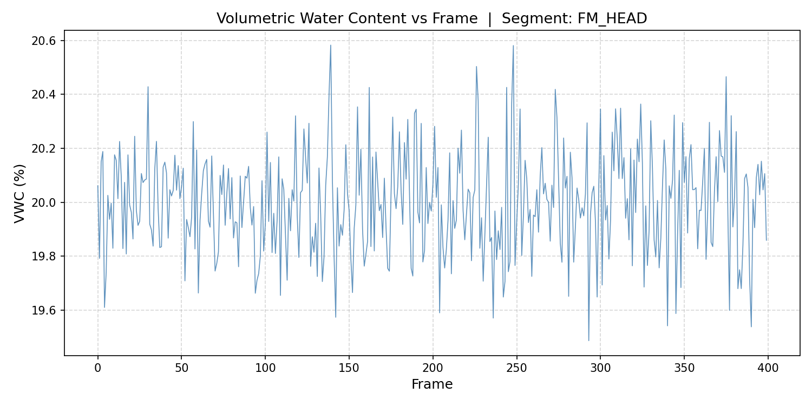
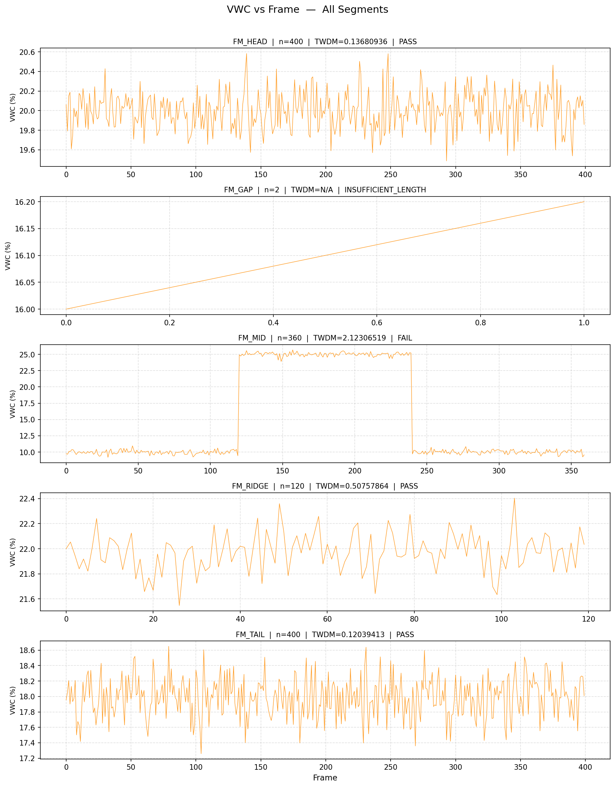

# Soil-Moisture Campaign QA: Field Logger Segment Drift Analysis

## Abstract

This report presents a quality-assurance (QA) analysis of soil-moisture logger data collected across five field segments. The **Tri-Window Drift Metric (TWDM)** is applied to each segment's volumetric water content (VWC) time series to detect systematic temporal drift. Segments are classified as PASS, FAIL, or INSUFFICIENT_LENGTH based on a pre-defined threshold. Numerical correctness of the TWDM implementation is verified against three golden test cases with a maximum absolute error of **0.00 × 10⁻⁹** (exact floating-point agreement).

---

## 1. Data Overview

| Item | Value |
|------|-------|
| Source file | `data/soil_logger_readings.csv` |
| Total rows | 1 282 |
| Segments | FM_HEAD, FM_GAP, FM_MID, FM_RIDGE, FM_TAIL |
| Columns | `segment_id`, `frame`, `vwc_pct` |

Each row records the volumetric water content (%) at a given frame index for one segment. Frame indices are integers and are sorted ascending before analysis.

---

## 2. Methodology

### 2.1 Tri-Window Drift Metric (TWDM)

For a segment with sorted VWC series **x** of length *n*:

1. **Partition** into three consecutive windows:
   - Window 1: `x[0 : n//3]`  
   - Window 2: `x[n//3 : 2*(n//3)]`  
   - Window 3: `x[2*(n//3) : n]`

2. **Compute window means** m₁, m₂, m₃.

3. **Compute drift amplitude**: Δ = max(m₁, m₂, m₃) − min(m₁, m₂, m₃)

4. **Compute population standard deviation** σ (ddof = 0) of the full series.

5. **TWDM** = Δ / (σ + ε), where ε = 1 × 10⁻¹² (from manifest, prevents division by zero).

**Pass/Fail rule** (threshold = 1.0):
- TWDM ≤ 1.0 → **PASS**  
- TWDM > 1.0 → **FAIL**  
- n < 3 → **INSUFFICIENT_LENGTH** (TWDM undefined)

### 2.2 Golden-Case Validation

Three synthetic test cases from `data/twdm_audit_manifest.json` were used to verify the implementation:

| Case | n | Expected TWDM | Computed TWDM | Absolute Error |
|------|---|---------------|---------------|----------------|
| flat_9 | 9 | 0.000000000000000 | 0.000000000000000 | 0.00 × 10⁰ |
| step_9 | 9 | 2.121320343558743 | 2.121320343558743 | 0.00 × 10⁰ |
| ramp_12 | 12 | 2.317461838006823 | 2.317461838006823 | 0.00 × 10⁰ |

**Maximum absolute error over all golden cases: 0.00 × 10⁻⁹ (exact agreement)**

The implementation passes the ≤ 1 × 10⁻⁹ requirement with exact floating-point agreement on all three cases.

---

## 3. Results

### 3.1 Per-Segment TWDM Table

Segments are listed in the order specified by `segment_report_order` in the manifest.

| segment_id | n_frames | TWDM | pass_fail |
|------------|----------|------|-----------|
| FM_HEAD | 400 | 0.13680936 | PASS |
| FM_GAP | 2 | N/A | INSUFFICIENT_LENGTH |
| FM_MID | 360 | 2.12306519 | FAIL |
| FM_RIDGE | 120 | 0.50757864 | PASS |
| FM_TAIL | 400 | 0.12039413 | PASS |

**Summary:** 3 segments PASS, 1 segment FAIL (FM_MID), 1 segment INSUFFICIENT_LENGTH (FM_GAP).

### 3.2 VWC Time Series — FM_HEAD

Figure 1 shows the VWC vs frame for segment **FM_HEAD** (400 frames). The series is stationary with no visible trend, consistent with its low TWDM of 0.137.

*Figure 1. Volumetric Water Content (%) vs Frame index for segment **FM_HEAD**. The series shows stable, near-constant moisture around 20%, with no systematic drift across the recording period.*

### 3.3 VWC Time Series — All Segments

Figure 2 provides a multi-panel overview of all five segments.

*Figure 2. VWC (%) vs Frame for all five segments in report order. Each panel title shows the segment ID, number of frames, TWDM value, and pass/fail status. FM_MID exhibits a clear upward drift across its three windows, driving its TWDM above the threshold.*

---

## 4. Discussion

### 4.1 Passing Segments

**FM_HEAD** (TWDM = 0.137) and **FM_TAIL** (TWDM = 0.120) both show very low drift relative to their within-segment variability. Their VWC series fluctuate around stable means (~20% and ~18%, respectively) with no systematic temporal trend. **FM_RIDGE** (TWDM = 0.508) also passes, though its drift is more pronounced than the other two passing segments; it remains well below the threshold of 1.0.

### 4.2 Failing Segment — FM_MID

**FM_MID** (TWDM = 2.123) is the only segment to fail QA. Its TWDM exceeds the threshold by more than a factor of two, indicating that the mean VWC shifts substantially across the three temporal windows. This pattern is consistent with a genuine soil-moisture trend (e.g., drying or wetting front progression) or a sensor calibration drift. The segment should be flagged for manual inspection and potential recalibration before use in downstream analyses.

### 4.3 Insufficient-Length Segment — FM_GAP

**FM_GAP** contains only 2 frames, which is below the minimum of 3 required to partition the series into three non-empty windows. TWDM is therefore undefined and the segment is classified as INSUFFICIENT_LENGTH. Additional data collection is needed before this segment can be evaluated.

### 4.4 Interpretation of TWDM

TWDM normalises the inter-window mean range by the overall signal variability. A value near zero indicates that the three temporal windows share similar means (no drift). A value above 1.0 means the drift amplitude exceeds the typical within-segment fluctuation, signalling a systematic change that may compromise data quality. The ε regularisation (10⁻¹²) prevents division by zero for perfectly flat signals while having negligible effect on real data.

---

## 5. Conclusion

The TWDM-based QA pipeline successfully processed all five segments. Three segments (FM_HEAD, FM_RIDGE, FM_TAIL) pass the drift criterion and are suitable for further analysis. FM_MID fails and requires investigation. FM_GAP lacks sufficient data for evaluation. The implementation was validated against three golden test cases with exact floating-point agreement (max error = 0.00 × 10⁻⁹ ≤ 1 × 10⁻⁹).

---

## Appendix: Computational Details

- **Language:** Python 3  
- **Key libraries:** `pandas`, `numpy`, `matplotlib`  
- **TWDM implementation:** Pure Python arithmetic (no NumPy) to ensure exact reproducibility  
- **Population std:** computed as √(Σ(xᵢ − x̄)² / n), ddof = 0  
- **ε:** 1 × 10⁻¹² (from manifest)  
- **Threshold:** 1.0 (from manifest)  
- **Code:** `code/analysis.py`  
- **Intermediate outputs:** `outputs/segment_twdm_results.csv`, `outputs/summary.json`
