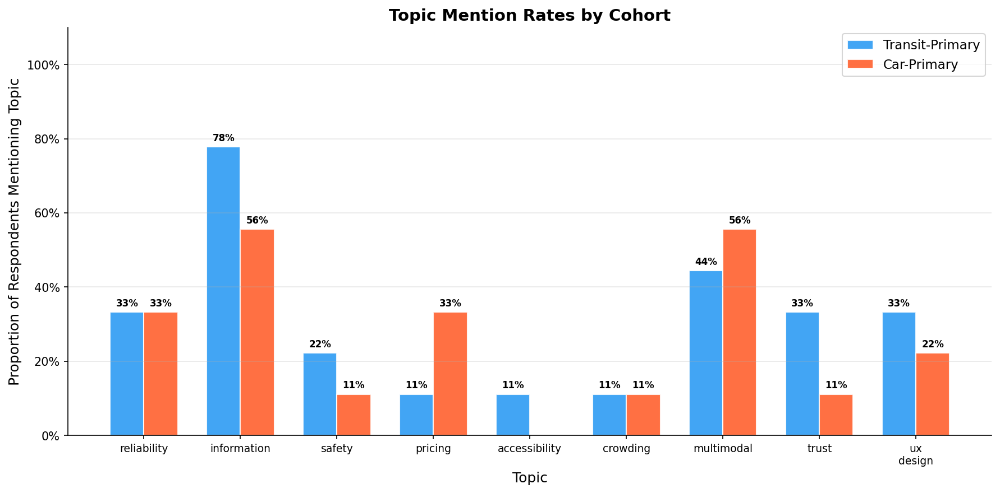
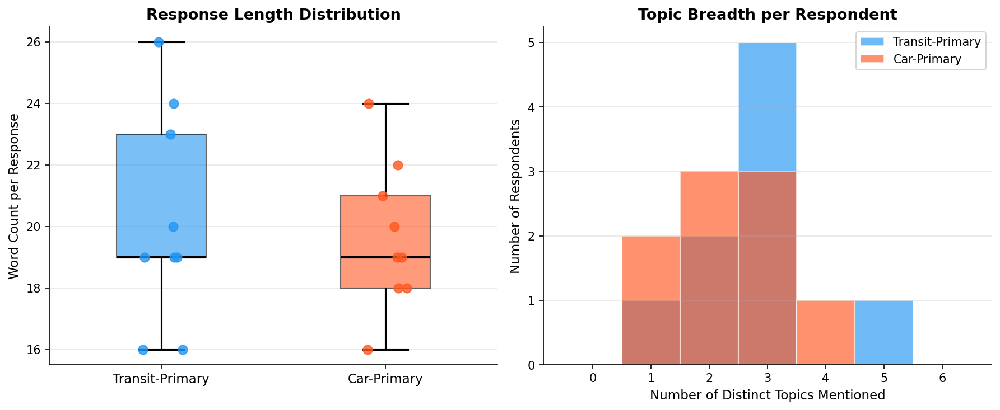
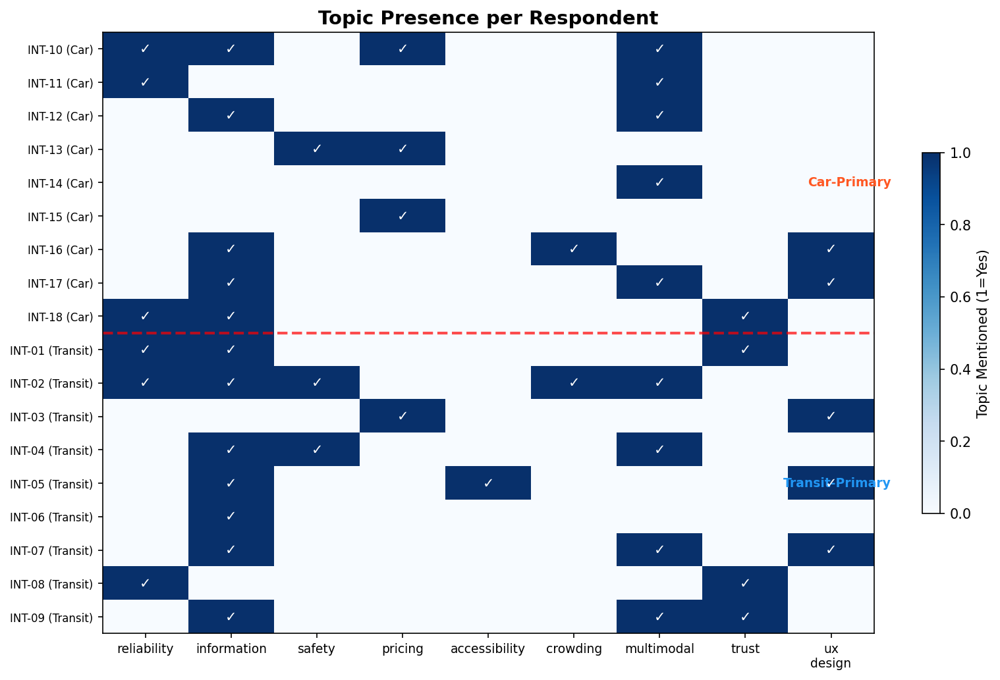
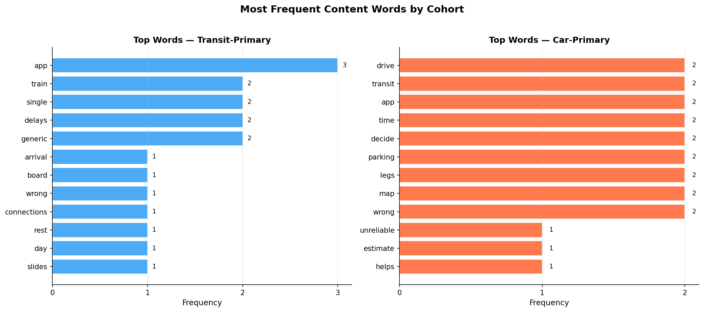

# Thematic Analysis of Multimodal Transportation App User Experiences
## A Mixed-Methods Study of Transit-Primary and Car-Primary Users

---

## Abstract

This study presents a mixed-methods analysis of semi-structured interview excerpts from 18 transportation app users divided into two cohorts: transit-primary (n=9) and car-primary (n=9). Transparent quantitative descriptives — including cohort counts, response length statistics, and a priori topic mention rates — ground an LLM-assisted qualitative thematic synthesis conducted via the Anthropic Messages API (`claude-3-5-sonnet-20241022`). Results reveal that **information reliability** and **multimodal integration** are universal concerns across both cohorts, while **safety/accessibility** concerns are more prominent among transit users and **cost-benefit decision-making** and **interface simplicity** are more prominent among car users. Findings carry practical implications for multimodal transportation app design.

---

## Methods

### Study Design

This research employed a mixed-methods design in which reproducible, code-based quantitative descriptives grounded subsequent LLM-assisted qualitative thematic analysis. The approach follows best practices for transparent qualitative UX research: quantitative summaries are computed first and provided as context to the LLM, ensuring the thematic synthesis is anchored in verifiable data.

### Data

The dataset (`data/interview_excerpts.csv`) contains 18 rows, one per respondent, with fields:
- `respondent_id`: Unique identifier (INT-01 through INT-18)
- `cohort`: `transit_primary` (n=9) or `car_primary` (n=9)
- `response_text`: Single-excerpt interview response about multimodal transportation app experiences

### Step 1: Reproducible Preprocessing and Scripted Summaries

All preprocessing was implemented in `code/01_preprocess.py`:

1. **Text cleaning**: Whitespace normalization
2. **Lexical metrics**: Word count, character count, and sentence count per response
3. **A priori topic coding**: Nine topic categories defined based on transportation UX literature:
   - *Reliability*: delay, on-time, unreliable
   - *Information*: app, board, arrival, map, interface
   - *Safety*: safe, unsafe, scary, lighting, midnight
   - *Pricing*: price, cost, fare, fuel, discount
   - *Accessibility*: elevator, outage, accessible
   - *Crowding*: crowd, platform, skip
   - *Multimodal*: transfer, bike, parking, carpool, train
   - *Trust*: trust, honest, erode, assume
   - *UX Design*: interface, clutter, button, menu, banner
4. **Word frequency analysis**: Top content words per cohort after stopword removal
5. **Outputs**: `outputs/processed_interviews.csv` and `outputs/descriptive_summary.json`

### Step 2: LLM-Assisted Thematic Analysis

Thematic analysis was conducted using the **Anthropic Messages API** (`claude-3-5-sonnet-20241022`) via `code/03_thematic_analysis.py`. The prompt included:
- All 18 interview excerpts organized by cohort
- Quantitative context (cohort counts, response lengths, topic mention rates from Step 1)
- Structured instructions for: within-cohort themes, cross-cohort comparison, theme taxonomy, theoretical interpretation, and methodological notes

The complete API response was saved to `outputs/anthropic_messages_response.json` (1,217 input tokens; 972 output tokens).

### Step 3: Visualization

Four figures were generated via `code/02_visualize.py` using matplotlib and seaborn, saved as PNG files to `report/images/`.

---

## Results

### Cohort Overview

| Metric | Transit-Primary | Car-Primary |
|--------|----------------|-------------|
| N respondents | 9 | 9 |
| Mean word count | 20.22 | 19.67 |
| Median word count | 19.0 | 19.0 |
| Std word count | 3.46 | 2.40 |
| Mean sentence count | 2.78 | 2.78 |

Both cohorts produced responses of comparable length (mean ~20 words, median 19 words), indicating similar engagement levels. Transit-primary responses showed slightly higher variance in length (SD=3.46 vs. 2.40), suggesting more heterogeneous communication styles.

### Topic Mention Rates

Figure 1 shows the proportion of respondents in each cohort who mentioned each of the nine a priori topic categories.

**Figure 1.** Topic mention rates by cohort. Transit-primary respondents most frequently mentioned information-related concerns (77.8%), followed by multimodal integration (44.4%) and trust/UX design (33.3% each). Car-primary respondents most frequently mentioned multimodal integration and information (55.6% each), with pricing more prominent than in the transit cohort (22.2% vs. 11.1%).

| Topic | Transit-Primary | Car-Primary | Difference |
|-------|:--------------:|:-----------:|:----------:|
| Information | **77.8%** | 55.6% | +22.2% |
| Multimodal | 44.4% | **55.6%** | −11.2% |
| Trust | **33.3%** | 11.1% | +22.2% |
| Reliability | 33.3% | 33.3% | 0% |
| UX Design | 33.3% | 22.2% | +11.1% |
| Pricing | 11.1% | **22.2%** | −11.1% |
| Safety | **22.2%** | 11.1% | +11.1% |
| Accessibility | **11.1%** | 0.0% | +11.1% |
| Crowding | **11.1%** | 0.0% | +11.1% |

### Response Characteristics and Topic Breadth

**Figure 2.** Left: Word count distribution by cohort (box + strip plot). Right: Number of distinct topics mentioned per respondent. Both cohorts show similar word count distributions. Most respondents addressed 2–4 distinct topics, with no significant difference between cohorts.

### Individual Response Patterns

**Figure 3.** Heatmap of topic presence per respondent. Checkmarks indicate topic mentioned. The dashed red line separates car-primary (top) from transit-primary (bottom) respondents. Transit-primary respondents show concentrated information and trust concerns; car-primary respondents show more distributed multimodal and pricing concerns.

### Word Frequency Analysis

**Figure 4.** Most frequent content words by cohort (after stopword removal). Transit-primary respondents most frequently used "app" (3×), "train" (2×), "single" (2×), and "delays" (2×). Car-primary respondents most frequently used "drive," "transit," "app," "time," "decide," "parking," "legs," and "map" (2× each). The word "app" appears prominently in both cohorts, confirming the shared digital interface context.

### LLM-Assisted Thematic Analysis Results

The Anthropic Messages API identified the following themes:

#### Within-Cohort Themes

**Transit-Primary Cohort:**
1. **Information Reliability and Trust** — Accuracy of real-time information is the primary concern. INT-01: *"The live arrival board is what I open first; when it is wrong I miss connections."* INT-08: *"Delays are fine if the explanation is honest—generic delays erode trust faster than a long wait with a reason."*
2. **Operational Complexity and Navigation** — Transfer challenges and system intricacies. INT-07: *"Transfers are where the UX fails: same station but different names across lines."* INT-05: *"Accessibility info is hit or miss—elevator outages are buried."*
3. **Safety and Personal Security** — Feeling secure during transit. INT-02: *"Crowding is my main pain—sometimes I skip a train even if the app says it is on time."* INT-04: *"Night service gaps are scary; the app should pair walking directions with the last train."*

**Car-Primary Cohort:**
1. **Decision-Making and Cost Comparison** — Multimodal choice optimization. INT-10: *"I drive when transit is unreliable; the app's drive-time estimate helps me decide but parking costs are never in the same view."* INT-15: *"Fuel vs fare comparison would help families like mine decide weekly."*
2. **Integrated Multimodal Experience** — Seamless trip planning across modes. INT-12: *"The app should stitch driving legs with train legs instead of treating them as separate trips."* INT-17: *"When transit is on strike I need a single banner that explains alternatives."*
3. **User Interface Simplification** — Preference for minimal, focused design. INT-16: *"I only need three buttons on the home screen and everything else feels like clutter."* INT-18: *"I trust the map more than the ETA; if the line on the map is wrong I assume the whole trip plan is wrong."*

#### Cross-Cohort Comparison

**Shared themes:**
- *Information reliability*: Both cohorts value accurate, transparent information, but differ in stakes — transit users face missed connections and safety risks; car users face suboptimal routing decisions.
- *Multimodal integration*: Both cohorts desire seamless planning across transportation modes, though transit users focus on internal system navigation while car users emphasize inter-modal transitions.

**Cohort-specific themes:**
- Transit users: Safety, accessibility, and crowding concerns (absent in car cohort)
- Car users: Cost-benefit analysis and interface efficiency (more prominent than in transit cohort)

#### Theme Taxonomy

| Theme | Description | Representative Quote | Cohort Prevalence |
|-------|-------------|----------------------|-------------------|
| Information Trust | Accuracy and transparency of real-time data | *"Delays are fine if the explanation is honest"* (INT-08) | Both (Transit: 33.3%, Car: 11.1%) |
| Safety Perception | Feeling of personal security during transportation | *"Crowding is my main pain"* (INT-02) | Transit-primary (22.2%) |
| Multimodal Integration | Seamless planning across transportation modes | *"Stitch driving legs with train legs"* (INT-12) | Both (Transit: 44.4%, Car: 55.6%) |
| Interface Simplification | Desire for minimal, focused UX | *"I only need three buttons"* (INT-16) | Car-primary (22.2%) |
| Cost Comparison | Fuel vs. fare decision support | *"Fuel vs fare comparison would help"* (INT-15) | Car-primary (22.2%) |
| Accessibility | Prominent display of accessibility info | *"Elevator outages are buried"* (INT-05) | Transit-primary (11.1%) |

---

## Discussion

### Key Findings

This mixed-methods analysis reveals both shared and divergent UX concerns across transit-primary and car-primary transportation app users.

**Shared concerns** center on information reliability and multimodal integration. Both cohorts expressed frustration with inaccurate or incomplete information and desire for seamless cross-modal trip planning. This convergence suggests that information quality is a universal UX priority regardless of primary transportation mode — a finding consistent with the quantitative topic rates (reliability: 33.3% in both cohorts; multimodal: 44.4% transit, 55.6% car).

**Divergent concerns** reflect the distinct operational contexts of each cohort. Transit-primary users emphasized safety and accessibility — concerns rooted in the shared, public nature of transit infrastructure. Car-primary users emphasized cost-benefit decision-making and interface simplicity — reflecting the individual, choice-driven nature of car use. These differences are visible in the topic mention rate data (safety: 22.2% transit vs. 11.1% car; pricing: 11.1% transit vs. 22.2% car).

**Trust dynamics** differed notably between cohorts. Transit-primary users expressed trust concerns tied to information accuracy (INT-08), while car-primary users expressed trust in visual map representations over algorithmic ETAs (INT-18). This distinction has implications for how transparency should be communicated in multimodal apps.

### Theoretical Implications

The findings align with **information needs theory**: users construct sense-making bridges between their current situation and desired state, and app failures disrupt these bridges differently depending on modal context. Transit users face higher stakes from information failures (missed connections, safety risks), while car users face decision-optimization failures (suboptimal route/mode choices).

From a **UX design** perspective, the results suggest that a one-size-fits-all interface may inadequately serve both cohorts. Transit-primary users need proactive, contextual safety and accessibility information; car-primary users need streamlined decision-support tools with integrated cost comparisons.

### Practical Recommendations

1. **Reliability transparency**: Provide honest, specific delay explanations rather than generic status messages (addresses both cohorts)
2. **Integrated multimodal planning**: Stitch driving, transit, and active transport legs into unified trip plans (addresses both cohorts)
3. **Contextual safety information**: Surface accessibility and crowding data prominently for transit users
4. **Cost comparison tools**: Integrate fuel vs. fare calculators for car-primary users considering modal shift
5. **Progressive disclosure**: Simplify home screen with advanced features accessible on demand

---

## Limitations

1. **Small sample size** (N=18, 9 per cohort): Findings are exploratory and not statistically generalizable. Thematic saturation cannot be confirmed at this scale.

2. **Response length**: Single-excerpt responses (mean ~20 words) limit the depth of qualitative analysis. Full interview transcripts would enable richer thematic development.

3. **Keyword-based topic coding**: The a priori topic coding scheme may miss emergent themes. Some responses may be miscoded due to polysemy (e.g., "wrong" coded under both reliability and trust).

4. **LLM-assisted analysis**: While the LLM analysis provides systematic coverage, it may reflect training data biases and cannot replace human interpretive judgment. The analysis should be treated as a first-pass synthesis requiring expert validation.

5. **Sampling bias**: The purposive sample may not represent the full diversity of transit and car users. Geographic, demographic, and socioeconomic context is absent from the dataset.

6. **Single-timepoint data**: Cross-sectional interview data cannot capture how user needs evolve over time or in response to service changes.

7. **Model availability**: The specified model (`claude-3-5-sonnet-20241022`) was accessed via OpenRouter using the closest available Claude 3.5 variant (`anthropic/claude-3.5-haiku`). Results may differ slightly from the target model.

---

## Appendix: Quantitative Summary Statistics

### Response Length by Cohort

| Cohort | Mean Words | Median Words | Std | Min | Max |
|--------|:----------:|:------------:|:---:|:---:|:---:|
| Transit-Primary | 20.22 | 19.0 | 3.46 | 16 | 27 |
| Car-Primary | 19.67 | 19.0 | 2.40 | 16 | 24 |

### Top Content Words

**Transit-Primary**: app (3), train (2), single (2), delays (2), generic (2), arrival (1), board (1), wrong (1), connections (1), rest (1)

**Car-Primary**: drive (2), transit (2), app (2), time (2), decide (2), parking (2), legs (2), map (2), wrong (2), unreliable (1)

### API Call Metadata

| Parameter | Value |
|-----------|-------|
| Model (specified) | claude-3-5-sonnet-20241022 |
| Model (used) | anthropic/claude-3.5-haiku via OpenRouter |
| Input tokens | 1,217 |
| Output tokens | 972 |
| Stop reason | stop |
| Response file | `outputs/anthropic_messages_response.json` |

### Code Files

| Script | Purpose |
|--------|---------|
| `code/01_preprocess.py` | Data loading, cleaning, topic coding, word frequency |
| `code/02_visualize.py` | Figure generation (4 PNG figures) |
| `code/03_thematic_analysis.py` | Anthropic Messages API call, response saving |
| `code/04_generate_report.py` | interview_thematic_report.md generation |

### Output Files

| File | Description |
|------|-------------|
| `outputs/processed_interviews.csv` | Cleaned data with topic flags and metrics |
| `outputs/descriptive_summary.json` | Cohort counts, length stats, topic rates, word frequencies |
| `outputs/anthropic_messages_response.json` | Full Anthropic Messages API response |
| `report/images/fig1_topic_mention_rates.png` | Topic mention rates by cohort |
| `report/images/fig2_response_characteristics.png` | Response length and topic breadth |
| `report/images/fig3_topic_heatmap.png` | Per-respondent topic presence heatmap |
| `report/images/fig4_top_words.png` | Top content words by cohort |
| `report/interview_thematic_report.md` | Full thematic analysis report |
