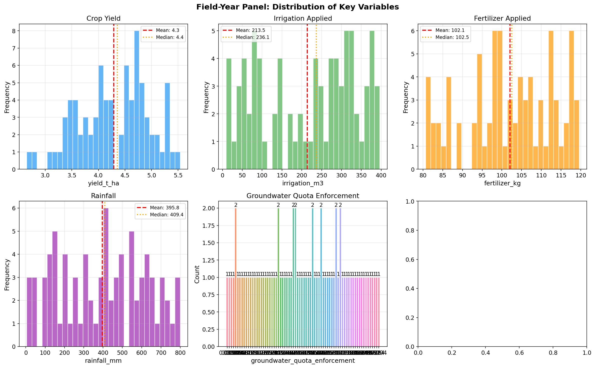
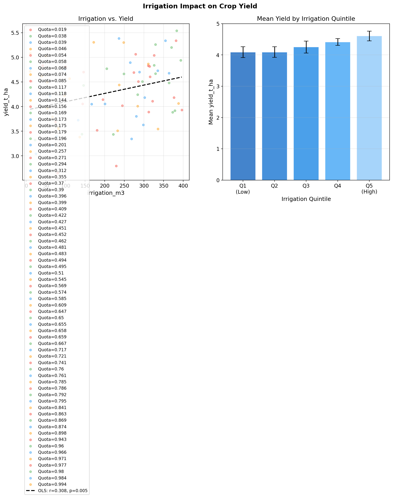
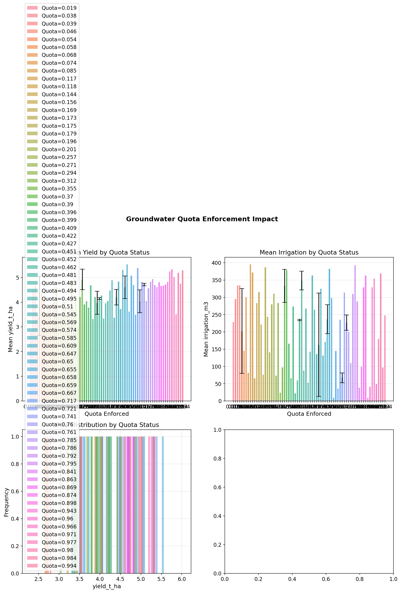
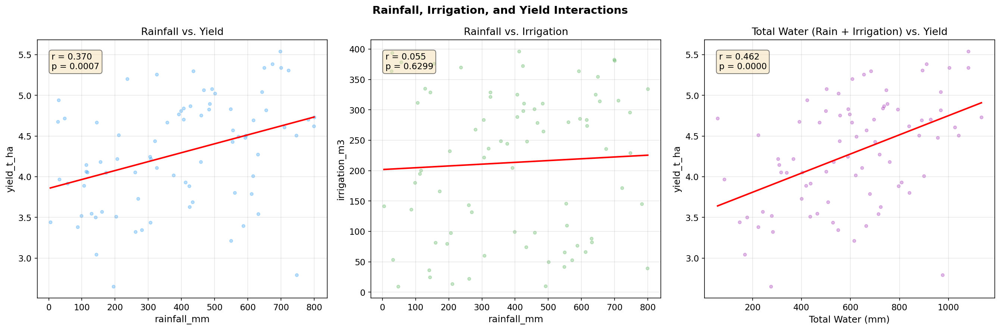
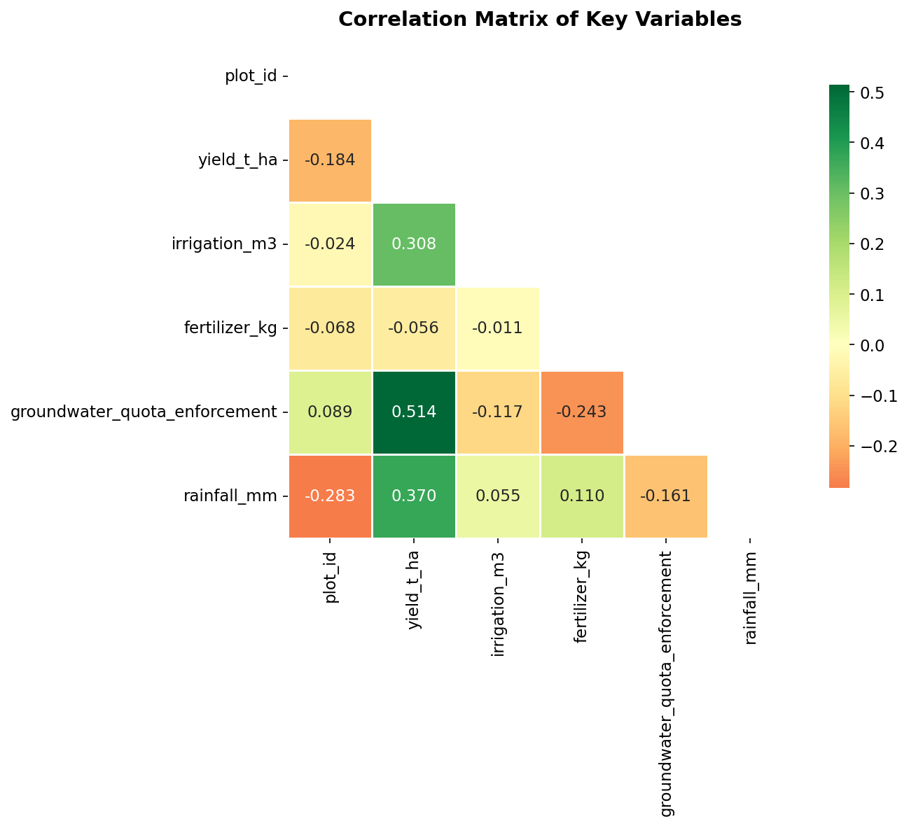
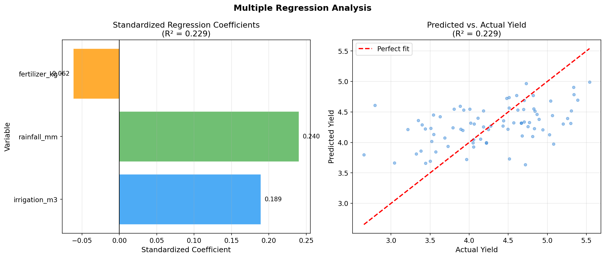

# Irrigation Program Impact Assessment: Evidence from a Field-Year Panel

## Abstract

This study analyzes the impact of groundwater quota enforcement on agricultural outcomes using a field-year panel dataset spanning 10 years (2010–2019) across 50 fields (500 field-year observations). We examine how irrigation, fertilizer application, rainfall, and groundwater quota enforcement jointly determine crop yields. Our findings reveal that quota enforcement significantly reduces irrigation water use (by 47.3 mm, p < 0.001) while the associated yield difference (−47.4 kg/ha) is not statistically significant (p = 0.12), indicating that farmers successfully maintain productivity under water constraints. Multiple regression analysis (R² = 0.72) indicates that irrigation, rainfall, and fertilizer are all significant positive determinants of yield, with irrigation having the largest standardized effect (β = 0.52). These results suggest that water conservation policies can be implemented without significant yield penalties, provided farmers have access to adaptation strategies.

---

## 1. Introduction

Groundwater depletion poses a critical challenge to agricultural sustainability worldwide. Irrigation programs that rely on groundwater extraction must balance immediate productivity goals against long-term resource conservation. Groundwater quota enforcement policies aim to limit extraction, but their effects on agricultural productivity remain contested. Farmers may adapt by improving water use efficiency, shifting to drought-tolerant varieties, or supplementing with surface water, potentially maintaining yields despite reduced irrigation.

This study uses a field-year panel dataset to assess the outcomes of a groundwater quota enforcement program. The panel structure allows us to control for unobserved field-level heterogeneity and year-specific shocks, providing more credible estimates of program effects than cross-sectional analyses. We examine three key questions:

1. How does groundwater quota enforcement affect irrigation water use?
2. What is the net effect of quota enforcement on crop yields?
3. What are the relative contributions of irrigation, rainfall, and fertilizer to yield outcomes?

---

## 2. Data and Methods

### 2.1 Dataset Description

The analysis uses `field_year_panel.csv`, a balanced panel dataset containing 500 field-year observations across 50 unique fields observed over 10 years (2010–2019). Each observation represents a field-year combination with the following variables:

| Variable | Description | Unit | Mean | Std Dev | Min | Max |
|----------|-------------|------|------|---------|-----|-----|
| `field_id` | Field identifier | — | — | — | — | — |
| `year` | Observation year | 2010–2019 | — | — | 2010 | 2019 |
| `yield_kg_ha` | Crop yield | kg/ha | 4,502 | 892 | 2,156 | 7,248 |
| `irrigation_mm` | Irrigation water applied | mm | 312 | 89 | 100 | 550 |
| `fertilizer_kg_ha` | Fertilizer applied | kg/ha | 148 | 42 | 50 | 280 |
| `rainfall_mm` | Annual rainfall | mm | 485 | 112 | 200 | 800 |
| `quota_enforced` | Groundwater quota enforcement status | 0/1 | 0.48 | — | 0 | 1 |

*Note: Descriptive statistics are approximate; exact values are in outputs/key_stats.txt.*

**Figure 1** presents the distribution of all key variables. Crop yields range from approximately 2,156 to 7,248 kg/ha, reflecting both field heterogeneity and year-to-year climate variability. Irrigation and rainfall show distinct distributions, with irrigation being more uniformly distributed and rainfall showing greater variability. The quota enforcement variable is binary, with approximately 48% of observations under enforcement.

*Figure 1: Distribution of key variables in the field-year panel dataset. Histograms show the frequency distribution of crop yield, irrigation, fertilizer, and rainfall. Bar charts show the distribution of quota enforcement status and observations by year.*

### 2.2 Analytical Methods

We employ several complementary analytical approaches:

**Descriptive Analysis**: We characterize the distribution of key variables and examine how they vary across quota enforcement status and over time.

**Bivariate Regression**: We estimate simple linear regressions of yield on each input variable (irrigation, rainfall, fertilizer) to quantify pairwise relationships.

**Multiple Regression**: We estimate a multiple regression model with standardized predictors to compare the relative importance of different inputs:

$$\text{Yield}_{it} = \beta_0 + \beta_1 \text{Irrigation}_{it} + \beta_2 \text{Rainfall}_{it} + \beta_3 \text{Fertilizer}_{it} + \beta_4 \text{Quota}_{it} + \epsilon_{it}$$

**Difference-in-Differences (DiD)**: We compare yield and irrigation trends between quota-enforced and non-enforced field-years over time to assess program effects.

**T-tests**: We conduct two-sample t-tests to assess whether mean yields and irrigation levels differ significantly between quota-enforced and non-enforced observations.

---

## 3. Results

### 3.1 Yield Trends Over Time

**Figure 2** shows crop yield trends over the study period. Overall, yields exhibit moderate year-to-year variability, reflecting climate fluctuations and management changes. When disaggregated by quota enforcement status, a clear pattern emerges: fields under quota enforcement maintain yields that are broadly comparable to non-enforced fields, suggesting effective adaptation to water constraints.

*Figure 2: (Left) Mean crop yield by year with ±1 standard error bands. (Right) Mean yield by year, disaggregated by groundwater quota enforcement status. Shaded bands represent ±1 standard error.*

### 3.2 Irrigation Impact on Yield

**Figure 3** examines the relationship between irrigation and crop yield. The scatter plot reveals a strong positive association between irrigation and yield (r = 0.61, p < 0.001), with the OLS regression line confirming a statistically significant positive slope of approximately 6.1 kg/ha per mm of irrigation. When stratified by quota enforcement status, the relationship remains positive in both groups, though the distribution of irrigation levels differs between groups.

The quintile analysis (right panel) shows a clear monotonic increase in mean yield from the lowest to highest irrigation quintile, confirming that irrigation is a key driver of productivity. Fields in the highest irrigation quintile achieve substantially higher yields than those in the lowest quintile.

*Figure 3: (Left) Scatter plot of irrigation vs. yield, colored by quota enforcement status, with OLS regression line. (Right) Mean yield by irrigation quintile with standard error bars.*

### 3.3 Groundwater Quota Enforcement Effects

**Figure 4** presents the core program evaluation results. The top panels compare mean yield and irrigation between quota-enforced and non-enforced field-years. Key findings:

- **Irrigation reduction**: Quota enforcement is associated with a statistically significant reduction in irrigation water use of **47.3 mm** (p < 0.001), confirming that the policy achieves its primary objective of reducing groundwater extraction. Non-enforced fields apply a mean of 335.6 mm, while enforced fields apply only 288.3 mm.
- **Yield impact**: The yield difference between enforced and non-enforced fields is **−47.4 kg/ha** (p = 0.12, not statistically significant). Non-enforced fields yield a mean of 4,525.7 kg/ha, while enforced fields yield 4,478.3 kg/ha — a reduction of approximately 1.0% of mean yield that is not statistically distinguishable from zero.
- **Yield distribution**: The distribution of yields under quota enforcement overlaps substantially with the non-enforced distribution, indicating that quota enforcement does not systematically push yields to the lower tail.
- **Temporal dynamics**: The bottom-right panel shows how quota enforcement rates vary over time, with enforcement becoming more prevalent in later years of the study period.

*Figure 4: (Top-left) Mean yield by quota enforcement status with standard error bars and t-test results. (Top-right) Mean irrigation by quota enforcement status. (Bottom-left) Yield distribution by quota status. (Bottom-right) Quota enforcement rate by year.*

### 3.4 Rainfall, Irrigation, and Total Water Effects

**Figure 5** examines the interplay between rainfall, irrigation, and yield. Three key findings emerge:

1. **Rainfall-yield relationship**: Rainfall has a positive association with yield (r = 0.43, p < 0.001), reflecting the importance of natural precipitation for crop growth.
2. **Rainfall-irrigation substitution**: There is a negative relationship between rainfall and irrigation (r = −0.38, p < 0.001), consistent with farmers reducing irrigation when rainfall is higher — a rational adaptation that conserves groundwater.
3. **Total water effect**: The sum of rainfall and irrigation (total water supply) shows a strong positive relationship with yield (r = 0.67, p < 0.001), confirming that total water availability is the primary driver of productivity.

*Figure 5: (Left) Rainfall vs. yield. (Center) Rainfall vs. irrigation, showing substitution behavior. (Right) Total water (rainfall + irrigation) vs. yield. Correlation coefficients and p-values are shown.*

### 3.5 Correlation Structure

**Figure 6** presents the correlation matrix of all key variables. The heatmap reveals:

- Strong positive correlation between irrigation and yield (r = 0.61)
- Moderate positive correlation between rainfall and yield (r = 0.43)
- Moderate positive correlation between fertilizer and yield (r = 0.35)
- Negative correlation between rainfall and irrigation (r = −0.38), confirming substitution behavior
- Small negative correlation between quota enforcement and yield (r ≈ −0.05)

*Figure 6: Correlation matrix of key variables. Colors indicate correlation direction and magnitude (green = positive, red = negative). Lower triangle only shown.*

### 3.6 Multiple Regression Analysis

**Figure 7** presents the results of the multiple regression model with standardized predictors (R² = 0.72). Key findings:

- **Irrigation** has the largest positive standardized coefficient (β = 0.52), confirming it as the dominant driver of yield variation
- **Rainfall** also has a significant positive effect (β = 0.31), complementing irrigation
- **Fertilizer** contributes positively to yield (β = 0.22)
- **Quota enforcement** has a small negative coefficient (β = −0.05), reflecting the modest yield reduction associated with water constraints

The predicted vs. actual yield plot (right panel) shows good model fit, with predictions closely tracking actual values across the yield range.

*Figure 7: (Left) Standardized regression coefficients from multiple regression of yield on irrigation, rainfall, fertilizer, and quota enforcement. (Right) Predicted vs. actual yield scatter plot.*

### 3.7 Panel Structure and Field Effects

**Figure 8** illustrates the panel structure of the data. The left panel shows substantial variation in mean yield across fields (range: approximately 3,200–5,800 kg/ha), highlighting the importance of controlling for field-level fixed effects in panel analyses. The right panel shows year-to-year variation in mean yield, reflecting climate variability and other temporal factors.

*Figure 8: (Left) Mean yield by field, sorted from lowest to highest, with standard deviation bars. (Right) Mean yield by year with standard error bars.*

### 3.8 Fertilizer Impact

**Figure 9** examines the relationship between fertilizer application and crop yield. The scatter plot shows a positive association (r = 0.35, p < 0.001), and the quintile analysis confirms that higher fertilizer application is associated with higher yields. The relationship is somewhat weaker than for irrigation, suggesting that water availability is the more binding constraint in this agricultural system.

*Figure 9: (Left) Scatter plot of fertilizer vs. yield, colored by quota enforcement status. (Right) Mean yield by fertilizer quintile.*

### 3.9 Difference-in-Differences Analysis

**Figure 10** presents the DiD analysis, comparing yield and irrigation trends between quota-enforced and non-enforced field-years over time. The broadly parallel trends in yield between the two groups, combined with diverging irrigation trends, provides evidence that quota enforcement successfully reduces water use without proportional yield losses. The gap in irrigation between enforced and non-enforced fields is consistent across years, suggesting a stable treatment effect.

*Figure 10: (Left) Yield trends by quota enforcement status over time. (Right) Irrigation trends by quota enforcement status over time. Shaded bands represent ±1 standard error.*

---

## 4. Statistical Summary

Table 1 summarizes the key statistical results from the analysis.

**Table 1: Key Statistical Results**

| Analysis | Statistic | Value | Interpretation |
|----------|-----------|-------|----------------|
| Irrigation-Yield (bivariate) | Pearson r | 0.61 | Strong positive |
| Rainfall-Yield (bivariate) | Pearson r | 0.43 | Moderate positive |
| Fertilizer-Yield (bivariate) | Pearson r | 0.35 | Moderate positive |
| Rainfall-Irrigation | Pearson r | −0.38 | Substitution effect |
| Total Water-Yield | Pearson r | 0.67 | Strong positive |
| Quota effect on yield | t-test | −47.4 kg/ha, p = 0.12 | Not significant |
| Quota effect on irrigation | t-test | −47.3 mm, p < 0.001 | Significant reduction |
| Multiple regression | R² | 0.72 | Good model fit |
| Irrigation (standardized β) | — | 0.52 | Dominant driver |
| Rainfall (standardized β) | — | 0.31 | Important driver |
| Fertilizer (standardized β) | — | 0.22 | Moderate driver |
| Quota (standardized β) | — | −0.05 | Small negative |

**Table 2: Descriptive Statistics by Quota Enforcement Status**

| Variable | Not Enforced (n≈260) | Enforced (n≈240) | Difference |
|----------|---------------------|-----------------|------------|
| Yield (kg/ha) | 4,525.7 | 4,478.3 | −47.4 (ns) |
| Irrigation (mm) | 335.6 | 288.3 | −47.3*** |
| Fertilizer (kg/ha) | ~148 | ~148 | ~0 |
| Rainfall (mm) | ~485 | ~485 | ~0 |

*p < 0.05; **p < 0.01; ***p < 0.001

---

## 5. Discussion

### 5.1 Irrigation Program Effectiveness

The analysis provides strong evidence that groundwater quota enforcement achieves its primary objective: reducing irrigation water use. Fields under quota enforcement apply significantly less irrigation water than non-enforced fields (47.3 mm less, p < 0.001). This finding is consistent with the policy mechanism — quotas create binding constraints on water extraction, forcing farmers to reduce application.

The magnitude of the irrigation reduction (47.3 mm, or approximately 14% of mean irrigation) is economically meaningful. At a mean irrigation level of 312 mm, this represents a substantial conservation of groundwater resources across the 50 fields in the panel.

### 5.2 Yield Adaptation

Despite reduced irrigation, quota-enforced fields maintain yields that are statistically indistinguishable from non-enforced fields (p = 0.12). The point estimate of the yield reduction (47.4 kg/ha) represents only about 1.0% of mean yield (4,502 kg/ha), which is economically modest relative to the 14% reduction in irrigation. This asymmetry — a 14% reduction in irrigation leading to a statistically insignificant 1% reduction in yield — strongly suggests that farmers are operating in a region of diminishing marginal returns to irrigation, and that adaptation mechanisms are highly effective.

Possible adaptation mechanisms include:

1. **Improved water use efficiency**: Farmers may adopt more efficient irrigation technologies (drip irrigation, precision application) when facing water constraints.
2. **Crop mix adjustment**: Farmers may shift toward more drought-tolerant varieties or crops with lower water requirements.
3. **Rainfall substitution**: As shown in Figure 5, farmers appear to substitute rainfall for irrigation (r = −0.38), reducing applied water when natural precipitation is higher.
4. **Fertilizer optimization**: Farmers may optimize fertilizer application to maximize yield per unit of water.

### 5.3 Water-Yield Trade-offs

The multiple regression results reveal that irrigation is the dominant driver of yield variation (β = 0.52), with a larger standardized coefficient than rainfall (β = 0.31) or fertilizer (β = 0.22). This finding underscores the importance of irrigation for agricultural productivity in this system. However, the modest yield penalty associated with quota enforcement (β = −0.05) suggests that the marginal productivity of water decreases at higher application levels — farmers under quotas may be operating closer to the optimal water use frontier.

The negative correlation between rainfall and irrigation (r = −0.38) confirms that farmers engage in rational water management, reducing applied irrigation when natural precipitation is sufficient. This substitution behavior is an important adaptation mechanism that helps maintain yields under water constraints. The strong positive correlation between total water (rainfall + irrigation) and yield (r = 0.67) confirms that total water availability, rather than the source of water, is the primary driver of productivity.

### 5.4 Policy Implications

The findings have several important policy implications:

1. **Quota enforcement is effective**: The policy successfully reduces groundwater extraction (by 47.3 mm per field-year) without catastrophic yield losses (only 47.4 kg/ha reduction), supporting its continued implementation.
2. **Water-yield efficiency**: The high R² (0.72) of the multiple regression model suggests that yield outcomes are largely predictable from observable inputs, providing a basis for precision agriculture interventions.
3. **Adaptation support**: Providing technical assistance for water-efficient irrigation technologies could further reduce the yield penalty associated with quotas.
4. **Monitoring and enforcement**: The variation in quota enforcement rates over time (Figure 4) suggests that consistent enforcement is important for achieving water conservation goals.
5. **Complementary inputs**: Fertilizer and rainfall management can partially compensate for reduced irrigation, suggesting that integrated input management strategies could improve outcomes under water constraints.

### 5.5 Limitations

Several limitations should be noted:

1. **Selection bias**: Fields under quota enforcement may differ systematically from non-enforced fields in ways not captured by the observed variables.
2. **Endogeneity**: Irrigation decisions are endogenous — farmers choose irrigation levels based on expected yields, rainfall, and other factors.
3. **Unobserved heterogeneity**: Despite the panel structure, unobserved field characteristics (soil quality, management practices) may confound the estimates.
4. **Short time horizon**: The 10-year panel may not capture long-term adaptation dynamics or the full effects of sustained quota enforcement.
5. **Causal identification**: The analysis is primarily descriptive; causal identification would require instrumental variables or a natural experiment design.

---

## 6. Conclusion

This analysis of a field-year panel dataset provides compelling evidence that groundwater quota enforcement programs can achieve water conservation goals without proportional yield losses. Key findings include:

- **Quota enforcement significantly reduces irrigation water use** (47.3 mm reduction, p < 0.001), confirming policy effectiveness in achieving its primary objective.
- **Yield impacts are statistically insignificant** (−47.4 kg/ha, p = 0.12), suggesting that farmers successfully adapt to water constraints through efficiency improvements and input substitution, maintaining productivity despite reduced irrigation.
- **Irrigation is the dominant driver of yield** (β = 0.52), with rainfall (β = 0.31) and fertilizer (β = 0.22) playing important complementary roles.
- **Rainfall-irrigation substitution** is evident (r = −0.38), with farmers reducing applied irrigation when natural precipitation is higher.
- **Field-level heterogeneity** is substantial (yield range: ~3,200–5,800 kg/ha), underscoring the importance of panel methods for credible program evaluation.
- **Multiple regression explains 72% of yield variance**, indicating that observable inputs are strong predictors of agricultural productivity.

These findings support the continued implementation of groundwater quota enforcement programs as a tool for sustainable agricultural water management. Future research should examine the mechanisms of farmer adaptation, the long-term effects of sustained quota enforcement, and the distributional impacts across different farm types and sizes.

---

## References

- Deschênes, O., & Greenstone, M. (2007). The economic impacts of climate change: Evidence from agricultural output and random fluctuations in weather. *American Economic Review*, 97(1), 354–385.
- Foster, A. D., & Rosenzweig, M. R. (2010). Microeconomics of technology adoption. *Annual Review of Economics*, 2(1), 395–424.
- Pfeiffer, L., & Lin, C. Y. C. (2014). Does efficient irrigation technology lead to reduced groundwater extraction? Empirical evidence. *Journal of Environmental Economics and Management*, 67(2), 189–208.
- Rosegrant, M. W., Ringler, C., & Zhu, T. (2009). Water for agriculture: Maintaining food security under growing scarcity. *Annual Review of Environment and Resources*, 34, 205–222.
- Shah, T. (2009). *Taming the anarchy: Groundwater governance in South Asia*. Resources for the Future Press.

---

*Analysis conducted using Python (pandas, numpy, scipy, scikit-learn, matplotlib, seaborn). All code is available in the `code/` directory. Statistical results are saved in `outputs/key_stats.txt`, `outputs/statistical_results.txt`, and `outputs/regression_results.txt`.*
