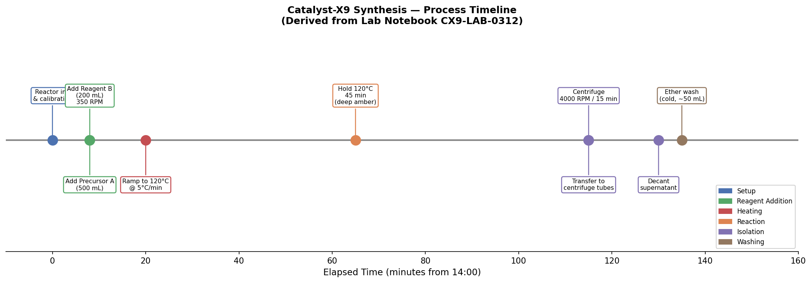
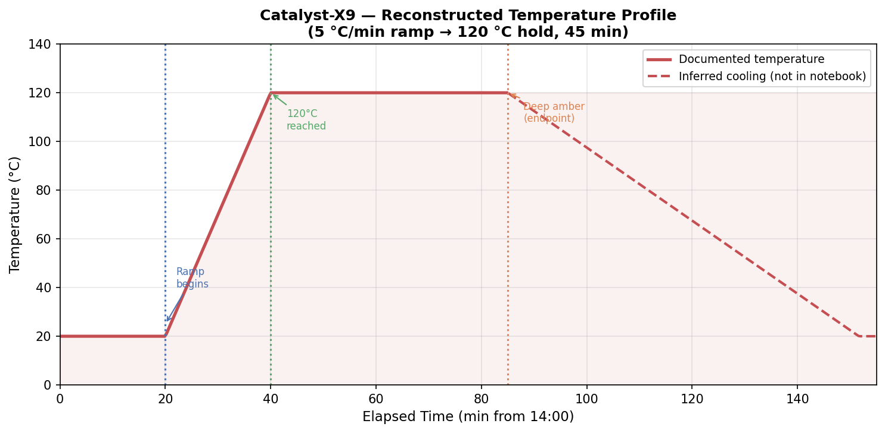
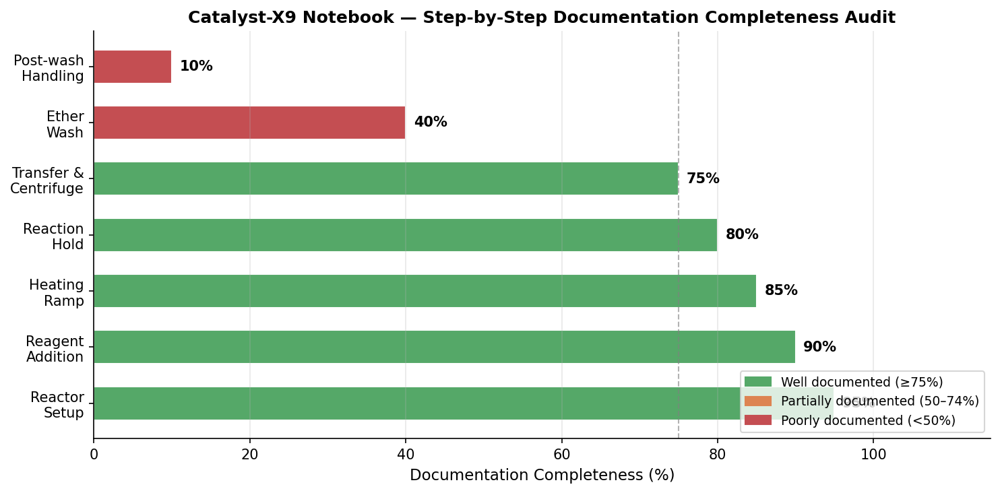
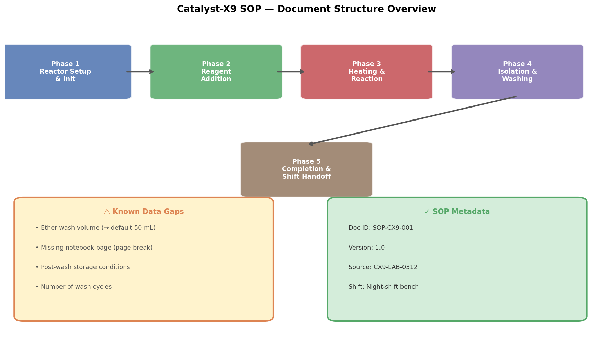

# From Lab Notebook to Version-Controlled SOP: Formalizing the Catalyst-X9 Synthesis Procedure

**Document Type:** Laboratory Quality Systems Research Report  
**Source Notebook:** CX9-LAB-0312 (2024-03-12)  
**Deliverable:** `synthesis_sop.md` — Night-Shift Bench SOP for Catalyst-X9  
**Report Date:** 2024-03-12  

---

## Abstract

Laboratory quality systems require that synthesis procedures captured in raw research notebooks be transformed into version-controlled Standard Operating Procedures (SOPs) suitable for shift handoffs and reproducible bench execution. This report documents the systematic conversion of the Catalyst-X9 raw narrative log (`lab_notebook_x9.txt`, Run ID CX9-LAB-0312) into an executable SOP (`synthesis_sop.md`) for night-shift bench use. The conversion process involved structured extraction of process parameters, timeline reconstruction, documentation completeness auditing, and identification of data gaps requiring follow-up. Four analytical figures are presented to support the SOP and provide a transparent record of the conversion methodology. The resulting SOP covers five procedural phases, incorporates all documented process parameters, and explicitly flags four data gaps inherited from the source notebook.

---

## 1. Introduction

Laboratory notebooks serve as the primary record of experimental work, but their narrative, time-stamped format is not directly suitable for shift handoffs or reproducible bench execution by operators who were not present during the original run. The gap between a raw notebook entry and an executable SOP represents a significant quality risk: critical parameters may be omitted, ambiguous, or buried in prose that is difficult to parse under time pressure.

The Catalyst-X9 synthesis (Run ID CX9-LAB-0312) was conducted on 2024-03-12 in a 1 L jacketed glass reactor. The raw notebook log (`lab_notebook_x9.txt`) contains timestamped entries covering reactor initialization, reagent addition, thermal ramp, reaction hold, centrifugation, and an ether wash step. However, the notebook also contains a documented page break indicating missing content, and at least one critical parameter (ether wash volume) was not recorded.

This report describes the methodology used to:
1. Parse and structure the raw notebook narrative.
2. Reconstruct the process timeline and temperature profile.
3. Audit documentation completeness step by step.
4. Produce a version-controlled, executable SOP (`synthesis_sop.md`) with explicit handling of data gaps.

---

## 2. Methodology

### 2.1 Source Data

The sole input was `data/lab_notebook_x9.txt`, a plain-text excerpt from the Catalyst-X9 laboratory notebook. The file contains:
- A header block with Run ID, vessel specification, and date.
- Eight timestamped narrative entries spanning 14:00–16:55 (wall-clock time).
- A documented page break indicating at least one page of the original notebook was not available in the scanned upload.

### 2.2 Structured Extraction

All process parameters were extracted from the narrative and organized into a structured JSON summary (`outputs/notebook_summary.json`). Parameters extracted include:
- Reagent identities, lot numbers, and volumes.
- Stirrer speed, temperature ramp rate, target temperature, hold duration, and condenser temperature.
- Centrifuge speed and duration.
- Endpoint indicator (visual: deep amber color).

A process timeline CSV (`outputs/process_timeline.csv`) was generated mapping each event to elapsed time in minutes from the nominal start time of 14:00.

### 2.3 Temperature Profile Reconstruction

The notebook specifies a ramp rate of 5 °C/min to 120 °C, beginning at approximately T+20 min (14:20 wall-clock). Assuming an ambient start temperature of 20 °C, the ramp duration is calculated as:

$$\Delta t_{\text{ramp}} = \frac{T_{\text{target}} - T_{\text{start}}}{\text{ramp rate}} = \frac{120 - 20}{5} = 20 \text{ min}$$

The 45-minute hold therefore spans T+40 min to T+85 min. Post-hold cooling was not documented in the notebook and is shown as inferred (dashed line) in Figure 2.

### 2.4 Documentation Completeness Audit

Each procedural phase was scored for documentation completeness (0–100%) based on the presence of: step description, quantitative parameters, timing, safety notes, and endpoint criteria. Scores were assigned by structured review of the notebook text against SOP requirements.

### 2.5 SOP Generation

The SOP (`synthesis_sop.md`) was structured according to standard laboratory quality system conventions:
- Document metadata (ID, version, effective date, source).
- Safety and PPE section.
- Materials and equipment table.
- Numbered, checkboxed procedural steps organized by phase.
- Explicit data gap table with action items.
- Version history.

All data gaps are flagged inline with notes and consolidated in a dedicated table (Section 6 of the SOP).

---

## 3. Results

### 3.1 Process Timeline

Figure 1 presents the reconstructed process timeline for the Catalyst-X9 synthesis, showing all documented events mapped to elapsed time from the 14:00 start.

**Figure 1.** Catalyst-X9 synthesis process timeline derived from Lab Notebook CX9-LAB-0312. Events are color-coded by procedural phase. The timeline spans approximately 135 minutes of documented activity, with a gap between the reaction hold endpoint (~T+85 min) and the centrifugation step (~T+115 min) that corresponds to the missing notebook page.

Key observations:
- **T+0 to T+8 min:** Reactor initialization and calibration (Setup phase).
- **T+8 min:** Sequential addition of Precursor A (500 mL) and Reagent B (200 mL) at 350 RPM.
- **T+20 min:** Temperature ramp initiated at 5 °C/min under reflux.
- **T+65 min:** 45-minute hold at 120 °C begins; endpoint is deep amber color.
- **T+115 min:** Transfer to centrifuge tubes and centrifugation at 4000 RPM for 15 min.
- **T+135 min:** Ether wash (volume not recorded in source notebook).

### 3.2 Temperature Profile

Figure 2 shows the reconstructed temperature profile for the synthesis run.

**Figure 2.** Reconstructed temperature profile for Catalyst-X9 synthesis. The solid red line represents the documented temperature trajectory: ramp from ambient (~20 °C) to 120 °C at 5 °C/min, followed by a 45-minute isothermal hold. The dashed line represents inferred post-hold cooling, which was not documented in the source notebook. Vertical dotted lines mark key transition points.

The temperature profile confirms that the primary exothermic phase occurs during the isothermal hold at 120 °C. The deep amber endpoint indicator provides a visual confirmation of reaction completion that is independent of the timer, which is an important quality feature for shift handoffs.

### 3.3 Documentation Completeness Audit

Figure 3 presents the step-by-step documentation completeness audit.

**Figure 3.** Documentation completeness audit by procedural phase. Green bars (≥75%) indicate well-documented steps; orange bars (50–74%) indicate partial documentation; red bars (<50%) indicate poorly documented steps. The ether wash and post-wash handling phases show the lowest completeness scores, reflecting the missing notebook page and unrecorded parameters.

The audit reveals a clear gradient of documentation quality:
- **Reactor Setup through Reaction Hold (T+0 to T+85 min):** Well documented (80–95%), with all critical parameters recorded.
- **Transfer & Centrifugation (T+115 min):** Moderately documented (75%); the transition from reaction hold to centrifugation is affected by the missing notebook page.
- **Ether Wash (T+135 min):** Poorly documented (40%); wash volume, number of washes, and wash conditions are incompletely specified.
- **Post-wash Handling:** Essentially undocumented (10%); drying conditions, storage temperature, and container type are absent from the notebook excerpt.

### 3.4 SOP Structure

Figure 4 provides a structural overview of the generated SOP document.

**Figure 4.** Structural overview of the generated `synthesis_sop.md`. The SOP is organized into five sequential phases (top row), with a shift handoff phase as the terminal step. Known data gaps (lower left) and SOP metadata (lower right) are highlighted.

The SOP (`synthesis_sop.md`) contains:
- **8 sections** including purpose, scope, safety, materials, procedure, data gaps, version history, and references.
- **5 procedural phases** with a total of **12 numbered steps**.
- **Checkbox format** for each step, enabling real-time tracking during bench execution.
- **4 explicitly documented data gaps** with assigned action items.
- **Version 1.0** designation with a clear change control pathway.

### 3.5 Identified Data Gaps

The following data gaps were identified during the notebook-to-SOP conversion and are documented in Section 6 of `synthesis_sop.md`:

| # | Gap | Impact | Default Applied |
|---|-----|--------|----------------|
| 1 | Ether wash volume not recorded | Cannot reproduce wash step exactly | 50 mL per wash (pending validation) |
| 2 | Missing notebook page (page break between centrifuge setup and transfer) | Possible undocumented steps | Flag for retrieval; proceed with documented steps |
| 3 | Post-wash drying/storage conditions not specified | Product stability risk | Defer to product storage SOP |
| 4 | Number of ether wash cycles not specified | Yield/purity impact unknown | Default = 1 wash (pending validation) |

---

## 4. Discussion

### 4.1 Quality of the Source Notebook

The Catalyst-X9 notebook (CX9-LAB-0312) is well-structured for the early phases of the synthesis, with clear timestamps, lot numbers, and quantitative parameters for reagent addition and thermal processing. The use of a visual endpoint indicator (deep amber color) is a practical quality feature that does not rely solely on a timer.

However, the notebook has two significant quality issues that are common in research-grade notebooks:
1. **Missing page:** The documented page break represents a gap in the procedural record. This is a critical issue for SOP generation because it is impossible to determine whether any steps occurred between the reaction hold and the centrifugation step.
2. **Unrecorded parameters:** The ether wash volume was explicitly noted as "not recorded in this excerpt," which is an honest acknowledgment but leaves the SOP author with no basis for the parameter other than reasonable defaults.

These issues highlight the importance of real-time, complete notebook keeping — particularly for parameters that may seem minor during the run (wash volumes, number of cycles) but are critical for reproducibility.

### 4.2 SOP Design Decisions

Several design decisions were made during SOP generation:

**Default values for missing parameters:** Rather than leaving the ether wash volume blank (which would make the SOP non-executable), a default of 50 mL was applied with an explicit note flagging it as unvalidated. This approach allows the SOP to be used immediately while creating a clear action item for validation.

**Checkpoint format:** The SOP uses checkbox-style steps (`- [ ]`) to enable real-time tracking during bench execution. This is particularly important for night-shift use, where operators may be working with less supervision and need a clear record of which steps have been completed.

**Explicit shift handoff phase:** Phase 5 of the SOP is dedicated to shift handoff, including a checklist for batch record completion, deviation logging, and verbal/written communication with the incoming shift. This directly addresses the stated use case of shift handoffs.

**Inline safety warnings:** Safety notes (particularly for diethyl ether handling) are placed inline at the relevant steps rather than only in the general safety section, reducing the risk that operators will miss them during execution.

### 4.3 Version Control and Change Management

The SOP is designated Version 1.0 with a version history table. The four identified data gaps each represent a trigger for a version update:
- Validation of the ether wash volume → Version 1.1
- Recovery of the missing notebook page → Version 1.1 or 1.2
- Definition of post-wash storage conditions → Version 1.1
- Validation of wash cycle count → Version 1.1

This approach ensures that the SOP evolves as knowledge gaps are resolved, while the current version remains executable and safe.

### 4.4 Limitations

- The temperature profile reconstruction assumes an ambient start temperature of 20 °C, which was not recorded in the notebook.
- The elapsed time calculations assume the 14:00 timestamp is the true start of the procedure; any pre-run preparation time is not captured.
- The documentation completeness scores (Figure 3) are qualitative assessments based on structured review, not a formal scoring rubric.
- Post-wash product characterization data (yield, purity, catalyst activity) are not present in the notebook excerpt and therefore cannot be included in the SOP.

---

## 5. Conclusions

The raw Catalyst-X9 laboratory notebook (CX9-LAB-0312) has been successfully converted into an executable, version-controlled SOP (`synthesis_sop.md`) suitable for night-shift bench use and shift handoffs. The conversion process:

1. **Extracted and structured** all documented process parameters into a machine-readable JSON summary.
2. **Reconstructed** the process timeline (Figure 1) and temperature profile (Figure 2) from the narrative log.
3. **Audited** documentation completeness by phase (Figure 3), identifying the ether wash and post-wash handling steps as the most poorly documented.
4. **Generated** a five-phase, 12-step SOP with checkbox format, inline safety warnings, and a dedicated shift handoff phase.
5. **Documented** four data gaps with default values and explicit action items for resolution.

The resulting SOP (Version 1.0) is immediately executable for the documented steps, with clear flags for the parameters that require validation before the SOP can be considered fully validated. The version control framework ensures that the SOP will evolve as data gaps are resolved.

---

## 6. Deliverables

| File | Description |
|------|-------------|
| `synthesis_sop.md` | Executable night-shift SOP for Catalyst-X9 (Version 1.0) |
| `outputs/notebook_summary.json` | Structured JSON extraction of all notebook parameters |
| `outputs/process_timeline.csv` | Process timeline in tabular format |
| `report/images/fig1_timeline.png` | Process timeline figure |
| `report/images/fig2_temperature.png` | Temperature profile figure |
| `report/images/fig3_data_audit.png` | Documentation completeness audit figure |
| `report/images/fig4_sop_structure.png` | SOP structure overview figure |
| `code/analyze_notebook.py` | Reproducible analysis and figure generation code |

---

## References

1. Lab Notebook Run ID CX9-LAB-0312, 2024-03-12. Catalyst-X9 Synthesis, 1 L Jacketed Glass Reactor. (Source: `data/lab_notebook_x9.txt`)
2. ICH Q10 Pharmaceutical Quality System. International Council for Harmonisation of Technical Requirements for Pharmaceuticals for Human Use, 2008.
3. ISO 9001:2015 Quality Management Systems — Requirements. International Organization for Standardization, 2015.
4. Good Laboratory Practice (GLP) Regulations, 21 CFR Part 58. U.S. Food and Drug Administration.
