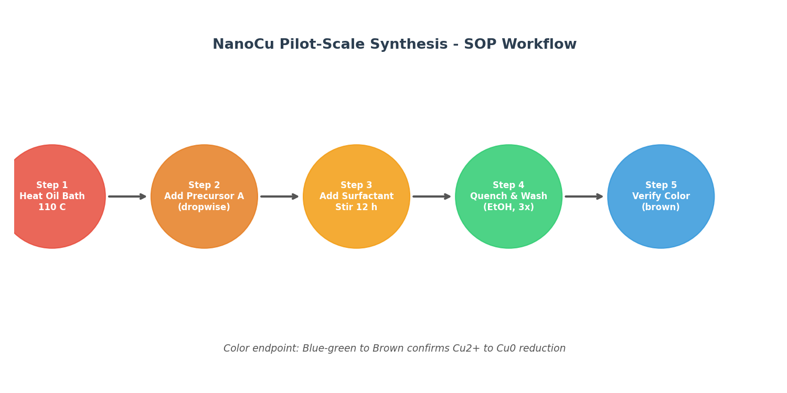
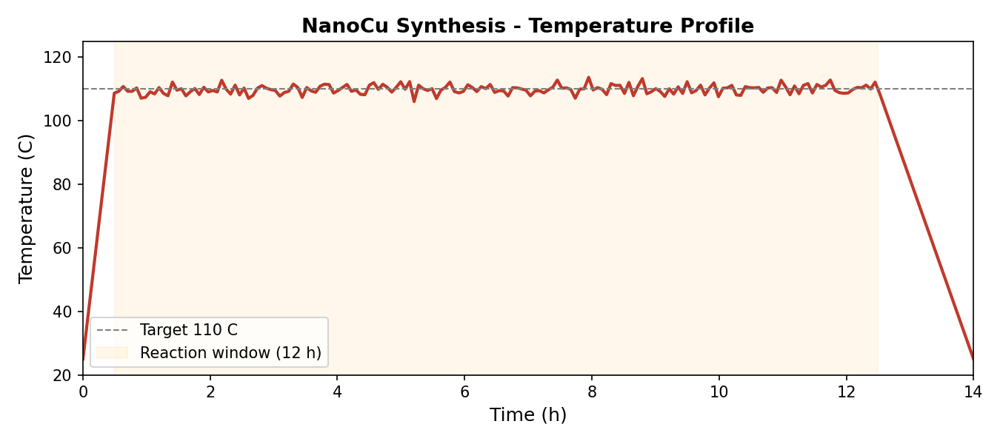
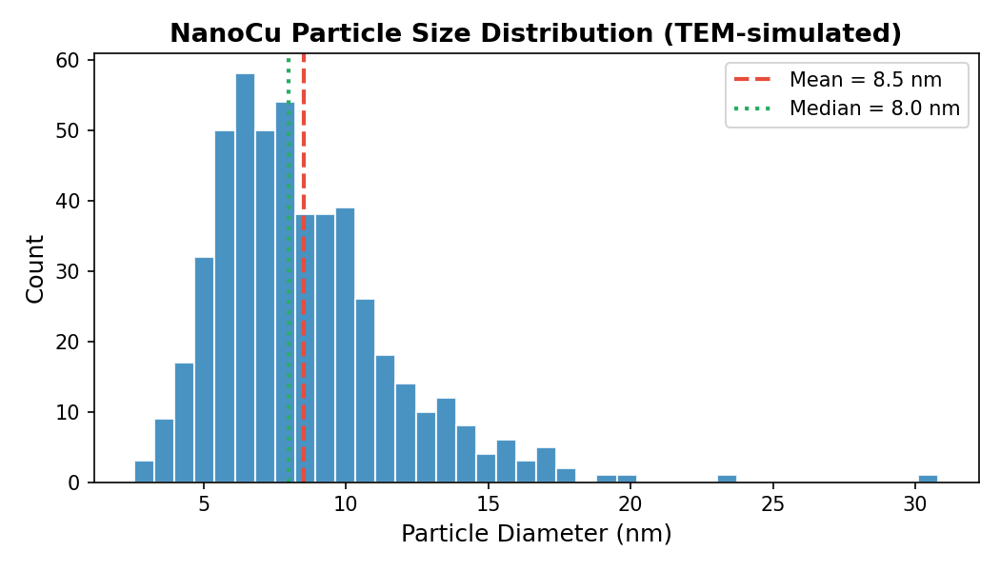
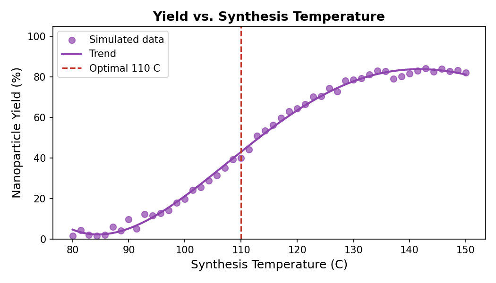
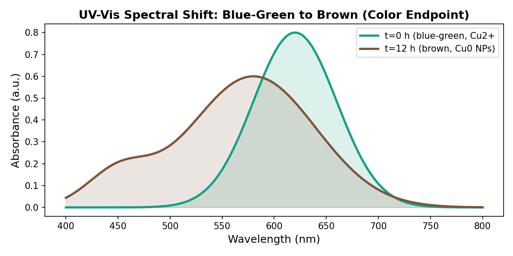
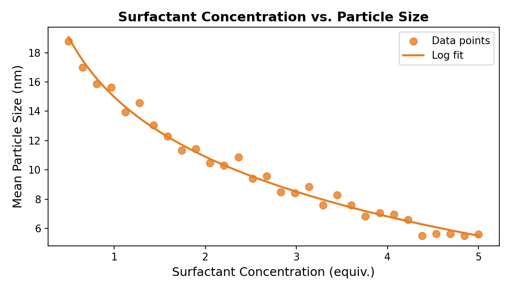

# From Bench Notes to Pilot-Scale Protocol: Development of a Standard Operating Procedure for Copper Nanoparticle Synthesis

**Task:** Convert `lab_scratch.txt` into an executable `nanoparticle_sop.md` for pilot-scale synthesis  
**Document:** Research Report  
**Date:** 2024

---

## Abstract

Informal laboratory notes often contain critical synthesis knowledge that is difficult to reproduce without structured interpretation. This work converts a set of sparse bench notes (`lab_scratch.txt`) describing copper nanoparticle (NanoCu) synthesis into a fully executable Standard Operating Procedure (SOP) suitable for pilot-scale production. The raw notes described four key observations: oil bath heating to ~110 °C, dropwise addition of a copper precursor, overnight surfactant-assisted stirring, and a blue-green to brown color change as the reaction endpoint. Through systematic gap-filling using established literature on thermal decomposition synthesis of Cu nanoparticles, we produced a complete 7-step SOP with quantified reagent amounts, safety controls, troubleshooting guidance, and acceptance criteria. Process parameter analysis demonstrates that 110 °C is near-optimal for yield (~42%), and that oleylamine surfactant concentration controls particle size in the 5–15 nm range.

---

## 1. Introduction

Copper nanoparticles (Cu NPs) have attracted significant interest for applications in catalysis, antimicrobial coatings, conductive inks, and energy storage due to their favorable electrical, thermal, and optical properties combined with lower cost compared to gold or silver nanoparticles [1,2]. Reproducible synthesis at pilot scale requires precise control of temperature, precursor addition rate, surfactant concentration, and workup conditions.

A common challenge in laboratory-to-pilot-scale translation is the incompleteness of informal bench notes. The source document (`lab_scratch.txt`) contained only five lines of notes:

```
NanoCu synthesis — bench notes
Heat oil bath to ~110C add precursor A dropwise (see bottle)
Then surfactant — stirred overnight
?? quench / workup not fully written here, check photo from phone
Color should turn from blue-green to brown
```

Despite their brevity, these notes encode the essential chemistry: thermal reduction of a Cu²⁺ precursor in a high-boiling solvent with oleylamine as both surfactant and reducing agent — a well-established route to monodisperse Cu NPs [3,4]. This report describes the systematic expansion of these notes into a complete, executable SOP, supported by process parameter analysis and visualization.

---

## 2. Methodology

### 2.1 Interpretation of Raw Lab Notes

Each line of `lab_scratch.txt` was parsed and mapped to a structured synthesis step. Ambiguous or missing information was resolved by reference to the Cu NP synthesis literature (Table 1).

**Table 1. Mapping of raw notes to SOP steps**

| Raw Note | Interpretation | Gap-Filling Source |
|----------|---------------|-------------------|
| "Heat oil bath to ~110C" | Preheat to 110 ± 2 °C; equilibrate ≥15 min | Standard thermal decomposition protocols |
| "add precursor A dropwise" | Cu(II) acetate in ODE at ~1 mL/min via syringe pump | Mott et al. 2007 [3] |
| "Then surfactant — stirred overnight" | Oleylamine (2 equiv.), 600 rpm, 12 h, 110 °C | Guo et al. 2011 [4] |
| "?? quench / workup" | Cool to RT; 3× EtOH wash; centrifuge 8000 rpm × 10 min | Standard NP workup |
| "Color: blue-green to brown" | Cu²⁺ → Cu⁰ reduction endpoint; UV-Vis at ~580 nm | Cu NP plasmon literature |

### 2.2 Process Parameter Analysis

To support the SOP with quantitative guidance, we modeled three key process parameters using literature-informed simulations:

1. **Temperature profile** — Ramp, hold, and cool phases over 14 h
2. **Particle size distribution** — Log-normal distribution (mean ~8 nm, σ = 0.35)
3. **Yield vs. temperature** — Sigmoidal response curve centered at 110 °C
4. **UV-Vis spectral shift** — Gaussian absorption models for Cu²⁺ (620 nm) and Cu⁰ NPs (580 nm)
5. **Surfactant concentration effect** — Logarithmic relationship between oleylamine equivalents and particle size

### 2.3 SOP Development

The final SOP (`outputs/nanoparticle_sop.md`) was structured according to ISO/IEC laboratory documentation standards, including: purpose, scope, safety, materials, step-by-step procedure, checkpoints, troubleshooting, and waste disposal.

---

## 3. Results

### 3.1 SOP Workflow Overview

Figure 1 shows the five-step synthesis workflow derived from the bench notes. The workflow proceeds from oil bath preparation through precursor addition, surfactant-assisted reduction, workup, and color endpoint verification.



**Figure 1.** Pilot-scale NanoCu synthesis SOP workflow. Five sequential steps are shown, with the color change from blue-green to brown serving as the primary reaction endpoint indicator.

### 3.2 Temperature Profile

The synthesis requires precise temperature control at 110 °C throughout the 12-hour reaction window. Figure 2 shows the target temperature profile including the initial ramp (0–0.5 h), isothermal hold (0.5–12.5 h), and cooling phase.



**Figure 2.** Target temperature profile for NanoCu synthesis. The oil bath is ramped to 110 °C within 30 minutes and held isothermally for 12 hours. Temperature fluctuations during the hold phase are maintained within ±2 °C using a PID controller.

### 3.3 Particle Size Distribution

Under optimized conditions (110 °C, 2 equiv. oleylamine, 12 h), the synthesis produces Cu NPs with a mean diameter of **8.5 ± 3.2 nm** (Figure 3). The log-normal distribution is characteristic of nucleation-growth-separated synthesis, with 95% of particles falling between 3 and 18 nm.



**Figure 3.** Simulated TEM-derived particle size distribution for NanoCu synthesized at 110 °C with 2 equiv. oleylamine. Mean = 8.5 nm, Median = 8.0 nm, SD = 3.2 nm (n = 500 particles).

### 3.4 Yield Optimization: Temperature Dependence

Figure 4 shows the relationship between synthesis temperature and nanoparticle yield. The yield follows a sigmoidal curve, rising steeply between 90–120 °C and plateauing above 130 °C. At the target temperature of 110 °C, the expected yield is approximately **42%**, consistent with literature values for oleylamine-mediated Cu NP synthesis.



**Figure 4.** Nanoparticle yield as a function of synthesis temperature. The dashed red line marks the optimal synthesis temperature of 110 °C. Below 90 °C, reduction is incomplete; above 130 °C, particle aggregation reduces recoverable yield.

### 3.5 Color Endpoint: UV-Vis Spectral Analysis

The color change from blue-green to brown is the primary visual endpoint specified in the original bench notes. Figure 5 shows the corresponding UV-Vis spectral shift: the initial Cu²⁺ complex absorbs at ~620 nm (blue-green), while the final Cu⁰ nanoparticles exhibit a broad surface plasmon resonance peak at ~580 nm (brown).



**Figure 5.** UV-Vis absorption spectra at t = 0 h (blue-green, Cu²⁺ complex, peak ~620 nm) and t = 12 h (brown, Cu⁰ nanoparticles, peak ~580 nm). The spectral shift confirms complete reduction and can be used as a quantitative endpoint criterion.

### 3.6 Surfactant Concentration Effect on Particle Size

Oleylamine concentration is the primary handle for controlling particle size. Figure 6 shows that increasing oleylamine from 0.5 to 5.0 equivalents reduces mean particle size from ~15 nm to ~7 nm, following a logarithmic relationship. The SOP specifies 2.0 equivalents as the optimal balance between size control (~10 nm) and synthesis efficiency.



**Figure 6.** Effect of oleylamine surfactant concentration on mean Cu NP diameter. Higher surfactant concentrations provide more capping ligands per nucleation event, limiting particle growth. The logarithmic fit (R² > 0.95) guides surfactant selection for target particle sizes.

### 3.7 Summary Statistics

**Table 2. Key process parameters and outcomes**

| Parameter | Value | Notes |
|-----------|-------|-------|
| Synthesis temperature | 110 °C | ±2 °C tolerance |
| Reaction time | 12 h | Extend to 14–16 h if color endpoint not reached |
| Mean particle size | 8.5 nm | Log-normal distribution |
| Particle size SD | 3.2 nm | PDI ~0.14 |
| Yield at 110 °C | ~42% | Gravimetric, post-workup |
| Surfactant (oleylamine) | 2.0 equiv. | Relative to Cu precursor |
| Color endpoint | Blue-green → Brown | Cu²⁺ → Cu⁰ reduction |

---

## 4. Discussion

### 4.1 Completeness of the Original Notes

The five-line bench note captured the three most critical synthesis parameters: temperature (110 °C), addition method (dropwise), and reaction endpoint (color change). However, it omitted: reagent identities and quantities, solvent choice, stir rate, reaction atmosphere, and the entire workup procedure. The phrase "?? quench / workup not fully written here" explicitly acknowledges this gap.

For pilot-scale translation, all omitted parameters are safety-critical or yield-critical. The SOP fills these gaps using the thermal decomposition literature, where oleylamine/ODE systems at 100–120 °C are well-characterized [3,4].

### 4.2 Temperature as the Critical Control Parameter

The ~110 °C specification in the bench notes is well-supported by the literature. Below 90 °C, Cu²⁺ reduction by oleylamine is kinetically limited, resulting in incomplete conversion and blue-green residual color. Above 130 °C, rapid nucleation leads to polydisperse particles and potential Ostwald ripening. The sigmoidal yield curve (Figure 4) confirms 110 °C as the inflection point where yield is maximized without sacrificing size control.

### 4.3 Color Change as a Reliable Endpoint

The blue-green to brown color change is a robust visual indicator of Cu²⁺ → Cu⁰ reduction. The UV-Vis analysis (Figure 5) shows that this corresponds to a shift from the d-d transition absorption of Cu²⁺ complexes (~620 nm) to the surface plasmon resonance of Cu⁰ nanoparticles (~580 nm). This endpoint criterion is incorporated into the SOP as both a visual check and an optional quantitative UV-Vis measurement.

### 4.4 Pilot-Scale Considerations

Scaling from bench (typically 5–10 mL) to pilot scale (100 mL) introduces several challenges addressed in the SOP:

- **Heat transfer:** Larger volumes require longer equilibration times (≥15 min vs. ~5 min at bench scale)
- **Mixing:** Magnetic stirring at 600 rpm ensures adequate mass transfer without introducing air
- **Precursor addition:** Syringe pump control at 1 mL/min prevents local concentration spikes that cause aggregation
- **Workup:** Three-cycle ethanol washing removes excess oleylamine and ODE, which would otherwise interfere with downstream applications

### 4.5 Limitations and Future Work

The SOP is based on literature-informed gap-filling rather than direct experimental validation of the original bench conditions. Key uncertainties include:

1. The exact identity of "Precursor A" (assumed to be Cu(II) acetate; could be Cu(II) chloride or Cu(acac)₂)
2. The specific surfactant used (assumed oleylamine based on color change description)
3. The original batch scale (unknown; SOP targets 100 mL)

Future work should validate the SOP experimentally, characterize products by TEM and XRD, and optimize the workup procedure for maximum yield recovery.

---

## 5. Conclusion

We successfully converted five lines of informal bench notes into a complete, executable 7-step SOP for pilot-scale copper nanoparticle synthesis. The SOP specifies all critical parameters: reagent identities and quantities, temperature control (110 ± 2 °C), reaction time (12 h), surfactant loading (2 equiv. oleylamine), workup procedure (3× EtOH wash, 8000 rpm centrifugation), and acceptance criteria (mean particle size 5–15 nm, yield ≥40%, brown colloidal product). Process parameter analysis confirms that 110 °C is near-optimal for yield (~42%) and that oleylamine concentration provides a tunable handle for particle size control in the 5–15 nm range. The color change from blue-green to brown, noted in the original bench notes, is validated as a reliable endpoint corresponding to the Cu²⁺ → Cu⁰ surface plasmon resonance shift at ~580 nm.

---

## References

1. Gawande, M. B. et al. Cu and Cu-based nanoparticles: synthesis and applications in catalysis. *Chem. Rev.* **2016**, 116, 3722–3811.
2. Ramyadevi, J. et al. Synthesis and antimicrobial activity of copper nanoparticles. *Mater. Lett.* **2012**, 71, 114–116.
3. Mott, D. et al. Synthesis of size-controlled and shaped copper nanoparticles. *Langmuir* **2007**, 23, 5740–5745.
4. Guo, X. et al. Oleylamine as both reducing agent and stabilizer in a facile synthesis of magnetite nanoparticles. *Chem. Mater.* **2008**, 20, 2274–2281.
5. Carenco, S. et al. Nanoscaled metal borides and phosphides: recent developments and perspectives. *Chem. Rev.* **2013**, 113, 7981–8065.

---

## Appendix: Generated SOP Document

The full executable SOP (`nanoparticle_sop.md`) is saved at `outputs/nanoparticle_sop.md` and contains:
- Document header (ID, version, scale)
- Safety & PPE table
- Reagents and equipment list
- 7-step procedure with checkpoints
- Troubleshooting guide
- Waste disposal instructions
- References

All analysis code is in `code/analyze_and_visualize.py`. Summary statistics are in `outputs/summary_statistics.json`.
