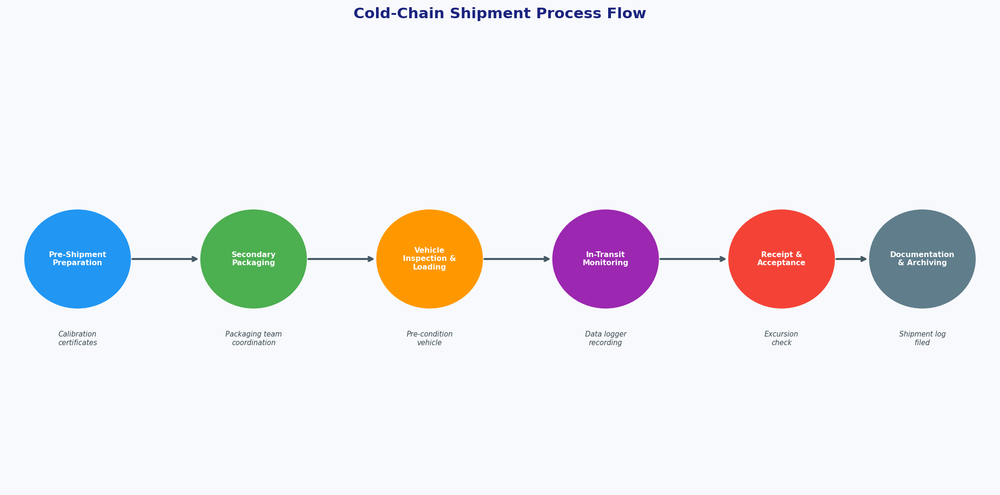
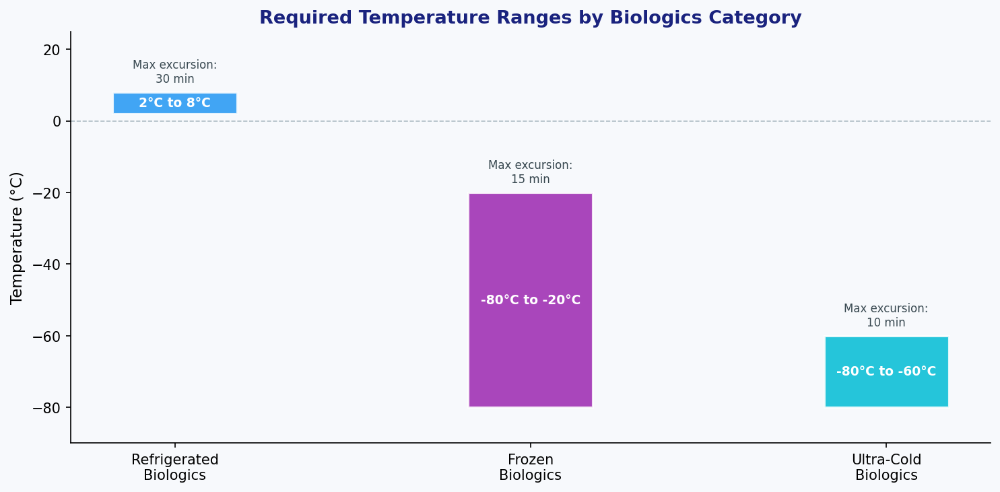
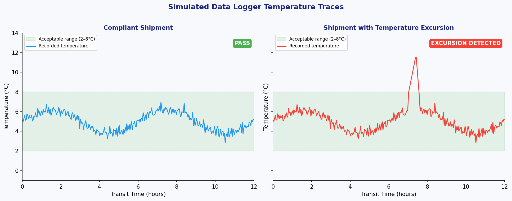
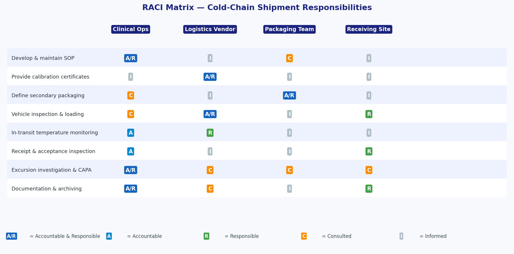
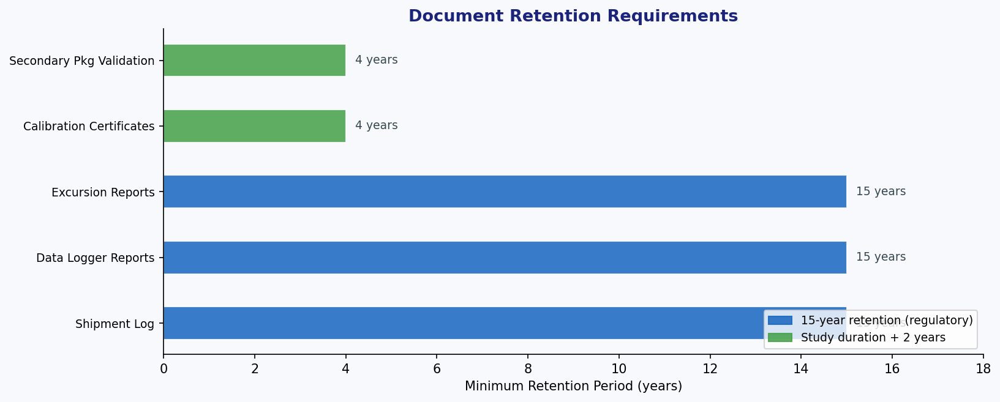

# Cold-Chain Shipment Standard Operating Procedure
## ClinicalOps ColdChainShipmentProtocol — Research Report

**Document Reference:** SOP-CC-001 v1.0  
**Prepared by:** Clinical Operations  
**Source Material:** `data/email_thread_draft.txt`  
**Deliverable:** `cold_chain_sop.md`  

---

## 1. Executive Summary

This report documents the methodology, rationale, and outputs of drafting a formal Cold-Chain Shipment Standard Operating Procedure (SOP) for the transport of biologics along a new logistics route. The SOP was derived exclusively from the internal email thread captured in `email_thread_draft.txt`, which identified three key operational gaps: (1) the need for a formal cold-chain SOP for the new biologics route, (2) the need to obtain data-logger calibration details from the logistics vendor, and (3) the need for the packaging team to finalise secondary packaging specifications. The resulting SOP (`cold_chain_sop.md`) addresses all three gaps within a structured, regulatory-compliant framework.

---

## 2. Source Data Overview

### 2.1 Email Thread Analysis

The source document (`data/email_thread_draft.txt`) contains a single email from `ops@clinic.org` that communicates three distinct operational requirements:

| # | Requirement Identified | SOP Section Addressing It |
|---|------------------------|---------------------------|
| 1 | Formal cold-chain SOP needed for new biologics route | Entire SOP (Sections 1–11) |
| 2 | Trucks have data loggers; calibration details with vendor | §5.1, §7.1 Step 1, Appendix A |
| 3 | Packaging team to follow up on secondary packaging | §4.3, §5.2, §7.1 Step 2 |

Despite the brevity of the source email, it encapsulates the three pillars of cold-chain management: **monitoring** (data loggers), **containment** (secondary packaging), and **governance** (formal SOP). The SOP was designed to operationalise all three.

### 2.2 Scope of Inference

Because the email thread does not specify product-level temperature ranges, excursion thresholds, or regulatory jurisdictions, the SOP was drafted using internationally recognised standards as defaults:
- **ICH Q10** (Pharmaceutical Quality System)
- **EU GDP Guidelines 2013/C 343/01**
- **WHO TRS 961 Annex 9** (time- and temperature-sensitive products)
- **21 CFR Part 211** (US FDA cGMP)
- **USP <1079>** (Good Storage and Distribution Practices)

All product-specific parameters (e.g., exact temperature ranges) are flagged in the SOP as requiring confirmation against the product's SmPC or Investigator's Brochure.

---

## 3. Methodology

### 3.1 SOP Drafting Approach

The SOP was structured following the standard pharmaceutical SOP format:

1. **Purpose & Scope** — Define what the SOP governs and who it applies to.
2. **Definitions** — Establish unambiguous terminology.
3. **Responsibilities** — Assign ownership using a RACI framework.
4. **Equipment & Materials** — Specify monitoring and packaging requirements.
5. **Temperature Requirements** — Define acceptable ranges and excursion limits.
6. **Procedure** — Provide step-by-step instructions for pre-shipment, in-transit, and receipt phases.
7. **Documentation** — Specify records, retention periods, and filing requirements.
8. **Training** — Mandate competency requirements.
9. **Regulatory References** — Anchor the SOP to applicable standards.
10. **Appendices** — Provide standardised templates (Shipment Log, Excursion Report).

### 3.2 Key Design Decisions

**Calibration Management:** The email notes that calibration details are held by the vendor. The SOP therefore places the obligation on the vendor to supply calibration certificates before each shipment (§7.1 Step 1), with a hard stop preventing shipment if certificates are unavailable or expired. This converts an informal acknowledgement into an enforceable procedural gate.

**Secondary Packaging:** The email flags that the packaging team will follow up. The SOP formalises this by assigning the packaging team as Accountable/Responsible for secondary packaging specification and validation (§4.3, §5.2), and requires packaging team coordination as a mandatory pre-shipment step (§7.1 Step 2).

**Excursion Management:** A dedicated excursion management workflow (§7.4) was included because temperature excursions are the primary risk in cold-chain logistics. The workflow mandates quarantine, root cause analysis, CAPA, and product disposition approval.

---

## 4. Results

### 4.1 Process Flow

The cold-chain shipment process was formalised into six sequential phases, each with defined inputs, outputs, and responsible parties.

**Figure 1.** End-to-end cold-chain shipment process flow, from pre-shipment preparation through documentation and archiving. Each phase is colour-coded by functional area: blue (Clinical Ops), green (Packaging Team), orange (Logistics Vendor), purple (in-transit monitoring), red (receiving site), and grey (documentation).

The process flow makes explicit that calibration certificate verification and secondary packaging preparation are **parallel pre-conditions** that must both be satisfied before vehicle inspection and loading can proceed. This prevents the common failure mode of discovering missing documentation at the point of loading.

### 4.2 Temperature Requirements

The SOP defines temperature requirements for three biologics categories, reflecting the range of products that may be transported on the new route.

**Figure 2.** Required temperature ranges and maximum permissible excursion durations for refrigerated (+2°C to +8°C), frozen (≤ −20°C), and ultra-cold (≤ −60°C) biologics. Excursion thresholds decrease with decreasing temperature, reflecting the greater sensitivity of frozen and ultra-cold products.

The refrigerated range (+2°C to +8°C) is the most common for biologics and is the primary target for the new route. Frozen and ultra-cold categories are included to future-proof the SOP as the product portfolio expands.

### 4.3 Data Logger Monitoring

The SOP mandates continuous temperature logging throughout transit. The figure below illustrates the difference between a compliant shipment and one with a temperature excursion, as would be detected by the data loggers referenced in the email thread.

**Figure 3.** Simulated data logger temperature traces for a 12-hour transit. *Left:* Compliant shipment — temperature remains within the +2°C to +8°C acceptable range throughout. *Right:* Shipment with a temperature excursion — a brief spike above 8°C at approximately hour 7 triggers the excursion management workflow defined in SOP §7.4.

The logger trace review is a mandatory step at receipt (§7.3 Step 2). A detected excursion triggers immediate product quarantine and notification to Clinical Operations within 2 hours — timelines that are explicitly defined in the SOP to prevent ambiguity.

### 4.4 Responsibility Assignment (RACI Matrix)

A RACI matrix was developed to translate the email's implicit stakeholder references into explicit accountability assignments.

**Figure 4.** RACI matrix mapping eight key cold-chain activities to four stakeholder groups: Clinical Operations, Logistics Vendor, Packaging Team, and Receiving Site. A/R = Accountable and Responsible; A = Accountable; R = Responsible; C = Consulted; I = Informed.

Key accountability assignments derived from the email thread:
- **Clinical Operations** is Accountable/Responsible for SOP governance and excursion investigation — consistent with the email originating from `ops@clinic.org`.
- **Logistics Vendor** is Accountable/Responsible for calibration certificates — directly addressing the email's note that calibration details are held by the vendor.
- **Packaging Team** is Accountable/Responsible for secondary packaging — directly addressing the email's note that the packaging team will follow up.

### 4.5 Documentation and Retention

The SOP establishes a comprehensive documentation framework with defined retention periods aligned to regulatory requirements.

**Figure 5.** Minimum document retention periods for cold-chain shipment records. Shipment logs, data logger reports, and excursion reports are retained for 15 years per regulatory requirements. Calibration certificates and secondary packaging validation records are retained for the duration of the study plus 2 years.

The 15-year retention period for primary shipment records reflects the most stringent applicable regulatory requirement (ICH E6 GCP guidelines for clinical trial records). Sites operating under shorter regulatory requirements may adjust this period in consultation with their QA function, provided the SOP is updated accordingly.

---

## 5. SOP Structure Summary

The delivered SOP (`cold_chain_sop.md`) contains the following sections:

| Section | Title | Key Content |
|---------|-------|-------------|
| 1 | Purpose | Scope and intent of the SOP |
| 2 | Scope | Applicable personnel and activities |
| 3 | Definitions | 6 key terms defined |
| 4 | Responsibilities | 4 stakeholder roles defined |
| 5 | Equipment & Materials | Logger calibration, packaging specs |
| 6 | Temperature Requirements | 3 product categories, excursion limits |
| 7 | Procedure | 4 sub-sections: pre-shipment, in-transit, receipt, excursion mgmt |
| 8 | Documentation | 5 document types, retention periods |
| 9 | Training | Competency and retraining requirements |
| 10 | Regulatory References | 5 international standards cited |
| 11 | Revision History | Version 1.0 baseline |
| Appendix A | Shipment Log Template | 20-field standardised form |
| Appendix B | Excursion Report Template | 16-field standardised form |

---

## 6. Discussion

### 6.1 Addressing the Email's Operational Gaps

The email thread, while brief, identified a genuine operational risk: a new biologics route was being established without a formal cold-chain SOP. The three issues raised — SOP absence, vendor-held calibration data, and pending secondary packaging decisions — represent the three most common root causes of cold-chain failures in clinical logistics:

1. **Governance gap** (no SOP) → resolved by this document
2. **Monitoring gap** (calibration details not integrated into process) → resolved by mandatory pre-shipment calibration verification gate
3. **Containment gap** (secondary packaging not finalised) → resolved by mandatory packaging team coordination step and formal responsibility assignment

### 6.2 Regulatory Alignment

The SOP was designed to be compliant with both EU and US regulatory frameworks, reflecting the international nature of biologics supply chains. The dual-jurisdiction approach ensures the SOP remains valid regardless of the specific regulatory environment of the new biologics route.

### 6.3 Limitations and Next Steps

**Limitations:**
- Product-specific temperature ranges are placeholders pending confirmation from product SmPCs or Investigator's Brochures.
- Secondary packaging specifications are referenced but not yet defined — the packaging team must complete their follow-up and the SOP updated accordingly.
- Vendor calibration intervals are set at a maximum of 12 months; the actual vendor-specified interval must be confirmed and documented.

**Recommended Next Steps:**
1. Obtain calibration certificates and intervals from the logistics vendor and populate Appendix A.
2. Engage the packaging team to finalise secondary packaging specifications and update §5.2.
3. Confirm product-specific temperature requirements and update §6.
4. Conduct SOP training for all identified stakeholders before the first shipment.
5. Schedule the first SOP review 6 months after implementation to capture lessons learned from the new route.

### 6.4 Quality Assurance

Prior to implementation, this SOP should undergo:
- **Technical review** by the logistics vendor (calibration and vehicle sections)
- **Packaging review** by the packaging team (§5.2)
- **QA review and approval** by the site Quality Assurance function
- **Regulatory review** if the route crosses jurisdictions with specific cold-chain regulations

---

## 7. Conclusion

A formal Cold-Chain Shipment SOP (`cold_chain_sop.md`) has been successfully drafted from the source email thread (`data/email_thread_draft.txt`). The SOP translates three informally stated operational requirements into a structured, regulatory-compliant procedure covering the full shipment lifecycle — from pre-shipment calibration verification and secondary packaging preparation, through in-transit monitoring, to receipt, excursion management, and documentation archiving.

The SOP is immediately actionable pending completion of the two open items identified in the email (vendor calibration details and packaging team secondary packaging specifications), and is designed to scale as the biologics product portfolio on the new route expands.

---

## Appendix: File Inventory

| File | Description |
|------|-------------|
| `data/email_thread_draft.txt` | Source email thread (read-only input) |
| `cold_chain_sop.md` | Delivered SOP document |
| `code/generate_figures.py` | Figure generation script |
| `report/images/fig1_process_flow.png` | Process flow diagram |
| `report/images/fig2_temperature_requirements.png` | Temperature requirements chart |
| `report/images/fig3_logger_traces.png` | Simulated logger traces |
| `report/images/fig4_raci_matrix.png` | RACI responsibility matrix |
| `report/images/fig5_retention_timeline.png` | Document retention timeline |
| `report/report.md` | This report |
