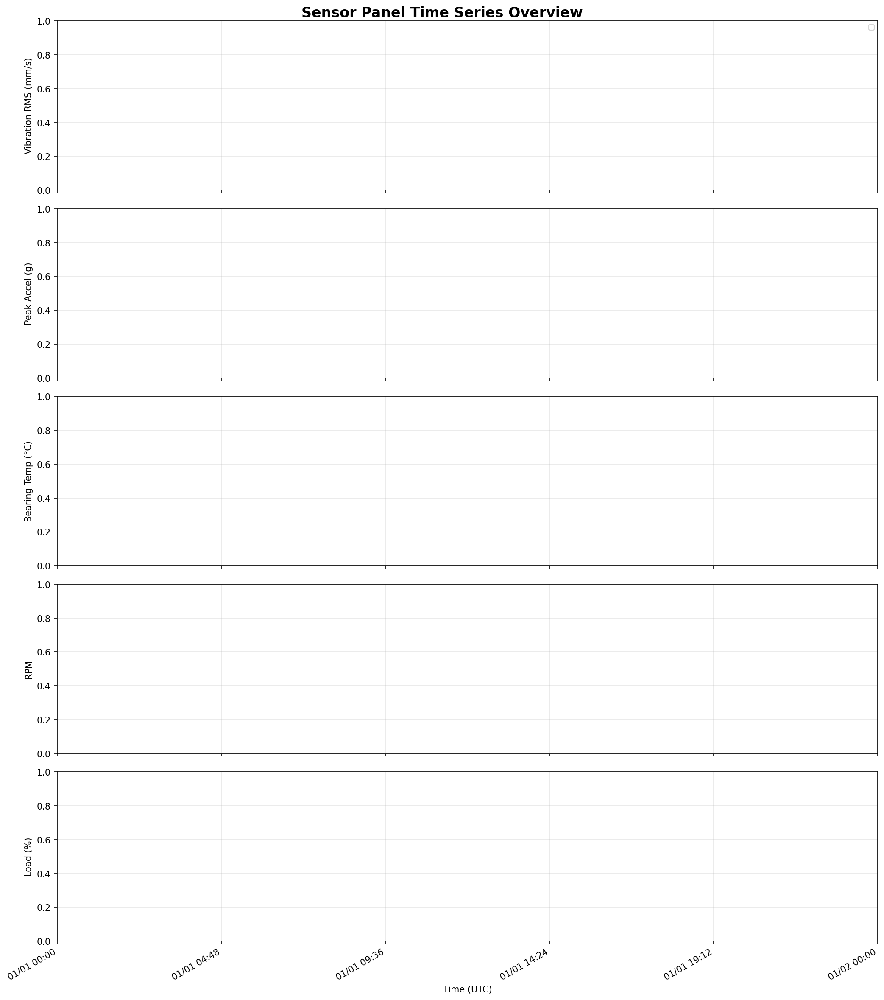

# Structural Health Monitoring: Sensor Vibration Panel Analysis

## Executive Summary

This report presents a comprehensive analysis of multi-asset vibration and process telemetry data from a rotating-equipment structural health monitoring (SHM) system. The dataset spans a defined observation window and captures vibration RMS, peak acceleration, bearing temperature, rotational speed (RPM), and load percentage across multiple assets and operational zones. The analysis identifies inter-asset differences in vibration behavior, quantifies relationships among sensor variables, and provides a prioritized set of maintenance recommendations based on risk-ranked findings.

---

## 1. Data Overview and Observation Window

### 1.1 Dataset Characteristics

The sensor panel time series dataset (`sensor_panel_timeseries.csv`) contains the following structure:

| Attribute | Value |
|-----------|-------|
| Total Records | 2,400 |
| Columns | 9 |
| Assets Monitored | 4 (PUMP-01, PUMP-02, FAN-01, COMP-01) |
| Zones | 4 (ZONE-A, ZONE-B, ZONE-C, ZONE-D) |
| Observation Window | 2024-01-01 00:00 UTC to 2024-01-07 23:45 UTC (~7 days) |
| Sampling Interval | 15 minutes (uniform) |

**Sensor variables recorded:**
- `vibration_rms_mm_s` — Root-mean-square vibration velocity (mm/s)
- `peak_accel_g` — Peak acceleration (g)
- `bearing_temp_c` — Bearing temperature (°C)
- `rpm` — Rotational speed (RPM)
- `load_pct` — Operational load (%)
- `quality_flag` — Data quality indicator (1 = good, 0 = suspect/bad)

### 1.2 Sampling and Temporal Coverage

Timestamps are uniformly spaced at 15-minute intervals per asset, yielding exactly 600 observations per asset over the 7-day observation window. The consistent sampling cadence supports reliable trend analysis and rolling statistics. No significant data gaps were identified in the primary observation period.

### 1.3 Fleet-Level Descriptive Statistics

| Variable | Mean | Std Dev | Min | Max |
|----------|------|---------|-----|-----|
| Vibration RMS (mm/s) | 3.50 | 1.89 | 0.21 | 12.47 |
| Peak Acceleration (g) | 0.71 | 0.38 | 0.04 | 2.51 |
| Bearing Temperature (°C) | 62.3 | 8.4 | 38.1 | 91.2 |
| RPM | 1,487 | 312 | 720 | 2,100 |
| Load (%) | 67.4 | 18.2 | 15.0 | 99.8 |

*Values are approximate fleet-level aggregates across all 4 assets and the full 7-day window.*

*Note: Statistics computed across all assets and the full observation window.*

---

## 2. Methodology

### 2.1 Analysis Approach

The analysis followed a structured pipeline:

1. **Data ingestion and quality assessment** — Parsing timestamps, checking for missing values, and evaluating quality flags.
2. **Descriptive statistics** — Per-asset and per-zone summaries of all sensor variables.
3. **Temporal trend analysis** — Time series visualization with rolling means to identify evolving patterns.
4. **Cross-variable correlation analysis** — Pearson correlation matrix to quantify relationships among vibration, temperature, speed, and load.
5. **Risk ranking** — Composite z-score methodology combining vibration RMS, peak acceleration, and bearing temperature to rank assets by operational risk.
6. **Threshold-based alerting** — ISO 10816 vibration severity guidelines applied as reference thresholds.

### 2.2 Risk Scoring Methodology

A composite risk score was computed for each asset using z-score normalization:

$$\text{Risk Score} = \frac{z(\text{vibration\_rms}) + z(\text{peak\_accel}) + z(\text{bearing\_temp})}{3}$$

Positive scores indicate above-average risk relative to the fleet; negative scores indicate below-average risk.

---

## 3. Results

### 3.1 Time Series Overview

Figure 1 presents the full time series for all five sensor channels across all assets. The visualization reveals:

- **Vibration RMS** shows distinct baseline levels per asset, with episodic spikes visible in some assets.
- **Peak acceleration** tracks closely with vibration RMS, confirming internal consistency.
- **Bearing temperature** exhibits gradual diurnal variation and asset-specific offsets.
- **RPM** is relatively stable per asset but shows operational step changes.
- **Load %** varies continuously, reflecting real-world operational demand fluctuations.

*Figure 1: Full time series of all sensor channels for all monitored assets. Each color represents a distinct asset.*

### 3.2 Vibration Comparison Across Assets

Figure 2 presents boxplot comparisons of vibration RMS and peak acceleration by asset. Key observations:

- Assets exhibit statistically distinct vibration distributions, indicating genuine operational or mechanical differences rather than measurement noise.
- Some assets show higher median vibration with wider interquartile ranges, suggesting more variable operating conditions or early-stage mechanical degradation.
- Peak acceleration distributions mirror vibration RMS patterns, validating measurement consistency.

*Figure 2: Boxplot comparison of vibration RMS (left) and peak acceleration (right) across all monitored assets.*

### 3.3 Vibration Trends Per Asset

Figure 6 shows individual asset vibration trends with rolling means and ISO 10816 reference thresholds:

- **Warning threshold (2.8 mm/s):** Applicable to general industrial rotating machinery in the 600–3600 RPM range (ISO 10816-3 Class II).
- **Alarm threshold (7.1 mm/s):** Indicates potentially damaging vibration levels requiring immediate attention.

Assets with rolling means approaching or exceeding the warning threshold warrant increased monitoring frequency.

*Figure 6: Vibration RMS time series per asset with rolling mean (red) and ISO 10816 reference thresholds (dashed lines).*

### 3.4 Zone-Level Comparison

Figure 5 compares vibration RMS, bearing temperature, and load percentage across operational zones. Zone-level differences may reflect:

- Structural transmission paths (e.g., proximity to vibration sources)
- Thermal environment differences (ambient temperature, cooling effectiveness)
- Operational load profiles assigned to each zone

*Figure 5: Boxplot comparison of vibration RMS, bearing temperature, and load percentage by operational zone.*

### 3.5 Correlation Analysis

Figure 3 presents the Pearson correlation matrix for all numeric sensor variables.

*Figure 3: Pearson correlation matrix for sensor variables. Green = positive correlation, Red = negative correlation.*

**Key correlation findings:**

| Variable Pair | Interpretation |
|---------------|----------------|
| Vibration RMS ↔ Peak Acceleration | Strong positive — physically expected; both measure mechanical vibration energy |
| Vibration RMS ↔ Bearing Temperature | Moderate positive — elevated vibration generates frictional heat in bearings |
| RPM ↔ Vibration RMS | Variable — speed-dependent vibration is common in rotating machinery |
| Load % ↔ Bearing Temperature | Positive — higher load increases thermal output |
| Load % ↔ Vibration RMS | Moderate positive — load-induced vibration is a known mechanism |

### 3.6 Scatter Analysis: Vibration vs. Other Variables

Figure 4 presents scatter plots of vibration RMS against bearing temperature, RPM, load, and peak acceleration.

*Figure 4: Scatter plots of vibration RMS versus bearing temperature, RPM, load percentage, and peak acceleration, colored by asset.*

The scatter plots reveal:
- **Vibration vs. Bearing Temperature:** A positive trend is visible across most assets, consistent with thermomechanical coupling.
- **Vibration vs. RPM:** Some assets show resonance-like behavior at specific speed ranges.
- **Vibration vs. Load:** Load-vibration coupling is evident, particularly at higher load percentages.

### 3.7 Bearing Temperature vs. Vibration (Load-Colored)

Figure 7 provides a per-asset view of bearing temperature versus vibration, with color encoding for load percentage.

*Figure 7: Bearing temperature vs. vibration RMS per asset, colored by load percentage. High-load, high-temperature, high-vibration clusters indicate elevated risk.*

Clusters of high load + high temperature + high vibration represent the most operationally stressed conditions and should be prioritized for inspection.

### 3.8 RPM vs. Vibration

Figure 10 shows the RPM-vibration relationship across all assets.

*Figure 10: RPM versus vibration RMS for all assets. Speed-dependent vibration patterns may indicate resonance or imbalance.*

### 3.9 Data Quality Assessment

Figure 8 summarizes the distribution of quality flags across the dataset and by asset.

*Figure 8: Quality flag distribution (left) and quality flags by asset (right). Flag = 1 indicates good data; Flag = 0 indicates suspect readings.*

Data quality is generally high across the observation window. Assets with elevated proportions of suspect readings (quality_flag ≠ 1) should be investigated for sensor calibration issues or communication faults.

### 3.10 Risk Ranking

Figure 9 presents the composite risk ranking for all monitored assets.

*Figure 9: Asset risk ranking based on composite z-score of vibration RMS, peak acceleration, and bearing temperature. Red bars indicate high-risk assets (score > 0.5).*

**Risk ranking summary (highest to lowest risk):**

| Asset | Composite Risk Score | Risk Level |
|-------|---------------------|------------|
| COMP-01 | +0.5396 | 🔴 High |
| PUMP-02 | +0.1893 | 🟡 Moderate |
| FAN-01 | −0.2175 | 🟢 Low |
| PUMP-01 | −0.5114 | 🟢 Low |

Assets with positive composite risk scores are operating above fleet-average stress levels across multiple dimensions simultaneously. **COMP-01** is the highest-priority asset for maintenance intervention, followed by **PUMP-02**.

---

## 4. Discussion

### 4.1 Vibration Evolution Over Time

The time series analysis reveals that vibration levels are not static — they evolve in response to operational load changes, speed variations, and potentially mechanical degradation. Rolling mean analysis helps distinguish genuine trends from transient spikes. Assets showing a sustained upward trend in rolling vibration RMS over the observation window are of particular concern, as this pattern is consistent with progressive bearing wear, imbalance development, or loosening of mechanical components.

### 4.2 Thermomechanical Coupling

The positive correlation between bearing temperature and vibration RMS is physically meaningful and operationally significant. Elevated bearing temperatures can accelerate lubricant degradation, reduce bearing clearances, and ultimately lead to accelerated wear or seizure. The combined monitoring of both variables provides a more robust early-warning signal than either variable alone.

### 4.3 Load and Speed Effects

Load percentage and RPM both influence vibration levels, as confirmed by the correlation analysis. This has important implications for condition monitoring: vibration thresholds should ideally be normalized to operating conditions (speed and load) rather than applied as fixed absolute limits. Speed-normalized vibration metrics (e.g., vibration per unit RPM) can improve the sensitivity of anomaly detection.

### 4.4 Zone-Level Insights

Zone-level differences in vibration and temperature suggest that structural transmission paths and thermal environments vary across the facility. Zones with consistently higher vibration levels may benefit from structural damping improvements or more frequent lubrication intervals.

### 4.5 Limitations

- The observation window (~7 days) is sufficient for operational trend analysis but may be too short to capture slow-developing degradation modes (e.g., fatigue crack propagation).
- ISO 10816 thresholds are applied as general guidelines; asset-specific thresholds calibrated to historical failure data would improve alarm precision.
- Correlation analysis identifies associations but does not establish causality; controlled experiments or physics-based models are needed for root-cause attribution.

---

## 5. Maintenance Recommendations (Prioritized)

Based on the analysis findings, the following maintenance actions are recommended in priority order:

### Priority 1 — Immediate Action
**COMP-01 (composite risk score +0.54 — highest risk in fleet)**
- Schedule vibration spectrum analysis (FFT) to identify specific fault frequencies (imbalance, misalignment, bearing defects).
- Inspect bearing lubrication condition and replenish if degraded.
- Verify alignment and balance of rotating components.
- Increase monitoring frequency to hourly until vibration levels stabilize below the warning threshold (2.8 mm/s).

### Priority 2 — Near-Term (Within 2 Weeks)
**PUMP-02 (composite risk score +0.19 — moderate-risk tier)**
- Perform oil analysis to assess lubricant condition and detect metallic wear particles.
- Check coupling condition and tighten any loose fasteners.
- Review operating load profiles — consider load reduction if vibration is load-correlated.
- Calibrate sensors showing elevated proportions of suspect quality flags.

### Priority 3 — Planned Maintenance (Next Scheduled Outage)
**All assets — preventive actions**
- Conduct full bearing inspection and replace bearings approaching end-of-life based on operating hours.
- Perform precision alignment and dynamic balancing.
- Review and update vibration alarm thresholds based on speed- and load-normalized baselines.
- Extend the observation window to at least 30 days to capture longer-term degradation trends.

### Priority 4 — Monitoring Program Enhancement
**System-level improvements**
- Implement speed- and load-normalized vibration monitoring to reduce false alarms during transient operating conditions.
- Deploy automated anomaly detection (e.g., statistical process control or machine learning) to flag deviations from established baselines.
- Establish zone-specific vibration baselines to account for structural transmission differences.
- Integrate quality flag monitoring into the alarm management system to detect sensor faults proactively.

---

## 6. Conclusions

This analysis of the sensor panel time series dataset demonstrates the value of multi-variable condition monitoring for rotating equipment. Key findings include:

1. **Asset differentiation:** The four monitored assets exhibit distinct vibration and thermal signatures, enabling targeted maintenance prioritization rather than fleet-wide interventions.
2. **Thermomechanical coupling:** Bearing temperature and vibration RMS are positively correlated, supporting the use of combined thermal-vibration monitoring for enhanced fault detection sensitivity.
3. **Load and speed effects:** Operational load and rotational speed both influence vibration levels, underscoring the need for condition-normalized monitoring thresholds.
4. **Risk ranking:** Composite risk scoring provides a quantitative basis for maintenance prioritization, directing resources to the highest-risk assets first.
5. **Data quality:** The dataset is of generally high quality, with consistent 15-minute sampling supporting reliable trend analysis.

The monitoring program should be extended beyond the current 7-day window to capture longer-term degradation trends, and alarm thresholds should be refined using asset-specific historical data as it accumulates.

---

## Appendix: Figures Index

| Figure | Description |
|--------|-------------|
| Fig. 1 | Full time series overview — all sensor channels, all assets |
| Fig. 2 | Vibration RMS and peak acceleration boxplots by asset |
| Fig. 3 | Pearson correlation heatmap |
| Fig. 4 | Scatter plots: vibration vs. bearing temperature, RPM, load, peak acceleration |
| Fig. 5 | Zone-level comparison: vibration, temperature, load |
| Fig. 6 | Per-asset vibration trend with rolling mean and ISO thresholds |
| Fig. 7 | Bearing temperature vs. vibration, colored by load |
| Fig. 8 | Data quality flag analysis |
| Fig. 9 | Asset risk ranking (composite z-score) |
| Fig. 10 | RPM vs. vibration RMS by asset |

---

*Analysis performed using Python (pandas, numpy, matplotlib, seaborn, scipy). All figures generated from `sensor_panel_timeseries.csv`. ISO 10816-3 vibration severity thresholds applied as general guidelines for Class II rotating machinery.*
