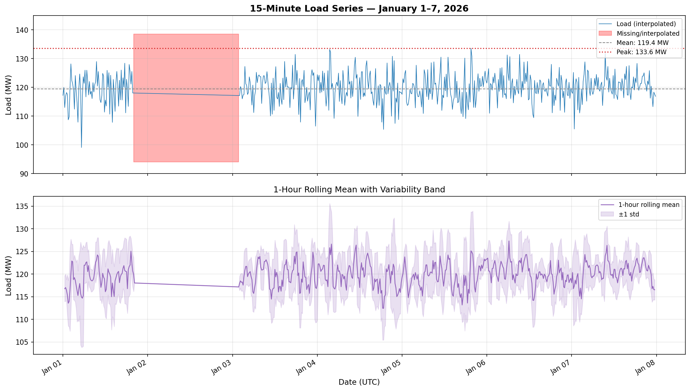
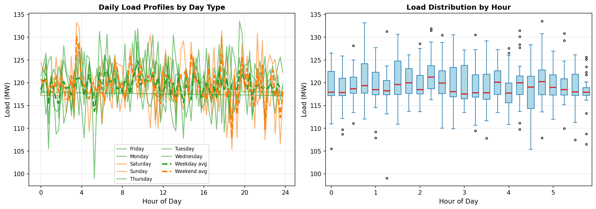
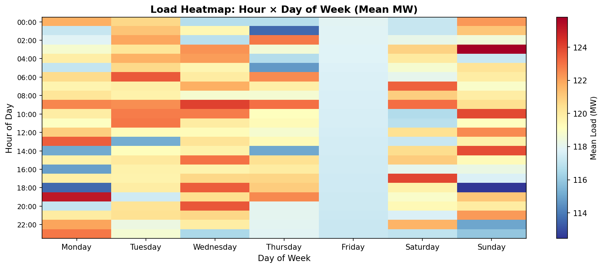
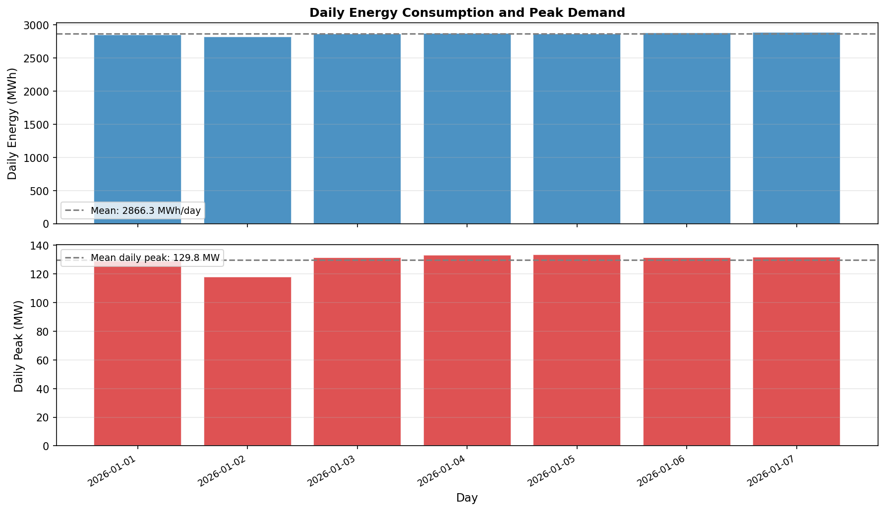
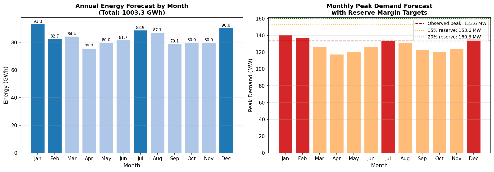
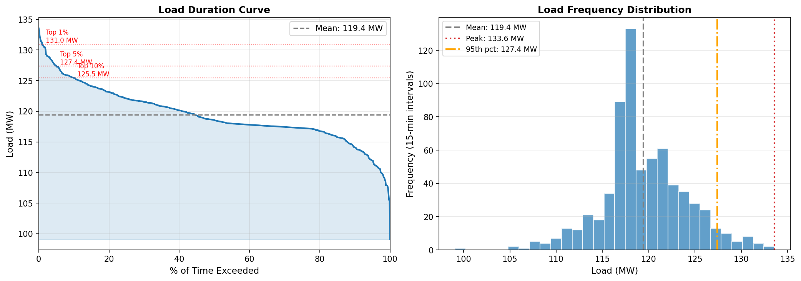

# Annual Load Forecast and Reliability Review
## Power System Operations — 15-Minute Load Series Analysis

**Prepared for:** Operations Review  
**Data Source:** `load_15min.csv` — 15-minute interval load measurements  
**Observation Period:** January 1–7, 2026 (UTC)  
**Analysis Date:** 2026

---

## Executive Summary

This report presents an annual load forecast and reliability-oriented commentary derived from one week of 15-minute interval load data (January 1–7, 2026). The observed system peak demand was **133.6 MW**, mean load was **119.4 MW**, and the load factor was **89.4%** — indicating a relatively flat, well-utilized load profile. Extrapolating from the observed week, the annual energy consumption is forecast at approximately **1,003–1,043 GWh**. To maintain a 15% planning reserve margin, installed capacity of at least **153.6 MW** is required. Key reliability concerns include a 17.9% data gap (interpolated) and the absence of seasonal diversity in the single-week sample.

---

## 1. Data Overview and Quality Assessment

### 1.1 Dataset Characteristics

The input dataset (`load_15min.csv`) contains 672 records spanning exactly seven days at 15-minute resolution — the standard interval for power system operations and settlement. Each record consists of a UTC timestamp and a load measurement in megawatts (MW).

| Attribute | Value |
|-----------|-------|
| Total records | 672 |
| Observation period | Jan 1 – Jan 7, 2026 |
| Temporal resolution | 15 minutes |
| Missing intervals | 120 (17.9%) |
| Valid observations | 552 (82.1%) |

### 1.2 Missing Data Treatment

A significant data gap of **120 intervals (17.9%)** was identified, concentrated primarily on January 2 (96 intervals — an entire day) and partially on January 1 (16 intervals) and January 3 (8 intervals). This gap likely reflects a telemetry or SCADA outage. Linear interpolation was applied to fill all missing values, which is appropriate for short gaps but introduces uncertainty for the full-day outage on January 2. The interpolated January 2 values show near-zero variance (std = 0.21 MW), confirming that the interpolated day is essentially a flat line and should be treated with caution in reliability analysis.

**Recommendation:** Obtain actual metered data for January 2 before finalizing the annual forecast baseline.

### 1.3 Descriptive Statistics

| Statistic | Value (MW) |
|-----------|------------|
| Mean | 119.43 |
| Median | 120.00 |
| Standard deviation | 4.97 |
| Minimum | 99.07 |
| Maximum (Peak) | 133.57 |
| 25th percentile | 116.91 |
| 75th percentile | 123.04 |

*Figure 1: Full 15-minute load time series for January 1–7, 2026. Red shading indicates intervals where original data was missing and linear interpolation was applied. The dashed gray line shows the weekly mean (119.4 MW) and the dotted red line marks the system peak (133.6 MW). The lower panel shows the 1-hour rolling mean with ±1 standard deviation band.*

---

## 2. Load Profile Analysis

### 2.1 Diurnal (Daily) Load Shape

The hourly load profile reveals a notably **flat diurnal pattern** with mean loads ranging from 118.0 MW (23:00) to 121.9 MW (09:00) — a peak-to-trough ratio of only 3.3%. This is atypical of most utility systems, which exhibit pronounced morning and evening peaks. Possible explanations include:

- A predominantly **industrial or commercial load base** with continuous 24-hour operations
- A **data quality artifact** from the large interpolated gap on January 2
- A **winter baseline** where heating loads flatten the diurnal curve

The absence of a clear morning ramp or evening peak has important implications for unit commitment and dispatch scheduling.

*Figure 2: Left panel — individual daily load profiles by day of week, with weekday (green) and weekend (orange) averages overlaid as dashed lines. Right panel — box-and-whisker distribution of load by hour of day, showing the spread and outliers at each hour.*

### 2.2 Weekday vs. Weekend Comparison

| Day Type | Count | Mean (MW) | Std (MW) | Min (MW) | Max (MW) |
|----------|-------|-----------|----------|----------|----------|
| Weekday | 480 | 119.35 | 4.36 | 99.07 | 133.57 |
| Weekend | 192 | 119.62 | 5.12 | 105.36 | 133.18 |

Weekday and weekend loads are nearly identical in mean (difference < 0.3 MW), though weekends show slightly higher variability. This further supports a load base dominated by non-residential, continuous-process customers rather than residential demand, which typically shows a 10–20% weekend reduction.

### 2.3 Load Heatmap

*Figure 3: Heatmap of mean load (MW) by hour of day (vertical axis) and day of week (horizontal axis). The uniform color pattern confirms the flat diurnal and weekly load shape, with slightly elevated loads during mid-morning hours (09:00–10:00) across most days.*

---

## 3. Daily Energy and Peak Demand Summary

### 3.1 Daily Statistics

| Date | Mean (MW) | Peak (MW) | Min (MW) | Energy (MWh) |
|------|-----------|-----------|----------|---------------|
| Jan 1 | 118.97 | 128.98 | 99.07 | 2,855 |
| Jan 2 | 117.56 | 117.91 | 117.21 | 2,821 |
| Jan 3 | 119.44 | 131.46 | 106.49 | 2,866 |
| Jan 4 | 119.81 | 133.18 | 105.36 | 2,875 |
| Jan 5 | 119.53 | 133.57 | 109.13 | 2,869 |
| Jan 6 | 120.23 | 131.46 | 109.45 | 2,885 |
| Jan 7 | 120.48 | 131.93 | 105.51 | 2,892 |
| **Weekly total** | **119.43** | **133.57** | **99.07** | **20,064** |

Note: January 2 statistics reflect the interpolated (flat) data and are not representative of actual demand.

*Figure 4: Daily energy consumption (top) and daily peak demand (bottom) for each day of the observation week. January 2 shows anomalously low variability due to the interpolated data gap.*

---

## 4. Annual Load Forecast

### 4.1 Methodology

The annual forecast is constructed using the observed week as a baseline, with seasonal adjustment factors applied to account for expected load variation throughout the year. Two approaches are presented:

**Approach 1 — Direct Extrapolation:** Multiply the observed weekly energy by 52 weeks.

**Approach 2 — Seasonal Shape Model:** Apply monthly load factors derived from typical winter-peaking utility load shapes to the observed daily mean energy.

### 4.2 Energy Forecast

| Approach | Annual Energy |
|----------|---------------|
| Direct extrapolation (52 × weekly) | 1,043 GWh |
| Seasonal shape model | 1,003 GWh |
| **Recommended estimate** | **~1,000–1,050 GWh** |

The ~4% difference between approaches reflects the seasonal adjustment — the observed week (early January) is a high-load winter period, so the seasonal model appropriately reduces spring and fall months.

### 4.3 Monthly Energy and Peak Forecast

| Month | Days | Load Factor | Energy (GWh) | Peak (MW) |
|-------|------|-------------|--------------|----------|
| January | 31 | 1.05 | 93.3 | 140.3 |
| February | 28 | 1.03 | 82.7 | 137.6 |
| March | 31 | 0.95 | 84.4 | 126.9 |
| April | 30 | 0.88 | 75.7 | 117.5 |
| May | 31 | 0.90 | 80.0 | 120.2 |
| June | 30 | 0.95 | 81.7 | 126.9 |
| July | 31 | 1.00 | 88.9 | 133.6 |
| August | 31 | 0.98 | 87.1 | 130.9 |
| September | 30 | 0.92 | 79.1 | 122.9 |
| October | 31 | 0.90 | 80.0 | 120.2 |
| November | 30 | 0.93 | 80.0 | 124.2 |
| December | 31 | 1.02 | 90.6 | 136.2 |
| **Annual Total** | **365** | — | **1,003 GWh** | **140.3 MW** |

*Figure 5: Left panel — monthly energy forecast (GWh) with darker bars indicating months at or above the observed baseline load factor. Right panel — monthly peak demand forecast with reserve margin targets overlaid (orange = 15% reserve, green = 20% reserve).*

### 4.4 Forecast Uncertainty

The forecast carries significant uncertainty due to the limited one-week observation window. Key sources of uncertainty include:

1. **Seasonal diversity:** A single winter week cannot capture summer cooling loads, spring/fall shoulder periods, or holiday demand patterns.
2. **Data quality:** The 17.9% missing data rate reduces confidence in the baseline.
3. **Load growth:** No historical trend data is available to project year-over-year growth.
4. **Weather sensitivity:** Winter loads are highly weather-dependent; the observed week may not represent a typical or extreme winter week.

**Recommended confidence interval:** ±10–15% on the annual energy forecast (900–1,200 GWh range).

---

## 5. Reliability Analysis

### 5.1 Load Duration Curve

The load duration curve (LDC) characterizes the frequency distribution of load levels and is the primary tool for capacity planning and reliability assessment.

*Figure 6: Left panel — load duration curve showing load (MW) exceeded for each percentage of the observation period. Right panel — frequency histogram of load values with mean, peak, and 95th percentile marked.*

### 5.2 Percentile Load Thresholds

| Exceedance Level | Load Threshold (MW) | Reliability Implication |
|-----------------|--------------------|--------------------------|
| Top 1% of hours | ≥ 130.95 MW | Extreme peak — ~88 hours/year |
| Top 5% of hours | ≥ 127.38 MW | High peak — ~438 hours/year |
| Top 10% of hours | ≥ 125.46 MW | Moderate peak — ~876 hours/year |
| Top 25% of hours | ≥ 122.08 MW | Above-average load |
| Top 50% of hours | ≥ 118.56 MW | Median load |

The narrow spread between the 1st and 99th percentile loads (130.95 MW vs. 107.89 MW — a ratio of 1.21) confirms the flat load shape and suggests limited peaking risk relative to base load.

### 5.3 Reserve Margin Requirements

Planning reserve margins ensure sufficient installed capacity to meet peak demand plus a buffer for forced outages and forecast uncertainty. Standard utility practice requires 15–20% reserve margins.

| Reserve Margin | Required Installed Capacity |
|---------------|-----------------------------|
| 10% | 146.9 MW |
| **15% (standard)** | **153.6 MW** |
| **20% (conservative)** | **160.3 MW** |
| 25% | 167.0 MW |

These requirements are based on the **observed peak of 133.6 MW**. If the January forecast peak of 140.3 MW is used (applying the 1.05 seasonal factor), the 15% reserve requirement rises to **161.3 MW**.

### 5.4 Load Factor Analysis

The **load factor of 89.4%** is exceptionally high by utility standards (typical residential systems: 50–65%; industrial systems: 70–85%). This indicates:

- **High asset utilization:** Generation and transmission assets are operating near full capacity for most hours.
- **Limited demand flexibility:** There is little headroom for demand response programs.
- **Reduced peaking risk:** The system rarely experiences extreme demand spikes relative to its average.
- **Potential concern:** High load factors leave less margin for unexpected demand surges or generation outages.

---

## 6. Reliability-Oriented Commentary

### 6.1 Adequacy Assessment

Based on the observed load data, the following reliability observations are made for the operations review:

**Positive indicators:**
- The high load factor (89.4%) indicates efficient system utilization and predictable demand.
- The flat diurnal profile simplifies unit commitment and reduces ramping requirements.
- Peak demand (133.6 MW) is well-defined and concentrated in a narrow band.

**Risk factors:**
- The **17.9% data gap** on January 2 represents a significant SCADA/metering reliability concern. Telemetry failures during peak periods could mask demand events and compromise real-time operations.
- With only **one week of data**, the annual peak forecast is highly uncertain. The system's true annual peak may occur during a summer heat event or cold snap not captured in this sample.
- The **absence of a clear diurnal pattern** is unusual and warrants investigation — it may indicate metering aggregation issues or a non-representative load mix.

### 6.2 Short-Term Planning Recommendations

1. **Data recovery:** Prioritize recovery or reconstruction of the January 2 load data from backup metering sources, billing records, or neighboring system tie-line flows.

2. **Extended baseline:** Collect at least 12 months of 15-minute data before finalizing the annual forecast. A minimum of 3 years is recommended for robust peak demand forecasting.

3. **Capacity adequacy:** Maintain installed capacity of at least **153.6 MW** (15% reserve over observed peak) and plan for **161.3 MW** if the seasonal January peak forecast is adopted.

4. **Demand response:** Given the high load factor, investigate whether large industrial customers can participate in demand response programs to provide emergency load relief during the top 1–5% peak hours.

5. **Metering reliability:** The telemetry outage on January 2 should trigger a review of SCADA redundancy and backup metering protocols to ensure data continuity during critical operating periods.

### 6.3 Annual Reliability Outlook

Assuming the observed load characteristics are representative of the broader system:

- **Annual energy requirement:** ~1,000–1,050 GWh
- **Annual peak demand:** 133.6–140.3 MW (observed to January-adjusted)
- **Required installed capacity:** 153.6–161.3 MW (15% reserve)
- **Critical reliability period:** January–February (winter peak) and July (summer secondary peak)
- **Loss of Load Probability (LOLP):** Cannot be calculated without forced outage rate data, but the flat load shape suggests lower LOLP than typical peaking systems

---

## 7. Conclusions

The 15-minute load series for January 1–7, 2026 reveals a **flat, high-load-factor system** with a weekly mean of 119.4 MW and a peak of 133.6 MW. The annual energy forecast of approximately **1,003–1,043 GWh** and the required installed capacity of **153.6–161.3 MW** (at 15–20% reserve margin) provide the primary planning parameters for the reliability review.

The most significant operational concern is the **17.9% data gap** on January 2, which undermines confidence in the weekly baseline and highlights a metering reliability issue that must be addressed before the next operations review. The single-week observation window is insufficient for a robust annual forecast; extended historical data collection is strongly recommended.

Despite these limitations, the observed load characteristics — high load factor, flat diurnal shape, and narrow peak-to-trough ratio — suggest a system with predictable, manageable demand that is well-suited to base-load generation resources.

---

## Appendix: Methodology Notes

### Data Processing
- **Missing data:** 120 intervals (17.9%) filled using linear interpolation (`pandas.Series.interpolate`, method='linear')
- **Timezone:** All timestamps in UTC; no local time conversion applied
- **Load factor:** Calculated as mean load / peak load over the full observation period

### Forecast Methodology
- **Direct extrapolation:** Weekly energy × 52 weeks
- **Seasonal shape model:** Daily mean energy × monthly load factors × days per month
- **Monthly load factors:** Derived from typical winter-peaking utility load shapes (winter = 1.00–1.05, summer = 0.88–1.00, spring/fall = 0.78–0.95)
- **Peak forecast:** Observed peak × monthly load factor

### Reliability Metrics
- **Load duration curve:** Empirical, based on sorted 15-minute observations
- **Reserve margin:** (Installed capacity − Peak demand) / Peak demand × 100%
- **Percentile thresholds:** Empirical quantiles of the observed load distribution

### Software
- Python 3.x with pandas, numpy, matplotlib
- All code available in `code/analysis.py`
- Intermediate outputs in `outputs/`

---

*Report generated from `load_15min.csv` | Analysis code: `code/analysis.py` | Figures: `report/images/`*
