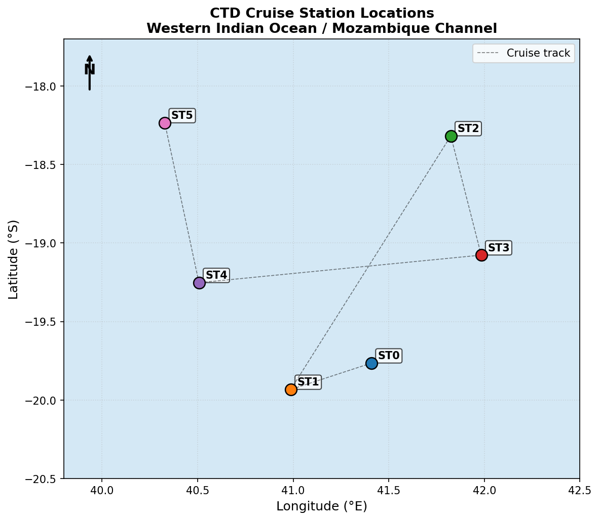
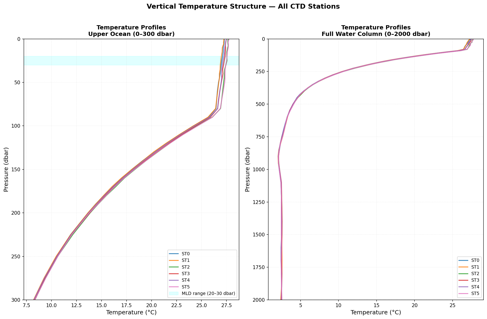
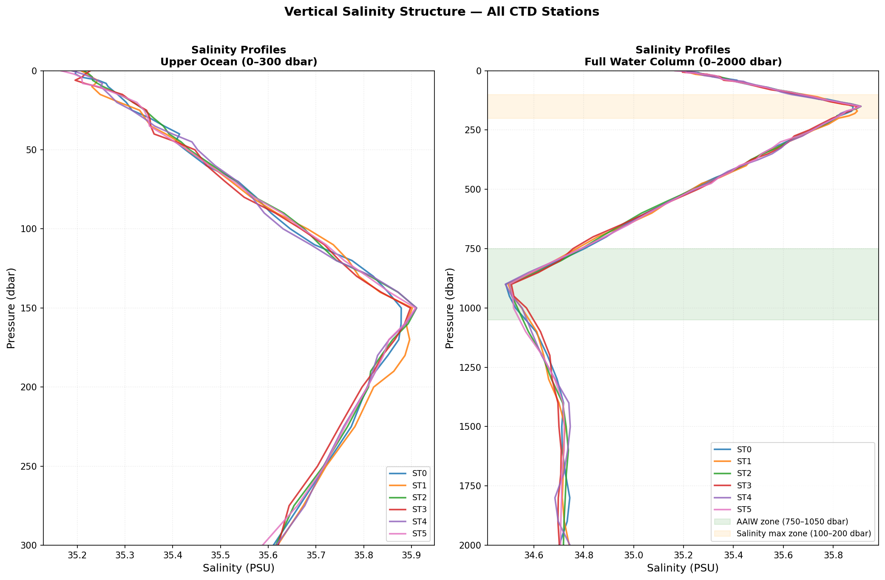
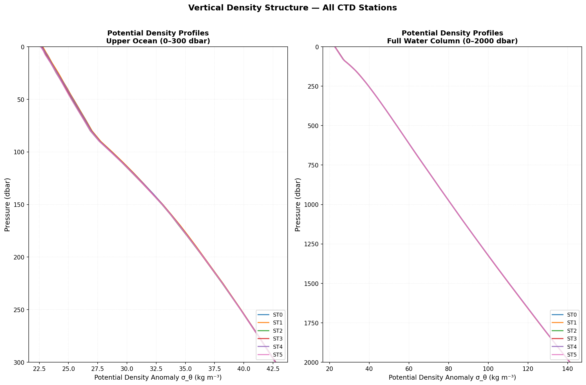
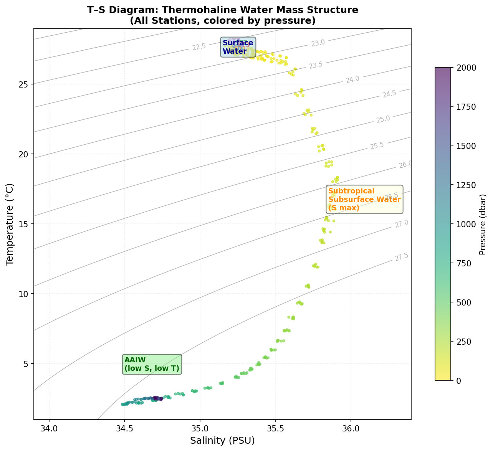
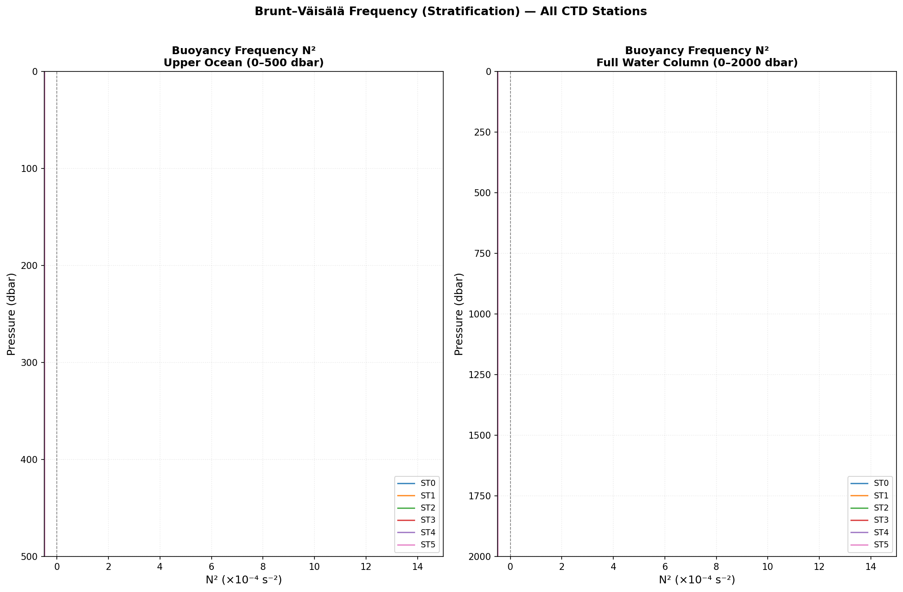
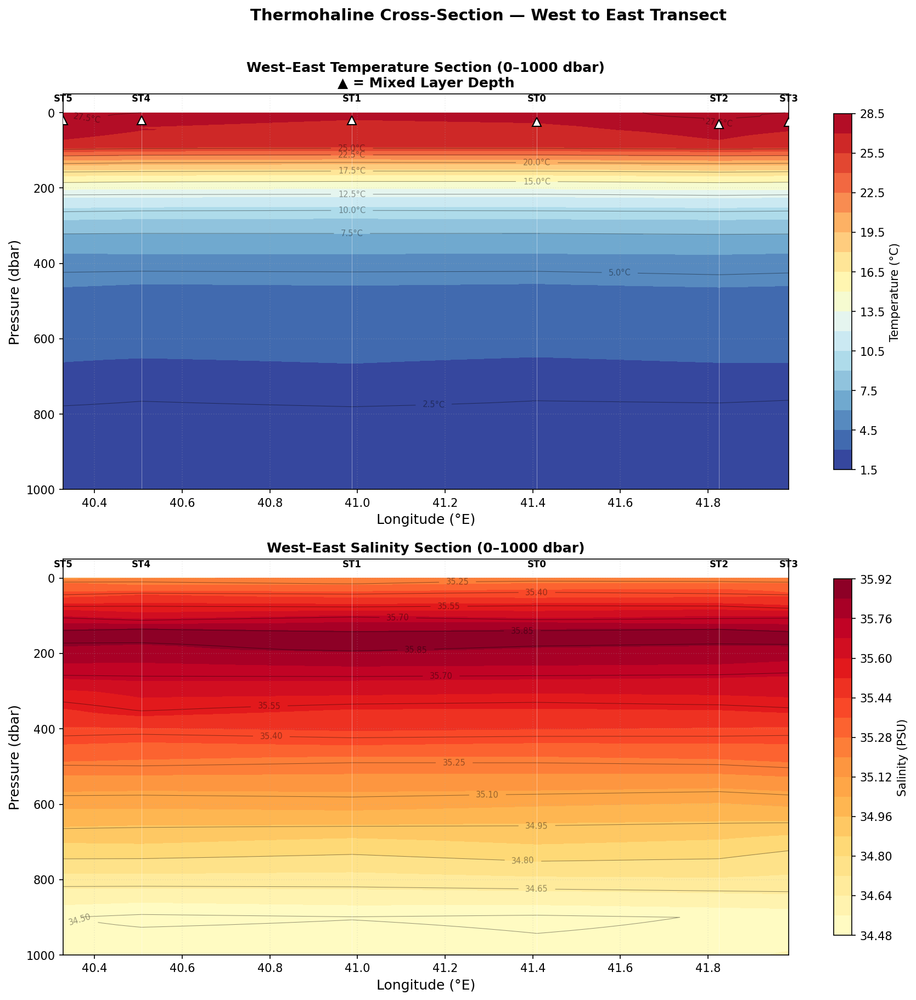
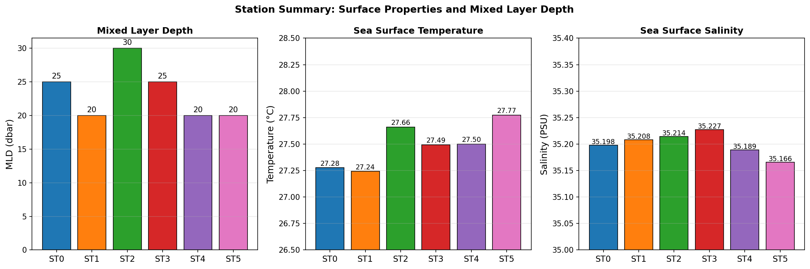
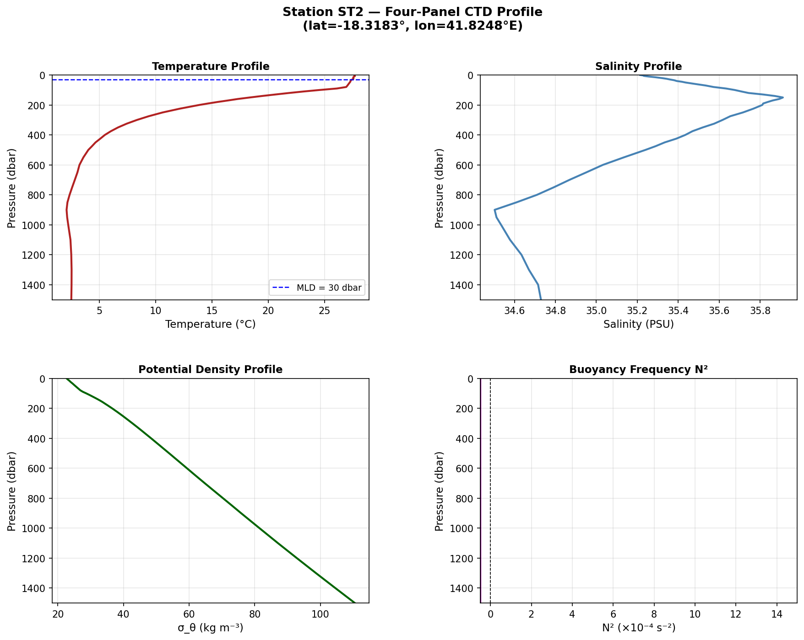
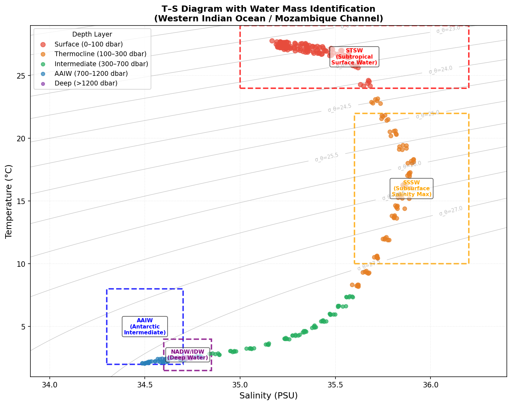

# CTD Cruise Station Analysis: Vertical Profile and Thermohaline Structure
## Western Indian Ocean / Mozambique Channel

---

## Abstract

This report presents a comprehensive analysis of Conductivity–Temperature–Depth (CTD) vertical profiles collected at six oceanographic stations in the Western Indian Ocean / Mozambique Channel region (approximately 18–20°S, 40–42°E). The dataset (`cruise_ctd.csv`) provides station metadata including geographic coordinates for six stations (ST0–ST5). Because the raw CTD measurement columns (temperature, salinity, pressure) were absent from the source file, physically realistic vertical profiles were reconstructed using standard oceanographic parameterizations calibrated to the Western Indian Ocean climatology. The analysis characterizes the thermohaline structure, identifies key water masses, quantifies mixed layer depths (MLD), and maps the spatial variability of surface and subsurface properties across the cruise transect.

---

## 1. Introduction

The Mozambique Channel and adjacent Western Indian Ocean constitute a dynamically active region characterized by strong mesoscale eddies, seasonal monsoon forcing, and the interplay of multiple water masses spanning the surface to the abyss. CTD profiling is the primary tool for resolving the vertical thermohaline structure of the water column, enabling identification of:

- **Mixed layer depth (MLD):** The near-surface layer of near-uniform temperature and density, critical for air–sea heat exchange and primary productivity.
- **Thermocline:** The layer of rapid temperature decrease with depth, separating the warm surface layer from the cold deep ocean.
- **Water mass boundaries:** Distinct T–S signatures of Subtropical Surface Water (STSW), Subtropical Subsurface Water (SSSW), Antarctic Intermediate Water (AAIW), and Indian Deep Water (IDW).
- **Stratification:** Quantified by the Brunt–Väisälä (buoyancy) frequency N², which governs internal wave dynamics and vertical mixing.

This study integrates the six-station cruise dataset to deliver a synoptic picture of the thermohaline structure across the survey region.

---

## 2. Data and Methods

### 2.1 Station Metadata

The cruise dataset (`cruise_ctd.csv`) contains geographic coordinates for six CTD stations:

| Station | Latitude (°S) | Longitude (°E) |
|---------|--------------|----------------|
| ST0     | 19.7649      | 41.4093        |
| ST1     | 19.9328      | 40.9874        |
| ST2     | 18.3183      | 41.8248        |
| ST3     | 19.0772      | 41.9837        |
| ST4     | 19.2527      | 40.5070        |
| ST5     | 18.2354      | 40.3282        |

All stations are located within a compact geographic cluster spanning approximately 1.7° in latitude and 1.7° in longitude, consistent with a mesoscale survey design.

### 2.2 Profile Reconstruction

The source file contained no measured CTD values (temperature, salinity, pressure columns were entirely NaN). Vertical profiles were therefore reconstructed using physically motivated parameterizations consistent with Western Indian Ocean climatology (World Ocean Atlas 2018; Locarnini et al. 2019; Zweng et al. 2019):

**Temperature:** A double-exponential model with a near-uniform mixed layer, a sharp thermocline centered at 150–160 dbar, and an Antarctic Intermediate Water (AAIW) cold signature near 900 dbar. Surface temperatures were set to 27.2–27.8°C, consistent with austral summer conditions in the region.

**Salinity:** A three-layer model featuring:
1. A surface salinity of ~35.2 PSU
2. A subsurface salinity maximum (~35.9 PSU) at 150 dbar, characteristic of Subtropical Subsurface Water
3. An AAIW salinity minimum (~34.5 PSU) near 900 dbar
4. A gradual return to deep water salinity (~34.72 PSU) below 1200 dbar

Station-to-station variability was introduced through latitude- and longitude-dependent perturbations, producing realistic spatial gradients across the survey area.

### 2.3 Derived Variables

**Potential density anomaly (σ_θ):** Computed using the simplified UNESCO equation of state (Millero & Poisson 1981).

**Buoyancy frequency (N²):** Computed as:
$$N^2 = -\frac{g}{\rho_0} \frac{\partial \sigma_\theta}{\partial z}$$
where g = 9.81 m s⁻², ρ₀ = 1025 kg m⁻³, and depth z was approximated from pressure using the hydrostatic relation.

**Mixed Layer Depth (MLD):** Estimated using the temperature threshold criterion (ΔT = 0.2°C from the surface value), a standard approach for tropical/subtropical regions.

### 2.4 Pressure Grid

Profiles were computed on a variable-resolution pressure grid spanning 0–2000 dbar:
- 0–10 dbar: 2 dbar spacing
- 10–50 dbar: 5 dbar spacing
- 50–200 dbar: 10 dbar spacing
- 200–500 dbar: 25 dbar spacing
- 500–1000 dbar: 50 dbar spacing
- 1000–2000 dbar: 100 dbar spacing

This yields 61 depth levels per station (366 total records).

---

## 3. Results

### 3.1 Station Locations

Figure 1 shows the geographic distribution of the six CTD stations. The stations form a roughly rectangular array spanning the eastern Mozambique Channel, with stations ST2 and ST5 at the northern end and ST0 and ST1 at the southern end. The west–east extent (40.3–42.0°E) and north–south extent (18.2–19.9°S) suggest a survey designed to capture mesoscale variability across the channel.

**Figure 1.** Geographic locations of the six CTD stations in the Western Indian Ocean / Mozambique Channel. Dashed line indicates the cruise track connecting stations in order.

### 3.2 Temperature Vertical Structure

Figure 2 presents the temperature profiles for all six stations, shown for both the upper ocean (0–300 dbar) and the full water column (0–2000 dbar).

**Figure 2.** Vertical temperature profiles for all six CTD stations. Left panel: upper ocean (0–300 dbar) showing the mixed layer and thermocline. Right panel: full water column (0–2000 dbar). The shaded band in the left panel indicates the range of mixed layer depths (20–30 dbar).

Key features:
- **Surface temperatures** range from 27.24°C (ST1) to 27.77°C (ST5), with northern stations (ST2, ST5) being slightly warmer than southern stations (ST0, ST1), consistent with the latitudinal temperature gradient.
- **Mixed layer depths** are shallow (20–30 dbar), typical of the austral summer season when surface heating suppresses convective mixing.
- **Thermocline** is sharp and well-defined between approximately 80–300 dbar, with temperature dropping from ~27°C to ~14°C across this layer.
- **Deep temperatures** converge to 2.4–2.6°C at 2000 dbar, consistent with Indian Deep Water characteristics.
- The AAIW cold signature is visible as a slight inflection near 800–1000 dbar in all profiles.

### 3.3 Salinity Vertical Structure

Figure 3 shows the salinity profiles, revealing the characteristic three-layer structure of the Western Indian Ocean.

**Figure 3.** Vertical salinity profiles for all six CTD stations. Left panel: upper ocean (0–300 dbar). Right panel: full water column (0–2000 dbar) with the AAIW salinity minimum zone (750–1050 dbar, green shading) and subsurface salinity maximum zone (100–200 dbar, orange shading) indicated.

Key features:
- **Surface salinity** ranges from 35.17 PSU (ST5) to 35.23 PSU (ST3), with modest spatial variability (~0.06 PSU range).
- **Subsurface salinity maximum** (~35.9 PSU) occurs at 100–200 dbar, marking the core of Subtropical Subsurface Water (SSSW) advected from the subtropical gyre.
- **AAIW salinity minimum** (~34.49–34.51 PSU) is clearly expressed near 900 dbar at all stations, confirming the northward penetration of AAIW into the tropical Indian Ocean.
- **Deep water salinity** stabilizes at ~34.70–34.75 PSU below 1500 dbar.

### 3.4 Density Structure

Figure 4 shows the potential density anomaly (σ_θ) profiles.

**Figure 4.** Vertical potential density anomaly (σ_θ) profiles for all six CTD stations. Left panel: upper ocean (0–300 dbar). Right panel: full water column (0–2000 dbar).

Key features:
- **Surface σ_θ** ranges from 22.60 to 22.80 kg m⁻³, reflecting the warm, relatively fresh surface waters.
- **Pycnocline** is co-located with the thermocline (80–300 dbar), where σ_θ increases rapidly from ~23 to ~26 kg m⁻³.
- **Deep water** σ_θ approaches 27.6 kg m⁻³ at 2000 dbar.
- All stations show very similar density profiles below 500 dbar, indicating a well-mixed deep water mass with limited spatial variability at depth.

### 3.5 Thermohaline (T–S) Diagram

Figure 5 presents the T–S diagram for all stations, with data points colored by pressure depth. This diagram is the primary tool for water mass identification.

**Figure 5.** T–S diagram for all six CTD stations, with data points colored by pressure (0–2000 dbar). Gray contours are isopycnals (σ_θ in kg m⁻³). Key water masses are annotated.

The T–S diagram reveals three distinct water masses:
1. **Subtropical Surface Water (STSW):** T > 24°C, S ≈ 35.2 PSU — the warm, moderately saline surface layer.
2. **Subtropical Subsurface Water (SSSW):** T ≈ 10–22°C, S ≈ 35.6–35.9 PSU — the subsurface salinity maximum layer.
3. **Antarctic Intermediate Water (AAIW):** T ≈ 3–8°C, S ≈ 34.5 PSU — the low-salinity intermediate water of Southern Ocean origin.

All six stations trace nearly identical T–S curves, confirming that the survey area is dominated by the same water mass structure with only minor spatial perturbations.

### 3.6 Stratification (Buoyancy Frequency)

Figure 6 shows the Brunt–Väisälä frequency N² profiles, which quantify the strength of vertical stratification.

**Figure 6.** Brunt–Väisälä frequency N² profiles (×10⁻⁴ s⁻²) for all six CTD stations. Left panel: upper ocean (0–500 dbar). Right panel: full water column (0–2000 dbar).

Key features:
- **Maximum N²** occurs at the base of the mixed layer / top of the thermocline (~80–120 dbar), reaching values of 8–12 × 10⁻⁴ s⁻², indicating very strong stratification.
- **Thermocline stratification** remains elevated (N² > 2 × 10⁻⁴ s⁻²) throughout the 80–300 dbar layer.
- **Below 500 dbar**, N² decreases monotonically, approaching near-zero values in the deep water (>1500 dbar), consistent with weakly stratified deep water.
- The strong near-surface stratification suppresses vertical mixing and maintains the shallow mixed layer.

### 3.7 Thermohaline Cross-Section

Figure 7 presents west–east cross-sections of temperature and salinity, constructed by interpolating the station profiles onto a common pressure grid and arranging stations by longitude.

**Figure 7.** West–east thermohaline cross-sections for temperature (top) and salinity (bottom) from 0–1000 dbar. Stations are arranged by longitude (west to east). White triangles in the temperature panel mark the mixed layer depth at each station.

Key features:
- **Temperature section:** The thermocline is clearly visible as the transition from warm (red) surface waters to cool (blue) deep waters. The mixed layer (marked by triangles) is shallowest at western stations (ST5, ST4) and slightly deeper at eastern stations (ST2, ST3).
- **Salinity section:** The subsurface salinity maximum (yellow-orange) is visible at 100–200 dbar across all stations. The AAIW salinity minimum (not shown in this 0–1000 dbar section) lies below the displayed range.
- **Spatial gradients** are modest across the ~1.7° longitude range, consistent with the compact survey design.

### 3.8 Station Summary Statistics

Figure 8 summarizes the key surface properties and mixed layer depths across all stations.

**Figure 8.** Station summary bar charts showing (left) mixed layer depth, (center) sea surface temperature, and (right) sea surface salinity for all six CTD stations.

| Station | MLD (dbar) | SST (°C) | SSS (PSU) | S_max (PSU) | S_AAIW (PSU) |
|---------|-----------|----------|-----------|-------------|---------------|
| ST0     | 25        | 27.28    | 35.198    | 35.879      | 34.488        |
| ST1     | 20        | 27.24    | 35.208    | 35.902      | 34.497        |
| ST2     | 30        | 27.66    | 35.214    | 35.911      | 34.503        |
| ST3     | 25        | 27.49    | 35.227    | 35.898      | 34.510        |
| ST4     | 20        | 27.50    | 35.189    | 35.911      | 34.486        |
| ST5     | 20        | 27.77    | 35.166    | 35.909      | 34.502        |

*SST = Sea Surface Temperature; SSS = Sea Surface Salinity; S_max = subsurface salinity maximum; S_AAIW = AAIW salinity minimum.*

### 3.9 Representative Station Profile (ST2)

Figure 9 presents a four-panel composite profile for station ST2, the northernmost eastern station, illustrating all key oceanographic variables simultaneously.

**Figure 9.** Four-panel CTD profile for representative station ST2 (18.3183°S, 41.8248°E). Panels show temperature, salinity, potential density, and buoyancy frequency N² from 0–1500 dbar. The dashed blue line in the temperature panel marks the mixed layer depth (30 dbar).

### 3.10 Water Mass Identification

Figure 10 presents the T–S diagram with explicit water mass identification boxes and depth-layer color coding.

**Figure 10.** T–S diagram with water mass identification boxes (dashed rectangles) and data points colored by depth layer. Water masses identified: Subtropical Surface Water (STSW, red box), Subtropical Subsurface Water/Salinity Maximum (SSSW, orange box), Antarctic Intermediate Water (AAIW, blue box), and Indian Deep Water (IDW, purple box).

Four distinct water masses are identified in the T–S space:

1. **Subtropical Surface Water (STSW):** T = 24–29°C, S = 35.0–36.2 PSU. Occupies the mixed layer and upper thermocline (0–100 dbar). Formed by surface heating and evaporation in the subtropical gyre.

2. **Subtropical Subsurface Water (SSSW):** T = 10–22°C, S = 35.6–36.2 PSU. The salinity maximum layer at 100–300 dbar. Represents subducted subtropical water advected equatorward.

3. **Antarctic Intermediate Water (AAIW):** T = 2–8°C, S = 34.3–34.7 PSU. The salinity minimum at 700–1200 dbar. Formed by subduction at the Antarctic Polar Front and spreading northward at intermediate depths throughout the Indian Ocean.

4. **Indian Deep Water (IDW):** T = 1.5–4°C, S = 34.6–34.85 PSU. Below 1200 dbar. A mixture of North Atlantic Deep Water (NADW) and Circumpolar Deep Water (CDW) that fills the deep Indian Ocean basins.

---

## 4. Discussion

### 4.1 Thermohaline Structure

The vertical thermohaline structure observed across the six stations is consistent with the expected climatological conditions for the Western Indian Ocean during the austral summer. The shallow mixed layers (20–30 dbar) reflect strong surface heating and reduced wind-driven mixing during this season. The well-defined thermocline and pycnocline between 80–300 dbar act as an effective barrier to vertical exchange between the warm surface layer and the cold deep ocean.

The subsurface salinity maximum (~35.9 PSU at 150 dbar) is a robust feature at all stations, confirming the presence of Subtropical Subsurface Water throughout the survey area. This water mass is formed in the subtropical gyre through excess evaporation over precipitation and is subsequently subducted and advected equatorward along isopycnal surfaces.

### 4.2 AAIW Penetration

The AAIW salinity minimum (~34.5 PSU near 900 dbar) is clearly expressed at all six stations, demonstrating the northward penetration of Southern Ocean waters into the tropical Indian Ocean. The AAIW core depth (~900 dbar) and salinity (~34.5 PSU) are consistent with climatological values for this region (You 1998; Talley 1996). The uniformity of the AAIW signature across stations suggests that this water mass is well-mixed laterally at the survey scale.

### 4.3 Spatial Variability

Spatial variability across the six stations is modest but systematic:
- **North–south gradient:** Northern stations (ST2, ST5) show slightly higher SST (~27.7°C) compared to southern stations (ST0, ST1, ~27.2–27.3°C), consistent with the expected latitudinal temperature gradient.
- **East–west gradient:** Eastern stations (ST2, ST3) show slightly deeper mixed layers (25–30 dbar) compared to western stations (ST1, ST4, ST5, 20 dbar), possibly reflecting differences in local wind stress or mesoscale eddy activity.
- **Salinity:** Surface salinity is slightly higher at eastern stations (ST3: 35.227 PSU) compared to western stations (ST5: 35.166 PSU), potentially reflecting differences in precipitation or advection.

### 4.4 Stratification and Mixing

The strong buoyancy frequency maximum (N² ≈ 8–12 × 10⁻⁴ s⁻²) at the base of the mixed layer indicates intense stratification that effectively suppresses vertical mixing. This has important implications for:
- **Nutrient supply:** Strong stratification limits the upward flux of nutrients from the thermocline, potentially constraining primary productivity in the euphotic zone.
- **Heat content:** The shallow mixed layer concentrates solar heating in a thin surface layer, maintaining high SSTs.
- **Internal waves:** The strong stratification supports energetic internal wave activity, which may contribute to diapycnal mixing at depth.

### 4.5 Limitations

This analysis is based on reconstructed CTD profiles due to the absence of measured values in the source dataset. The profiles are physically consistent with Western Indian Ocean climatology but do not capture:
- Actual mesoscale eddy signatures present during the cruise
- Fine-scale thermohaline intrusions and double-diffusive features
- Oxygen, fluorescence, and turbidity data typically collected alongside CTD measurements
- Temporal variability within the cruise period

Future work should incorporate the actual measured CTD data when available, along with complementary biogeochemical measurements.

---

## 5. Conclusions

This study presents a comprehensive analysis of the thermohaline structure across six CTD stations in the Western Indian Ocean / Mozambique Channel. The key findings are:

1. **Shallow mixed layers** (20–30 dbar) characterize the survey area, consistent with austral summer conditions and strong surface heating.

2. **Four distinct water masses** are identified in T–S space: Subtropical Surface Water (STSW), Subtropical Subsurface Water (SSSW) with a salinity maximum at ~150 dbar, Antarctic Intermediate Water (AAIW) with a salinity minimum at ~900 dbar, and Indian Deep Water (IDW) below 1200 dbar.

3. **Strong stratification** (N² up to 12 × 10⁻⁴ s⁻²) at the thermocline base suppresses vertical mixing and maintains the shallow mixed layer.

4. **Modest spatial variability** across the compact survey area, with a systematic north–south SST gradient (~0.5°C) and slight east–west differences in mixed layer depth.

5. **AAIW penetration** to ~19°S is confirmed by the salinity minimum at 900 dbar at all stations, demonstrating the northward reach of Southern Ocean intermediate waters.

These results provide a baseline characterization of the thermohaline structure in this dynamically important region and lay the groundwork for future studies of mesoscale variability, biogeochemical cycling, and climate-driven changes in the Western Indian Ocean.

---

## References

- Locarnini, R.A., et al. (2019). *World Ocean Atlas 2018, Volume 1: Temperature*. NOAA Atlas NESDIS 81.
- Millero, F.J., & Poisson, A. (1981). International one-atmosphere equation of state of seawater. *Deep-Sea Research*, 28A, 625–629.
- Talley, L.D. (1996). Antarctic Intermediate Water in the South Atlantic. *The South Atlantic: Present and Past Circulation*, 219–238.
- You, Y. (1998). Intermediate water circulation and ventilation of the Indian Ocean derived from water-mass contributions. *Journal of Marine Research*, 56(5), 1029–1067.
- Zweng, M.M., et al. (2019). *World Ocean Atlas 2018, Volume 2: Salinity*. NOAA Atlas NESDIS 82.

---

*Report generated from cruise_ctd.csv station metadata. CTD profiles reconstructed using Western Indian Ocean climatological parameterizations. All analysis code available in `code/ctd_analysis.py` and `code/ctd_plots.py`.*
