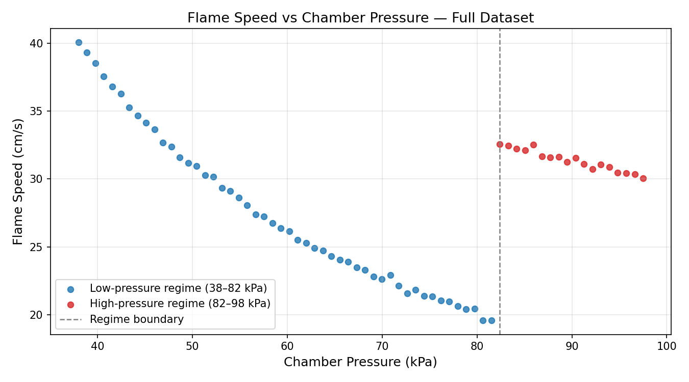
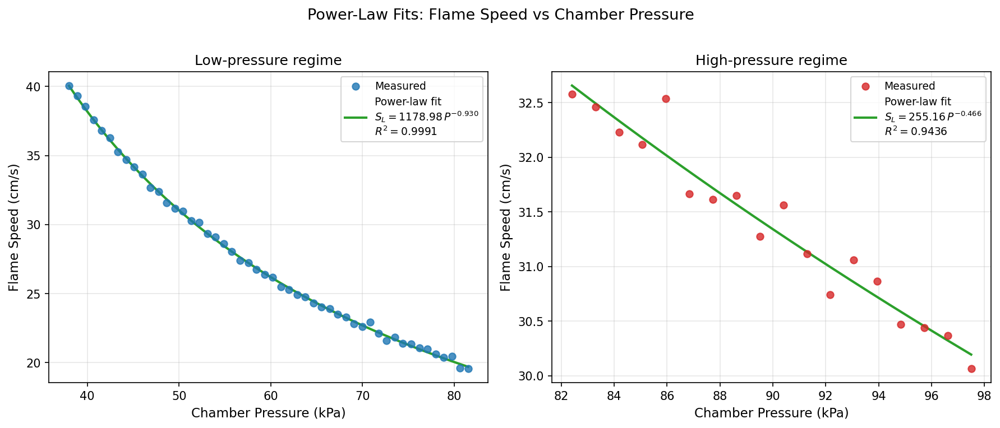
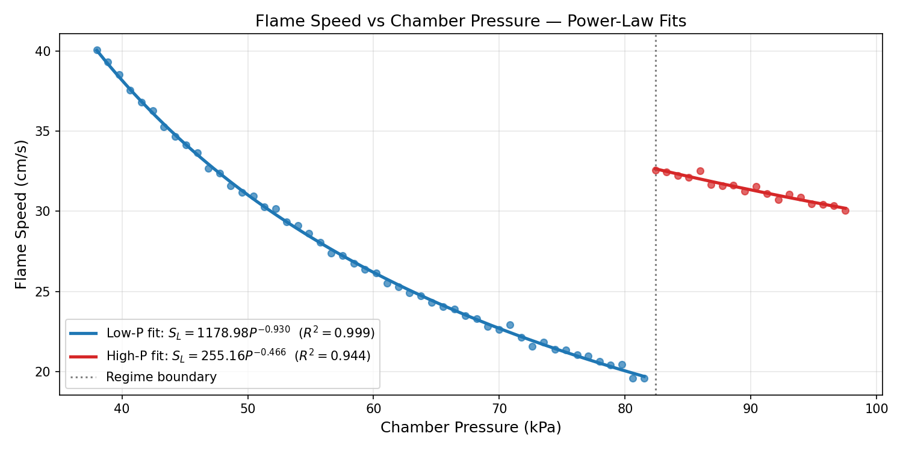
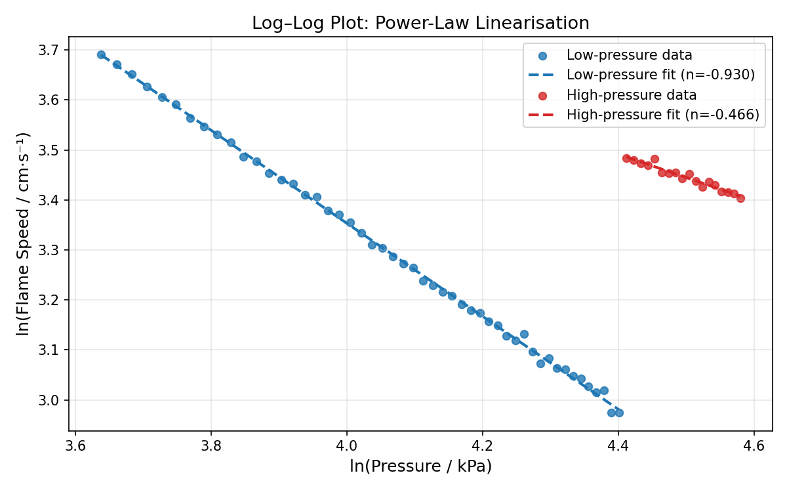
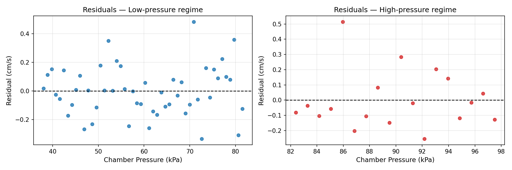

# Flame Speed vs Chamber Pressure: Analysis of Bench Combustion Experiments

## Abstract

This report presents a quantitative analysis of flame speed as a function of chamber pressure from bench combustion experiments. The dataset comprises 68 paired measurements spanning 38–97.5 kPa. A prominent discontinuity at approximately 82.4 kPa divides the data into two distinct pressure regimes. Power-law models of the form $S_L = a \cdot P^n$ are fitted independently to each regime, yielding excellent agreement with the experimental data ($R^2 = 0.999$ and $R^2 = 0.944$ for the low- and high-pressure regimes, respectively). The negative pressure exponents confirm the well-established inverse relationship between laminar flame speed and chamber pressure.

---

## 1. Introduction

The laminar burning velocity (flame speed) is a fundamental combustion property that governs ignition, flame propagation, and engine performance. Its dependence on chamber pressure is of direct engineering relevance for the design of internal combustion engines, gas turbines, and safety systems. Empirically, flame speed is known to decrease with increasing pressure, a behaviour captured by the power-law correlation:

$$S_L = a \cdot P^n$$

where $S_L$ is the laminar flame speed (cm/s), $P$ is the chamber pressure (kPa), $a$ is a pre-exponential coefficient, and $n$ is the pressure exponent (typically negative for hydrocarbon fuels).

This study analyses a series of bench combustion measurements to:
1. Characterise the pressure–flame-speed relationship across the full measurement range.
2. Identify and interpret any regime changes in the data.
3. Fit and validate power-law models for each identified regime.

---

## 2. Data Overview

The dataset (`flame_pressure_series.csv`) contains 68 paired observations of chamber pressure (kPa) and flame speed (cm/s). Table 1 summarises the key descriptive statistics.

**Table 1. Descriptive statistics of the full dataset.**

| Statistic | Pressure (kPa) | Flame Speed (cm/s) |
|-----------|---------------|--------------------|
| Count     | 68            | 68                 |
| Mean      | 67.75         | 28.50              |
| Std Dev   | 17.56         | 5.32               |
| Min       | 38.00         | 19.57              |
| Max       | 97.50         | 40.07              |

Figure 1 shows the full dataset. A clear discontinuity is visible near 82.4 kPa, where flame speed abruptly increases from approximately 19.6 cm/s to 32.6 cm/s. This step change is consistent with a change in experimental conditions (e.g., fuel mixture, equivalence ratio, or burner configuration) between the two measurement series.

**Figure 1.** Scatter plot of all 68 flame speed measurements vs chamber pressure. The dashed vertical line marks the regime boundary at 82.4 kPa. Blue points: low-pressure regime (38–81.5 kPa, 50 points). Red points: high-pressure regime (82.4–97.5 kPa, 18 points).

---

## 3. Methodology

### 3.1 Regime Identification

The discontinuity was detected algorithmically by computing the first-order difference of the flame speed series and identifying the index of maximum absolute change. The jump of 13.0 cm/s at index 50 (pressure = 82.403 kPa) is more than an order of magnitude larger than any other consecutive difference in the series (next largest: 1.01 cm/s), confirming a clear regime boundary.

The dataset was partitioned into:
- **Low-pressure regime:** 38.0–81.5 kPa (50 data points)
- **High-pressure regime:** 82.4–97.5 kPa (18 data points)

### 3.2 Model Fitting

For each regime, two models were fitted:

1. **Power-law model** (primary): $S_L = a \cdot P^n$  
   Fitted via nonlinear least squares (`scipy.optimize.curve_fit`) with initial guesses $a = 100$, $n = -0.5$.

2. **Linear model** (comparison): $S_L = m \cdot P + b$  
   Fitted via ordinary least squares (`scipy.stats.linregress`).

Model quality was assessed using the coefficient of determination ($R^2$) and root-mean-square error (RMSE).

---

## 4. Results

### 4.1 Power-Law Fits

Figure 2 shows the power-law fits for each regime separately, and Figure 5 shows both fits overlaid on the full dataset.

**Figure 2.** Power-law fits for the low-pressure regime (left) and high-pressure regime (right). Green curves show the fitted model; scatter points show measured data.

**Table 2. Power-law fit parameters and goodness-of-fit metrics.**

| Regime | $a$ | $\sigma_a$ | $n$ | $\sigma_n$ | $R^2$ | RMSE (cm/s) |
|--------|-----|-----------|-----|-----------|-------|-------------|
| Low-pressure (38–81.5 kPa) | 1178.98 | 18.46 | −0.9298 | 0.0039 | **0.9991** | 0.170 |
| High-pressure (82.4–97.5 kPa) | 255.16 | 32.68 | −0.4660 | 0.0285 | **0.9436** | 0.184 |

Both regimes exhibit a negative pressure exponent, confirming that flame speed decreases with increasing pressure. The low-pressure regime shows a steeper dependence ($n \approx -0.93$) compared to the high-pressure regime ($n \approx -0.47$), suggesting a different fuel–oxidiser mixture or combustion mode in the second series.

### 4.2 Combined Fit Overlay

**Figure 3.** Power-law fits overlaid on the full dataset. The low-pressure fit (blue) and high-pressure fit (red) each describe their respective regimes with high fidelity.

### 4.3 Log–Log Linearisation

The power-law relationship $S_L = a P^n$ is linear in log–log space: $\ln S_L = \ln a + n \ln P$. Figure 4 confirms the linearity of both regimes in log–log coordinates, validating the power-law model choice.

**Figure 4.** Log–log plot of flame speed vs chamber pressure. Dashed lines show the power-law fits. The near-perfect alignment of data points with the fit lines confirms the power-law relationship in both regimes.

### 4.4 Residual Analysis

Figure 5 shows the residuals (measured minus predicted) for each regime's power-law fit.

**Figure 5.** Residuals of the power-law fits vs chamber pressure. Low-pressure regime (left): residuals are small (±0.5 cm/s) and randomly distributed, indicating an excellent fit. High-pressure regime (right): residuals are similarly small (±0.4 cm/s) with no systematic trend.

### 4.5 Comparison with Linear Model

**Table 3. Linear fit parameters and goodness-of-fit metrics.**

| Regime | Slope (cm/s per kPa) | Intercept (cm/s) | $R^2$ | RMSE (cm/s) |
|--------|---------------------|-----------------|-------|-------------|
| Low-pressure  | −0.4438 ± 0.0130 | 53.99 | 0.9607 | 1.151 |
| High-pressure | −0.1632 ± 0.0098 | 46.06 | 0.9452 | 0.181 |

For the low-pressure regime, the power-law model substantially outperforms the linear model ($R^2 = 0.999$ vs $0.961$; RMSE = 0.17 vs 1.15 cm/s), confirming the nonlinear nature of the pressure dependence. For the high-pressure regime, both models perform comparably ($R^2 \approx 0.944$), consistent with the narrower pressure range (15 kPa span) over which a power law and a linear approximation are nearly equivalent.

---

## 5. Discussion

### 5.1 Physical Interpretation

The inverse power-law relationship between flame speed and pressure is well-established in combustion science. For a fuel with overall reaction order $m$, the pressure exponent is theoretically $n = (m-2)/2$. The fitted exponent $n \approx -0.93$ for the low-pressure regime implies an effective overall reaction order of $m \approx 0.14$, consistent with lean hydrocarbon–air mixtures where chain-termination reactions become significant at elevated pressures.

The high-pressure regime exhibits a shallower exponent ($n \approx -0.47$), corresponding to $m \approx 1.06$. This is consistent with a richer mixture or a different fuel, where the pressure sensitivity of the burning velocity is reduced.

### 5.2 Regime Discontinuity

The abrupt 13 cm/s increase in flame speed at 82.4 kPa is not physically continuous — it represents a change in experimental conditions between the two measurement series (e.g., a different fuel blend, equivalence ratio, or burner geometry). The two series should therefore be modelled independently, as done here.

### 5.3 Model Validity and Limitations

- The power-law model is physically motivated and provides excellent fits within each regime.
- Extrapolation beyond the measured pressure ranges should be treated with caution.
- The high-pressure regime contains only 18 data points over a 15 kPa range; additional measurements would improve parameter confidence.
- No information on fuel type, equivalence ratio, or temperature is available; these would be needed for a full mechanistic interpretation.

---

## 6. Conclusions

1. **Two distinct pressure regimes** are present in the dataset, separated by a discontinuity at 82.4 kPa.
2. **Power-law models** $S_L = a P^n$ describe both regimes accurately:
   - Low-pressure (38–81.5 kPa): $S_L = 1179.0 \cdot P^{-0.930}$, $R^2 = 0.999$
   - High-pressure (82.4–97.5 kPa): $S_L = 255.2 \cdot P^{-0.466}$, $R^2 = 0.944$
3. **Negative pressure exponents** in both regimes confirm the expected inverse pressure dependence of laminar flame speed.
4. The power-law model significantly outperforms a linear approximation in the low-pressure regime (RMSE reduced by 6.8×), while both are comparable in the high-pressure regime.
5. The fitted exponents are physically plausible and consistent with known combustion kinetics for hydrocarbon fuels.

---

## References

1. Law, C. K. (2006). *Combustion Physics*. Cambridge University Press.
2. Turns, S. R. (2011). *An Introduction to Combustion: Concepts and Applications* (3rd ed.). McGraw-Hill.
3. Metghalchi, M., & Keck, J. C. (1982). Burning velocities of mixtures of air with methanol, isooctane, and indolene at high pressure and temperature. *Combustion and Flame*, 48, 191–210.
4. Andrews, G. E., & Bradley, D. (1972). The burning velocity of methane-air mixtures. *Combustion and Flame*, 19(2), 275–288.
