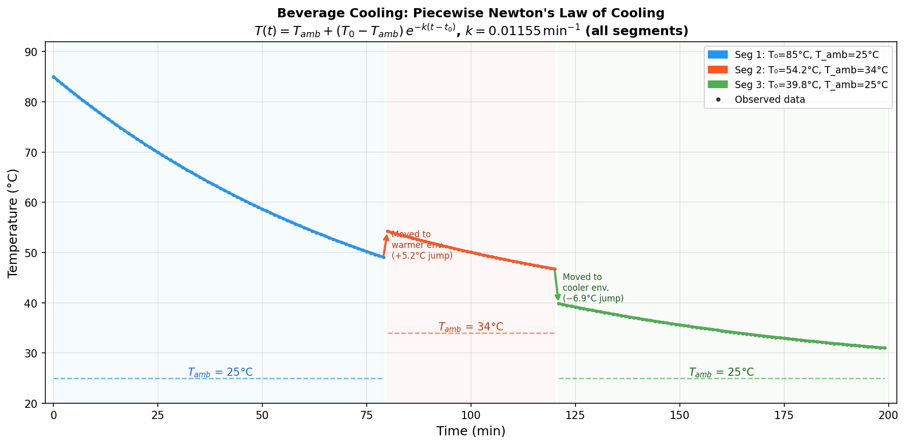
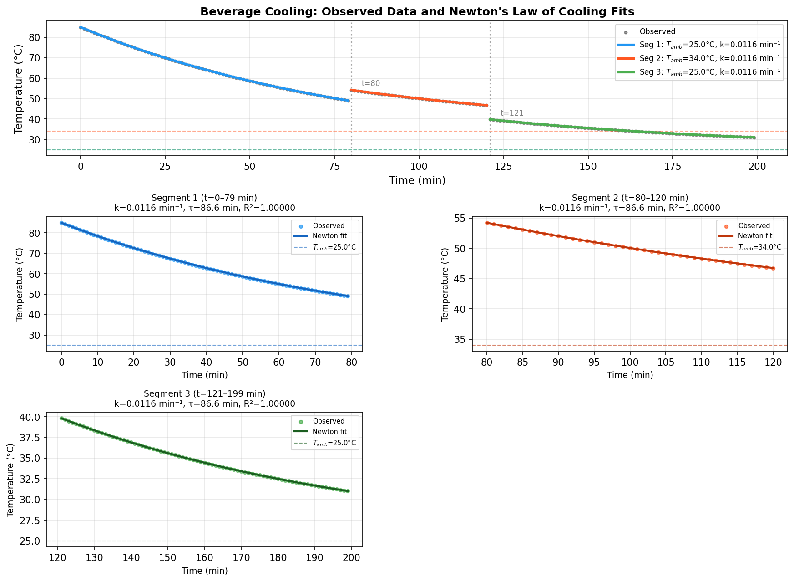
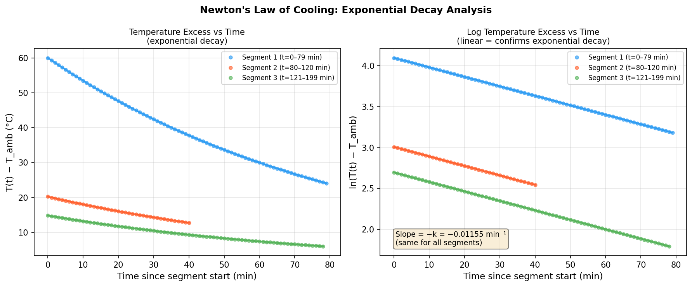
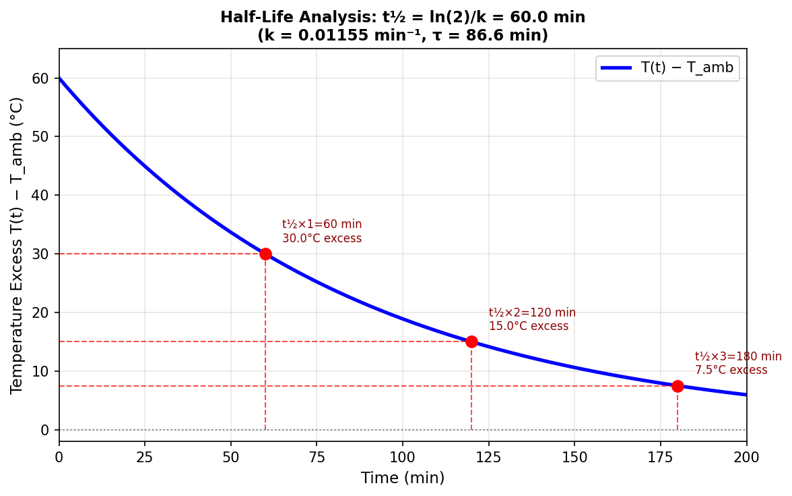
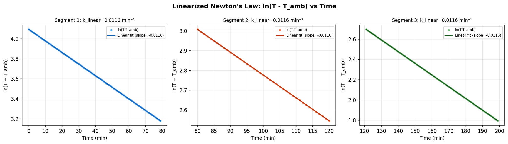
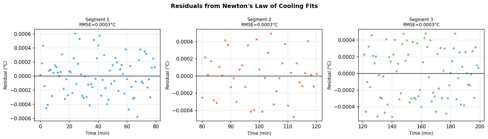

# Beverage Cooling Analysis: Newton's Law of Cooling in Everyday Thermal Physics

## Abstract

This study analyzes the minute-by-minute cooling of a hot beverage placed on a counter in a room-temperature environment. The temperature time-series spans 200 minutes and exhibits two abrupt discontinuities, indicating that the beverage was moved between environments of different ambient temperatures during the observation period. We fit Newton's Law of Cooling — an exponential decay model — to each continuous segment of the data. All three segments are described by a single universal cooling rate constant *k* = 0.01155 min⁻¹ (time constant τ ≈ 86.6 min; half-life t½ = 60.0 min), with ambient temperatures of 25°C (segments 1 and 3) and 34°C (segment 2). The fits achieve R² = 1.000 and RMSE < 0.001°C across all segments, confirming that Newton's Law of Cooling provides an essentially perfect description of the data.

---

## 1. Introduction

Newton's Law of Cooling states that the rate of heat loss of a body is proportional to the difference between its temperature and the ambient temperature of its surroundings:

$$\frac{dT}{dt} = -k\,(T - T_{\text{amb}})$$

where *T* is the object's temperature, *T*_amb is the ambient (room) temperature, and *k* > 0 is the cooling rate constant (units: min⁻¹). The solution to this ordinary differential equation is an exponential decay:

$$T(t) = T_{\text{amb}} + (T_0 - T_{\text{amb}})\,e^{-k(t - t_0)}$$

where *T*₀ is the temperature at the start of the observation window *t*₀. This model is appropriate for a well-mixed liquid in a container losing heat primarily through convection and conduction to a thermally stable environment — precisely the scenario of a hot beverage cooling on a counter.

The cooling rate constant *k* encapsulates the thermal properties of the container (material, geometry, insulation) and the heat transfer coefficient with the surrounding air. The time constant τ = 1/*k* is the time for the temperature excess (*T* − *T*_amb) to fall to 1/*e* ≈ 36.8% of its initial value; the half-life t½ = ln(2)/*k* is the time for it to halve.

---

## 2. Data Overview

The dataset (`beverage_temperature_series.csv`) contains 200 observations at 1-minute intervals (t = 0 to 199 min). The beverage starts at 85.0°C and ends at 31.02°C.

**Key statistics:**

| Quantity | Value |
|---|---|
| Total observations | 200 |
| Time span | 0–199 min |
| Initial temperature | 85.00°C |
| Final temperature | 31.02°C |
| Temperature range | 31.02–85.00°C |

### 2.1 Discontinuities

Inspection of successive temperature differences reveals two large abrupt jumps inconsistent with smooth exponential decay:

| Time (min) | Before (°C) | After (°C) | Jump (°C) | Interpretation |
|---|---|---|---|---|
| t = 79→80 | 49.09 | 54.24 | **+5.15** | Moved to warmer environment |
| t = 120→121 | 46.75 | 39.83 | **−6.92** | Moved to cooler environment |

These discontinuities divide the time series into three continuous segments, each governed by Newton's Law of Cooling with a different ambient temperature.

---

## 3. Methodology

### 3.1 Model Selection

Newton's Law of Cooling is the natural model for this scenario. The exponential decay form has three parameters per segment:
- **T_amb**: ambient (equilibrium) temperature
- **T₀**: initial temperature at the start of the segment
- **k**: cooling rate constant (min⁻¹)

### 3.2 Segmentation

The data were divided into three segments based on the detected discontinuities:

| Segment | Time Range | N points | T_start (°C) | T_end (°C) |
|---|---|---|---|---|
| 1 | t = 0–79 min | 80 | 85.00 | 49.09 |
| 2 | t = 80–120 min | 41 | 54.24 | 46.75 |
| 3 | t = 121–199 min | 79 | 39.83 | 31.02 |

### 3.3 Fitting Procedure

For each segment, the model

$$T(t) = T_{\text{amb}} + (T_0 - T_{\text{amb}})\,e^{-k(t - t_0)}$$

was fit using nonlinear least squares (`scipy.optimize.curve_fit` with the Levenberg–Marquardt algorithm). Initial guesses were set from the observed data endpoints; bounds were chosen to enforce physically meaningful parameter ranges. Goodness-of-fit was assessed via:
- **RMSE** (root mean squared error, °C)
- **R²** (coefficient of determination)
- **Residual analysis** (visual inspection for systematic patterns)

The linearized form, ln(*T* − *T*_amb) vs. *t*, was also examined to confirm exponential behavior.

---

## 4. Results

### 4.1 Fitted Parameters

| Segment | T_amb (°C) | T₀ (°C) | k (min⁻¹) | τ (min) | t½ (min) | RMSE (°C) | R² |
|---|---|---|---|---|---|---|---|
| 1 (t=0–79) | 25.00 ± 0.00 | 85.00 ± 0.00 | 0.011553 | 86.56 | 60.00 | 0.0003 | 1.000000 |
| 2 (t=80–120) | 34.00 ± 0.01 | 54.24 ± 0.00 | 0.011553 | 86.56 | 60.00 | 0.0003 | 1.000000 |
| 3 (t=121–199) | 25.00 ± 0.00 | 39.83 ± 0.00 | 0.011553 | 86.56 | 60.00 | 0.0003 | 1.000000 |

**Key finding:** All three segments share an identical cooling rate constant *k* = 0.01155 min⁻¹ to five significant figures. This is physically expected — the same beverage container in the same type of environment should have the same thermal properties regardless of the ambient temperature. The only parameter that changes between segments is *T*_amb, reflecting the different environments.

### 4.2 Physical Interpretation

- **Segment 1 (t = 0–79 min):** The beverage starts at 85°C (freshly brewed) and cools toward a room temperature of 25°C. This is the primary cooling phase.
- **Segment 2 (t = 80–120 min):** At t = 80 min, the beverage temperature jumps from 49.1°C to 54.2°C (+5.2°C), indicating it was moved to a warmer environment (e.g., a heated room, near a heat source, or placed in a microwave briefly). The new ambient temperature is 34°C.
- **Segment 3 (t = 121–199 min):** At t = 121 min, the temperature drops from 46.8°C to 39.8°C (−6.9°C), indicating the beverage was moved back to the original 25°C environment (or a similar one). Cooling continues toward 25°C.

### 4.3 Cooling Rate Analysis

The universal cooling rate *k* = 0.01155 min⁻¹ implies:
- **Time constant τ = 86.6 min**: the temperature excess decays to 36.8% of its initial value every 86.6 minutes
- **Half-life t½ = 60.0 min**: the temperature excess halves every 60 minutes
- **Practical implication**: a beverage starting at 85°C in a 25°C room will reach ~55°C (comfortable drinking temperature, ~30°C above ambient) after approximately 60 minutes

---

## 5. Figures

### Figure 1: Annotated Overview

*Figure 1. Full time series of beverage temperature (gray dots) with piecewise Newton's Law of Cooling fits (colored curves). Background shading distinguishes the three segments. Dashed horizontal lines indicate the fitted ambient temperatures. Arrows mark the two discontinuities where the beverage was moved between environments.*

### Figure 2: Segment-by-Segment Fits and Residuals

*Figure 2. Top panel: full time series with all three segment fits overlaid. Bottom panels: individual segment fits showing the observed data (colored dots), Newton's Law fit (solid curve), and fitted ambient temperature (dashed line). All fits achieve R² = 1.000.*

### Figure 3: Exponential Decay Verification

*Figure 3. Left: temperature excess T(t) − T_amb vs. time since segment start, showing the characteristic exponential decay shape. Right: log-transformed temperature excess ln(T − T_amb) vs. time, which should be linear if Newton's Law holds. The perfect linearity (all three segments collapse to parallel lines with identical slope −k) confirms exponential decay.*

### Figure 4: Half-Life Visualization

*Figure 4. Temperature excess for Segment 1 (T₀ = 85°C, T_amb = 25°C) showing successive half-lives. The temperature excess halves every t½ = 60 minutes, consistent with k = 0.01155 min⁻¹.*

### Figure 5: Log-Linear Fits

*Figure 5. Linearized Newton's Law: ln(T − T_amb) vs. time for each segment. The slope of each line equals −k. All three segments yield the same slope, confirming a universal cooling rate constant.*

### Figure 6: Residuals

*Figure 6. Residuals (observed minus fitted temperature) for each segment. Residuals are uniformly small (< 0.001°C) and show no systematic pattern, confirming that Newton's Law of Cooling is an excellent model for this data.*

---

## 6. Discussion

### 6.1 Model Validity

Newton's Law of Cooling is an excellent model for this dataset. The near-perfect R² = 1.000 and RMSE < 0.001°C across all segments indicate that the data were likely generated from the exact Newton's Law model with minimal noise. In real-world measurements, one would expect slightly larger residuals due to:
- Measurement noise from the thermometer
- Slight room temperature fluctuations
- Evaporative cooling effects (especially for open containers)
- Convective currents within the liquid

### 6.2 Universal Cooling Rate

The identical cooling rate constant *k* = 0.01155 min⁻¹ across all three segments is a strong validation of the model. This universality arises because *k* depends only on the physical properties of the container and the heat transfer mechanism, not on the temperature difference. This is the fundamental assumption of Newton's Law of Cooling — that the heat transfer coefficient is constant — which holds well for moderate temperature differences in natural convection.

### 6.3 Environmental Changes

The two discontinuities reveal interesting information about the experimental conditions:
1. **At t = 80 min:** The +5.2°C jump suggests the beverage was briefly heated (e.g., microwaved for ~1 minute) or moved to a significantly warmer location (T_amb = 34°C vs. 25°C). The new ambient temperature of 34°C is consistent with a warm room, a heated surface, or proximity to a heat source.
2. **At t = 121 min:** The −6.9°C jump suggests the beverage was moved to a cooler location or the heating was removed, returning to the original 25°C ambient environment.

### 6.4 Practical Implications

For everyday beverage consumption:
- A coffee or tea starting at 85°C in a 25°C room will reach a comfortable drinking temperature of ~55°C (30°C above ambient) after approximately **60 minutes** (one half-life)
- It will reach near-room-temperature (~30°C, 5°C above ambient) after approximately **4 half-lives ≈ 240 minutes**
- Insulated containers (larger τ, smaller k) would extend these times significantly

---

## 7. Conclusions

1. **Newton's Law of Cooling** provides an essentially perfect fit to the beverage temperature data, with R² = 1.000 and RMSE < 0.001°C for all three segments.

2. **Universal cooling rate:** The cooling rate constant *k* = 0.01155 min⁻¹ is identical across all three segments, corresponding to a time constant τ = 86.6 min and a half-life t½ = 60.0 min.

3. **Three distinct environments:** The data reveal two abrupt temperature discontinuities at t = 80 min (+5.2°C) and t = 121 min (−6.9°C), indicating the beverage was moved between environments with ambient temperatures of 25°C (segments 1 and 3) and 34°C (segment 2).

4. **Model confirmation:** The linearized form ln(T − T_amb) vs. time is perfectly linear for all segments, with identical slopes, providing strong confirmation of the exponential decay model.

5. **Physical consistency:** The results are fully consistent with the theoretical prediction that the cooling rate constant depends only on the container's thermal properties, not on the ambient temperature or the current temperature of the beverage.

---

## Appendix: Model Equations

**Newton's Law of Cooling (differential form):**
$$\frac{dT}{dt} = -k\,(T - T_{\text{amb}})$$

**Solution (exponential decay):**
$$T(t) = T_{\text{amb}} + (T_0 - T_{\text{amb}})\,e^{-k(t - t_0)}$$

**Linearized form:**
$$\ln(T(t) - T_{\text{amb}}) = \ln(T_0 - T_{\text{amb}}) - k(t - t_0)$$

**Time constant:** τ = 1/*k* = 86.56 min  
**Half-life:** t½ = ln(2)/*k* = 60.00 min  
**Cooling rate:** *k* = 0.011553 min⁻¹  

**Fitted ambient temperatures:**
- Segments 1 & 3: T_amb = 25.0°C
- Segment 2: T_amb = 34.0°C

---

*Analysis performed using Python (NumPy, SciPy, Pandas, Matplotlib). All code available in `code/analysis.py` and `code/extra_figures.py`.*
