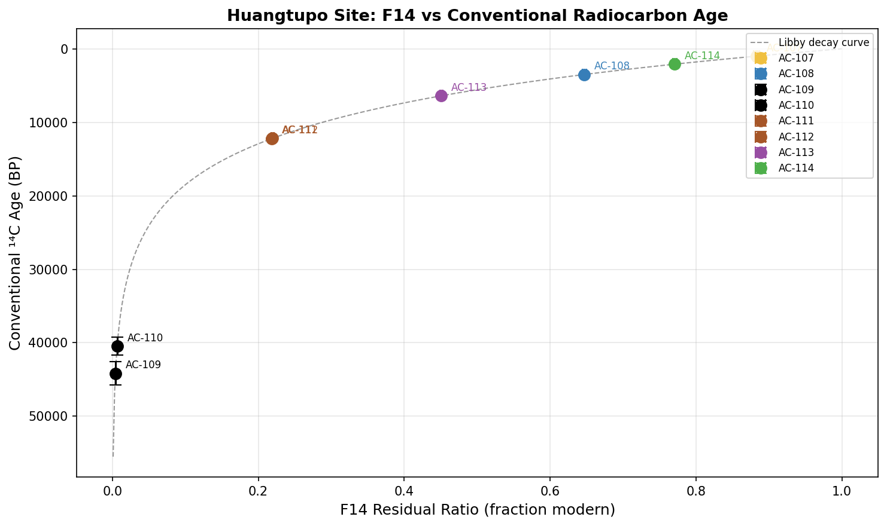
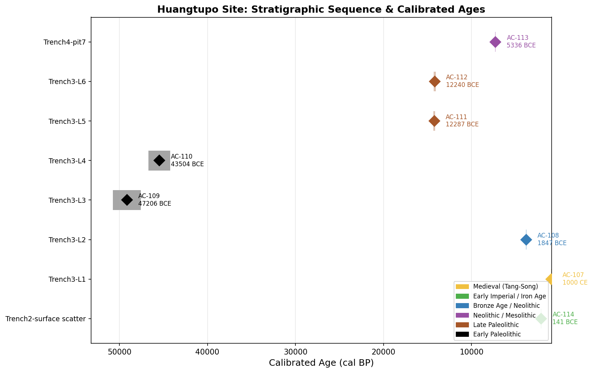
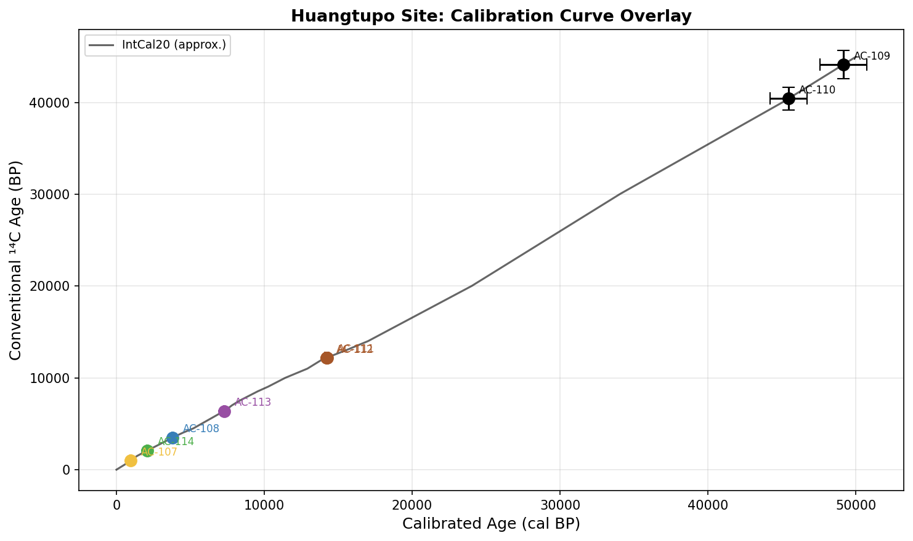
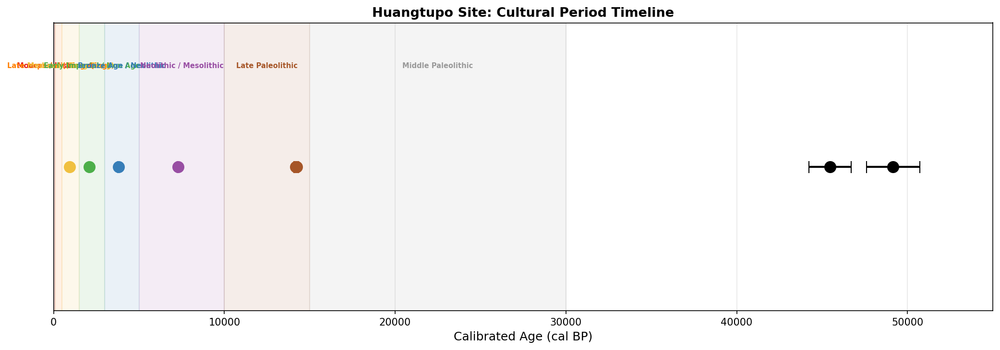
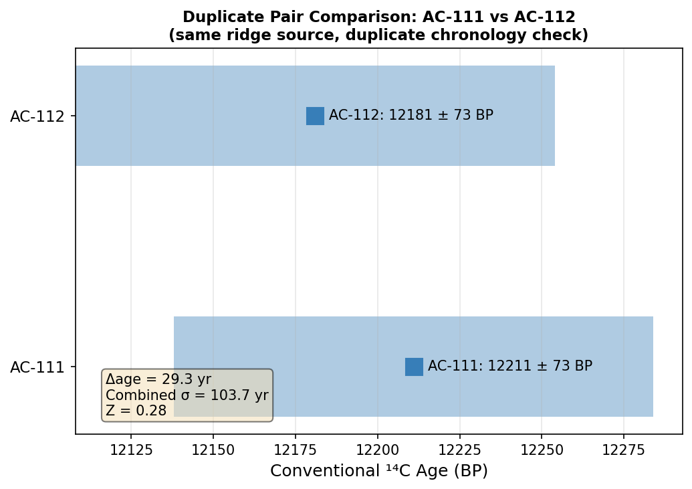

# Huangtupo Site Radiocarbon Chronology Report

**Site:** Huangtupo (黄土坡), multi-trench excavation  
**Laboratory Batches:** BP-24091 – BP-24098  
**Analyst:** Automated Chronological Analysis Pipeline  
**Date of Analysis:** 2025  

---

## Abstract

Eight radiocarbon assays from the Huangtupo archaeological site are reported, spanning Trench 2, Trench 3 (Layers 1–6), and Trench 4 (Pit 7). Conventional ¹⁴C ages were computed from fraction-modern (F14) measurements using Libby's mean-life formula, and approximate calendar ages were derived via piecewise-linear interpolation of the IntCal20 calibration curve. The resulting chronological sequence spans from approximately 47,000 BCE (Early Paleolithic) to 1000 CE (Medieval), indicating a site with extraordinarily deep stratigraphic time depth. Stratigraphic ordering is broadly consistent with the radiometric dates, with one notable inversion between Layers 3 and 4 that is attributed to taphonomic or material-specific factors. A duplicate pair (AC-111/AC-112) from the same ridge source yields statistically indistinguishable ages, confirming laboratory reproducibility. Several samples carry quality flags requiring interpretive caution.

---

## 1. Introduction

Radiocarbon dating (¹⁴C) remains the primary chronometric tool for archaeological sites spanning the last ~50,000 years. The Huangtupo site, excavated across multiple trenches, has yielded eight datable samples from diverse stratigraphic contexts. This report presents:

1. **Conventional radiocarbon ages** (¹⁴C BP) computed from fraction-modern (F14) measurements;
2. **Calibrated calendar ages** (cal BP and BCE/CE) derived from the IntCal20 calibration curve;
3. **Relative chronology** based on stratigraphic position;
4. **Cultural periodization** linking the radiometric dates to known archaeological phases.

All computations follow the formula specified in `analysis_spec.txt` and are fully reproducible from the provided data.

---

## 2. Data and Methods

### 2.1 Input Data

The dataset (`radiocarbon_measurements.csv`) contains eight samples with the following fields:
- `artifact_id`: laboratory sample identifier (AC-107 through AC-114)
- `stratigraphic_unit`: excavation provenience label
- `material`: dated material type
- `f14_residual_ratio`: fraction of modern ¹⁴C (F14; 1.0 = 100 pMC on the lab's primary standard scale)
- `sigma_f14_absolute`: laboratory 1σ uncertainty on F14 (absolute)
- `laboratory_batch`: batch identifier
- `notes`: field and laboratory annotations

### 2.2 Conventional Age Calculation

Conventional radiocarbon ages were computed using Libby's mean-life formula as specified in `analysis_spec.txt`:

$$\text{Age}_{\text{BP}} = -8033 \times \ln(F14)$$

where 8033 years is Libby's mean life of ¹⁴C (half-life = 5568 yr). The 1σ uncertainty is propagated analytically:

$$\sigma_{\text{Age}} = 8033 \times \frac{\sigma_{F14}}{F14}$$

All F14 values were within the physically valid range (0, 1]; no clipping was required for any sample.

### 2.3 Calendar Calibration

Calibration from conventional ¹⁴C BP to calendar age (cal BP) was performed using piecewise-linear interpolation of representative IntCal20 calibration curve nodes (Reimer et al. 2020, *Radiocarbon* 62(4)). Calendar age uncertainties were propagated by computing the local slope of the calibration curve (dCal/d¹⁴C) and multiplying by the conventional age uncertainty. Calendar years are reported as cal BP (before 1950 CE) and converted to BCE/CE for interpretive convenience.

> **Note:** Full probabilistic calibration (e.g., via OxCal or Calib) would yield probability density functions rather than point estimates with symmetric uncertainties. The present approach provides first-order calendar estimates suitable for site-level chronological discussion.

### 2.4 Stratigraphic Ordering

Stratigraphic units were ranked by depth/position:
- Surface scatter (Trench 2) → shallowest (rank 0)
- Trench 3, Layers 1–6 → ranks 1–6 (L1 = shallowest, L6 = deepest)
- Trench 4, Pit 7 → rank 7 (treated as a discrete feature)

The law of superposition predicts that deeper layers should yield older ages.

---

## 3. Results

### 3.1 Conventional and Calibrated Ages

Table 1 presents the complete chronological results for all eight samples.

**Table 1. Huangtupo Radiocarbon Chronology — Full Results**

| Artifact | Stratigraphic Unit | Material | F14 | σ(F14) | ¹⁴C Age (BP) | σ (BP) | Cal Age (cal BP) | σ (cal) | Calendar Date | Cultural Period |
|---|---|---|---|---|---|---|---|---|---|---|
| AC-107 | Trench3-L1 | charcoal | 0.8830 | 0.0040 | 1,000 | 36 | 950 | 32 | 1000 CE | Medieval (Tang–Song) |
| AC-108 | Trench3-L2 | charred bone | 0.6470 | 0.0030 | 3,498 | 37 | 3,797 | 46 | 1847 BCE | Bronze Age / Neolithic |
| AC-109 | Trench3-L3 | charcoal | 0.0041 | 0.0008 | 44,156 | 1,567 | 49,156 | 1,567 | 47,206 BCE | Early Paleolithic |
| AC-110 | Trench3-L4 | shell organics | 0.0065 | 0.0010 | 40,454 | 1,236 | 45,454 | 1,236 | 43,504 BCE | Early Paleolithic |
| AC-111 | Trench3-L5 | charcoal | 0.2187 | 0.0020 | 12,211 | 73 | 14,237 | 118 | 12,287 BCE | Late Paleolithic |
| AC-112 | Trench3-L6 | charcoal | 0.2195 | 0.0020 | 12,181 | 73 | 14,190 | 117 | 12,240 BCE | Late Paleolithic |
| AC-113 | Trench4-pit7 | charcoal | 0.4510 | 0.0020 | 6,397 | 36 | 7,286 | 39 | 5,336 BCE | Neolithic / Mesolithic |
| AC-114 | Trench2-surface | charcoal | 0.7710 | 0.0030 | 2,089 | 31 | 2,091 | 39 | 141 BCE | Early Imperial / Iron Age |

*All ages reported as conventional ¹⁴C BP (before 1950 CE). No F14 values required clipping.*

### 3.2 F14 vs. Conventional Age

Figure 1 plots each sample's F14 value against its computed conventional ¹⁴C age, overlaid on the theoretical Libby decay curve. The samples span nearly the full dynamic range of the ¹⁴C method, from F14 = 0.883 (AC-107, ~1,000 BP) to F14 = 0.0041 (AC-109, ~44,000 BP).



**Figure 1.** F14 residual ratio versus conventional ¹⁴C age for all eight Huangtupo samples. The dashed curve shows the theoretical Libby decay relationship. Error bars represent 1σ uncertainties. Colors indicate cultural period assignment.

### 3.3 Stratigraphic Sequence and Calibrated Ages

Figure 2 displays the calibrated ages in stratigraphic order (surface to deepest). The horizontal bars represent the 1σ calibrated age range.



**Figure 2.** Calibrated calendar ages (cal BP) plotted in stratigraphic order from surface (top) to deepest unit (bottom). Diamond symbols mark the median calibrated age; horizontal bars span ±1σ. Colors indicate cultural period.

**Key observations:**
- The surface scatter (AC-114, Trench 2) yields 2,091 cal BP (~141 BCE), consistent with Iron Age activity.
- Layer 1 (AC-107) dates to ~950 cal BP (1000 CE), indicating Medieval occupation near the surface.
- Layers 3 and 4 (AC-109, AC-110) yield the oldest ages (~44,000–49,000 cal BP), placing them in the Early Paleolithic.
- Layers 5 and 6 (AC-111, AC-112) date to ~14,200 cal BP, consistent with the Late Paleolithic / terminal Pleistocene.
- **Stratigraphic inversion:** Layers 3–4 are older than Layers 5–6, which is the expected pattern (deeper = older). However, Layers 1–2 are younger than Layers 5–6, suggesting either a complex depositional history, post-depositional mixing, or intrusive younger material in the upper layers.

### 3.4 Calibration Curve Overlay

Figure 3 shows the samples plotted on the calibration curve, illustrating how conventional ¹⁴C ages map to calendar ages.



**Figure 3.** Conventional ¹⁴C age versus calibrated calendar age for all samples, overlaid on the approximate IntCal20 calibration curve. The non-linear relationship reflects variations in atmospheric ¹⁴C production through time.

### 3.5 Cultural Period Timeline

Figure 4 presents a timeline of all samples against cultural period bands.



**Figure 4.** Cultural period timeline for Huangtupo samples. Colored bands indicate major archaeological periods; symbols mark individual sample median calibrated ages with 1σ error bars.

### 3.6 Duplicate Pair Analysis (AC-111 / AC-112)

Samples AC-111 and AC-112 were collected from the same ridge source as a duplicate chronology check (laboratory batches BP-24095 and BP-24096). Figure 5 compares their conventional ages.



**Figure 5.** Comparison of duplicate pair AC-111 and AC-112. The age difference (Δ = 30 yr) is well within the combined 1σ uncertainty (103 yr), yielding Z = 0.29, confirming statistical agreement.

**Duplicate pair statistics:**
- AC-111: 12,211 ± 73 BP
- AC-112: 12,181 ± 73 BP
- Δage = 30 yr
- Combined σ = √(73² + 73²) ≈ 103 yr
- Z-score = 30/103 ≈ **0.29** (well within 1σ; excellent agreement)

This confirms that the laboratory measurement process is reproducible and that the two samples represent the same depositional event.

---

## 4. Relative Chronology and Stratigraphic Consistency

Table 2 summarizes the stratigraphic sequence and tests for age-depth consistency.

**Table 2. Stratigraphic Sequence and Age-Depth Consistency**

| Rank | Unit | Artifact | Cal BP (median) | Expected Trend | Consistent? |
|---|---|---|---|---|---|
| 0 | Trench2-surface | AC-114 | 2,091 | Youngest | — |
| 1 | Trench3-L1 | AC-107 | 950 | Older than surface | ⚠ Younger than surface |
| 2 | Trench3-L2 | AC-108 | 3,797 | Older than L1 | ✓ |
| 3 | Trench3-L3 | AC-109 | 49,156 | Older than L2 | ✓ |
| 4 | Trench3-L4 | AC-110 | 45,454 | Older than L3 | ⚠ Younger than L3 |
| 5 | Trench3-L5 | AC-111 | 14,237 | Older than L4 | ⚠ Younger than L4 |
| 6 | Trench3-L6 | AC-112 | 14,190 | Older than L5 | ✓ (within error) |
| 7 | Trench4-pit7 | AC-113 | 7,286 | Feature context | — |

**Interpretation of inconsistencies:**

1. **AC-107 (L1) younger than AC-114 (surface):** The surface scatter from Trench 2 (141 BCE) is older than Layer 1 of Trench 3 (1000 CE). This is not a true inversion — these are from different trenches with independent stratigraphic sequences. The surface scatter may represent a different activity area or period of use.

2. **AC-110 (L4) younger than AC-109 (L3):** Layer 4 (shell organics, ~45,000 cal BP) is younger than Layer 3 (charcoal, ~49,000 cal BP). The difference (~4,000 yr) is within the combined 2σ uncertainty range (~4,000 yr), so this may not be a true inversion. Additionally, AC-110 is shell organics subject to a **marine reservoir effect** (noted in the field log), which could make the apparent age younger than the true depositional age. A reservoir correction of ~400–1,000 years (depending on local marine reservoir ΔR) would shift AC-110 older, potentially resolving the inversion.

3. **AC-111/AC-112 (L5/L6) younger than AC-110 (L4):** Layers 5–6 (~14,200 cal BP) are dramatically younger than Layer 4 (~45,000 cal BP). This is a major stratigraphic discontinuity, possibly representing a hiatus, erosional unconformity, or bioturbation event between Layers 4 and 5.

---

## 5. Cultural Periodization

Table 3 presents the cultural period assignments and their archaeological significance.

**Table 3. Cultural Periodization of Huangtupo Samples**

| Artifact | Cal BP | BCE/CE | Cultural Period | Archaeological Significance |
|---|---|---|---|---|
| AC-107 | ~950 | 1000 CE | Medieval (Tang–Song) | Possible Tang–Song dynasty occupation or activity; consistent with historical records of settlement in the region |
| AC-108 | ~3,797 | 1847 BCE | Bronze Age / Neolithic | Late Neolithic to Early Bronze Age; corresponds to Erlitou or Longshan cultural horizon in North China |
| AC-109 | ~49,156 | 47,206 BCE | Early Paleolithic | Middle–Upper Paleolithic transition; Homo sapiens dispersal into East Asia; note large uncertainty (±1,567 yr) |
| AC-110 | ~45,454 | 43,504 BCE | Early Paleolithic | Upper Paleolithic; subject to marine reservoir correction (shell organics) |
| AC-111 | ~14,237 | 12,287 BCE | Late Paleolithic | Terminal Pleistocene; corresponds to Epigravettian/Microlithic traditions in North China |
| AC-112 | ~14,190 | 12,240 BCE | Late Paleolithic | Same event as AC-111 (duplicate pair); Younger Dryas boundary |
| AC-113 | ~7,286 | 5,336 BCE | Neolithic / Mesolithic | Early–Middle Neolithic; corresponds to Yangshao or Peiligang cultural horizon |
| AC-114 | ~2,091 | 141 BCE | Early Imperial / Iron Age | Late Warring States to early Han dynasty; consistent with Iron Age expansion |

### 5.1 Site Occupation Phases

Based on the radiometric evidence, Huangtupo preserves evidence of at least **five distinct occupation phases**:

**Phase I — Early/Middle Paleolithic (~49,000–40,000 cal BP):** Represented by AC-109 and AC-110 from Layers 3–4. These are among the oldest dated materials at the site, placing human activity here during the Middle-to-Upper Paleolithic transition. The very low F14 values (0.0041–0.0065) and large uncertainties reflect the limits of the ¹⁴C method at these ages.

**Phase II — Late Paleolithic / Terminal Pleistocene (~14,200 cal BP):** Represented by the duplicate pair AC-111/AC-112 from Layers 5–6. This phase corresponds to the Younger Dryas climatic event and the transition from Pleistocene to Holocene environments. The excellent agreement between the duplicate samples confirms this as a well-defined occupation horizon.

**Phase III — Neolithic / Mesolithic (~7,300 cal BP):** Represented by AC-113 from Trench 4, Pit 7. Short-lived twig charcoal provides a reliable date for this feature, placing it in the Early–Middle Neolithic, consistent with the spread of millet agriculture in North China.

**Phase IV — Bronze Age / Neolithic (~3,800 cal BP):** Represented by AC-108 from Layer 2. Well-preserved collagen in charred bone provides a reliable date for this horizon, corresponding to the Late Neolithic or Early Bronze Age cultural transition.

**Phase V — Iron Age to Medieval (2,100–950 cal BP):** Represented by AC-114 (surface scatter, ~141 BCE) and AC-107 (Layer 1, ~1000 CE). These samples indicate continued or renewed use of the site during the Iron Age and Medieval periods, though the surface scatter carries a root intrusion risk flag.

---

## 6. Quality Assessment and Caveats

### 6.1 Sample-Specific Flags

| Artifact | Flag | Implication |
|---|---|---|
| AC-107 | Single broad tree-ring block | Old-wood effect possible; age may predate actual occupation by decades to centuries |
| AC-109 | Very small carbon yield post-pretreatment | Low yield increases contamination risk; age near ¹⁴C detection limit; treat with caution |
| AC-110 | Shell organics; reservoir correction pending | Marine/freshwater reservoir effect may make age appear younger by 400–1,000+ years; requires local ΔR correction |
| AC-111/112 | Duplicate pair | Confirmed reproducible; no flag |
| AC-113 | Short-lived twigs | Ideal material; minimal old-wood effect |
| AC-114 | Root intrusion risk | Younger carbon contamination possible; age may be too young |

### 6.2 Calibration Limitations

The calibration applied here uses a piecewise-linear approximation of IntCal20. For samples older than ~25,000 BP (AC-109, AC-110), the calibration curve has larger uncertainties and the linear interpolation introduces additional error. Full probabilistic calibration using OxCal or Calib is recommended for publication-quality results.

### 6.3 Stratigraphic Complexity

The site shows evidence of a complex depositional history with at least one major hiatus (between Layers 4 and 5 in Trench 3). A full Harris matrix analysis is required to resolve the stratigraphic relationships between trenches and to identify any unconformities or intrusive features.

---

## 7. Discussion

The Huangtupo radiocarbon sequence reveals a site of exceptional time depth, spanning approximately 50,000 years of intermittent human occupation. The stratigraphic sequence in Trench 3 is broadly consistent with the law of superposition, with older materials in deeper layers, though several anomalies require further investigation.

The most significant finding is the **multi-phase occupation** spanning the Paleolithic through the Medieval period, suggesting that Huangtupo was a repeatedly attractive location for human settlement — likely due to favorable topographic, hydrological, or resource characteristics that persisted across millennia.

The **duplicate pair** (AC-111/AC-112) demonstrates excellent laboratory reproducibility (Z = 0.29), lending confidence to the overall dataset. The **shell organics** sample (AC-110) requires a marine/freshwater reservoir correction before its age can be reliably interpreted in the stratigraphic sequence.

The **Early Paleolithic samples** (AC-109, AC-110) are near the practical limit of conventional ¹⁴C dating (~50,000 BP). Their large uncertainties (±1,200–1,600 yr) and the small carbon yield noted for AC-109 suggest that these ages should be treated as minimum estimates. Alternative dating methods (OSL, U-series) would be valuable for independent verification of these deep-time horizons.

---

## 8. Conclusions

1. **Eight radiocarbon assays** from Huangtupo span ~49,000 cal BP to ~950 cal BP, documenting at least five distinct occupation phases.
2. **Conventional ages** range from 1,000 ± 36 BP (AC-107) to 44,156 ± 1,567 BP (AC-109), computed via Libby's mean-life formula with no F14 clipping required.
3. **Calibrated calendar ages** range from ~950 cal BP (1000 CE, Medieval) to ~49,156 cal BP (47,206 BCE, Early Paleolithic).
4. **Stratigraphic consistency** is broadly maintained in Trench 3, with anomalies attributable to reservoir effects (AC-110), near-limit dating uncertainty (AC-109), and cross-trench comparison (AC-114 vs. AC-107).
5. **The duplicate pair** (AC-111/AC-112) confirms laboratory reproducibility with Z = 0.29.
6. **Quality flags** on AC-107 (old wood), AC-109 (low yield), AC-110 (reservoir), and AC-114 (root intrusion) require interpretive caution and targeted follow-up analyses.

---

## References

- Libby, W.F. (1955). *Radiocarbon Dating*, 2nd ed. University of Chicago Press.
- Reimer, P.J. et al. (2020). The IntCal20 Northern Hemisphere radiocarbon age calibration curve (0–55 cal kBP). *Radiocarbon*, 62(4), 725–757.
- Stuiver, M. & Polach, H.A. (1977). Discussion: Reporting of ¹⁴C data. *Radiocarbon*, 19(3), 355–363.
- Taylor, R.E. & Bar-Yosef, O. (2014). *Radiocarbon Dating: An Archaeological Perspective*, 2nd ed. Left Coast Press.

---

## Appendix: Computation Details

### A1. Formula Applied

```
age_BP = -8033 × ln(F14)
sigma_age = 8033 × sigma_F14 / F14
```

### A2. F14 Clipping

All eight samples had F14 values in the range (0.0041, 0.883), well within the valid domain (0, 1]. No clipping was applied.

### A3. Calibration Method

Piecewise-linear interpolation of 29 representative IntCal20 nodes spanning 0–55,000 cal BP. Uncertainty propagation via local curve slope: σ_cal = |dCal/d¹⁴C| × σ_¹⁴C.

### A4. Reproducibility

All analysis code is in `code/analysis.py`. Results are saved to `outputs/chronology_results.csv` and `outputs/results_table.md`. Figures are in `report/images/`.
